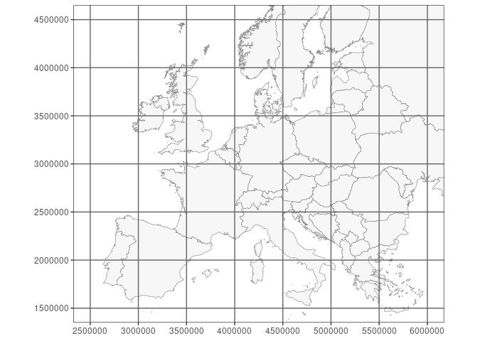
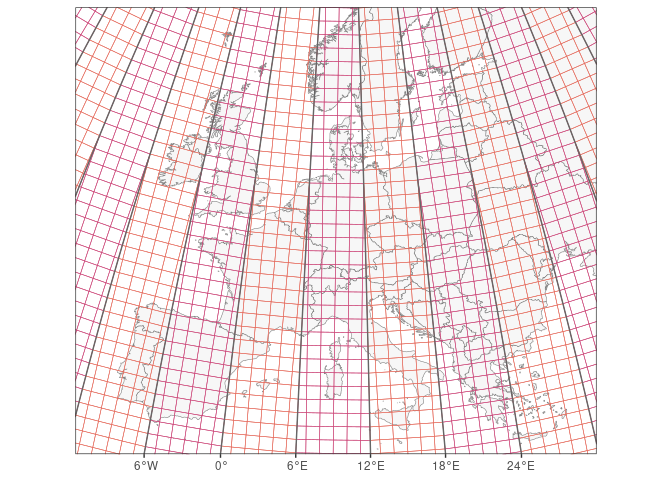
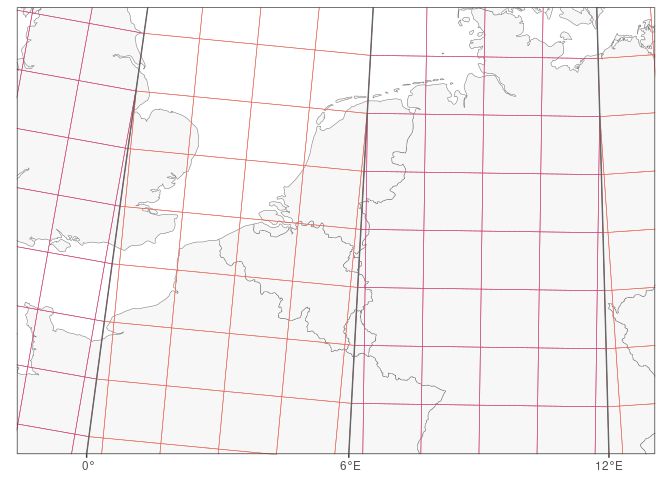
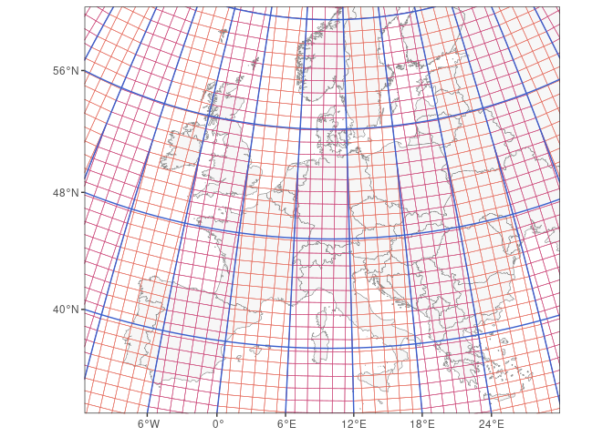

#### Summary

Grids are widely used in biodiversity monitoring to define the basic
spatial units for data collection, data processing or mapping.
Authoritative definitions of widely used grids and grid reference
systems are not globally coordinated though, contrary to the case of the
EPSG-dataset for coordinate reference systems. Here I explain
differences between the UTM and MGRS grids, provide references to their
full definition and refer to some software implementations for MGRS. The
full definitions are not given here since the primary aim is to draw
attention to important properties and differences. For the same reason,
the UPS portion of MGRS is not further explained here.

This post results from a limited literature study on these topics (see
[Bibliography](#bibliography)).

In short:

- The UTM grid and the MGRS grid outside the polar regions are both
  derived from the UTM (Universal Transverse Mercator) map projection
  system. Both grids have a world-wide coverage, with exception of the
  polar regions in the case of the UTM grid. In the polar regions, the
  MGRS derives its grid from the UPS (Universal Polar Stereographic) map
  projection.
- UTM grid references consist solely of digits (Arabic numerals), while
  MGRS grid references are alphanumeric (combination of digits & Latin
  characters).
- When decreasing the precision of a position, coordinates are to be
  rounded while in (UTM and MGRS) grid references the numeric parts
  representing easting and northing are to be truncated.
- Projected coordinate reference systems (CRSs) specify a geodetic datum
  so that coordinates can be linked to a physical location on the
  Earth’s surface. Likewise, you need to specify (and be aware of) the
  geodetic datum when using a (UTM or MGRS) grid reference for
  positioning.

#### Terminological notes

The NGA (National Geospatial-Intelligence Agency) Office of Geomatics
(<https://earth-info.nga.mil>), part of the US Department of Defense,
maintains definitions of the UTM map projection system and the MGRS grid
([National Geospatial-Intelligence Agency,
2014a](#ref-national_geospatial-intelligence_agency_universal_2014)), as
did its predecessor organisations since the inception of these systems
in the 1940s ([Department of the Army,
1956](#ref-department_of_the_army_map_1956),
[2001](#ref-department_of_the_army_map_2001); [Palombo,
2021](#ref-palombo_military_2021); [Stott, 1977](#ref-stott_utm_1977)).
Their usage of the term ‘UTM grid’ is not distinguished from the UTM map
projection system, hence comes down to using numeric CRS coordinates in
metres.

At least in the past, a ‘UTM grid’ reference system was implemented on
*civil* maps, distinct from mere UTM CRS coordinates and with grid
referencing rules to allow different levels of precision (see section
[UTM grid](#utm-grid)). Hence I prefer to maintain the distinction
between the terms ‘UTM projection’ and ‘UTM grid’, also because ‘UTM
grid’ is sometimes erroneously used to refer to the ‘MGRS grid’, to
which it is related.

Confusion between UTM and MGRS is further compounded by the fact that
some (civil) sources that distinguish these grids, erroneously describe
the division of UTM zones with 8° wide latitude bands as being part of
the UTM map projection system, while this belongs solely to the MGRS.

## Introduction

In biodiversity monitoring the Military Grid Reference System (MGRS) is
used a lot, although sometimes it is confusingly referred to as ‘the UTM
grid’. Example projects that use this spatial reference system are the
Atlas Florae Europaea ([Lampinen, 2013](#ref-lampinen_utm_2013)) and the
European Invertebrate Survey ([van Nieukerken,
1991](#ref-van_nieukerken_utm_1991); [van Veen,
2000](#ref-van_veen_eis-nieuws_2000)). In Belgium various faunistic
inventories use this grid.

Coordinate reference systems
([CRSs](../../tutorials/spatial_crs_coding/#coordinate-reference-systems-minimal-background))
that are widely used, e.g. on regional, national or global level, have
obtained standardized definitions in a coordinated manner (e.g. in the
[EPSG dataset](https://epsg.org/)). However, grid reference
systems—associated with a projected CRS, a map projection [^1], or sets
of these—seem not as well globally coordinated.

A ‘grid’ in the context of maps refers to the horizontal and vertical
*lines* chosen in the cartesian coordinate system of a projected CRS,
usually in a regular manner (equal distance between all lines). It may
also refer to the rectangular cells that emerge from these lines
([Iliffe & Lott, 2008](#ref-iliffe_datums_2008); [Stott,
1977](#ref-stott_utm_1977)). The distance between the grid lines on a
map depends on the used map scale.

<div class="figure" style="text-align: center">


<p class="caption">
A map of Europe in the projected CRS ‘EPSG:3035’ (‘ETRS89-extended /
LAEA Europe’). The grid is from the same CRS.
</p>

</div>

<div class="figure" style="text-align: center">


<p class="caption">
The same map of Europe in the projected CRS ‘EPSG:3035’. The grid
however is from ‘EPSG:3034’ (‘ETRS89-extended / LCC Europe’),
reprojected in ‘EPSG:3035’.
</p>

</div>

<div class="figure" style="text-align: center">


<p class="caption">
‘Grid lines’ of geographic CRSs are called the graticule. This map still
uses the projected CRS ‘EPSG:3035’ but displays the graticule of
geographic CRS ‘EPSG:4258’ (‘ETRS89’), projected in CRS ‘EPSG:3035’.
</p>

</div>

## UTM projection, UTM grid and MGRS grid

### UTM projection

UTM (Universal Transverse Mercator) was developed during World War II
and subsequently refined by the US Army ([Buchroithner & Pfahlbusch,
2017](#ref-buchroithner_geodetic_2017)).

UTM is a map projection system for the Earth, composed of 120 single
Transverse Mercator map projections (conformal, transverse cylindrical
projection) for 60 ‘**UTM zones**’ (numbered 1 - 60), each 6 degrees of
longitude wide and reaching from 80°S to 84°N (originally 80°N;
Department of the Army ([1956](#ref-department_of_the_army_map_1956))).
120 map projections are defined since for each UTM zone a separate map
projection is needed for the northern and the southern hemisphere, the
only difference being the false northing value. For example, the largest
part of Belgium (and the whole of Flanders) is situated in UTM zone 31,
and there the map projection ‘UTM zone 31N’ applies [^2], with ‘N’
referring to the northern hemisphere.

<div class="figure" style="text-align: center">


<p class="caption">
A map centered on Greenwich, showing how meridians define the borders of
UTM zones.
</p>

</div>

<div class="figure" style="text-align: center">


<p class="caption">
UTM zones in the European area. The UTM zones are narrower in the north.
</p>

</div>

UTM projects geographical coordinates (degrees) to cartesian coordinates
(**meters**), so the result is XY coordinates (eastings and northings)
like in other map projections, often resulting in high numbers,
especially for Y as it covers the whole range of 0° to 80° or 84°
latitude.

In the case of a lower precision, coordinates are rounded (not
truncated) following the usual rounding rules of science and engineering
([National Geospatial-Intelligence Agency,
2014a](#ref-national_geospatial-intelligence_agency_universal_2014)), as
would happen in other coordinate systems.

As an example, we calculate the projected easting (X) and northing (Y)
of a point in Belgium using the `sf` package in R, at the millimeter
resolution. The CRS uses the geodetic datum ‘ETRS89’ [^3] and the ‘UTM
zone 31N’ map projection (CRS ‘EPSG:25831’).

``` r
library(sf)
point <- st_sfc(st_point(c(4.1, 51.1)), crs = "EPSG:4258")
st_transform(point, "EPSG:25831") |> st_coordinates() |> format(nsmall = 3, trim = TRUE)
```

    ##      X            Y            
    ## [1,] "577019.527" "5661520.775"

<div class="figure" style="text-align: center">


<p class="caption">
A map in the Belgian CRS ‘EPSG:3812’ (‘ETRS89 / Belgian Lambert 2008’),
showing provinces of Flanders. The point with geographical coordinates
‘51.1°N 4.1°E’, projected in ‘EPSG:3812’, is shown in red. It is
situated in the province ‘Oost-Vlaanderen’. The superposed UTM grid
lines and UTM coordinates are from the UTM CRS ‘EPSG:25831’ (‘ETRS89 /
UTM zone 31N’)—reprojected in ‘EPSG:3812’—with lines every 5 km.
</p>

</div>

### UTM grid

A UTM grid refers to the grid lines and the resulting grid cells
portrayed on a map, using the cartesian coordinate system(s) obtained by
UTM projection. These lines can for example be shown every 1, 2 or 10
km, depending on the map scale. This concept complies with the general
description of a ‘grid’ in the context of mapping (see
[Introduction](#introduction)).

The UTM grid lines are labelled with the corresponding coordinate
values, often expressed as kilometers except in the SE corner of the map
where full coordinates are given in meters, as explained by Stott
([1977](#ref-stott_utm_1977)), and by National Geospatial-Intelligence
Agency
([2014b](#ref-national_geospatial-intelligence_agency_universal_2014-1))
in the context of the MGRS system. In the case of kilometer grid labels,
the (anterior) digits *before* the last two (principal) digits are
printed in superscript as they generally do not change within the map.
This approach matches general rules of printing the various rectangular
grids that emerged since World War I.

<div class="figure" style="text-align: center">


<p class="caption">
UTM grid in the European area, using cells of 100 km. As UTM zones (in
one hemisphere) each have their own map projection, an angle arises
between grid lines in two different UTM zones.
</p>

</div>

<div class="figure" style="text-align: center">


<p class="caption">
UTM grid in the area around Belgium, using cells of 100 km.
</p>

</div>

The UTM grid referencing system to identify *grid cells* at a specific
resolution follows the following numerical syntax, as explained on civil
maps that use it ([Stott, 1977](#ref-stott_utm_1977)) [^4]:

    [UTM zone number] [Truncated integer X-coordinate] [Truncated integer Y-coordinate]

The spaces can be omitted or kept, or replaced by a point or a slash.
The integers can be truncated at the required precision, hence
representing 10<sup>p</sup> meters. As the coordinates are always
truncated (not rounded) to integers, this effectively means that a UTM
grid reference represents a square cell with a size that reflects the
chosen precision, potentially clipped by the UTM zone border. For cells
not clipped by the UTM zone border, this also means that their truncated
coordinates match the UTM coordinates of their southwest corner; this
holds for any precision.

Hence for the Belgian point referred above with UTM coordinates
<code>577019.527, 5661520.775</code>, the UTM grid reference at 10-meter
precision is <code>31 57701 566152</code>.

The above grid reference can be further shortened by dropping the UTM
zone number and anterior digits, e.g. if the context is within the area
of one map. When not dropping prefixes, the UTM grid reference is unique
at the global level *if* it is also clear which hemisphere—i.e. which of
the two map projections per UTM zone—applies.[^5]

The concepts of UTM grid portrayal on maps and UTM grid referencing with
anterior and principal digits match those of other rectangular grids
that have also long been in use on civil maps, and these are all named
‘civil’ grids by Stott ([1977](#ref-stott_utm_1977)).

Note that the UTM grid defines *no* subdivisions of the cartesian
coordinate system by means of latitude bands, nor does it describe an
alphanumeric geocoding system to uniquely identify further subdivisions.
These topics are part of the Military Grid Reference System (MGRS)
specification.

### MGRS grid (Military Grid Reference System)

The Military Grid Reference System (MGRS) was designed by the end of the
1940s by the US Army and is used by NATO militaries for locating
positions worldwide up to 1 m precision. The MGRS specification is
maintained by the NGA Office of Geomatics [^6] ([National
Geospatial-Intelligence Agency,
2014a](#ref-national_geospatial-intelligence_agency_universal_2014)).
Best use the foregoing reference when referring to the MGRS. Other
resources describe the MGRS too, including Wikipedia contributors
([2023](#ref-wikipedia_contributors_military_2023)).

Biodiversity monitoring and perhaps other projects sometimes claim to
use UTM grid references, while they actually use MGRS grid references.
Hence it is good to understand the difference; see also the
[Terminological notes](#terminological-notes).

The coordinate system obtained by **UTM** projection is used in the MGRS
definition between 80°S and 84°N, and MGRS combines this with a **UPS**
(Universal Polar Stereographic) projection to define its grid in the
polar regions. In what follows, *only the UTM portion of MGRS* is
considered.

The MGRS grid pattern between 80°S and 84°N has two important
differences with the pattern of the [UTM grid](#utm-grid)—apart from
using a different referencing (geocoding) system:

- In MGRS the UTM grid cell pattern is *intersected* by latitude bands
  of generally 8° wide (starting at the equator). Intersecting [UTM
  zones](#utm-projection) with latitude bands results in large cells
  called ***MGRS grid zones*** of generally 6° longitude by 8° latitude
  large.
- In MGRS, some of the MGRS grid zones are wider or narrower than 6
  longitudinal degrees. This has been done to avoid grid zone junctions
  in specific areas, e.g. Bergen and Oslo (Norway) belong to the same
  grid zone.

<div class="figure" style="text-align: center">


<p class="caption">
The intersection of the UTM grid by latitude bands of 8° wide forms the
basis of the MGRS. This map does not include the subsequent changes to
some MGRS grid zones in the north, e.g. in Norway.
</p>

</div>

Below the grid zone level, it is still the UTM grid pattern that drives
the further subdivision in MGRS between 80°S and 84°N, down to the
required precision, just as in other grid systems. However, an important
difference at this level is that MGRS uses an ***alphanumeric grid
reference*** instead of a numeric one as in civil grids. In MGRS, Latin
characters are used in referencing both the applicable grid zone and the
first subdivision thereof, as follows.

An MGRS ‘grid reference’ (sometimes called MGRS coordinate) is defined
as:

    [Grid Zone Designation] [Grid Square ID] [Truncated integer X-coordinate] [Truncated integer Y-coordinate]

An example is `31U ES 56914 61249` at the 1 m precision, which resolves
to `31U ES 56 61` at 1 km precision.

The spaces can be omitted or kept, but preferably omitted in a
computational environment. The integer coordinates are truncated
depending on the required precision, up to *zero* digits (precision 100
km), with the *maximum* of 5 digits per coordinate corresponding to a
precision of 1 meter (i.e. the unit of the UTM coordinate system).
Consequently, MGRS grid references need less digits per coordinate for 1
m precision than UTM grid references, and this is seen as an advantage
of MGRS.

<div class="figure" style="text-align: center">


<p class="caption">
The ‘U’ latitude band goes from 48°N to 56°N. Two resulting MGRS grid
zones are fully shown here: grid zones 31U (with most of Belgium) and
32U (with most of Germany).
</p>

</div>

In the UTM area of MGRS (between 80°S and 84°N), an MGRS grid reference
is built as follows:

- The **Grid Zone Designation** (GZD), e.g. `31U`, combines the UTM
  zone (31) with a letter code (U) that corresponds to a latitude band
  of generally 8° wide; hence each intersection defines the ***MGRS grid
  zone***. The letter codes in the GZD represent the latitude bands and
  run from ‘C’ in the south to ‘X’ in the north, dropping ‘I’ and ‘O’ in
  order to not confuse with numeric digits.
- Each grid zone is further subdivided into ***grid squares*** (cells)
  of size 100 km, using the *UTM coordinate system* to define the cell
  border coordinates as multiples of 100 000 m. As grid zones get wider
  towards the equator, more grid squares are present in zones near the
  equator than in zones located much further north or south. The **Grid
  Square ID** is a code of 2 characters that is unique *within* the grid
  zone, e.g. `ES`, with ‘E’—the ‘easting letter’— referring to a column
  and with ‘S’—the ‘northing letter’—referring to a row. These letters
  follow the Latin alphabet (excluding ‘I’ and ‘O’) in eastern and
  northern direction within a UTM zone, neglecting parallel grid zone
  borders and repeating the sequence as needed in northern direction.
  The starting letters at UTM coordinates `0, 0` determine both letter
  sequences in a UTM zone, but depend on the UTM zone number as
  specified in the rules of the lettering scheme [^7].
- To specify locations ***with precision \< 100 km***, the **truncated
  integer coordinates** of the [UTM grid reference](#utm-grid) are
  added, thereby *dropping* the digits that represent the
  hundred-thousands and higher. At this level, a precision can be chosen
  of 1, 10, 100, 1000 or 10 000 meters.

Since coordinates are always truncated (not rounded), resulting in 0 to
5 integers per coordinate, this effectively means that an MGRS grid
reference represents a square cell with its size reflecting the chosen
precision, although potentially clipped by the UTM zone border or the
latitude band. E.g. in `31U ES 1 4` X = 1 refers to the half-open
interval \[**1**0, 20) km.

## What is the relation to coordinate reference systems (CRSs)?

Projected CRSs combine a map projection (such as ‘UTM 31N’) with a
geodetic datum that relates actual positions on the Earth’s surface to
the (unprojected, ellipsoidal) geodetic coordinate system, which also
implies defining the ellipsoid and prime meridian. The geodetic datum is
a property of the geodetic CRS associated with the projected CRS.

This also means that without a geodetic datum, you cannot determine the
physical location on the Earth’s surface that corresponds to a pair of
UTM coordinates or to a UTM or MGRS grid reference [^8]. See the [CRS
tutorial](../../tutorials/spatial_crs_coding/#coordinate-reference-systems-minimal-background)
for more information.

Although the aim of MGRS is positioning and although it needs a compound
CRS for its implementation, MGRS is a geocoding standard, not a map
projection or a CRS as it adds complexity on top of a compound CRS.

In Belgium, the most relevant UTM CRSs for UTM zone 31 are:

- ETRS89 / UTM zone 31N (`EPSG:25831`)
- WGS 84 / UTM zone 31N (`EPSG:32631`)
- ED50 / UTM zone 31N (`EPSG:23031`) which was applied in older
  topographic maps

Run `sf::st_crs("EPSG:25831")` in R to inspect the WKT string.

## Distribution of the MGRS grid

The NGA Office of Geomatics
[distributes](https://earth-info.nga.mil/index.php?dir=coordsys&action=coordsys)
worldwide WGS 84 vector layers of MGRS grid polygons [up to 1
km](https://earth-info.nga.mil/index.php?dir=coordsys&action=mgrs-1km-polyline-dloads)
precision.

The UF Geoplan Center provides an [MGRS-data site](http://mgrs-data.org)
that serves as a library for MGRS data and information, including
[geospatial layers](http://mgrs-data.org/data/).

The match of these layers with any WGS 84 UTM CRS and with the WGS 84
graticule can be easily verified post-hoc.

## Criticisms about the MGRS

Criticisms about the MGRS are mainly related to the complexity of the
system itself.

- The geocoding system is quite excentric compared to CRSs, especially
  in current times where computing power is available and handling long
  numeric coordinates is automated and mathematically simpler.
- The complexity may be a source of mistakes. A renowned geodesist has
  advocated on the PROJ mailing list to not use the MGRS outside of the
  United States.

## Software implementations

MGRS and corresponding conversion methods have not been implemented in
PROJ because of the technical non-fit.

They have been implemented in geospatial software though. The following
list provides open-source implementations and may be incomplete:

- the [GEOTRANS](https://earth-info.nga.mil) executables and C libraries
  of the NGA Office of Geomatics. They provide various coordinate
  conversions and transformations.
- the C++ library [GeographicLib](https://geographiclib.sourceforge.io).
  It grew from a desire to improve on the GEOTRANS package for
  transforming between geographic and MGRS coordinates. GeographicLib
  also provides utilities that can be run in a shell environment, such
  as `GeoConvert` for converting coordinates to or from MGRS. These
  utilities also have an
  [online](https://geographiclib.sourceforge.io/doc/library.html#online-utilities)
  implementation.
- a silent (unexposed) implementation as C code inside the [GDAL driver
  for NITF](https://gdal.org/drivers/raster/nitf.html), an imagery
  format of the NGA Geospatial-Intelligence Standards Working Group
  (GWG).
- the R package [mgrs](https://github.com/hrbrmstr/mgrs) which uses
  GDAL’s MGRS implementation in the NITF-driver.
- the Python package `mgrs` ([PyPi](https://pypi.org/project/mgrs/) /
  [conda-forge](https://anaconda.org/conda-forge/mgrs)) which uses the
  GEOTRANS C library.
- the QGIS plugin [Lat Lon
  Tools](https://plugins.qgis.org/plugins/latlontools/) by the US
  National Security Agency ([code
  repo](https://github.com/NationalSecurityAgency/qgis-latlontools-plugin)).
  It provides several geoprocessing algorithms, which can also be
  accessed outside the QGIS GUI, e.g. from R [^9]. The plugin also
  provides a GUI for easy coordinate conversion based on interaction
  with the map.

Note that some of these implementations do not require a geodetic datum
(hence CRS), but of course (converted) coordinates still need a geodetic
datum to refer to an actual position on the Earth’s surface and to use
them with other geospatial data.

Since it has not been implemented in PROJ, regular geospatial R packages
cannot convert to or from MGRS grid references.

Various online web applications allow to interactively determine MGRS
coordinates, or display the MGRS grid. One example is
[map.army](https://www.map.army/doc/en/map/coordinategrid/).

## Acknowledgements

NGI / INBO

## Bibliography

<div id="refs" class="references csl-bib-body hanging-indent">

<div id="ref-buchroithner_geodetic_2017" class="csl-entry">

Buchroithner M.F. & Pfahlbusch R. (2017). Geodetic grids in
authoritative maps – new findings about the origin of the UTM Grid.
Cartography and Geographic Information Science 44 (3): 186–200.
<https://doi.org/10.1080/15230406.2015.1128851>.

</div>

<div id="ref-department_of_the_army_map_1956" class="csl-entry">

Department of the Army (1956). Map reading. Field Manual, No. 21–26.
Washington, DC, 256 p. <https://ciehub.info/ref/FM/21-26.html>.

</div>

<div id="ref-department_of_the_army_map_2001" class="csl-entry">

Department of the Army (2001). Map reading and land navigation. Field
Manual, No. 3–25.26. Washington, DC, 209 p.
<https://ciehub.info/ref/FM/3-25x26.html>.

</div>

<div id="ref-iliffe_datums_2008" class="csl-entry">

Iliffe J. & Lott R. (2008). Datums and Map Projections. For Remote
Sensing, GIS and Surveying. 2nd edn. Whittles Publishing, Caithness, UK,
208 p.

</div>

<div id="ref-lampinen_utm_2013" class="csl-entry">

Lampinen R. (2013). UTM & MGRS – Atlas Florae Europaeae \| LUOMUS.
<https://www.luomus.fi/en/utm-mgrs-atlas-florae-europaeae> (accessed
August 24, 2023).

</div>

<div id="ref-national_geospatial-intelligence_agency_universal_2014"
class="csl-entry">

National Geospatial-Intelligence Agency (2014a). The Universal Grids and
the Transverse Mercator and Polar Stereographic Map Projections. NGA
Standardization Document - Implementation Practice, No.
NGA.SIG.0012_2.0.0_UTMUPS. Washington, DC, 86 p.
<https://nsgreg.nga.mil/doc/view?i=4056>.

</div>

<div id="ref-national_geospatial-intelligence_agency_universal_2014-1"
class="csl-entry">

National Geospatial-Intelligence Agency (2014b). Universal grids and
reference systems. NGA Standardization Document, No.
NGA.STND.0037_2.0.0_GRIDS. Washington, DC, 101 p.
<https://nsgreg.nga.mil/doc/view?i=4057>.

</div>

<div id="ref-palombo_military_2021" class="csl-entry">

Palombo S. (2021). Military Grid Reference System (MGRS). In: ArcGIS
StoryMaps.
<https://storymaps.arcgis.com/stories/842edf2b4381438b9a4edefed124775b>
(accessed August 24, 2023).

</div>

<div id="ref-stott_utm_1977" class="csl-entry">

Stott P.H. (1977). The UTM Grid Reference System. Journal of the Society
for Industrial Archeology 3 (1): 1–14.
<https://www.jstor.org/stable/40967933>.

</div>

<div id="ref-uf_geoplan_center_mgrs_2009" class="csl-entry">

UF GeoPlan Center (2009). MGRS. 4 p.
<http://mgrs-data.org/data/documents/nga_mgrs_doc.pdf>.

</div>

<div id="ref-van_nieukerken_utm_1991" class="csl-entry">

van Nieukerken E.J. (1991). UTM grid: een voorschot op de toekomst.
Nieuwsbrief EIS Kenniscentrum Insecten en andere ongewervelden 20: 9–14.
<https://natuurtijdschriften.nl/pub/1000930>.

</div>

<div id="ref-van_veen_eis-nieuws_2000" class="csl-entry">

van Veen M. (2000). EIS-nieuws: Software. Nieuwsbrief EIS Kenniscentrum
Insecten en andere ongewervelden 30: 11–12.
<https://natuurtijdschriften.nl/pub/1001490>.

</div>

<div id="ref-wikipedia_contributors_military_2023" class="csl-entry">

Wikipedia contributors (2023). Military Grid Reference System. In:
Wikipedia, The Free Encyclopedia.
<https://en.wikipedia.org/w/index.php?title=Military_Grid_Reference_System&oldid=1140475364>
(accessed August 25, 2023).

</div>

</div>

[^1]: A map projection defines the conversion from geodetic to projected
    coordinates (geodetic coordinate system (CS, not CRS) + the
    projection (conversion) method + numeric projection (conversion)
    parameters), but without specifying the geodetic datum.

[^2]: OGC URN identifier of map projection [UTM zone
    31N](https://epsg.org/conversion_16031/UTM-zone-31N.html):
    `urn:ogc:def:coordinateOperation:EPSG::16031`. Using
    [`projinfo`](https://proj.org/en/latest/apps/projinfo.html), you can
    compare with `urn:ogc:def:coordinateOperation:EPSG::16131` for map
    projection [UTM zone
    31S](https://epsg.org/conversion_16131/UTM-zone-31S.html). More
    information about OGC URN identifiers can be found in the [OGC URN
    policy](https://www.ogc.org/about-ogc/policies/ogc-urn-policy/) and
    more extensively in the OGC Best Practice ‘Definition identifier
    URNs in OGC namespace’, the latest version of which can be found on
    the [OGC Best Practices](https://www.ogc.org/standards/bp/) webpage.

[^3]: OGC URN identifier of the [ETRS89 ensemble
    datum](https://epsg.org/datum_6258/European-Terrestrial-Reference-System-1989-ensemble.html):
    `urn:ogc:def:ensemble:EPSG::6258`.

[^4]: This UTM grid reference notation is also followed in the 2001
    version of US Army’s Field Manual 3-25.26 (Map Reading and Land
    Navigation) for the notation of UTM coordinates ([Department of the
    Army, 2001](#ref-department_of_the_army_map_2001)), of course
    without truncation.

[^5]: Some sources (e.g. [UF GeoPlan Center,
    2009](#ref-uf_geoplan_center_mgrs_2009)) therefore mention the
    possibility to extend the UTM zone with ‘N’ or ‘S’ depending on the
    hemisphere, resulting in e.g. <code>31N 57701 566152</code>. However
    this approach is now officially obsoleted, and *full* (i.e. globally
    unique) UTM coordinates should contain an MGRS grid zone prefix (see
    MGRS section) instead ([National Geospatial-Intelligence Agency,
    2014b](#ref-national_geospatial-intelligence_agency_universal_2014-1)).

[^6]: URL: <https://earth-info.nga.mil>.

[^7]: Moreover, two different lettering schemes are in use (called ‘AA’
    and ‘AL’), and it is the ellipsoid used in the geodetic datum that
    defines which one will be used!

[^8]: Older series of Belgian maps distributed by the National
    Geographical Institute (<https://www.ngi.be>) applied the ED50
    geodetic datum (European Datum 1950), which affects the position of
    coordinates (hence MGRS grid) by about 90 m in E-W direction and
    about 200 m in N-S direction compared to the ETRS89 and WGS 84
    datums. OGC URN identifiers of these datums:  
    [ED50 datum](https://epsg.org/datum_6230/European-Datum-1950.html):
    `urn:ogc:def:datum:EPSG::6230`  
    [ETRS89 ensemble
    datum](https://epsg.org/datum_6258/European-Terrestrial-Reference-System-1989-ensemble.html):
    `urn:ogc:def:ensemble:EPSG::6258`  
    [WGS 84 ensemble
    datum](https://epsg.org/datum_6326/World-Geodetic-System-1984-ensemble.html):
    `urn:ogc:def:ensemble:EPSG::6326`.

[^9]: Beside R’s `mgrs` package, another possibility to translate
    to/from MGRS grid references in R is by accessing the ‘Lat Lon
    Tools’ QGIS plugin using the
    [qgisprocess](https://r-spatial.github.io/qgisprocess) package,
    e.g. by calling the algorithm `latlontools:point2mgrs`.
