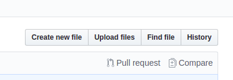
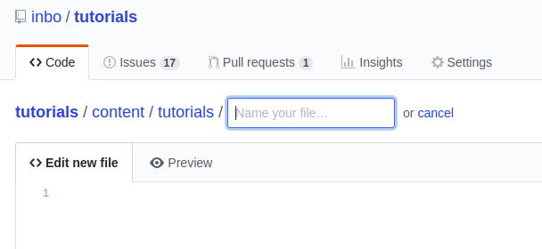
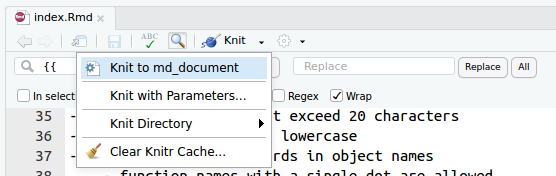

## Introduction

First of all, thanks to consider making a new tutorial! By providing a tutorial, you are actively supporting your colleagues and the wider community and making work more efficient. 

In this page, the roadmap towards a new tutorial will be explained.

## Writing a tutorial

Each tutorial is setup in a subfolder of the `content/tutorials` folder. Within this folder, different files and formats may exist as you create them, but a file with the name `index.md` will be used for the tutorials website. So, you can create the tutorial directly in markdown or create it based on a [Rmarkdown](https://rmarkdown.rstudio.com/), a [Jupyter notebook](https://jupyter.org/) or any other format, as long as there is a single markdown file with the name `index.md` in your tutorial folder. 

There are different ways to create this file. We will provide in this document specific instructions for markdown an Rmarkdown based tutorials. Still, if you got useful information or text in another format or you got stuck with the description, do not hesitate to describe your submission in a [new issue ](https://github.com/inbo/tutorials/issues/new). If you do not have a Github account, ask the [IT helpdesk](mailto:ict.helpdesk@inbo.be). We will try to support you as soon as possible. 

### 1. writing a markdown tutorial

If you are directly writing your documentation in markdown syntax, you can either work online using [Github](https://github.com/inbo/tutorials) or work on your own computer while using git. 

#### Online submission

Although providing less functionalities (adding custom images is not directly supported), the Github interface provides already a powerfull interface to add new content. 

To write a new tutorial **online**, go to the INBO-tutorials Github repository and navigate to the `/content/tutorials` page, or use [this link](https://github.com/inbo/tutorials/tree/master/content/tutorials). 

Next, click the `Create new file` button



You will be directed to a new page and asked to _Name your file..._ 



Providing this name is **very important,** so make sure:

- provide a folder name  + `/` + `index.md`
- the folder name needs to be all lowercase 
- the folder name should not have spaces, but you can use `_` to separate words
- provide a meaningful name without dates or names

For example: `r_tidy_data/index.md`, `database_query_inboveg/index.md` or `statistics_regression/index.md`

**Notice:** The moment you type the `/`, Github will guide you by translating this to a folder name. 

Next, in the edit field you can start typing your tutorial. The header has an agreed format and you should copy paste this to start with:

```
---
title: "YOUR TITLE"
description: "SHORT DESCRIPTION ON TUTORIAL"
authors: [YOUR_AUTHOR_ID]
date: YYYY-MM-DD
categories: ["YOUR_CATEGORY"]
tags: ["FIRST_TAG", "SECOND_TAG", "..."]
---

# your text starts here...
```

Replace all the CAPITAL words with appropriate information:

- a short clear title
- a single or two line description
- your author id: for each author on INBO tutorials, there's a `AUTHOR_ID.toml` file under `data/authors`. If it's your first contribution, please choose an author id (suggestion: your full name, lowercase, with no space) and add a file about yourself there. Start by copying the content from a preexisting author file. If a tutorial is written by multiple authors, use the following syntax in the header: `authors: [1ST_AUTHOR_ID, 2ND_AUTHOR_ID, ...]`
- the creation date, in the specified format (`year-month-day`), e.g. 2019-01-04 or 2018-04-02
- one or two categories from the specified list available [here](https://github.com/inbo/tutorials/blob/master/static/list_of_categories)
- multiple tags you can pick yourself, all lowercase words. Have a look at the current [wordcloud](https://inbo.github.io/tutorials/tags/) to check which would be useful for your submission.

Underneath the last triple dahs (`---`), you can write the tutorial as you like using [markdown syntax](https://github.com/adam-p/markdown-here/wiki/Markdown-Cheatsheet). Use the `Preview` button to check how it would look like rendered on a website.

**Notice:** You can add images from online source by using the URL of the image, e.g. ``. For example, `https://www.inbo.be/sites/all/themes/bootstrap_inbo/img/inbo/logo_nl.png` will include the INBO logo into your document:


If you are ready, commit your file to the website maintainers by filling in the boxes:


* `Create new file`: exchange this by a short message about the additions, e.g. _Add tutorial to explain tidy data in R_ or _Add tutorial about database queries in inboveg,..._
* `Add an optional extended description`: If you think more background info is suitable, add that in this box.
* `yourgithubnam-patch` you can replace this by the same name as your folder name above (e..g. `r_tidy_data`) to clarify your submission. 

(the checkbox will always be on `create a new branch`, this is also the required option)

Next, click `commit new file` and your submission will be reviewed by the website maintainers. If accepted, the tutorial will be automatically integrated in the tutorials website.

#### Using git (or Github Desktop, Rstudio,...)

When you ever used git or Github before, either using the command line, rstudio, Github Desktop,... you can work on your own computer and submit the tutorial using git.  In this section, we assume you are familiar to the git command or interface and have some basic knowledge. If not, no worries, we have a dedicated course to get you up to speed, see the [INBO git course](https://inbo.github.io/git-course/).

_**Notice**: The links in the different steps will refer to the Rstudio steps in the INBO git tutorial, but can be done using other interfaces or the command line as well. Pick the one you prefer_

If it is your first submission using your computer, [clone](https://inbo.github.io/git-course/course_rstudio.html#23_clone_a_repo_to_work_locally) the [INBO tutorials](https://github.com/inbo/tutorials) repository (*so use the clone button on the https://github.com/inbo/tutorials page!*).

Next, we use the [git workflow](https://inbo.github.io/git-course/workflow_rstudio.html) to submit the new tutorial:

- Update your code and create a new branch, cfr. [STEP 1 of the workflow](https://inbo.github.io/git-course/workflow_rstudio.html#option-1a-ill-make-a-new-branch-to-work-with). Provide a useful name for your branch related to the topic of your tutorial, e.g. `r_tidy_data` or `database_query_inboveg` and not ~~`my_tutorial`~~.
- Navigate to the subfolder `content/tutorials` and create a new subfolder in this directory. This will be the directory of your tutorial. Again, use a representative name for the directory name similar to the branch name. 
- Within the folder, create a new file markdown `index.md`.  The header of this file has an agreed format and you should copy paste this to start with:

```
---
title: "YOUR TITLE"
description: "SHORT DESCRIPTION ON TUTORIAL"
authors: [YOUR_AUTHOR_ID]
date: YYYY-MM-DD
categories: ["YOUR_CATEGORY"]
tags: ["FIRST_TAG", "SECOND_TAG", "..."]
---

# your text starts here...
```

Replace all the CAPITAL words with appropriate information:

- a short clear title
- a single or two line description
- your author id: for each author on INBO tutorials, there's a `AUTHOR_ID.toml` file under `data/authors`. If it's your first contribution, please choose an author id (suggestion: your full name, lowercase, with no space) and add a file about yourself there. Start by copying the content from a preexisting author file. If a tutorial is written by multiple authors, use the following syntax in the header: `authors: [1ST_AUTHOR_ID, 2ND_AUTHOR_ID, ...]`
- the creation date, in the specified forma (`year-month-day`), e.g. 2019-01-04 or 2018-04-02
- one or two categories from the specified list available [here](https://github.com/inbo/tutorials/blob/master/static/list_of_categories)
- multiple tags you can pick yourself, all lowercase words. Have a look at the current [wordcloud](https://inbo.github.io/tutorials/tags/) to check which would be useful for your submission.

Underneath the last triple dahs (`---`), you can write the tutorial as you like using [markdown syntax](https://github.com/adam-p/markdown-here/wiki/Markdown-Cheatsheet).

- `add`/`commit` the file to git, cfr. [STEP 2 of the workflow](https://inbo.github.io/git-course/workflow_rstudio.html#while_editing). You can commit the tutorial all in once or split the commits in different steps, that is up to you. To make sure your work is updated online as well, `push` the tutorial as in [STEP 3 of the workflow](https://inbo.github.io/git-course/workflow_rstudio.html#step_3:_push_your_changes_to_github).
- When ready, `push` your tutorial a last time and create a `Pull request` to the website maintainers as explained in [STEP 4 of the workflow](https://inbo.github.io/git-course/workflow_rstudio.html#step_4:_pull_request_to_add_your_changes_to_the_current_master).

After you pull request, your submission will be checked and reviewed. When accepted and merged, you tutorial will be online.

### 2. Writing an Rmarkdown tutorial

As you are writing the tutorial in Rmarkdown, we assume you are using Rstudio to write the tutorial. In this section, we assume you are familiar to the Rstudio git interface and have some basic knowledge. If not, no worries, we have a dedicated course to get you up to speed with git in Rstudio, see the [INBO git course](https://inbo.github.io/git-course/).

If it is your first submission using your computer, [clone](https://inbo.github.io/git-course/course_rstudio.html#23_clone_a_repo_to_work_locally) the [INBO tutorials](https://github.com/inbo/tutorials) repository (*so use the clone button on the https://github.com/inbo/tutorials page!*).

Next, we use the [git workflow](https://inbo.github.io/git-course/workflow_rstudio.html) to submit the new tutorial:

- Update your code and create a new branch, cfr. [STEP 1 of the workflow](https://inbo.github.io/git-course/workflow_rstudio.html#option-1a-ill-make-a-new-branch-to-work-with). Provide a useful name for your branch related to the topic of your tutorial, e.g. `r_tidy_data` or `database_query_inboveg` and not ~~`my_tutorial`~~.
- Navigate to the subfolder `content/tutorials` and create a new subfolder in this directory. This will be the directory of your tutorial. Again, use a representative name for the directory name similar to the branch name. 
- Within the folder, create a new file markdown `index.Rmd`.  The header of this file has an agreed format and you should copy paste this to start with:

```
---
title: "YOUR TITLE"
description: "SHORT DESCRIPTION ON TUTORIAL"
authors: [YOUR_AUTHOR_ID]
date: YYYY-MM-DD
categories: ["YOUR_CATEGORY"]
tags: ["FIRST_TAG", "SECOND_TAG", "..."]
output: 
    md_document:
        preserve_yaml: true
---

# your text starts here...
```

Replace all the CAPITAL words with appropriate information:

- a short clear title
- a single or two line description
- your author id: for each author on INBO tutorials, there's a `AUTHOR_ID.toml` file under `data/authors`. If it's your first contribution, please choose an author id (suggestion: your full name, lowercase, with no space) and add a file about yourself there. Start by copying the content from a preexisting author file. If a tutorial is written by multiple authors, use the following syntax in the header: `authors: [1ST_AUTHOR_ID, 2ND_AUTHOR_ID, ...]`
- the creation date, in the specified forma (`year-month-day`), e.g. 2019-01-04 or 2018-04-02
- one or two categories from the specified list available [here](https://github.com/inbo/tutorials/blob/master/static/list_of_categories)
- multiple tags you can pick yourself, all lowercase words. Have a look at the current [wordcloud](https://inbo.github.io/tutorials/tags/) to check which would be useful for your submission.
- leave the `output` section as it is

Underneath the last triple dahs (`---`), you can write the tutorial as you like using [markdown syntax](https://github.com/adam-p/markdown-here/wiki/Markdown-Cheatsheet) and add code chunks to run R code. 

As the Rmarkown file will not be part of the website, make sure to click the `knit` button to create the equivalent markdown file (`index.md`) in the same directory:



**Notice**: always knit the Rmarkdown file before you start committing the changes!

- `add`/`commit` **both files** to git, cfr. [STEP 2 of the workflow](https://inbo.github.io/git-course/workflow_rstudio.html#while_editing). You can commit the tutorial all in once or split the commits in different steps, that is up to you. To make sure your work is updated online as well, `push` the tutorial as in [STEP 3 of the workflow](https://inbo.github.io/git-course/workflow_rstudio.html#step_3:_push_your_changes_to_github).
- When ready, `push` your tutorial a last time and create a `Pull request` to the website maintainers as explained in [STEP 4 of the workflow](https://inbo.github.io/git-course/workflow_rstudio.html#step_4:_pull_request_to_add_your_changes_to_the_current_master).

After you pull request, your submission will be checked and reviewed. When accepted and merged, you tutorial will be online.

## Tips

In the rare cases where your tutorial includes a link to a raw HTML document (to be delivered as-is, without any visual integration in the rest of the INBO tutorials website), you can proceed like this:

1) Place your HTML document in `static/html` (in the top directory of the site, outside of `tutorials`, `articles`, ...)
2) To link it, use a relative URL (`..` can be used to point to the parent directory). The content of the `static` directory is accessible at the root URL.

This should be more clear with a practical example:

The file at `content/tutorials/r_beginners/index.md` has a link to a static HTML file in `static/html/Rmarkdown_oefening_resultaat.html`. 

Since that tutorial page will be visible at the `tutorials/r_beginners/` relative URL and that the static file will be accessible at `html/Rmarkdown_oefening_resultaat.html`, you need to create a link that goes up twice to reach the site root before going down in the `html` directory, for example: 

`[Oefening](../../html/Rmarkdown_oefening_resultaat.html)`
