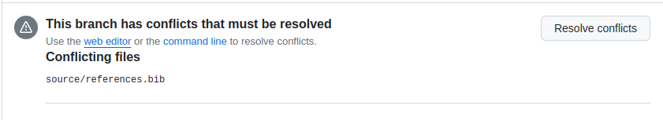
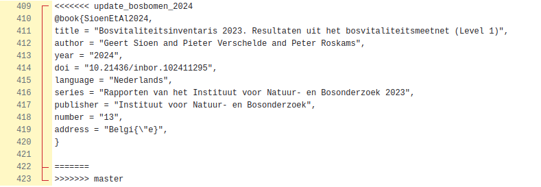
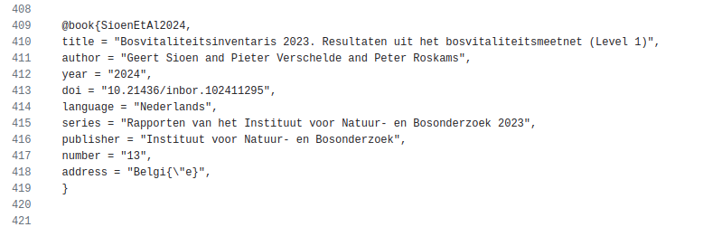
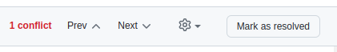
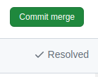

## Fix merge conflict with a pull request

Sometimes a pull request warnings about a merge conflict.
A merge conflict occurs when one or more lines were altered both in the base branch as in the issue branch.
The warning looks like the image below.

You can fix most merge conflicts in the browser.
First push the `Resolve conflict` button in the warning.
The website sends you to a page with a list of all merge conflicts.
The website highlights them by the red vertical line with yellow background between the line numbers and the code.
Every merge conflict inserts three delimiters.

1. `<<<<<< issue branch name`: the start of the merge conflict
1. `======`: the separator between the content of both branches
1. `>>>>>> base branch name`: the end of the merge conflict

Fix the merge conflict by changing the source.
Often you can fix it by simply deleting the content of one to the branches within the conflict.
Potentially you need to keep a mix of both.
Should fixing the merge conflict is more complicated, then you probably better should fix them via the [command line](../git_conflict/index.html).
In our example we solved the conflict by keeping the content of the issue branch.

Once you fixed all merge conflict, go to the top of the page.
There hit the `Mark as resolved` button.

Finally you store the fixes in a new commit by hitting the `Commit merge` button.

