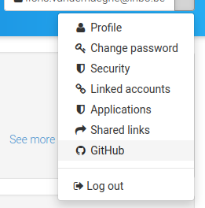
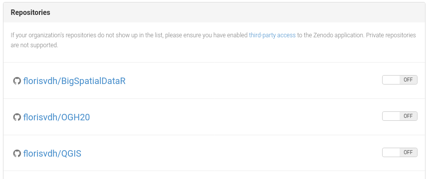
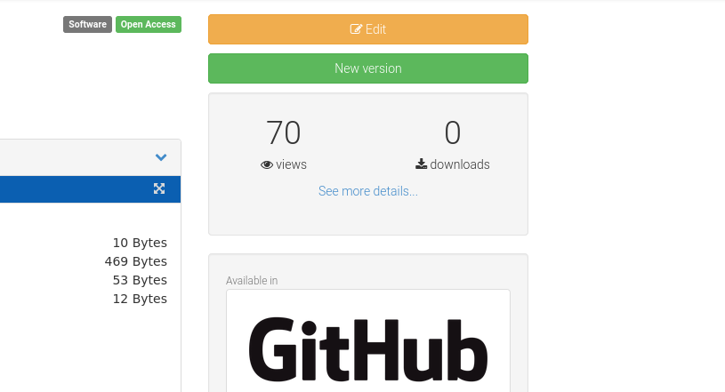
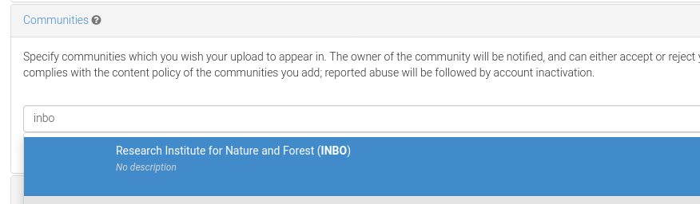

_Note: there is also a [vignette](https://inbo.github.io/checklist/articles/zenodo.html) in the `checklist` package for R, that covers below topics and more, such as integration with ORCID._
_If you are working with R and wish to control some of the below steps from R, then definitely read the vignette!_


## GitHub and Zenodo: background

[GitHub](https://github.com) hosts a remote Git server that you can use for distributed version control with Git.
For more information about Git and GitHub, see [other](https://inbo.github.io/tutorials/categories/version-control/) tutorials on this website!
In short, Git helps you with version control (maintaining snapshots) of a directory (file folder) – a repository – and GitHub helps you with distributing versions and with collaboration.

On GitHub, one can designate specific snapshots (commits) as a release.
Each release will typically have its version number.
In this way, you can release a version 1.2.0, 1.3.0 etcetera of your source code – typically a software package, a report, a website, a note or whatever you wish to maintain and distribute.

[Zenodo](https://zenodo.org) is a scientific repository funded by the European Commission and hosted at CERN.
It allows researchers to deposit research papers, data sets, research software, reports, and any other research related digital artefacts (enumeration from Wikipedia).
Zenodo is aimed at preserving the deposits for the long term, which is great for reproducibility purposes.
Also, it keeps multiple versions of your stuff together under the same record.
Moreover, it provides a stable DOI link for each version and for each record as whole!

## Integrating GitHub and Zenodo

Just having a public code repository at GitHub is not enough for long-term reproducibility.
This is where Zenodo comes in!
From within Zenodo, you can setup a webhook in the GitHub repository which is triggered when you make a new release at GitHub.
Then, GitHub will send the entire repository snapshot to Zenodo where it will be published as a zip-file.
Also, Zenodo will increment the version number or take that (and other metadata) from a `.zenodo.json` metadata file, if you provide such a file in the repository.

Let's suppose you already have a GitHub repository and you want to set up such integration.\
Let's do it!

Oh, wait!\
Did you know that you _cannot_ just _undo_ a publication at Zenodo?
So make sure to get familiar first!

If you are just taking your first steps and you want to do a safe exercise,
then replace '<https://zenodo.org>' by '<https://sandbox.zenodo.org>'!
Consider the Zenodo Sandbox a playground for your exercise.

The Zenodo Sandbox creates the publications at <https://sandbox.zenodo.org>, e.g. <https://sandbox.zenodo.org/record/1139470>, but those are not perpetual and the displayed DOI's will not work (since they aren't actually created).

First of all, make an account at <https://zenodo.org> (or the Sandbox!) and log in.

#### Step 1: in Zenodo, go to 'GitHub' in your account settings

\
_Go to the GitHub settings in Zenodo._

#### Step 2: find your repository, and flip the toggle to 'on'

\
_Your list of repositories._

\
_Flip the toggle!_

Now you are ready for your first release.

## Releasing at GitHub triggers a Zenodo publication

#### Step 1: draft a new release

In GitHub, go to the releases page, and click 'Draft new release'.
Alternatively, extend the repository URL with `/releases/new`.


You get a page where you can:

- select or create a tag.
This is required: releases always refer to a tag.
A Git tag is a label that is fixed to a specific snapshot (commit).
It will typically contain a version number that you decide yourself.
- choose a title for your release.
You will typically want to include the version number.
- add a description.
This is not required, but most commonly you will enumerate the most important changes compared to a previous release.


#### Step 2: make the release

Just push 'publish release'!


#### Step 3: inspect the result at Zenodo

In seconds, the record (or the new version) will be created at Zenodo.

_How do you know the URL?_\
In the GitHub settings at Zenodo, you can see a DOI badge for each enabled repository.
Click on it to get the URL!


Navigate to the URL:


## Tune your repository metadata for Zenodo

As referred above, you can include a `.zenodo.json` file in your repository to provide specific metadata for Zenodo.

You can find more explanation and an example [at the developer's site of Zenodo](https://developers.zenodo.org/#add-metadata-to-your-github-repository-release).

A simple example of the content of `.zenodo.json` is:

```json
{
    "title": "test title",
    "description": "test description",
    "license": "GPL-3.0",
    "upload_type": "software",
    "access_right": "open",
    "version": "0.14.0",
    "creators": [
        {
            "name": "Vanderhaeghe, Floris",
            "affiliation": "Research Institute for Nature and Forest",
            "orcid": "0000-0002-6378-6229"
        }
    ],
    "keywords": [
        "T",
        "my strange keyword",
        "another"
    ]
}
```

But you can do more with `.zenodo.json`.
As an example, see [this one](https://github.com/inbo/protocolhelper/blob/cea8c3735c5fd761556c48d17008c68bbe3e98c3/.zenodo.json) in the `protocolhelper` repository!

## Zenodo communities

A Zenodo community can be regarded as a collection of Zenodo records.
A community has a name and a description, and one Zenodo record can belong to more than one community.

An example is the [INBO community](https://zenodo.org/communities/inbo) at Zenodo: all Zenodo content uploaded by INBO.

In the [above referred](https://github.com/inbo/protocolhelper/blob/cea8c3735c5fd761556c48d17008c68bbe3e98c3/.zenodo.json) example of `.zenodo.json`, you can also find how to add your record to a community via `.zenodo.json`, e.g. the INBO community in case of INBO staff.

Alternatively, after a first version of your record has been created at Zenodo, you can do it manually in Zenodo:

### Step 1: push the 'Edit' button

You need to be logged in of course, and you must have administrator rights for the record at hand.



### Step 2: search for the community and select it

For example, add the INBO community if you are INBO staff:



### Step 3: click 'Publish' at the top or bottom of the page


That's all!\
Have fun with GitHub and Zenodo!


