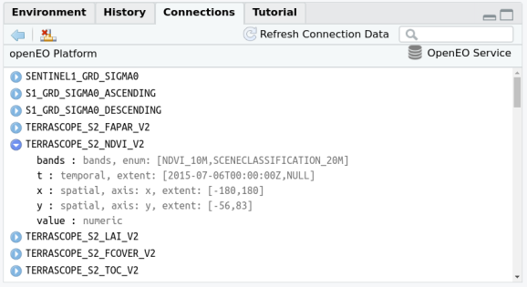
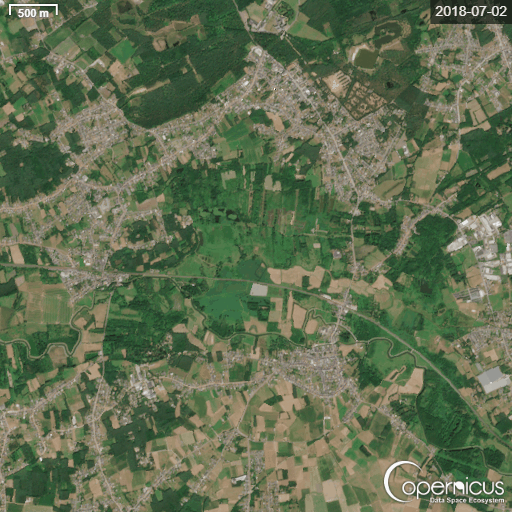

```{r deps}
#| warning: FALSE 
#| message: FALSE
list.of.packages <- c("tidyverse", "sf", "stars", "mapview", "lubridate", "dplyr", "rpart", "rpart.plot", "leaflet", "mapedit", "scales", "ggplot2", "rstudioapi","tidyr","zoo","np","kernlab","leafem","viridis","cubelyr","terra","signal","abind","INBOmd","INBOtheme","openeo")
new.packages <- list.of.packages[!(list.of.packages %in% installed.packages()[,"Package"])]
if(length(new.packages)) install.packages(new.packages)
library(openeo)
library(tidyverse)
library(sf)
library(stars)
library(mapview)
library(lubridate)
library(dplyr)
library(rpart)
library(rpart.plot)
library(leaflet)    # for interactive maps
library(leafem)
library(mapedit)    # for drawing polygons interactively
library(scales)
library(ggplot2)
library(rstudioapi)
library(tidyr)
library(zoo)
library(np)         # kernel regression
library(kernlab)    # Gaussian processes
library(viridis)
library(terra)
library(signal)
library(abind)
library(INBOmd)
library(INBOtheme)
```

This script took some inspiration from: <https://www.r-bloggers.com/2022/11/processing-large-scale-satellite-imagery-with-openeo-platform-and-r/#google_vignette> and is modified for learning purpose.

# OpenEO

[OpenEO](https://openeo.org) is an open source project that tries to make large-scale, cloud-based satellite image processing easier and more open. This script shows how the openEO client can access openEO providers: (here, the Copernicus Data Space Ecosystem Federation), available from CRAN, can be used to explore datasets, compute on them, and download results.

A list of support back ends and collection can be found on <https://hub.openeo.org/>.

## Registration

You first need to create an account op the Copernicus Data Space Ecosystem (CDSE) in order to get [acces to OpenEO](https://identity.dataspace.copernicus.eu/auth/realms/CDSE/protocol/openid-connect/auth?client_id=account-console&redirect_uri=https%3A%2F%2Fidentity.dataspace.copernicus.eu%2Fauth%2Frealms%2FCDSE%2Faccount%2F%23%2F&state=a8075610-e75a-4fc8-90f3-08e59d243f4c&response_mode=fragment&response_type=code&scope=openid&nonce=f8d35ab0-061f-4fb9-843a-746f6eeda9ce&code_challenge=W6xjfkziopIjZAUIgAoq7RSFiSrPv9Lr4ztu3GhAa3U&code_challenge_method=S256)

Once you have access to OpenEO, you have access to all the supported back-ends (without having additional API's) like SentinelHub, Terrascope, EODC,...


## Sample session

An openEO session is started with loading the library, connecting to a back-end, and authenticating with the back-end:

```{r}
con = connect("https://openeofed.dataspace.copernicus.eu/openeo/1.2")
login()
```

The login will prompt for an authentication ID which can come from your organisation, or an openID-based mechanism such as google or GitHub. For loggin on you need an account on the back-end, as cloud computing in general is not a free resource. The openeo.cloud website has instructions on how to apply for a (ESA-) sponsored account with limited compute credits.

When these commands were carried out, and you are using RStudio as an IDE, RStudio will show an overview of the image collections available on this backend.



This can help search for a particular collection. Image collections are collections of satellite images that are all processed in a uniform way. The set of image collections can also be obtained programmatically by

```{r}
collections = list_collections(con)
names(collections) |> head()


length(collections)
```

which can then be further processed

We will work with Sentinel level 2A data, available in the collection.

```{r}
collection = "SENTINEL2_L2A"
coll_meta = describe_collection(collection)
names(coll_meta)

## [1] "bands"                         "ceosard:specification"         "ceosard:specification_version"
## [4] "ceosard:type"                  "cube:dimensions"               "description"                  
## [7] "extent"                        "id"                            "keywords"                     
## [10] "license"                       "links"                         "mission"                      
## [13] "name"                          "providers"                     "sci:citation"                 
## [16] "sci:doi"                       "stac_extensions"               "stac_version"                 
## [19] "summaries"                     "title"                         "type"
```

information about the names and extents of data cube dimensions is for instance obtained by

```{r}
coll_meta$`cube:dimensions`
```

## Example 1: Monthly NDVI values of the Kloosterbeemden

We are going to set some parameters to extract Sentinel-2 datacubes form OpenEO. We define the extent of our AOI, the bands we are interested in and the time range. In this example, we are going to extract the R, G, B values (for visualization) and the NDVI (the most popular vegetation index there is) for the Kloosterbeemden.

```{r}
# Set parameters
KB <- st_read("./data/Extent_KB.gpkg") # Our area of interest (AOI) = the Kloosterbeemden
KB <- KB %>% st_transform("EPSG:4326") # transform crs to WGS84
bbox <- st_bbox(KB)
bbox

bands = c("B02","B03","B04", "B08") # The Blue, Green, Red and NDVI bands of S2. 
time_range = list("2018-01-01", "2019-01-01") # Time range of one year. 
```

```{r}
mapview(KB)
```

If you are not familiar with Sentinel-2 Bands and what which landcover types they can represent, you can learn more about this with this slider <https://h5p.org/h5p/embed/663570> [Link to source](https://learn.opengeoedu.de/en/fernerkundung/vorlesung/copernicus/Sentinel-2-Teil-2).

We can then start building a process graph, the object that contains the work to be done on the back-end side. First we load the available processes from the back-end:

```{r}
p = openeo::processes(con)
```

and then we define the image collection as constrained by name, space, time, and bands (if no constraints are given, the full extent is used). We use a member function of `p` here, so that we cannot use processes that are not available on the back-end.

```{r}
data = p$load_collection(id = collection, 
                         spatial_extent = bbox,
                         temporal_extent = time_range, 
                         bands = bands) 
```

We will compute NDVI, [normalized difference vegetation index](https://en.wikipedia.org/wiki/Normalized_difference_vegetation_index), from the two selected bands, and use the NDVI function in `reduce_dimension` to reduce dimension `bands`:

```{r}
ndvi = function(data, context) {
  red = data[3]
  nir = data[4]
  (nir-red)/(nir+red)
}
calc_ndvi = p$reduce_dimension(data = data,
                               dimension = "bands",
                               reducer = ndvi)

data_final = calc_ndvi
```

Although `ndvi` is defined as an R function, in effect the `openeo` R client translates this function into openEO native processes. This cannot be done with arbitrarily complex functions, and passing on R functions to be processed by an R instance in the back-end is done using user-defined functions (see later).

If you want to work only with NDVI values, you may skip the code block below. If you want to have the original band values (B02: blue, B03: green, B04: red, B08: NIR) and the NDVI values, you can run this code block

```{r}
ndvi_cube = p$add_dimension(
  data = calc_ndvi,
  name = "bands",
  label = "NDVI",
  type = "bands"
)

data_final = p$merge_cubes(data, ndvi_cube)
```

We will now process the NDVI values to a monthly series, by picking for each pixel the median value of all pixels over the month (Sentinel-2 has an image for roughly every 5 days). This is done by `aggregate_temporal`:

```{r}
intervals = list(c('2018-01-01', '2018-02-01'),
                 c('2018-02-01', '2018-03-01'),
                 c('2018-03-01', '2018-04-01'),
                 c('2018-04-01', '2018-05-01'),
                 c('2018-05-01', '2018-06-01'), 
                 c('2018-06-01', '2018-07-01'), 
                 c('2018-07-01', '2018-08-01'),
                 c('2018-08-01', '2018-09-01'),
                 c('2018-09-01', '2018-10-01'), 
                 c('2018-10-01', '2018-11-01'),
                 c('2018-11-01', '2018-12-01'), 
                 c('2018-12-01', '2018-12-30'))
# and labels
labels = sapply(intervals, head, 1) # create labels from list

# add the process node
temp_period = p$aggregate_temporal(data = data_final,
                                   intervals = intervals,
                                   reducer = function(data, context){p$median(data)},
                                   labels = labels,
                                   dimension = "t")

```

Finally, we can define how we want to save results (which file format), by the `save_result` process

```{r}
result = p$save_result(data = temp_period, format="NetCDF")
```

and request the results synchronously by `compute_results`:

```{r}
# synchronous:
compute_result(result, format = "NetCDF", output_file = "./export/ndvi.nc", con = con)

## [1] "ndvi.nc"
```

All commands before `compute_result()` can be executed without authentication; only `compute_result` asks for “real” computations on imagery, and requires authentication, so that the compute costs can be accounted for.

`compute_result` downloads the file locally, and we can now import it and plot it either by e.g. `ggplot2`

First: load the NetCDF file as stars object and check the dimensions

```{r}
r = read_stars("./export/ndvi.nc")

st_dimensions(r) # you will see the starting and end points (from / to), offset and delta (step interval). For x and y (since they are expressed in local projection system), the units are meters. So delta is 10, since every pixel is 10 x 10 meter. 

```

Our time value is expressed in udunits, in days since 1990-01-01. Stars object can also express time in `Date` (calendar dates), `POSIXct` (dates and times), or `PCICt` (for non-standard 360-day or 365-day calendars often used in climate models). We will convert the udunits to Dates.

```{r}
r <- st_set_dimensions(r, "t",as.Date(st_get_dimension_values(r, "t"), origin = "1990-01-01"))
st_dimensions(r)
```

Visualize the output with ggplot.

```{r}
## Loading required package: abind
ggplot() + geom_stars(data = r["NDVI"]) +
        facet_wrap(~t) + coord_equal() +
        theme_void() +
        scale_x_discrete(expand = c(0,0)) +
        scale_y_discrete(expand = c(0,0)) +
        scale_fill_viridis_c() 
```

or by `mapview` (where the “real” mapview obviously gives an interactive plot):

```{r}
# Slice the 5th temporal layer
time_slice5 <- r %>% slice(t, 5) # Month of May
time_slice5_ndvi <- time_slice5 %>% select("NDVI") # Select the NDVI band

# Visualize the sliced single-timestamp object
mapview(time_slice5_ndvi)
```

Change detection - see the difference between May and July

```{r}
time_slice7 <- r %>% slice(t, 7) # Month of May
time_slice7_ndvi <- time_slice7 %>% select("NDVI") # Select the NDVI band
diff <- (time_slice7_ndvi - time_slice5_ndvi)

ggplot() + geom_stars(data = diff) +
        coord_equal() +
        theme_void() +
        scale_x_discrete(expand = c(0,0)) +
        scale_y_discrete(expand = c(0,0)) +
        scale_fill_viridis_c(direction=1) # yellow green areas: greening of the area, blue areas: loss of green

```

you can also plot true color (RGB) image of false color images (like the false color infrared color CIR):

```{r}
# Select True Color bands (B04=Red, B03=Green, B02=Blue)
# Or for False Color IR use: c("B08", "B04", "B03")
rgb_attributes <- time_slice5 %>% select(c("B04", "B03", "B02")) # -> R-G-B
cir_attributes <- time_slice5 %>% select(c("B08", "B04", "B02")) # -> NIR-R-G
# 3. Merge attributes into a single multi-band dimension
rgb_stacked <- merge(rgb_attributes, name = "band")
cir_stacked <- merge(cir_attributes, name = "band")

# Convert stars object to terra object to visualize with plotRGB
rgb_terra <- rast(rgb_stacked)
cir_terra <- rast(cir_stacked)

# 4. Plot as RGB (rgb = 1:3 maps Red->1, Green->2, Blue->3)
plotRGB(rgb_terra, r = 1, g = 2, b = 3, stretch = "lin", main = "Sentinel-2 True Color (Linear Stretch) - May 2018")

plotRGB(cir_terra, r = 1, g = 2, b = 3, stretch = "lin", main = "Sentinel-2 False Color CIR (Linear Stretch) - May 2018")
# Healthy vegetation appears in vibrant, bright red tones. Bare soil and urban areas appear gray, blue, or cyan, while water appears dark blue or black.
```

We see "strange deviations in the NDVI trend" , whereby we would expect values to increase (NDVI follows the phenological cycle of vegetation) over the summer months and decrease in the winter months. For example, we same very low values in June 2018. This is we did not correct for atmospheric interference.

To illustrate, I made a time-laps animation for the month of June for our area. The animation was created on the [Copernicus website](https://browser.dataspace.copernicus.eu/?zoom=5&lat=50.16282&lng=20.78613&themeId=DEFAULT-THEME&visualizationUrl=U2FsdGVkX1%2Bqks280qYM21jCX9mmd%2FcsnAko8WK02m2bsat2uf1S9JW62GKn8ZwYxcBvIg7t2OfUcwVFRJiO%2FJSNM8%2BfdZ0VsFQSbck%2F8nAm%2FrQCKSBFMNcgHyj8%2BTXj&datasetId=S2_L2A_CDAS&demSource3D=%22MAPZEN%22&cloudCoverage=30&dateMode=SINGLE):



We see that atmospheric interference causes noise within the data. In order to make reliable time series, we need to perform atmospheric corrections (cloud % filtering, cloud masking), converting band values from digital numbers (0-10000) to reflectance values (0-1). Gaps within the data have to be filled in (data imputation) to create regular time series for analysis. This is typically done with temporal and/or spatial interpolation, followed by smoothing.


## Example 2: Inundation monitoring of the Kloosterbeemden

#### (with more advanced preprocessing and batch processing)

We are going to check if our area has become more wet over the years and check it this claim is true. <https://www.vrt.be/vrtnws/nl/2026/05/05/scherpenheuvel-zichem-kloosterbeemden-sanering-natuur-bos-tessen/>

For this, we are going to use a very simplistic model, developed to detect inundation in open wetlands (doi/10.1002/rse2.363).

```{r}
# Load the decision tree model
load("./data/jussila_decisiontree.RData")

# Visualize the decision tree structure
rpart.plot(tree_jussila, tweak = 1, extra = 0)

# Visualize the necessary bands for model:
tree_jussila[["terms"]][[3]]
#b02 + b03 + b04 + b05 + b8a + b11 + b12 + ndvi + mndwi11 + mndwi12 + ndwi_mf + ndmi_gao11
```

Set some parameters to extract Sentinel-2 datacubes form OpenEO. We define the extent of our AOI, the bands we are interested in and the time range. In this example, we are going to extract the R, G, B values (for visualization) and the NDVI (the most popular vegetation index there is) for the Kloosterbeemden.

```{r}
con = connect("https://openeofed.dataspace.copernicus.eu/openeo/1.2")
login()
```

Load the AOI's.

```{r}
gr<- st_read("./data/grasslands_kloosterbeemden.gpkg") # Our area of interest (AOI) = the Kloosterbeemden 
gr <- gr %>% st_transform("EPSG:4326") # transform crs to WGS84 

we<- st_read("./data/wetlands_kloosterbeemden.gpkg") # Our area of interest (AOI) = the Kloosterbeemden 
we <- we %>% st_transform("EPSG:4326") # transform crs to WGS84 

polygons <- rbind(gr,we)
mapview(polygons,zcol="HAB1")
```

Remove "High Green" form the polygons

```{r}
gk21 <- rast("./data/groenkaart21.tif")
plot(gk21)

hg <- gk21 == 1
plot(hg)


# Convert TRUE cells to polygons
hg_poly <- as.polygons(hg, dissolve = TRUE)

# Keep only TRUE areas
hg_poly <- hg_poly[hg_poly$groenkaart21 == 1, ]

# Convert terra vector to sf
hg_sf <- st_as_sf(hg_poly)

# Make sure CRS matches
polygons <- st_transform(polygons, st_crs(hg_sf))

# Remove overlapping parts
polygons_no_overlap <- st_difference(polygons, st_union(hg_sf))

# Plot result
plot(st_geometry(polygons_no_overlap), col = "lightblue")
plot(hg_sf$geometry, add = TRUE, col = "red")
```

```{r}
mapview(polygons_no_overlap)
```

Important, openEO expect your regions to have crs = EPSG:4326 (WGS84)!

```{r}
polygons_no_overlap <- polygons_no_overlap %>% st_transform("EPSG:4326")
```

Set the parameters for the cube processing.

```{r}
# Set parameters 
bands = c("B02","B03","B04", "B05", "B8A", "B11", "B12", "SCL") # SCL = scene classification layer

time_range = list("2022-01-01", "2026-01-01") # 5 years
collection = "SENTINEL2_L2A"
```

```{r}
jobs <- list()

for (i in 1:nrow(polygons_no_overlap[1,])) { 
  polygon <- polygons_no_overlap[i, ] 
  bbox <- st_bbox(polygon)
  
  # Get process graph builder
  process <- openeo::processes()
  
  # Define spatial extent
  spatial_extent <- list(
    west = bbox["xmin"],
    south = bbox["ymin"],
    east = bbox["xmax"],
    north = bbox["ymax"],
    crs = 4326
  )
  
  # Define temporal extent (all available years)
  temporal_extent <- time_range
  
  fn_eo_cloud_cover1 = function(value) {
    cc = process$lte(x = value, y = 20) # We set a <20% cloud cover filter for the whole S2 image tile.
    return(cc)
  }
  
  # Load Sentinel-2 L2A data using process graph builder
  col <- process$load_collection(
    id = collection,
    spatial_extent = spatial_extent,
    temporal_extent = temporal_extent,
    bands = bands,
    properties = list("eo:cloud_cover" = fn_eo_cloud_cover1)
  )
  
  # Mask out bad pixels based on values of the SCL layer. 
  filterSCL = function(col , context) {
    scl = col[8]
    res = scl != 4 & scl != 5 & scl != 6 # The pixel is not classified as vegetation, not_vegetated or water
    return(res)
  }
  
  mask = process$reduce_dimension(
    data = col
    , reducer = filterSCL
    , dimension = "bands")
  
  # apply mask
  cube_masked = process$mask(col, mask)
  
  # Calculate the different indices:
  ndvi = function(cube_masked, context) {
    red = cube_masked[3]
    nir = cube_masked[5]
    (nir-red)/(nir+red)
  }
  
  mndwi12 = function(cube_masked, context) {
    green = cube_masked[2]
    swir2 = cube_masked[7]
    (green-swir2)/(green+swir2)
  }
  
  mndwi11 = function(cube_masked,context){
    green = cube_masked[2]
    swir1 = cube_masked[6]
    (green-swir1)/(green+swir1)
  }
  
  ndwi_mf = function(cube_masked,context){
    green = cube_masked[2]
    nir = cube_masked[5]
    (green-nir)/(green+nir)
  }
  
  ndmi_gao11 = function(cube_masked,context){
    swir1 = cube_masked[6]
    nir = cube_masked[5]
    (nir-swir1)/(nir+swir1)
  }
  
  
  calc_mndwi11 = process$reduce_dimension(data = cube_masked,
                                          dimension = "bands",
                                          reducer = mndwi11)
  
  calc_mndwi12 = process$reduce_dimension(data = cube_masked,
                                          dimension = "bands",
                                          reducer = mndwi12)
  
  calc_ndvi = process$reduce_dimension(data = cube_masked,
                                       dimension = "bands",
                                       reducer = ndvi)
  
  calc_ndwi_mf = process$reduce_dimension(data = cube_masked,
                                          dimension = "bands",
                                          reducer = ndwi_mf)
  
  calc_ndmi_gao11 = process$reduce_dimension(data = cube_masked,
                                             dimension = "bands",
                                             reducer = ndmi_gao11)
  
  # Rename the bands
  cube_ndvi = process$add_dimension(data = calc_ndvi,name = "bands",label = "ndvi", type = "bands")
  cube_mndwi11 = process$add_dimension(data = calc_mndwi11, name = "bands",label = "mndwi11", type = "bands")
  
  cube_mndwi12 = process$add_dimension(data = calc_mndwi12,name = "bands",label = "mndwi12", type = "bands")
  
  cube_ndwi_mf = process$add_dimension(data = calc_ndwi_mf,name = "bands",label = "ndwi_mf", type = "bands")
  
  cube_ndmi_gao11 = process$add_dimension(data = calc_ndmi_gao11,name = "bands",label = "ndmi_gao11", type = "bands")
  
  
  
  # Combine the datacubes
  merge1 = process$merge_cubes(cube_masked, cube_mndwi11)
  merge2 = process$merge_cubes(merge1, cube_mndwi12)
  merge3 = process$merge_cubes(merge2, cube_ndvi)
  merge4 = process$merge_cubes(merge3, cube_ndwi_mf)
  data_combined = process$merge_cubes(merge4,cube_ndmi_gao11)
  
  
  
  # Create monthly mosaics
  library(lubridate)
  
  dates <- seq(
    as.Date("2022-01-01"),
    as.Date("2026-01-01"),
    by = "month"
  )
  
  intervals <- lapply(
    1:(length(dates)-1),
    function(i) {
      c(
        as.character(dates[i]),
        as.character(dates[i+1])
      )
    }
  )
  
  # and labels
  labels = sapply(intervals, head, 1) # create labels from list
  
  # add the process node
  temp_period = process$aggregate_temporal(data = data_combined,
                                           intervals = intervals,
                                           reducer = function(data_combined, context){process$median(data_combined)},
                                           labels = labels,
                                           dimension = "t")
  # Test to see if UDF work
  udf_code <- "import numpy as np
import xarray
from scipy.signal import savgol_filter
from openeo.udf import XarrayDataCube

def apply_datacube(cube: XarrayDataCube, context: dict) -> XarrayDataCube:
    array = cube.get_array()

    # Ensure time dimension exists
    if 't' not in array.dims:
        return cube

    # Interpolate NaNs along time
    filled = array.interpolate_na(dim='t', method='linear', fill_value='extrapolate')

    data = filled.values

    # Find time axis safely
    time_axis = array.dims.index('t')

    # Check length
    if data.shape[time_axis] < 5:
        return cube  # too short → skip

    # Check for remaining NaNs
    if np.isnan(data).any():
        return cube

    try:
        smoothed = savgol_filter(data, window_length=5, polyorder=2, axis=time_axis)
    except Exception:
        return cube  # fail-safe

    return XarrayDataCube(
        xarray.DataArray(smoothed, dims=array.dims, coords=array.coords)
    )"
  #temp_period_smooth <- process$run_udf(data = temp_period,udf = udf_code, runtime = "Python")
  
  temp_period_smooth <- process$apply_dimension(
    data = temp_period,
    dimension = "t",
    process = function(data, context) {
      process$run_udf(
        data = data,
        udf = udf_code,
        runtime = "Python",
        context = list()
      )
    }
  )
  

  # Save the result using process$save_result
  result <- process$save_result(data = temp_period_smooth, format = "NetCDF")

  
  # Create the batch job
  job <- create_job(graph = result, title = paste0("OpenSciencecafé_", i)) 
  
  # Submit the job
  #job$send_job()
  
  jobs[[i]] <- job
  cat("Job for polygon", i, "submitted./n")
}
```

Submit the job

```{r}
list_jobs() %>% names() -> job_names

for(i in 1:nrow(polygons_no_overlap[1,])) { start_job(job_names[i]) }
```

Monitor the status of your batch jobs on OpenEO

```{r}
list_jobs() %>% as_tibble() %>% View() # View the list of batch jobs on your OpenEO account

list_jobs() %>% as_tibble() %>% count(status) # See the status of your batch jobs

list_jobs() %>% as_tibble() -> jobs_df # create a dataframe of your batch jobs

```

When your batch jobs are finished, you can download them with this code to a specific folder:

```{r}
for(i in 1:nrow(polygons_no_overlap[1,])) { 
  id <- unlist(jobs_df[i,"id"]) 
  name <- paste0("./export/", gsub(" ", "_", unlist(jobs_df[i, "title"])), ".nc") 
  
  print(name) 
  
  download_results(id, folder = "./export/") -> downname
  
  file.rename(unlist(downname), name) 
  }
```

```{r}
r2 = read_stars("./export/OpenSciencecafé_1.nc")
r2 <- st_set_dimensions(r2, "t",as.Date(st_get_dimension_values(r2, "t"), origin = "1990-01-01"))
st_dimensions(r2)
plot(r2)
```

```{r}
## Loading required package: abind
ggplot() + geom_stars(data = r2["ndvi"]) +
        facet_wrap(~t,ncol=12) + coord_equal() +
        theme_void() +
        scale_x_discrete(expand = c(0,0)) +
        scale_y_discrete(expand = c(0,0)) +
        scale_fill_viridis_c() 
```

Perform classification.

```{r}
df <- as.data.frame(r2, wide = TRUE)
names(df)[4:10] <- c("b02","b03","b04","b05","b8a","b11","b12")

# Identify rows with NAs
# This ensures we don't pass NAs to models that can't handle them 
# and allows us to preserve the NA structure in the output.
complete_cases <- complete.cases(df)
df_clean <- df[complete_cases, ]

# Prepare the prediction vector (as done above)
pred <- predict(tree_jussila, newdata = df_clean)
pred_binary <- ifelse(pred[, "water"] > pred[, "dry"], 1, 0)
pred_values <- as.vector(pred_binary)
final_pred_vector <- rep(NA_real_, nrow(df))
final_pred_vector[complete_cases] <- pred_values

# Get the dimensions of your original object (spatial + temporal)
# We exclude the 'bands' dimension because we are collapsing it into 1 classification value
new_dims <- st_dimensions(r2)[c("x", "y", "t")] # Ensure names match your r2 object

# Rebuild the stars object directly from the vector
# This avoids 'slice' and 'mutate' errors by building from the ground up
result_stars <- st_as_stars(list(classification = array(final_pred_vector, dim = dim(new_dims))),
                            dimensions = new_dims)


# Ensure values are factors for discrete scaling
result_stars_df <- result_stars
result_stars_df[[1]] <- factor(result_stars_df[[1]], 
                                levels = c(0, 1), 
                                labels = c("dry", "inundated"))

polygon_transformed <- st_transform(polygons_no_overlap[1,], st_crs(result_stars_df)) # Make sure both files have the same crs system.

ggplot() +
  geom_stars(data = result_stars_df) +
  # Map values to specific colors
  scale_fill_manual(values = c("dry" = "tan", "inundated" = "blue"), 
                    name = "Status") +
  # Add the polygon border
  geom_sf(data = polygon_transformed, 
          fill = NA, 
          color = "red") +
  # If you have multiple time steps/layers, this creates the facets
  facet_wrap(~t,ncol=12) + 
  theme_minimal() 
```

Visualize the relative frequency each year.

```{r}
# Extract the years from the time dimension ('t')
time_vals <- st_get_dimension_values(result_stars, "t")
# This works whether 't' consists of Dates, characters, or factors by grabbing the first 4 digits
years <- substr(as.character(time_vals), 1, 4) 
unique_years <- sort(unique(years))

# Compute the inundation frequency proportion (0 to 1) for each year
yearly_maps <- lapply(unique_years, function(yr) {
  
  target_times <- years == yr
  
  # Extract the indices where target is TRUE
  true_indices <- which(target_times)

  
  
  # Subset the time steps belonging to the current year
  year_sub <- result_stars[, , ,true_indices]
  
  # Calculate the mean across the spatial grid (collapsing the time dimension).
  # Since 1 = inundated and 0 = dry, the mean represents the frequency proportion.
  st_apply(year_sub, c("x", "y"), mean, na.rm = TRUE)
})

# Combine the separate yearly maps into a single stars object
result_combined <- do.call(c, yearly_maps)
names(result_combined) <- unique_years # Name each attribute layer after its year

# Merge the separate year attributes into a single 'year' dimension
result_yearly_stars <- merge(result_combined)
result_yearly_stars <- st_set_dimensions(result_yearly_stars, "attributes", names = "year")
names(result_yearly_stars) <- "frequency" # Label the value column

# Align the coordinate reference system (CRS) for your polygon overlay
polygon_transformed <- st_transform(polygons_no_overlap[1,], st_crs(result_yearly_stars))

# Plot the continuous yearly frequency using ggplot
ggplot() +
  geom_stars(data = result_yearly_stars) +
  # Map the continuous frequency to a gradient matching your original colors
  scale_fill_gradient(low = "tan",        # 0% Inundated (Always Dry)
                      high = "blue",      # 100% Inundated (Always Flooded)
                      limits = c(0, 1),
                      labels = scales::percent, # Formats values as 0%, 50%, 100%
                      name = "Inundation\nFrequency") +
  # Add the red polygon boundary
  geom_sf(data = polygon_transformed, 
          fill = NA, 
          color = "red",
          linewidth = 0.8) +
  # Facet the map layout by year instead of individual time steps
  facet_wrap(~year) + 
  theme_minimal() +
  labs(title = "Annual Inundation Frequency Map",
       x = "Longitude",
       y = "Latitude")
```

Evaluate the % of inundated pixels (within the polygon) over the years and plot the trend line.

```{r}
# Crop stars object to the polygon and calculate the mean for each time step
# st_apply allows us to run a function (mean) over the 't' dimension
inundation_stats <- result_stars[polygon_transformed] %>%
  st_apply(MARGIN = "t", FUN = function(x) mean(x == 1, na.rm = TRUE)) %>%
  as.data.frame()

# Rename columns for clarity (adjust 'classification' if your attribute name differs)
colnames(inundation_stats) <- c("t", "ratio")

ggplot(inundation_stats, aes(x = t, y = ratio)) +
  geom_point(color = "blue", alpha = 0.6) +
  geom_line(color = "blue", alpha = 0.3) +
  # Add a linear trend line (method = "lm") or a curved one (method = "loess")
  geom_smooth(method = "lm", color = "red", se = TRUE, linetype = "dashed") +
  scale_y_continuous(labels = scales::percent, limits = c(0, 1)) +
  labs(title = "Inundation Ratio Over Time",
       subtitle = paste("Calculated within polygon area"),
       x = "Time (t)",
       y = "Percentage Inundated") +
  theme_minimal()
```

# Extra: when to use terra vs stars for processing raster/datacubes?

The data can be easily converted in one another, of even a tibble / standard dataframes. See discussion on: https://github.com/r-spatial/stars/issues/633
