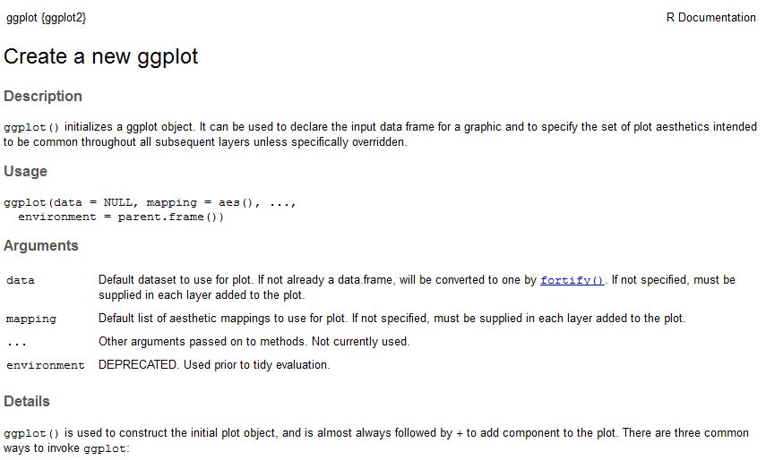

```{r setup, include=FALSE}
knitr::opts_chunk$set(
  out.extra = "",
  inline = TRUE,
  echo = TRUE, 
  warning = FALSE,
  # eval = FALSE,
  # cache = FALSE, 
  dpi = 300, 
  fig.width = 3.6, 
  fig.height = 2.4
  )
fig_width_legend <- 4.8
fig_width_facet <- 5.4
fig_height_facet <- 3.6
```

\hspace{7cm} {width=2.5cm} \hspace{5cm}


# Waarom ggplot?

- `ggplot` maakt grafieken gebaseerd op de [Grammar of Graphics](https://www.springer.com/gp/book/9780387245447)
    - Je geeft de gegevens mee
    - Je vertelt ggplot2 welke variabelen op de assen moeten komen
    - Je zegt welk type grafiek je wil maken (punten, lijnen, boxplot, histogram, ...)
    - En je zorgt voor de details (titels, kleuren, vormen, ...)
- De basisgrafieken zien er al heel mooi uit
- Alle soorten grafieken vertrekken van dezelfde syntax
- Grafieken worden stap voor stap opgebouwd
- Gemakkelijk om kleuren, groottes, ... te laten variëren per groep
- Automatische legende
- Mogelijk om verschillende datasets te combineren
- ...

# Datasets

- `iris` data uit R
    - Opgesplitst in `iris.Sepal` en `iris.Petal`
    - Variabelen hernoemd naar `Length` en `Width`
    - Extra variabele `Leaf.Type` aangemaakt, gelijk aan `sepal` of `petal`
    - Beide datasets onder mekaar geplakt en bewaard in `iris.All` 
    - Deze 3 datasets zijn bewaard als `R` objecten, en worden ingelezen met de functie `load()`
    ```{r, echo = FALSE}
    load("../data/iris.Sepal")
    load("../data/iris.Petal")
    load("../data/iris.All")
    ```
    ```{r, eval = FALSE}
    load("data/iris.Sepal")
    load("data/iris.Petal")
    load("data/iris.All")
    ```

<!-- - Pilootstudie -->
<!--     - 8 proefvlakken (4 eik en 4 beuk) -->
<!--     - 12 bomen per proefvlak -->
<!--     - 7 ploegen -->
<!--     - elke ploeg meet helft van de bomen 1x en andere helft 3x -->
<!--         - wisselt per ploeg -->
<!--         - indien inconsistentie tussen 3 metingen, dan wordt de boom een 4e keer gemeten -->
<!--     - omtrek meting -->
<!--         - gemeten op borsthoogte (+/- 130cm) -->
<!--         - gemeten tot op 1cm nauwkeurig -->
<!--     - hoogte meting -->
<!--         - 2 toestellen (vertex, fieldmap) -->
<!--     - referentie omtrek -->
<!--         - gemiddelde van de 3 metingen van ploeg 7 -->
<!--         - gemeten op exact 130cm hoogte -->
<!--         - gemeten tot op 1mm nauwkeurig -->
<!--     ```{r, message = FALSE} -->
<!--     library(readr) -->
<!--     pilootstudie <- read_csv2("../data/pilootstudie.csv") -->
<!--     str(pilootstudie) -->
<!--     ``` -->


# Package `ggplot2`

- Dit package heb je al als je het package `tidyverse` geïnstalleerd hebt
- Laad het package `tidyverse` (of alleen `ggplot2`)
    ```{r}
    # library(ggplot2)
    library(tidyverse)
    ```
- Je ziet dat er een hele reeks packages geladen worden
- Er zijn 2 conflicten
    - De functie `filter()` uit het package `dplyr` overschrijft de functie `filter()` uit het `stats` package
    - De functie `lag()` uit het package `dplyr` overschrijft de functie `lag()` uit het `stats` package
    - Geen probleem, maar wees je ervan bewust wanneer je hulp zoekt over deze functies, dat je die uit het juiste package (`dplyr`) bestudeert (`R` geeft het aan als er verschillende mogelijkheden zijn)


# Basis syntax `ggplot`

- Het package heet `ggplot2`, de belangrijkste functie is `ggplot()`
- Zoek hulp over `ggplot`

{width=12cm}\

`ggplot()` initialiseert de componenten van het `ggplot` object

- `data = NULL`: de dataset die gebruikt wordt voor de grafiek
- `mapping = aes()`: de aesthetics (*assen*), variabelen in de dataset

```{r}
# ggplot(data = iris.Sepal, mapping = aes(x = Length, y = Width))
ggplot(iris.Sepal, aes(x = Length, y = Width))
```

- Blanco figuur
- Enkel dataset gespecifieerd, en X- en Y-as
- Daarna worden er 1 of meerdere lagen met punten, lijnen,... toegevoegd volgens diezelfde X- en Y-assen, met `+ geom_xxx()`.


# Lagen toevoegen

## Punten

- `geom_point`
    ```{r}
    ggplot(iris.Sepal, aes(x = Length, y = Width)) +
      geom_point()
    ```
- `geom_jitter`: voegt wat ruis toe, interessant wanneer er veel punten over mekaar vallen

## Lijnen

### `geom_line`

- Verbindt de punten volgens de waarden op de X-as
    ```{r}
    ggplot(iris.Sepal, aes(x = Length, y = Width)) +
      geom_point() +
      geom_line()
    ```
- Eventueel groeperen per soort met het `group` aesthetic
    ```{r}
    ggplot(iris.Sepal, aes(x = Length, y = Width, group = Species)) +
      geom_point() +
      geom_line()
    ```

### `geom_path`

- Verbindt de punten volgens de volgorde in de data
    ```{r}
    ggplot(iris.Sepal, aes(x = Length, y = Width)) +
      geom_point() +
      geom_path()
    ```

### `geom_smooth`

- Smoother zonder verdere specificatie, om een patroon te herkennen in de punten
    ```{r}
    ggplot(iris.Sepal, aes(x = Length, y = Width)) +
      geom_point() +
      geom_smooth()
    ```
- Lineaire smoother met `method = "lm"`
    ```{r}
    ggplot(iris.Sepal, aes(x = Length, y = Width)) +
      geom_point() +
      geom_smooth(method = "lm")
    ```
- Veel meer opties mogelijk, zie help

### Andere lijnen

- `geom_hline`: horizontale lijn
- `geom_vline`: verticale lijn
- `geom_abline`: hellende lijn


# Aesthetics

Naast de X- en Y-as kunnen we nog extra *assen* toevoegen aan de figuur:

- `color`, `shape`, `linetype`, `size`, `fill`
- Specifiëer je deze argumenten **binnen** de `aes()`, dan variëren ze volgens een bepaalde variabele (kenmerk van de observaties)
- Specifiëer je deze argumenten **buiten** de `aes()`, dan zijn het vaste kenmerken
- Dit kan voor de volledige grafiek hetzelfde, of verschillend per laag, afhankelijk in welke aesthetics `aes()` je dit argument toevoegt

## `color`

- Kleur van de punten variërend volgens soort
    ```{r, fig.width = fig_width_legend}
    ggplot(iris.Sepal, aes(x = Length, y = Width, color = Species)) +
      geom_point()
    ```
- Kleur van de punten en lijnen variërend volgens soort
    ```{r, fig.width = fig_width_legend}
    ggplot(iris.Sepal, aes(x = Length, y = Width, color = Species)) +
      geom_point() +
      geom_smooth(method = "lm")
    ```
    - Merk op dat we nu 3 verschillende smoothers krijgen, een per soort
- Effect van plaatsing `color` aesthetic
    ```{r, fig.width = fig_width_legend}
    ggplot(iris.Sepal, aes(x = Length, y = Width)) +
      geom_point(aes(color = Species)) +
      geom_smooth(method = "lm")
    ```
- Beperk het aantal kleuren (categorieën), anders zijn deze nog moeilijk te onderscheiden
- Vaste kleur, bvb blauwe punten en rode lijn
    ```{r}
    ggplot(iris.Sepal, aes(x = Length, y = Width)) +
      geom_point(color = "blue") +
      geom_smooth(color = "red", method = "lm")
    ```

## `shape`

- Symbool van de punten variërend volgens soort
    ```{r, fig.width = fig_width_legend}
    ggplot(iris.Sepal, aes(x = Length, y = Width, shape = Species)) +
      geom_point()
    ```

## `linetype`

- Type lijn varieert volgens soort
    ```{r, fig.width = fig_width_legend}
    ggplot(iris.Sepal, aes(x = Length, y = Width)) +
      geom_point() +
      geom_smooth(aes(linetype = Species), method = "lm")
    ```

## `size`

- Grootte van de punten variërend volgens soort
    ```{r, fig.width = fig_width_legend, warning = TRUE}
    ggplot(iris.Sepal, aes(x = Length, y = Width, size = Species)) +
      geom_point()
    ```
- **Waarschuwing** dat het gebruik van `size` niet aangewezen is voor een discrete variabele
- Grootte van de punten en dikte van de lijnen variërend volgens soort
    ```{r, fig.width = fig_width_legend}
    ggplot(iris.Sepal, aes(x = Length, y = Width, size = Species)) +
      geom_point() +
      geom_smooth(method = "lm")
    ```
- Dikkere lijn, maar hetzelfde voor elke soort
    - Aangegeven door een getal, in millimeter
    ```{r}
    ggplot(iris.Sepal, aes(x = Length, y = Width, group = Species)) +
      geom_point() +
      geom_smooth(size = 3, method = "lm")
    ```

## `fill`

- Hiermee kan je de kleur van het (interne) vlak bepalen
- Met `color` verander je enkel de kleur van de rand
- Punten en lijnen hebben enkel `color`, geen `fill`
- We kunnen dit wel gebruiken voor het betrouwbaarheidsinterval rond de smoother
    ```{r}
    ggplot(iris.Sepal, aes(x = Length, y = Width)) +
      geom_point() +
      geom_smooth(fill = "yellow", method = "lm")
    ```
    ```{r, fig.width = fig_width_legend}
    ggplot(iris.Sepal, aes(x = Length, y = Width)) +
      geom_point() +
      geom_smooth(aes(fill = Species), method = "lm")
    ```

## Combinatie van aesthetics

- Verschillende kleuren voor de punten en smoothers
- Verschillend symbool voor de punten
- Verschillende grootte voor de punten
- Verschillend lijntype
- Verschillende kleur betrouwbaarheidsinterval rond de smoothers
- Dikte van de smoothers vast op 2mm

```{r, fig.width = 6, fig.height = 3}
ggplot(iris.Sepal, aes(x = Length, y = Width, color = Species)) +
  geom_point(aes(shape = Species, size = Species)) +
  geom_smooth(aes(linetype = Species, fill = Species), size = 2, method = "lm")
```

## Lagen met verschillende assen

- Het is mogelijk in elke laag een verschillende dataset en/of aesthetics te gebruiken
- Beperk de informatie in de `ggplot()` functie dan tot het gemeenschappelijke
- Specifieer de rest in de afzonderlijke `geom_xxx()`
    - **Opgelet**: hier moet je het data argument expliciet benoemen met `data = `
- "Stom" voorbeeld dat op een mooiere manier kan, slechts ter illustratie
    ```{r}
    ggplot() +
      geom_point(data = iris.Sepal, aes(x = Length, y = Width), color = "blue") +
      geom_point(data = iris.Petal, aes(x = Length, y = Width), color = "red") 
    ```
    ```{r, eval = FALSE}
    ggplot(mapping = aes(x = Length, y = Width)) +
      geom_point(data = iris.Sepal, color = "blue") +
      geom_point(data = iris.Petal, color = "red")
    ```

## Conclusie

- Aesthetics in de `ggplot()` functie hebben een effect op alle lagen die toegevoegd worden
- Aesthetics in een `geom_xxx()` functie hebben enkel effect op die laag
- Aesthetics in `aes()` variëren volgens een variabele in de data
- Aesthetics buiten `aes()` zijn vast, en worden gespecifieerd met een getal of een naam
- Let ook op de aan- of aanwezigheid van een legende
    - Legende voor `color`, `shape`, `linetype`, `size`, `fill` die binnen `aes()` staan
    - Geen legende voor kleuren en groottes buiten `aes()`
- Zet in de `geom_xxx()` altijd eerst de `aes()`, en daarna pas andere opties
- Lagen worden over mekaar gelegd
    - Volgorde belangrijk voor de zichtbaarheid
    - Soms beter om de volgorde te wijzigen


# Object stapsgewijs opbouwen

- Kan handig zijn om gemeenschappelijke delen niet telkens te moeten herhalen
    ```{r, fig.width = fig_width_legend}
    p <- ggplot(iris.Sepal, aes(x = Length, y = Width)) +
      geom_point(aes(color = Species))
    p
    ```
- Figuur kan dan stapsgewijs verder opgebouwd worden met geschikte lagen
    - Tonen
    ```{r, eval = FALSE}
    p + geom_smooth()
    ```
    - Bewaren in een ander object
    ```{r, eval = FALSE}
    p1 <- p + geom_smooth(method = "lm")
    ```
    - Bewaren in hetzelfde object (overschrijven)
    ```{r, eval = FALSE}
    p <- p + geom_smooth(aes(color = Species, fill = Species), method = "lm")
    ```


# Facets

- Gebruik van verschillende kleuren kan verwarrend zijn, zeker als er veel punten en/of lijnen op 1 grafiek staan
- Duidelijker als gegevens over verschillende deelfiguren weergeven worden
- Opsplitsen volgens een of meerdere (categorische) variabelen
- Elke deelfiguur heeft dezelfde definitie
- `facet_wrap()`: vul het raster doorlopend
- `facet_grid()`: vul het raster zoals een tabel, waarbij in de rijen 1 variabele staat en in de kolommen een andere

We definiëren onderstaande basisplot `p` die we vanaf nu telkens gaan aanvullen.
```{r}
p <- ggplot(iris.All, aes(x = Length, y = Width)) +
  geom_point() +
  geom_smooth(method = "lm")
```

## `facet_wrap()`

- Basisnotatie: `facet_wrap(~ NaamVariabele)`
    ```{r, fig.width = fig_width_facet, fig.height = fig_height_facet}
    p + facet_wrap(~ Species)
    ```
- `nrow` en `ncol`: gewenste aantal rijen en kolommen
    ```{r, fig.width = fig_width_facet, fig.height = fig_height_facet}
    p + facet_wrap(~ Species, nrow = 2)
    ```
- `scales`
    - default: elke subplot heeft zelfde x en y-as
    - `scales = "free_x"` elke subplot heeft aangepaste x-as
    - `scales = "free_y"` elke subplot heeft aangepaste y-as
    - `scales = "free"` elke subplot heeft aangepaste x en y-as
    ```{r, fig.width = fig_width_facet, fig.height = fig_height_facet}
    p + facet_wrap(~ Species, nrow = 2, scales = "free")
    ```

## `facet_grid()`

- Basisnotatie: `facet_grid(RijVariabele ~ KolomVariabele)`
- `scales`
    - default: elke subplot heeft zelfde x en y-as
    - `scales = "free_x"` elke **kolom** subplots heeft aangepaste x-as
    - `scales = "free_y"` elke **rij** subplots heeft aangepaste y-as
    - `scales = "free"` elke **kolom** en **rij** subplots heeft aangepaste x en y-as
    ```{r, fig.width = fig_width_facet, fig.height = fig_height_facet}
    p + facet_grid(Leaf.Type ~ Species, scales = "free")
    ```
- Gebruik `facet_grid(. ~ A)` als je enkel in kolommen wilt splitsen
    - Dit geeft (bijna) hetzelfde resultaat als `facet_wrap` met `nrow = 1`
    ```{r, fig.width = fig_width_facet, fig.height = fig_height_facet}
    p + facet_grid(. ~ Species, scales = "free")
    ```
- Gebruik `facet_grid(A ~ .)` als je enkel in rijen wilt splitsen
    - Dit geeft (bijna) hetzelfde resultaat als  `facet_wrap` met `ncol = 1`
    ```{r, fig.width = fig_width_facet, fig.height = fig_height_facet}
    p + facet_grid(Leaf.Type ~ ., scales = "free")
    ```


# Nog enkele handige `geom_xxx()`

- `geom_histogram`, `geom_density`: histogram en gesmooth histogram
- `geom_bar`, `geom_col`: staafdiagram
    - `geom_bar`: hoogte proportioneel tot aantal observaties in die groep 
    - `geom_col`: hoogte proportioneel tot waarde in data
- `geom_boxplot`: boxplot
- `geom_errorbar`, `geom_errorbarh`: foutenvlaggen verticaal en horizontaal
    - `geom_ribbon`: band met betrouwbaarheidsinterval
- `geom_text`: tekst labels per datapunt
- `geom_tile`, `geom_contour`: bovenaanzicht 3D oppervlak

## `geom_histogram`

```{r, message = TRUE}
ggplot(iris.Sepal, aes(x = Length)) +
  geom_histogram()
```

- Enkel een X-as nodig
- Waarden op de Y-as worden berekend
- Hiervoor wordt de X-as onderverdeeld in 30 `bins`, en aantallen geteld in deze intervallen
- Met `bins` of `binwidth` kan een betere keuze gemaakt worden voor deze intervallen (zie message)
    ```{r, eval = FALSE}
    geom_histogram(bins = 10)
    geom_histogram(binwidth = 0.25)
    ```

## `geom_density`

```{r}
ggplot(iris.Sepal, aes(x = Length)) +
  geom_density()
```

- Enkel een X-as nodig
- Waarden op de Y-as worden berekend

## `geom_bar`

```{r}
ggplot(iris.Sepal, aes(x = Species)) +
  geom_bar()
```

- Enkel een X-as nodig
- Waarden op de Y-as worden berekend

## `geom_boxplot`

```{r}
ggplot(iris.Sepal, aes(x = "", y = Length)) +
  geom_boxplot()
```

- Verplicht om X-as te definiëren
- Indien slechts 1 boxplot gewenst, dan is dit een lege character string
- Ofwel een categorische variabele om boxplot op te splitsen
    ```{r}
    ggplot(iris.Sepal, aes(x = Species, y = Length)) +
      geom_boxplot()
    ```


# Titels aanpassen

## Titel van de figuur

- Gebruik `ggtitle()` om een titel toe te voegen
    ```{r}
    p + ggtitle("Verband tussen lengte en breedte")
    ```

## Naam van de assen

- Standaard naam van de as = de naam van de variabele
    - Dus naam variabele wijzigen = naam as wijzigen
    - Mogelijkheden beperkt door eisen kolomnamen
- Alternatief: naam van de assen instellen met `xlab()` en `ylab()`
    ```{r}
    p + xlab("Lengte (in mm)") + ylab("Breedte (in mm)")
    ```

## Gecombineerd in 1 functie

```{r, eval = FALSE}
p + labs(title = "Verband tussen lengte en breedte",
         x = "Lengte (in mm)",
         y = "Breedte (in mm)")
```


# Plot bewaren

- In het `plot` venster met de `Export` knop
    - Niet aan te raden, niet reproduceerbaar en je maakt fouten !!
- Ken de plot toe aan een object
    ```{r, eval = FALSE}
    p <- ggplot(data, aes()) + geom_xxx()
    ```
- Bewaar dit object met een bepaalde naam
    ```{r, eval = FALSE}
    ggsave(filenaam, p)
    ```
- Verschillende formaten door middel van het argument `device = `
    - jpeg, tiff, png, bmp, wmf, ps, pdf, ...
    - Mogelijk om al een extensie toe te voegen aan de filenaam, dan is het overbodig om een formaat mee te geven
- Extra argumenten
    - Afmetingen: `width` en `height`
    - Eenheid van de afmetingen: `units` ("in", "cm", "mm")
    - Resolutie: `dpi`
    - Plaats waar de plot bewaard moet worden, indien anders dan de working directory: `path = `
    ```{r, eval = FALSE}
    ggsave("Figuur_iris.png", p, path = "Figuren/", 
           width = 9, height = 6, dpi = 100)
    ggsave("Figuur_iris_cm.png", p, path = "Figuren/", 
           width = 9, height = 6, units = "cm", dpi = 100)
    ggsave("Figuur_iris_flou.png", p, path = "Figuren/", 
           width = 15, height = 10, dpi = 10)
    ```


\newpage

# More to learn

- Google !!!
- [Cookbook for R](http://www.cookbook-r.com/Graphs/index.html)
- [ggplot2 QuickRef](http://r-statistics.co/ggplot2-cheatsheet.html)
- R for data science
    - Boek van Hadley Wickham en Garrett Grolemund
    - Hardcopy beschikbaar op INBO
    - [Digitale versie](https://r4ds.had.co.nz/)
- Datacamp
    - (gedeeltelijk) gratis lessen (video tutorials en oefeningen)
    - Account voor 72h voor volledige toegang, daarna betalende licentie (~ €25/maand)
    - [Data visualization with ggplot2](https://campus.datacamp.com/courses/data-visualization-with-ggplot2-1/chapter-1-introduction-d19c22c0-9d9c-4202-b2fb-8630796b7dde?ex=1)
    - [Grammar of Graphics](https://campus.datacamp.com/courses/data-visualization-with-ggplot2-1/chapter-1-introduction-d19c22c0-9d9c-4202-b2fb-8630796b7dde?ex=5)
- Data Carpentry
    - [Visualizing Data](https://datacarpentry.org/R-ecology-lesson/04-visualization-ggplot2.html)
- Stat 545
    - [All the graph things](http://stat545.com/graph00_index.html)
- Cheat Sheets
    - In RStudio onder `Help` menu
    - [Online](https://www.rstudio.com/resources/cheatsheets/)


# Referenties

- [R for data science](https://r4ds.had.co.nz/)
- Slides van Thierry uit 2015
