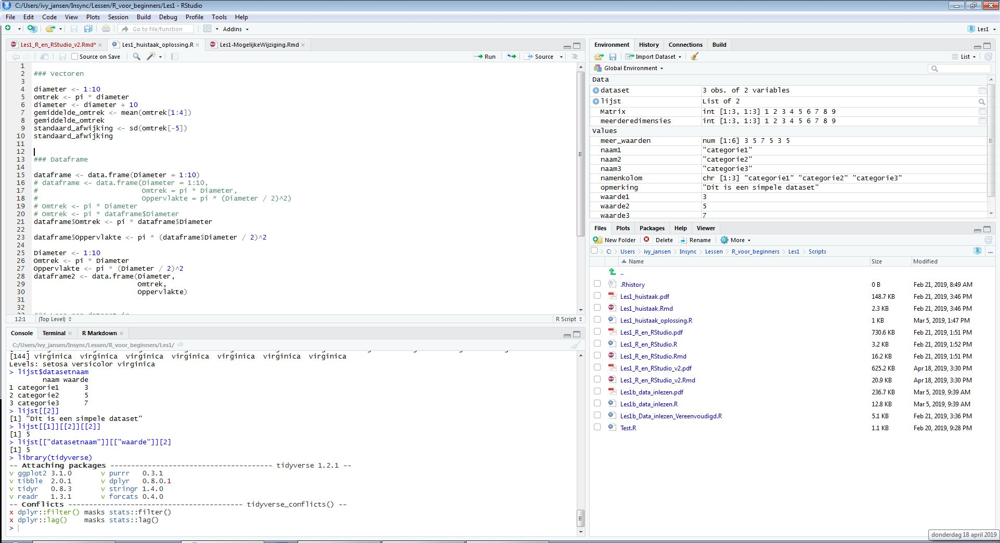
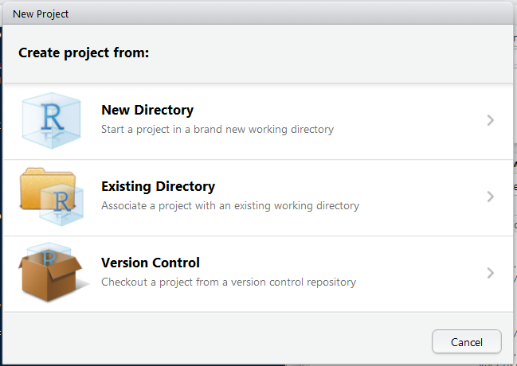
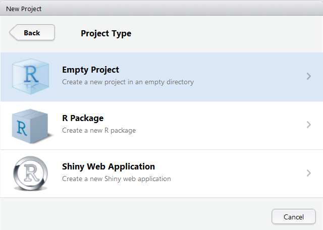
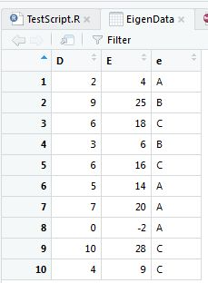

```{r include = FALSE}
library(knitr)
library(tidyverse)
library(INBOtheme)
theme_set(theme_inbo(6, transparent = "plot"))
opts_chunk$set(
  out.extra = "",
  inline = TRUE,
  echo = TRUE, 
  eval = FALSE,
  cache = FALSE, 
  dpi = 300, 
  fig.width = 4.5, 
  fig.height = 3
  )
```

\hspace{2cm} {width=2.5cm} \hspace{4cm} {width=7cm}\ \hspace{2cm}


# R en Rstudio

- R
    - Taal waarmee je gegevens (statistisch) kan verwerken
    - De software `R` is de motor voor gegevensverwerking
    - Beschikt over een rudimentaire GUI (Graphical User Interface)
        - Zelden rechtstreeks gebruikt
        - Meestal via een speciale interface, zoals RStudio
- Waarom R?
    - Open Source en gratis
    - Softwarepakket speciaal ontworpen voor data verwerking, maar daarnaast ook heel flexibel
    - Krachtige motor voor visualisaties
    - Veel tools voor data verkenning en manipulatie ("wrangling")
    - Van zeer eenvoudige tot heel complexe modellen kunnen gemakkelijk gecodeerd worden
    - Zowat iedere nieuw gepubliceerde techniek is onmiddellijk in R beschikbaar
- Hoe werk je met R?
    - Schrijf een script
    - Voer de commando's van het script uit
    - Bewaar de resultaten en figuren
- RStudio
    - Interface (toolbox) rond R
    - Om het gebruik van R sterk te vereenvoudigen
    - Meest gebruikte interface voor R, sterk aanbevolen door BMK
    - Andere toolboxen als TINN-R, Eclipse, Emacs, ... hebben niet de kracht van RStudio
- Wat te doen na een eerste installatie of een upgrade van R en RStudio?
    - [RStudio](https://inbo.github.io/tutorials/installation/user/user_install_rstudio/)
    - [R](https://inbo.github.io/tutorials/installation/user/user_install_r/)


# Interface RStudio

\


## Titelbalk

- Bovenaan
- Balk zoals in alle software, om nieuwe files aan te maken, knippen/plakken, zoeken/vervangen, R te herstarten, opties aan te passen, ...


## Console venster

- Standaard links onder
- Hier voer je commando's uit
- Bovenaan het Console venster zie je de huidige werkdirectory (belangrijk!)

\


## Script venster

- Standaard links boven
- Hier schrijf je scripts
    - Eenvoudig tekstbestand met .R extensie
    - Bevat een set van R commando's in een logische volgorde
    - Gemakkelijk commentaar toe te voegen
- Principe 
    - Alle code in een script
    - Code van script naar console sturen om uit te voeren
        - Met de **Run** knop rechtsboven 
        - Of met de toetsencombinatie CTRL + ENTER 
        - Werkt voor de huidige regel (waar de cursor staat), of op alle geselecteerde tekst
    - Je past de code in het script aan (en voert die opnieuw uit) tot er gebeurt wat jij wenst
    - Je bewaart het script om het later opnieuw te gebruiken (of aan verder te werken)
- Nieuw script starten
    - Via menu `File` --> `New file` --> `R Script`
    - Geef je scripts een zinvolle naam
- Bestaand script openen
    - Via menu `File` --> `Recent files`
    - Via menu `File` --> `Open file ...`
    - Via tabblad `Files` (rechtsonder) dubbelklikken op het bestand
- Je kan meerdere scripts naast elkaar openen
    - Elk script wordt een apart tabblad

### Basisstructuur van een script

1. Laden van packages
1. Data inlezen
1. Data formatteren en selecteren (data wrangling)
1. Exploratieve analyse (tabellen en figuren)
1. Statistische analyses
1. Resultaten model tonen (tabellen en figuren)

### Handige weetjes i.v.m. scripts

- RStudio beschikt over *syntax highlighting*

    {width=3cm}\
- Beweeg over het kruisje om te zien wat het probleem is

    {width=5cm}\
- Ook mogelijke problemen worden aangegeven

    {width=10cm}\
- Als je de cursor op een haakje plaatst, dan zal het overeenkomstige haakje oplichten
- CTRL + SHIFT + C zet de selectie (of huidige regel) om naar commentaar regel(s)
    - Commentaarregels beginnen met `#`
    - Indien het commentaarregels betrof, worden de commentaar tekens verwijderd
- Bestanden met een asterix (*) achter hun (rode) naam bevatten wijzigingen die nog niet bewaard werden
    - Bestand bewaren met CTRL + S of `File` --> `Save`
    - RStudio zorgt continu voor een autosave van alle scripts

\newpage

## Environment / History venster

- Standaard rechts boven
- In het **Environment** tabblad zie je alle objecten in de actieve R-sessie
- In het **History** tabblad zie je alle reeds uitgevoerde commando's

{width=12cm}\


## Files / Plots / Packages / Help venster

- Standaard rechts onder
- In het **Files** tabblad zie je alle bestanden in de (werk)directory
- In het **Plots** tabblad verschijnen alle grafieken
- In het **Packages** tabblad krijg je een overzicht van alle geïnstalleerde packages. De packages die geladen zijn in de huidige sessie, zijn aangevinkt.
- In het **Help** tabblad kan je informatie terugvinden over alle R functies


### Files

- Laat standaard alle files in de werkdirectory zien
    - Werkdirectory staat bovenaan Console venster
    - Of op te vragen met `getwd()`
    - Te veranderen met `setwd("/path/to/my/CoolProject")`
    - Of via `Files` venster --> `More` --> `Set As Working Directory`
    - Zelden zinvol om te wijzigen
- Een verkenner
    - Snuffelen in mappen
    - Files verwijderen
    - Files hernoemen (zelfs al staan ze open in RStudio)
    - Nieuwe mappen aanmaken
    - Zelfs mogelijk om files te kopiëren of verplaatsen (via `More`)


### Packages

- Een R __package__ is een collectie van functies, data en documentatie ter uitbreiding van base R. 
- Deze moeten eerst geïnstalleerd worden met het commando `install.packages("Name_Package")`. Dit dient slechts éénmalig uitgevoerd te worden en mag in de console.
    - `install.packages("readr")`
- Kan ook via het `Packages` venster --> `Install`
- Zorg dat je verbonden bent met het internet !!!
- Je kan de functies, objecten en help files van een package pas gebruiken nadat het geladen is met het commando `library()`. Zet dit commando steeds bovenaan je R-script, zodat alle packages die nodig zijn voor de analyse, vanaf de start geladen zijn.
    - `library(readr)`
- Kan ook via het `Packages` venster, en dan de box voor het package aanvinken, maar dit is niet aan te raden, wegens niet reproduceerbaar.

\newpage

### Help

- Gebruik de built-in RStudio help interface voor meer info over R functies

    {width=10cm}
- Ik krijg van iemand een script (of open een "oud" script van mezelf) en weet niet (meer) wat een bepaalde functie doet
    - Zet de cursor op die functie (of selecteer de functie) en druk `F1`
- Ik ken de naam van de functie die ik wil gebruiken, maar weet niet goed hoe
    - Gebruik het vraagteken
    - `?mean`
- Ik wil een functie gebruiken die `X` doet. Er moet zo een functie bestaan, maar ik weet niet welke
    - Gebruik `help.search()` of het dubbele vraagteken `??`
    - `??kruskal`
    - Dit zoekt enkel in de reeds geïnstalleerde packages
- [rdocumentation.org](http://www.rdocumentation.org) website 
    - Doorzoekt de help files van alle bestaande packages
- Generieke zoektocht op Google "R \<task\>" 
    - Package documentatie
    - Forum waar al iemand anders jouw vraag gesteld heeft
- Ik zit vast... Ik krijg een error message en ik begrijp het niet
    - Google de error message
    - Werkt niet altijd, omdat de foutmelding heel generiek kan zijn
    - Voeg de naam van de functie of het package toe in de zoekopdracht
- [http://stackoverflow.com/questions/tagged/r](http://stackoverflow.com/questions/tagged/r)
    - Gebruik de tag `[r]`
    - Uitdaging is om de juiste woorden te gebruiken in de zoekopdracht


# R project

## Wat is een R project?

- Een R project is niet meer dan een klikbaar tekstbestandje (.Rproj extensie)
- En een map .Rproj.user die automatisch gemaakt wordt
- Samen bevatten deze alle instellingen voor je project
- **Doel**: R werk op een eenvoudige manier structureren
- **Voordelen**
    - Projectspecifieke basisdirectory
        - Alle scripts en data kan je per project samenzetten
    - Alle instellingen en bestanden worden geladen zoals het project de laatste keer afgesloten werd
    - Meerdere projecten kunnen naast elkaar geopend worden
        - Start hiervoor een RStudio sessie per project
    - Hele project gemakkelijk doorgeven aan een collega
- **Suggestie**: gebruik minstens één RStudio project per (onderdeel van een) JIRA project


## Nieuw project aanmaken

- Via het menu `File` --> `New project...`

\


- **New directory**: 
    - Maak het project in een nieuwe directory
- **Existing directory**: 
    - Maak een project op basis van een bestaande directory
    - In een volgende stap selecteer je de gewenste directory
- **Version control**:
    - Start een project met versiebeheer
    - Geavanceerde versie van _track changes_ in Word
    - Behoorlijk geavanceerd en buiten scope van deze cursus

\


- **Empty project**
    - Een leeg project
    - Je kiest 
        - de naam van het project (`Directory name`)
        - de naam van een directory waarin het project als subdirectory gemaakt wordt
    - Klik daarna op _Create project_
- **R Package**
    - Voor wie zelf code wil documenteren onder de vorm van een R package
    - Buiten de scope van deze cursus
    - Slides van workshop beschikbaar bij BMK
- **Shiny Web Application**
    - Jouw R analyse beschikbaar stellen als een webapplicatie
    - Buiten de scope van deze cursus

{width=11cm}\  

**Tip** Maak voor deze lessenreeks 1 project aan volgens variant 1, waarin je het materiaal van de 4 lessen bewaart in de juiste submappen (datasets onder `data`, scripts onder `src`, begeleidende pdf's, oefeningen en huistaken onder `documenten`, ...).


## Bestaand project openen

- In Verkenner dubbelklikken op `.Rproj` bestand
- In RStudio via menu `File` --> `Recent projects` 
- Of `File` --> `Open project...`
- Of knop rechtsboven
    
{width=4cm}\


## Aanbevolen structuur projectmap

Op het INBO zijn er 2 vaak voorkomende varianten. Ze verschillen enkel in de plaats van het project bestand `.Rproj`. Dit bepaalt ook de default werkdirectory van het project.

1. Het project bestand staat in de projectmap, op hetzelfde niveau als de mappen die hieronder aangemaakt worden
1. Het project bestand staat in de submap `src`, naast alle R-scripts

Maak in de projectmap volgende submappen aan

- `src` : hier zet je alle R-scripts
- `data` : bevat alle datasets (xls, txt, csv, ...)
- `output` : figuren, tabellen, ... van je analyse
- `rapport` : bewaar hier het finale rapport van de analyses
- `documenten` : voor achtergrondliteratuur en dergelijke

Nieuwe mappen zijn gemakkelijk aan te maken via het `Files` venster.


## Bestandshiërarchie

- R zal altijd werken relatief aan je werkdirectory
- Verwijzen naar een bestand in de werkdirectory: `"mijndata.csv"`
- Naar een bovenliggende directory verwijs je via **../**
- Als je data in de data folder in je project staat krijg je volgende
    1. Variant 1 van de projectstructuur: `"data/mijndata.csv"`
    1. Variant 2 van de projectstructuur: `"../data/mijndata.csv"`
- Je kan daar heel ver in gaan: rarara waar staat deze file in relatie tot je werkdirectory?   `"../../project2/data/subfolder/mijndata.csv"`
- Je kan altijd verwijzen naar een absoluut pad (raden we meestal niet aan):  
`"x:/yyy/zzz/data/mijndata.csv"`
- Onder Windows kan je ook \\\\ gebruiken (dubbele backslash) in plaats van forward slash en deze zelfs mixen
    - `"c:\\xxx\\yyy\\project1\\data\\mijndata.csv"`
    - `"c:\\xxx\\yyy/project1/data/mijndata.csv"`


# Coding basics

## R als rekenmachine

```{r}
1 / 200 * 30
(59 + 73 + 2) / 3
sin(pi / 2)
sqrt(169)
```


## Functies oproepen

R heeft een grote collectie van ingebouwde functies, die je als volgt oproept

```{r eval = FALSE}
function_name(arg1 = val1, arg2 = val2, ...)
```

```{r}
sin(pi / 2)
sqrt(169)
seq(1, 10)
round(5.78)
```


## Nieuwe objecten creëren

```{r}
x <- 3 * 4
y <- sqrt(169)
z <- (x > y)
naam <- "Ivy Jansen"
```

Alle R commando's waarmee een object aangemaakt wordt, __assignments__, hebben dezelfde vorm

```{r}
object_name <- value
```

*Sneltoets* voor " `<-` " : ALT + "-"

R helpt waar mogelijk met haakjes en aanhalingstekens

```{r}
x <- "hello world"
```

```
> x <- "hello
+
```

Een `+` aan het begin van de regel betekent dat R wacht op meer input. Meestal betekent dit dat je een `"` of een `)` vergeten bent. Voeg het ontbrekende teken toe en duw op ENTER, of duw op ESCAPE om het commando af te breken.


### What's in a name?

- Object namen starten met een letter
- Bevat alleen letters, cijfers, `_` en `.`
- Beschrijvende naam
- Verschillende conventies

```{r}
i_use_snake_case
otherPeopleUseCamelCase
some.people.use.periods
```

```{r}
this_is_a_really_long_name <- 2.5
```

*Sneltoets* om lange naam te vervolledigen : TAB

*Sneltoets* om in de Console vorige commando's terug op te roepen : ↑

```{r}
r_rocks <- 2 ^ 3
```

Laten we dit object eens inspecteren
```{r}
r_rock
#> Error: object 'r_rock' not found
R_rocks
#> Error: object 'R_rocks' not found
```

**There's an implied contract between you and R: it will do the tedious computation for you, but in return, you must be completely precise in your instructions.** 

- Typos matter 
- Case matters


\newpage


# R data types

## Enkelvoudige types

1. Numerieke waarden (geen quotes)
    - gehele getalen (`integer`): 3, 5, -17
    - kommagetallen (`numeric`, `float`, `double`): 3.00, 3.14, -7.52, 3.4e08
    - logische waarden (`logical`): 
        - waar: `TRUE`, `T`, 1
        - onwaar: `FALSE`, `F`, 0 
    - Datum/Datumtijd: 
        - tekstuele notatie: "2019-04-01 13:13:13"
        - numerieke notatie (aantal seconden sinds 1970-01-01 00:00:00 GMT): 1554117193
1. Tekstuele waarden (altijd in quotes)
    - `string`: betekenisloze waarden: "ik beteken helemaal niets"
    - `factor`: categorische variabele: "appel", "peer", "banaan"
    - `ordered`: geordende categorieën: "weinig", "middelmatig", "veel"
    - **Quotes zijn essentieel**. Zonder quotes denkt R dat het gaat over de objecten `appel`, `peer`, `weinig`, `veel`. Aangezien deze niet bestaan in het geheugen van R, zal je een foutmelding krijgen.
1. Speciale waarden (geen quotes)
    - `NA`: ontbrekende waarde
    - `NaN`: ongeldige waarde
    - `Inf`: $\infty$ 
    ```{r, eval = TRUE}
    waarde1 <- 3
    waarde2 <- 5
    waarde3 <- 7
    waarde3
    naam1 <- "categorie1"
    naam2 <- "categorie2"
    naam3 <- "categorie3"
    naam3
    opmerking <- "Dit is een simpele dataset"
    ```


## Array (of vector)

- Een reeks van enkelvoudige waarden van hetzelfde type
- Een kolom in een tabel
- Kan meerdere dimensies hebben: bijvoorbeeld een matrix  
    ```{r, eval = TRUE}
    waardekolom <- c(waarde1, waarde2, waarde3)
    waardekolom
    namenkolom <- c(naam1, naam2, naam3)
    namenkolom
    meerderedimensies <- matrix(1:9, ncol = 3)
    meerderedimensies
    ```

## Dataset (data.frame, tibble)

- Verschillende vectoren (kolommen) met hetzelfde aantal elementen
- Kolommen hebben allemaal een (logische) naam
- tibble is een speciaal soort dataframe van het `tidyverse` package
    - Wordt altijd mooi geprint in de Console (in tegenstelling tot grote dataframes)
    - Belangrijkste informatie wordt getoond
    ```{r, eval = TRUE}
    dataset <- data.frame(naam = namenkolom, 
                          waarde = waardekolom)
    dataset
    ```


## Lijst
    
- Verzameling die al het voorgaande kan bevatten, alsook andere lijsten
    ```{r, eval = TRUE}
    lijst <- list(datasetnaam = dataset, 
                  beschrijving = opmerking)
    lijst
    ```


## Elementen selecteren in een vector, dataframe en lijst

### Vector

- Elementen selecteren met indices tussen vierkante haken [], dimensies gescheiden door een komma
    ```{r}
    waardekolom[2]
    namenkolom[c(3, 2)]
    meerderedimensies[1, 2]
    ```
- Negatieve indices: alles behalve die elementen
    ```{r}
    waardekolom[-1]
    namenkolom[-c(2, 4)]
    meerderedimensies[-3, -2]
    ```
- Indices herhalen om bepaalde elementen meer te laten voorkomen
    ```{r}
    waardekolom[c(1, 2, 3, 2, 1, 2)]
    ```


### Dataframe

- Kolommen selecteren met $ of [[]], dit wordt dan een vector
    ```{r}
    dataset$waarde
    dataset[[2]]
    ```
- Elementen selecteren zoals in een meerdimensionale vector, of uit een kolom zoals bij vectoren
    ```{r}
    dataset[3, 2]
    dataset$waarde[2]
    ```


### Lijsten

- Deelverzameling selecteren met $ of [[]]
    ```{r datatypes}
    lijst$datasetnaam
    lijst[2]
    lijst[[2]]
    ```
- Daarna verdere selecties zoals bij vectoren of dataframes
    ```{r}
    lijst$datasetnaam$waarde[2]
    lijst[[1]][[2]][[2]]
    ```


### Extra: verschil tussen [] en [[]]

- Selectie met $ en [[]] resulteert in een vector
- Ook mogelijk om een selectie te maken met []
    - Dit behoudt het oorspronkelijke dataformaat
    ```{r}
    lijst[2]
    lijst[[2]]
    class(dataset[[2]])
    class(dataset[2])
    class(lijst[2])
    ```
- `lijst[2]` zal een lijst teruggeven met enkel het tweede element
- `lijst[[2]]` zal de inhoud teruggeven van het tweede element van de lijst
    

## Functies om vectoren en dataframes te inspecteren

- Structuur van een object en zijn elementen: `str()`
- Datatype van een object: `class()`
- Samenvatting van een object: `summary()`
- Meer informatie over factoren: `levels()`, `labels()`
- Aantal elementen in een vector: `length()`
- Aantal rijen en/of kolommen in een dataframe: `nrow()`, `ncol()`, `dim()`
- Rijnamen van een dataframe: `rownames()`
- Kolomnamen van een dataframe: `colnames()` of `names()`
- Eerste $n$ regels van een dataframe: `head()`
- Laatste $n$ regels van een dataframe: `tail()`
- Een volledig overzicht van een dataframe: `View()`
    
    {width=4.5cm}\  

**Wees kritisch** bij het evalueren

- Juiste datatypes
- Correct aantal NA waarden
- Realistische waarden voor min, max, mean, ...


## Missing data

- Ontbrekende waarden codeer je als `NA` (-9999 = *recipe for disaster*)
- Bewerkingen op getallen
    - Meeste functies geven `NA` als resultaat wanneer er missing data aanwezig zijn
    - Extra moeilijkheid !!!
    - Argument `na.rm = TRUE` toevoegen aan de functie
    ```{r}
    heights <- c(1, 2, 4, 4, NA, 6, 8)
    mean(heights)
    max(heights)
    mean(heights, na.rm = TRUE)
    max(heights, na.rm = TRUE)
    ```
- Functies om te kunnen omgaan met missing data
    - `is.na()` 
    - `na.omit()`
    - `complete.cases()`
    ```{r}
    !is.na(heights)
    na.omit(heights)
    complete.cases(heights)
    heights[!is.na(heights)]
    ```


# Meldingen in de Console

De (rode) meldingen in de Console kunnen 3 verschillende dingen betekenen:

- Foutmelding
    - Begint met `Error`
    - R stopt
    - Moet opgelost worden alvorens verder te kunnen
- Waarschuwing
    - Begint met `Warning`
    - R gaat gewoon verder
    - Zeker nakijken en indien nodig aanpassen
    - Kan de reden aangeven waarom *rare* resultaten verkregen worden
- Mededeling
    - Begint **niet** met `Error` of `Warning`
    - Geeft meer informatie (vooral bij laden van packages)
    - Niet nodig iets aan te passen


# Tips & tricks, shortcuts

- ALT + "-" : maak een toekenningspijltje " `<-` " 
- TAB : vraag R om het commando aan te vullen
- ↑ (in Console) : roep het vorige commando terug op
- CTRL + ENTER : voer het commando uit waar de cursor staat (niet nodig om te selecteren)
- CTRL + SHIFT + ENTER : voer alle commando's uit
- CTRL + SHIFT + C : verander een regel code in een commentaar regel (#) of omgekeerd
- CTRL + S : bewaar het script
- CTRL + Z : undo
- CTRL + SHIFT + Z : redo
- CTRL + L : clear console
- CTRL + SHIFT + F10 : restart R


# More to learn

- R for data science
    - Boek van Hadley Wickham en Garrett Grolemund
    - Hardcopy beschikbaar op INBO
    - [Digitale versie](https://r4ds.had.co.nz/)
- Datacamp
    - (gedeeltelijk) gratis lessen (video tutorials en oefeningen)
    - Account voor 72h voor volledige toegang, daarna betalende licentie (~ €25/maand)
    - [Introduction to R](https://www.datacamp.com/courses/free-introduction-to-r)
    - [Importing data in R (part 1)](https://www.datacamp.com/courses/importing-data-in-r-part-1)
        - [readr](https://campus.datacamp.com/courses/importing-data-in-r-part-1/readr-datatable?ex=1)
        - [readxl](https://campus.datacamp.com/courses/importing-data-in-r-part-1/importing-excel-data?ex=1)
    - Gewone tutorial [Quick-R](https://www.statmethods.net/index.html)
- Data Carpentry
    - Data Carpentry is a non-profit organization that develops and provides data skills training to researchers
    - Building communities teaching universal data literacy
    - [Lessen voor ecologen](https://datacarpentry.org/R-ecology-lesson/index.html)
- Stat 545
    - [Topic list](http://stat545.com/topics.html)
- Cheat Sheets
    - In RStudio onder `Help` menu
    - [Online](https://www.rstudio.com/resources/cheatsheets/)


# Referenties

- [R for data science](https://r4ds.had.co.nz/)
- Slides van Thierry uit 2015