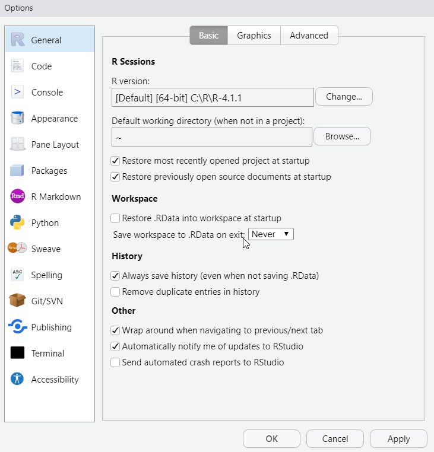
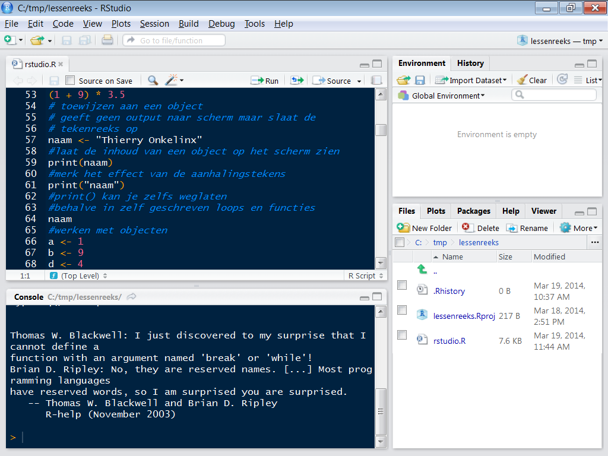
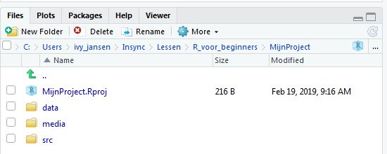

```{r include = FALSE, purl=FALSE}
library(knitr)
library(tidyverse)
library(INBOtheme)
theme_set(theme_inbo(6, transparent = "plot"))
opts_chunk$set(
  out.extra = "",
  inline = TRUE,
  echo = TRUE, 
  eval = FALSE,
  cache = TRUE, 
  dpi = 300, 
  fig.width = 4.5, 
  fig.height = 3
  )
```

\hspace{2cm} {width=2.5cm} \hspace{4cm} {width=7cm}\ \hspace{2cm}

# Inleiding tot R en Rstudio

## Doelstelling van deze les

* Wat is R en Rstudio
* Basiscommando's in R gebruiken
* Werken met scripts
* Help opvragen
* Werken met projecten

## Inhoud volgende lessen

* Les 2: Data inlezen en visualiseren
* Les 3: Data kneden: samenvatten, berekeningen maken, filterenm selecteren, ...
* Les 4: Introductie tot markdown en geïntegreerde oefening over de 4 lessen


## R vs Rstudio

* R
    * Scripting taal waarmee je gegevens (statistisch) kan verwerken
    * De software R is de motor voor de gegevensverwerking
    * Het programma R zelf beschikt over een rudimentaire GUI (Graphical User Interface)
        * Zelden rechtstreeks gebruikt
        * Meestal via een uitgebreide interface die R oproept, zoals RStudio
* Waarom R?
    * Open Source en gratis
    * Softwarepakket speciaal ontworpen voor data verwerking, maar daarnaast ook heel flexibel
    * Krachtige motor voor visualisaties
    * Veel tools voor data verkenning en kneding (“wrangling”)
    * Van zeer eenvoudige tot heel complexe modellen kunnen gemakkelijk gecodeerd worden
    * Zowat iedere nieuw gepubliceerde techniek is onmiddellijk in R beschikbaar
    * Kan gemakkelijk met andere programma's interfacen zoals QGIS, STAN, MARK, INLA
    * Verwerking in R is reproduceerbaar
* Hoe werk je met R?
    * Schrijf een script (dit is gewoon een tekstbestand met extensie .R)
    * Voer de commando’s van het script uit
    * Bewaar de resultaten en figuren die bekomen worden

* RStudio
    * Interface (toolbox) rond R
    * Om het gebruik van R sterk te vereenvoudigen en overzichtelijk te maken
    * Meest gebruikte interface voor R, sterk aanbevolen door BMK
    * Andere toolboxen als TINN-R, Eclipse, Emacs, . . . hebben niet de kracht van RStudio

* Wat te doen na een eerste installatie of een upgrade van R en RStudio?
    * Zie informatie op de [tutorials website](https://inbo.github.io/tutorials/) van INBO
    * Specifiek voor R en Rstudio kan je de links hieronder vinden (aangeraden, niet verplicht)
        * [RStudio](https://inbo.github.io/tutorials/installation/user/user_install_rstudio/)
        * [R](https://inbo.github.io/tutorials/installation/user/user_install_r/)

## Basisscherm Rstudio

\

Rstudio bestaat uit een menu bovenaan en bestaat standaard over 4 hoofdpanelen die elk verschillende tabbladen kunnen bevatten. Je kan de layout, de kleuren, enz... allemaal aanpassen.

1. Titelbalk (helemaal bovenaan):
    * balk zoals in de meeste programma's om te knippen/plakken, nieuwe bestanden te maken, opties te wijzigen, ... 
1. Scriptvenster (Linksboven): Alleen zichtbaar al je een script hebt openstaan
1. Console output (Linksonder): Hierin worden de R commando's uitgevoerd en krijg je standaard de output
1. R omgeving (Rechtsboven): Bestaat uit verschillende tabbladen
    1. Environment: Bevat alle objecten die actief zijn in de sessie
    1. History: Bevat de historiek van je commando's die je hebt uitgevoerd
    1. Connections / Git / Build: Enkel zichtbaar als je effectief deze nodig hebt
1. Varia omgeving (Rechtsonder): Bevat veel verschillende types info
    1. Files: Toont de fysieke bestanden op je harde schijf (een soort verkenner)
    1. Plots: Als je figuren maakt, worden deze hier getoond
    1. Packages: overzicht van alle geïnstalleerde en geladen packages
    1. Help: Help voor R functies
    1. Andere tabbladen zoals data viewer

## R console en eerste korte introductie in de R taal

R kan je gebruiken van een simpele rekenmachine tot een uitgebreide set aan commando's en functies. 
Dit gebeurt door commando's zoals hieronder te typen in de R console. 

### R als rekenmachine

Je kan operatoren gebruiken zoals

- vermenigvuldigen en delen `*` en `/`
- optellen en aftrekken `+` en `-`
- macht `^` of `**` (is hetzelfde)
- vierkantswortel, sinus, cosinus, ...: `sqrt(x)`,  `sin(x)`,  `cos(x)`
- pi en e: `pi` en  `exp(1)`
- integere deling en modulus:  `%/%` en `%%`
- factulteit: `prod(1:n)` waarbij n 20 is, als je 20! wil berekenen
- matrixvermenigvuldiging: `%*%`
- haakjes `(` en `)`

```{r Rekenmachine}
1 / 200 * 30
(59 + 73 + 2) / 3
sin(pi / 2)
sqrt(169)
```

### Nieuwe objecten creëren

```{r NieuweObjecten}
x <- 3 * 4
y <- sqrt(169)
z <- (x > y)
naam <- "Ivy Jansen"
```

Alle R commando's waarmee een object aangemaakt wordt, __assignments__, hebben dezelfde vorm

```
object_name <- value

```

*Sneltoets* voor " `<-` " : ALT + "-"

### Objecten verwijderen

Objecten verwijderen gebeurt niet zoveel, al is dit van toepassing in volgende gevallen 

- de objectnamen zorgen voor verwarring
- enkele objecten zijn reusachtig groot (bv 5x5m grid Vlaanderen) en je wil RAM geheugen vrijmaken

``` {r ObjectenVerwijderen}

#een object verwijderen
objectnaam <- "dit is een object dat ik wil verwijderen"
rm(objectnaam)

#Alle objecten verwijderen
rm(list = ls())

```

## Environment

De environment in R is de collectie van alle objecten en instellingen die actief zijn in de huidige R sessie. Een R sessie is alles wat je doet vanaf je Rstudio opstart totdat je Rstudio afsluit.

### Environment paneel

{width=12cm}\

* De environment geeft een overzicht van de objecten die gekend zijn
    * Voor simpele objecten zie je direct de waarde
    * Voor data en lijsten krijg je de dimensies te zien
        * Je kan klikken op het object en dan wordt dit getoond in een datavenster (soort aleen-lezen spreadsheet), waarin je kan filteren, sorteren, ..., zonder impact op het object zelf
        * Je kan op het blauwe pijltje klikken om het object uit te vouwen en meer in detail te zien
* History toont je recent uitgevoerde commando's 
* Build bevat de interface als je packages of rapporten wil bouwen
* Git bevat de interface met git en github
* Connections geeft een overzicht over de beschikbare connecties met databanken

### Afsluiten van Rstudio
 
- Als je Rstudio afsluit zal gevraagd worden om alle niet bewaarde scripts te bewaren
- Daarnaast zal ook gevraad worden .Rdata (alle objecten in je R sessie) te bewaren
    - Al je huidige objecten zullen dan actief zijn de volgende keer je R opent
    - Toch is dit afgeraden, omdat je liever met een propere R sessie begint wat problemen vermijdt met objecten die je niet verwacht aanwezig te zijn
    - De vraag om .Rdata te bewaren kan je vermijden door in het Tools menu > Global options Save workspace op *never* te zetten en Restore .Rdata into workspace uit te vinken




## Scripts

De geopende R scripts kan je zien in het Scripts paneel in Rstudio.

### Wat is een script

- Eenvoudig tekstbestand met .R extensie
- Bevat een set van R commando's in een logische volgorde
    - Programma's als Rstudio zullen de commando's kleuren naargelang ze commentaar, functies, ... zijn
- Gemakkelijk commentaar toe te voegen
    - `#` is het commentaarsymbool. Alles op dezelfde regel na het hekje wordt niet als code aanzien, maar als commentaar
    - met de snelkoppeling CTRL-SHIFT-C kan je verschillende lijnen tegelijk uitcommentariëren of terug actief maken
- Principe voor het gebruik van een script 
    - Alle code zet je in een script
    - De code moet je zelf nog naar de console, voordat R aan de berekeningen begint
        - CTRL + ENTER stuurt huidige regel naar console (en gaat naar de volgende regel)
        - Indien code geselecteerd is, dan wordt de selectie doorgestuurd
    - Je past de code in het script aan tot dat er gebeurt wat jij wenst. Doe dit niet in de R console!
    - Je bewaart het script om het later opnieuw te gebruiken (of aan verder te werken)
- Nieuw script starten
    - Via menu `File` --> `New file` --> `R Script`
    - Geef je scripts een zinvolle naam
- Bestaand script openen
    - Via menu `File` --> `Recent files`
    - Via menu `File` --> `Open file ...`
    - Via tabblad `Files` dubbelklikken op het bestand
- Je kan meerdere scripts naast elkaar openen
    - Elk script wordt een apart tabblad
- Vergeet niet je script te bewaren
    - Via menu `File` --> `Save As ...`
    - het bewaaricoontje bovenaan het scriptvenster

\


### Basisstructuur van een script

1. Laden van packages en scripts
1. Data inlezen
1. Data formatteren en selecteren
1. Exploratieve analyse (eenvoudige tabellen en figuren)
1. Data dieper onderzoeken en samenvatten
1. Statistische analyses
1. Valideren resultaten
1. Resultaten rapporteren (mooie en doordachte tabellen en figuren)

**Let op: Een script wordt altijd van boven naar onder uitgevoerd. Dus als je iets nodig hebt van bovenstaande regels, moet je die eerst uitvoeren.**

Meestal zal je je code over verschillende scripts verspreiden. Deze zijn niet afhankelijk van elkaar, 
dus zal je moeten afdwingen dat de nodige scripts eerst uitgevoerd zijn

- Je kan dit manueel
- Je kan je scripts een logische volgorde geven, zoals een nummering
- Je kan bovenaan een script `source("pad_naar_script_dat_eerst_uitgevoerd_wordt")` zetten


### Handige weetjes i.v.m. scripts

- RStudio beschikt over *syntax highlighting* (code kleuren) een *syntax controle* (codeerfouten opsporen voor je de code uitvoert)

    {width=3cm}\
- Beweeg over het kruisje om te zien wat het probleem is

    {width=5cm}\
- Ook mogelijke problemen worden aangegeven

    {width=10cm}\
- Als je de cursor op een haakje plaatst, dan zal het overeenkomstige haakje oplichten
- Als je een deel van een commando schrijft en TAB duwt, krijg je een lijst met mogelijke aanvullingen
- CTRL + SHIFT + C zet de selectie (of huidige regel) om naar commentaar regel(s)
    - Commentaarregels beginnen met `#`
    - Indien het commentaarregels betroffen, worden de commentaar tekens verwijderd
- Bestanden met een asterix (*) achter hun (rode) naam bevatten wijzigingen die nog niet bewaard werden
    - Bestand bewaren met CTRL + S of `File` --> `Save`
    - RStudio zorgt continu voor een autosave van alle scripts


## Werkdirectory: Waar bevind ik me?

De werkdirectory in R is wat R ziet als het pad waarin je werkt, dus als je files inleest of exporteert zal dit standaard in de werkdirectory gebeuren. Als je met relatieve paden werkt zal dit relatief aan de werkdirectory zijn

\


- Working directory (werkdirectory)
    - `getwd()` toont de huidige werkdirectory
    - `setwd("/path/to/my/CoolProject")` wijzigt de werkdirectory
    - `Files` venster --> `More` --> `Set As Working Directory`
    - Bovenaan in de console kan je ook je huidige werkdirectory terugvinden
- Gebruik van paden (verwijzingen naar files op de harde schijf)
    - Om data in te lezen
    - Om resultaten weg te schrijven
    - Keuze tussen absolute en relatieve paden --> gebruik zoveel mogelijk relatieve paden
    - Absolute paden zijn verwarrend, en vooral **vervelend** als je de structuur van je pc verandert, of werk wil doorgeven aan een collega


## Projecten

### Wat zijn projecten

Projecten zijn een belangrijke manier om je werk te structureren en gemakkelijk door te geven aan iemand anders.

- Dit is niets exotisch: 
- Er wordt een tekstbestandje aangemaakt met de extensie `.Rproj` waarop je kan in de windows verkenner klikken om het project in Rstudio te openen
- Daarnaast wordt de map `.Rproj.user` aangemaakt die heel wat info bijhoudt
    - Geopende scripts bij het afsluiten zullen terug geopend worden
    - Instellingen rond git, het bouwen van je applicatie, rapport, ... worden in het project bewaard
- Wij raden aan zoveel mogelijk met projecten te werken!
- Voordelen
    - Projectspecifieke basisdirectory
        - Alle scripts en data kan je per project samenzetten
        - Projectspecifieke instellingen bewaren
        - Het is altijd duidelijk wat de werkdirectory is, nl. de projectdirectory
        - Relatieve verwijzingen naar directories vertrekken uit je projectdirectory
    - Meerdere projecten kunnen naast elkaar geopend worden zonder elkaar te beïnvloeden
        - Open Rstudio apart per project (je kan gerust 5 keer Rstudio tegelijk open hebben)
    - Een project kan je gemakkelijk doorgeven aan een collega

- **Suggestie**: gebruik minstens één RStudio project per (onderdeel van een) JIRA project al houdt niets je tegen om projecten binnen projecten te gebruiken
- Starten met een nieuw project
    - In RStudio via het menu `File` --> `New project...`
- Bestaand project openen
    - In Verkenner dubbelklikken op `.Rproj` bestand
    - In RStudio via menu `File` --> `Recent projects` 
    - Of `File` --> `Open project...`

### Nieuw project

\


- **New directory**: 
    - Maak het project in een nieuwe directory
- **Existing directory**: 
    - Maak een project op basis van een bestaande directory
    - In een volgende stap selecteer je de gewenste directory
- **Version control**:
    - Start een project met versiebeheer
        - Geavanceerde versie van _track changes_ in Word
        - Als je met git en github werkt zal je deze optie vaak gebruiken
        - Je zal de optie krijgen op de git clone url in te vullen


\


- **Empty project**
    - Een leeg project
    - Je kiest 
        - de naam van het project (`Directory name`)
        - de naam van een directory waarin het project als subdirectory gemaakt wordt
    - Klik daarna op _Create project_
- **R Package**
    - Voor wie zelf code wil documenteren onder de vorm van een R package
    - Buiten de scope van deze cursus
    - Slides van workshop beschikbaar bij BMK
- **Shiny Web Application**
    - Jouw R analyse beschikbaar stellen als een webapplicatie
    - Buiten de scope van deze cursus

{width=11cm}\


### Aanbevolen structuur projectmap

- MijnProject.Rproj (de locatie waar dit bestand staat is je project werkdirectory)
- ./data
    - Alle datasets (xls, txt, csv, ...)
- ./media of ./figuren ./tabellen ./output
    - Alle figuren en dergelijke
- ./src of ./R
    - Alle scripts
- ./interim wordt soms gebruikt voor tussenliggende analysedatasets
- Nieuwe mappen gemakkelijk aan te maken via `Files` venster in Rstudio

Met deze structuur kan je dan bv data inlezen met de relatieve padnaam `data/mijndata.csv` of figuren wegschrijven met de relatieve padnaam `figuren/mijnfiguur.png`

{width=11cm}\


## Packages (libraries)

- Een R __package__ is een collectie van functies, data en documentatie ter uitbreiding van base R. Veel functies die in R gebruikt worden zitten in packages (packages worden soms ook libraries genoemd)
- Deze moeten eerst geïnstalleerd worden met het commando `install.packages("Name_Package")`. Dit dient slechts éénmalig uitgevoerd te worden en mag in de console
    - `install.packages("readr")`
- Kan ook via het `Packages` venster --> `Install`
- Zorg dat je verbonden bent met het internet !!!
- Je kan de functies, objecten en help files van een package pas gebruiken nadat het geladen is met het commando `library()`. Dit moet iedere keer opnieuw als je R opstart. Zet dit commando steeds bovenaan je R-script, zodat alle packages die nodig zijn voor de analyse, vanaf de start geladen zijn
    - `library(readr)` 
- Kan ook via het `Packages` venster, en dan de box voor het package aanvinken, maar dit is niet aan te raden, wegens niet reproduceerbaar
- Packages gebruiken heel vaak andere packages die moeten geïnstalleerd worden (dependency). Dus een installatie kan wel wat duren.

**Let op: als je functies uit een pakket wil gebruiken zal je iedere keer je Rstudio opstart de code die de pakketten laadt moeten uitvoeren `library(pakketnaam)` daarom dat je die code best bovenaan je script zet**

```{r InstallerenEnLadenPackages}
  install.packages("tidyverse") #eenmalig, quotes zijn nodig
  
  tekstje <- "van deze string wil ik het aantal characters tellen"
  str_count(tekstje) #werkt niet, de functie is nog niet gekend
  
  library(tidyverse) #telkens je een nieuwe R sessie start
  str_count(tekstje) #nu werkt het wel
  
```


Je kan code uit een pakket gebruiken zonder het pakket te laden met `::` bv `readr::read_csv(...)` maar dit wordt zeker voor beginners afgeraden.

Soms komen er nieuwe versies uit van packages, dan kan je deze bijwerken (updaten) 

```{r BijwerkenPackages}
update.packages("tidyverse")
```
Je kan ook alle packages die een nieuwe versie hebben updaten. Via checkBuilt = TRUE worden enkel de packages met een nieuwe versie bijgewerkt, ask = FALSE zorgt dat niet telkens een bevestiging gevraagd wordt

```
update.packages(checkBuilt = TRUE, ask = FALSE) 

```
Sommige packages staan niet op CRAN (de website waar de packages van gedownload worden), maar staan bijvoorbeeld op github. Die kan je rechtstreeks installeren als volgt: 

```{r InstallPackageFromGithub}
#eenmalige installatie
install.packages('remotes') #ook het pakket devtools kan je gebruiken

library(remotes)
install_github("inbo/INBOtheme") #pakket voor INBO figuurlayout van Thierry

```


## Help opvragen

- Gebruik de built-in RStudio help interface voor meer info over R functies

    {width=12cm}
- Ik ken de naam van de functie die ik wil gebruiken, maar weet niet goed hoe
    - Gebruik het vraagteken
    - `?mean`
- Ik wil een functie gebruiken die `X` doet. Er moet zo een functie bestaan, maar ik weet niet welke
    - Gebruik `help.search()` of het dubbele vraagteken `??`
    - `??kruskal`
    - Dit zoekt in de  geïnstalleerde packages, ook als ze niet geladen zijn
- Ik ben het commando weer eens vergeten ... 
    - Cheat sheets (Rstudio menu bovenaan > Help > Cheat sheets)
- Ik heb een interessant pakket gevonden, maar ik weet niet hoe het te gebruiken ...
    - Vaak komen R packages met een tutorial (noemt vignette in R)
    - `browseVignettes()` toont een overzicht van alle tutorials van de packages die je geïnstalleerd hebt
    - als je in het packages tabblad een pakket aanklikt krijg je bovenaan een link naar de vignettes voor dit pakket 
    


- [rdocumentation.org](http://www.rdocumentation.org) website 
    - Doorzoekt de help files van alle bestaande packages
- Generieke zoektocht op Google "R \<task\>" 
    - Package documentatie
    - Forum waar al iemand anders jouw vraag gesteld heeft
- Ik zit vast... Ik krijg een error message en ik begrijp het niet
    - Google de error message
    - Werkt niet altijd, omdat de foutmelding heel generiek of heel specifiek kan zijn
    - Voeg de naam van de functie of het package toe in de zoekopdracht
- [http://stackoverflow.com/questions/tagged/r](http://stackoverflow.com/questions/tagged/r)
    - Gebruik de tag `[r]`
    - Uitdaging is om de juiste woorden te gebruiken in de zoekopdracht
    - R zonder google is quasi onmogelijk, maar via google vind je heel veel antwoorden vrij snel
- Ik krijg van iemand een script (of open een "oud" script van mezelf) en weet niet (meer) wat een bepaalde functie doet
    - Zet de cursor op die functie (of selecteer de functie) en druk `F1`
- Als je hulp nodig hebt van BMK of op het internet kan het handig zijn de informatie over je R sessie mee te geven, dit kan met het commando `sessionInfo()`


## R code basis

Eerder hebben we al getoond hoe je R als rekenmachine kan gebruiken en objecten kan maken en hoe je eenvoudige functies kan uitvoeren. Hier gaan we nu op verder.

Je zal zelden code rechtstreeks in de console intypen, maar zal daarvoor meestal een script gebruiken, waar je dan stukken code uit selecteert en laat runnen in de R console (ctrl + ENTER).


### Objectnamen

In tegenstelling tot veel andere programma's werkt R steeds met objecten die je manipuleert en bevraagt. Dus als je een berekening uitvoert en bewaart in een object, zal je dat object moeten tonen om het resultaat te zien. Vaak gebeurt dit via `print` of `summary`. Een object kan gaan van een enkel getal, tot een heuse lijst van statistische modellen.

Niet alle objectnamen zijn zomaar toegestaan:

- Objectnamen moeten starten met een letter
- Bevat alleen letters, cijfers, `_` en `.`
- Beschrijvende naam
- Verschillende conventies

```{r ObjectNamen}
i_use_snake_case = "aangeraden" #dit is aangeraden op het INBO
otherPeopleUseCamelCase = "veel gebruikt"
some.people.use.periods = "afgeraden"
this_is_a_really_long_name <- 2.5
```

*Sneltoets* om lange naam te vervolledigen : TAB

*Sneltoets* om vorige commando's terug op te roepen : ↑

Laten we dit object eens inspecteren

```{r Hoofdlettergevoelig}
r_rocks <- 2 ^ 3
r_rock
#> Error: object 'r_rock' not found
R_rocks
#> Error: object 'R_rocks' not found
```

*There's an implied contract between you and R: it will do the tedious computation for you, but in return, you must be completely precise in your instructions.* 

- Typos matter 
- Case matters

### Functies oproepen

R heeft een grote collectie van ingebouwde functies, die je als volgt oproept.


```
resultaat <- function_name(arg1 = val1, arg2 = val2, ...)

```

Indien je de argumenten niet benoemt zal R die in volgorde interpreteren. Indien je argumenten wel benoemd zal die de waarde voor het corresponderende element gebruiken.

Het is best alle argumenten te benoemen, met uitzondering voor de eerste elementen, waarbij dit wel mag maar minder onduidelijkheid schept. Bv bij het maken van een sequentie `seq` kan je er vanuit gaan dat de eerste argumenten `from` en `to` zijn, dus die hoeven niet benoemd te worden, maar alle andere argumenten best wel.

```{r EnkeleVeelgebruikteFuncties}
sin(pi / 2)
sqrt(169)
seq(1, 10, length.out = 10)
seq(to = 10, from = 1, by = 1)
round(5.78)
c(3, 5, 10) 
```

Rstudio helpt waar mogelijk met haakjes en aanhalingstekens

```
x <- "hello world"

> x <- "hello
+
```
Als je de functie aan het typen bent en je drukt op TAB, dan krijg je een overzicht van de argumenten en die kan je ook selecteren


Een `+` aan het begin van de regel betekent dat R wacht op meer input. Meestal betekent dit dat je een `"` of een `)` vergeten bent. Voeg het ontbrekende teken toe en duw op ENTER, of duw op ESCAPE om het commando af te breken.

### Zelf functies schrijven

Dit gaat te ver voor deze cursus, maar het basisprincipe is als volgt

```
mijn_functie <- function(argument1 = defaultwaarde, argument2 = defaultwaarde) {
 expressies
 ...
 return(resultaat)
}

```
```{r EigenFunctie}
#definieer je eigen functie met de naam mijn_som
#argumenten x en y beiden zonder defaultwaarde
mijn_som <- function(x, y) {
  resultaat <- x + y
  return(resultaat)
}

#voer de functie uit met de objecten a en b
a <- 5
b <- 7
mijn_som(x = a, y = b)

```

### Lussen uitvoeren

Je kan in R zaken herhaald uitvoeren met functies zoals `for` en `while`.
Dit is te complex voor de cursus, maar hier een kort voorbeeld: 

```{r Lussen}
#print voor elke waarde van i (1 tot 10) de waarde van i
for (i in 1:10) {
  resultaat <- paste("i heeft de waarde", i)
  print(resultaat)
}

#resultaat start als 0, zolang j <= 5 is, wordt telkens 2 * j eraan toegevoegd
j <- 0
resultaat <- 0
while (j <= 5) {
  print(paste0("j heeft de waarde ", j))
  resultaat <- resultaat + 2 * j
  j <- j + 1
}
print(resultaat)

```

## Data Types

R gebruikt verschillende datatypes om gegevens te gebruiken. Het gegevenstype kan je via `class(objectnaam)` oproepen.

### Enkelvoudige types

1. Numerieke waarden (geen quotes)
    * gehele getalen (integer): 3, 5, -17
    * kommagetallen (numeric, float, double): 3.00, 3.14, -7.52, 3.4e08
    * logische waarden (logical):
        * waar: TRUE, T, 1
        * onwaar: FALSE, F, 0
    * Datum/Datumtijd: '2019-04-01 13:13:13' of idem 1554117193
1. Tekstuele waarden (altijd in quotes)
    * string: betekenisloze waarden: "ik beteken helemaal niets"
    * factor: categorische variabele: "appel", "peer", "banaan"
    * ordered: geordende categorieën: "weinig", "middelmatig", "veel"
    * Quotes zijn essentieel. Zonder quotes denkt R dat het gaat over de objecten appel, peer,
weinig, veel. Aangezien deze niet bestaan in het geheugen van R, zal je een foutmelding
    * Je kan kiezen of je enkele quotes of dubbele quotes gebruikt " als je consistent blijft
        - `'appel'` of `"appel"` is geldig
        - `'appel"` of `"appel'`niet
        - `"'appel'"` is wel geldig maar dan bewaar je `'appel'` in het object ipv `appel`
1. Speciale waarden (geen quotes)
    * NA: ontbrekende waarde
    * NaN: ongeldige waarde
    * Inf: 1

```{r WaardenToekennen, eval = TRUE}
waarde1 <- 3
waarde2 <- 5
waarde3 <- 7
waarde3

naam1 <- "categorie1"
naam2 <- "categorie2"
naam3 <- "categorie3"
naam3

opmerking <- "Dit is een simpele dataset"
```


### Array (of vector)

**De functie c() is heel belangrijk, hiermee kan je een reeks van getallen of woorden maken**

- Een reeks van enkelvoudige waarden van hetzelfde type
- Een kolom in een tabel
- Kan meerdere dimensies hebben: bijvoorbeeld een matrix
- Een rij cijfers wordt met `c(cijfer1, cijfer2, cijfer3)` gecodeerd
- Een rij tekst wordt met `c("elem1", "elem2", "elem3")` gecodeerd

```{r Vectoren, eval = TRUE}
waardekolom <- c(waarde1, waarde2, waarde3)
waardekolom
waardenrange <- 10:1
waardenrange
waardenrange2 <- seq(from = 1, to = 20, by = 2)
waardenrange2

namenkolom <- c(naam1, naam2, naam3)
namenkolom

meerderedimensies <- matrix(1:9, ncol = 3)
meerderedimensies
```


### Dataset (data.frame, tibble)

- Lijst van Verschillende vectoren (kolommen) met hetzelfde aantal elementen
- Kolommen hebben allemaal een (logische) naam
- Een tibble is een speciaal soort dataframe van het tidyverse package
    - Wordt altijd mooi geprint in de Console (in tegenstelling tot grote dataframes)
    - Belangrijkste informatie wordt getoond

```{r Dataframes, eval = TRUE}
dataset <- data.frame(naam = namenkolom, waarde = waardekolom)
dataset
```

### Lijst

- Verzameling die al het voorgaande kan bevatten, alsook andere lijsten

```{r Lijsten, eval = TRUE}
lijst <- list(datasetnaam = dataset,
beschrijving = opmerking)
lijst

```

## Elementen selecteren in een vector, dataframe en lijst

### Vector

Selecteren in een vector/array:

* Elementen selecteren met indices tussen vierkante haken [], dimensies gescheiden door een komma
* Negatieve indices: alles behalve die elementen
* Indices herhalen om bepaalde elementen meer te laten voorkomen
* Bij meerdimesionele arrays kan je een dimensie leeglaten, dan worden alle elementen gekozen in deze dimensie
    - dus `matrixnaam[1,]` zal alle elementen uit de eerste rij tonen
    - R wil automatisch vereenvoudigen, dus als je wil dat `matrixnaam[1,]` een matrix blijft en geen vector wordt, kan je `drop = FALSE` gebruiken

```{r VectorSelectie, eval = TRUE}
waardekolom[2]
namenkolom[c(3, 2)]
meerderedimensies[1, 2]
waardekolom[-1]
namenkolom[-c(2, 4)]
meerderedimensies[-3, -2]
meerderedimensies[1, ]   #selecteer hele eerste rij  --> vereenvoudigd tot vector
class(meerderedimensies[1, ] )
meerderedimensies[1, , drop = FALSE] #selecteer hele eerste rij --> blijf matrix
class(meerderedimensies[1, , drop = FALSE] )
waardekolom[c(1, 2, 3, 2, 1, 2)]
```

### Dataframe

* Elementen selecteren zoals in een meerdimensionale vector, of uit een kolom zoals bij vectoren
* Kolommen selecteren met $ of [[]], dit wordt dan een vector
* Kolommen selecteren met enkele haken resulteert normaal gezien in een data.frame met enkel die kolommen, tenzij R kan vereenvoudigen, wat je kan vermijden door `drop = FALSE` te gebruiken


```{r DataframeSelectie, eval = TRUE}
dataset$waarde
dataset[[2]]
dataset[2]
dataset["waarde"]    #blijft data.frame
dataset[["waarde"]]  #conversie naar vector
dataset[3, 2]
dataset[3, 2, drop = FALSE]
class(dataset[3, 2, drop = FALSE])
dataset$waarde[2]
```

### Lijsten

* Deelverzameling selecteren met $ of [[]]
* Indien je enkele haken gebruikt [], dan zal het resultaat opnieuw een lijst zijn met enkel de gekozen elementen
* Daarna verdere selecties zoals bij vectoren of dataframes


```{r LijstSelectie, eval = TRUE}
lijst["datasetnaam"]
class(lijst["datasetnaam"])
lijst[2]
lijst$datasetnaam
class(lijst$datasetnaam)
lijst[[2]]
lijst$datasetnaam$waarde[2]
lijst[[1]][[2]][[2]]
```

### Selecteren op basis van een TRUE/FALSE vector (**veelgebruikt!!**)

In plaats van elementen te selecteren op nummer kan je elementen ook selecteren op basis van een voorwaarde

- In plaats van de posities te specifiëren die je wil selecteren, kan je ook een TRUE/FALSE vector gebruiken waarbij enkel de elementen die je wil behouden TRUE zijn
- Je kan vergelijkingsoperatoren `<`,  `>`,  `==`,  `!=`,  `<=`,  `>=`, `%in%` gebruiken
- Je kan ook logische operatoren EN (`&`), OF (`\`),  NIET (`!`) gebruiken 

```{r VoorwaardelijkeSelectie}
#Toon de waarden in de waardenkolom
waardekolom

#selecteer de tweede waarde
waardekolom[2]

#is identiek, enkel het tweede element is TRUE en  wordt geselecteerd
waardekolom[c(FALSE, TRUE, FALSE)]

#Geeft TRUE indien >4 en FALSE indien <= 4
waardekolom > 4
voorwaarde <- waardekolom > 4 #is een object die de TRUE-FALSE vector bevat


#selecteer alle waarden > 4
#de elementen waarvoor waardekolom > 4 TRUE is worden geselecteerd
waardekolom[waardekolom > 4]
waardekolom[voorwaarde] #identiek

#selecteer alle kolommen, dus leeg na de komma uit de dataset 
#waarvoor de naam niet "categorie2"is
dataset$naam != "categorie2" #ter illustratie: de TRUE FALSE vector

dataset[dataset$naam != "categorie2", ] #uiteindelijke selectie

#selecteer de namen waarvoor de waarde kleiner dan 4 of groter dan 6 is
#We nemen slechts 1 kolom, dus zal dit tot een vector vereenvoudigd worden
dataset$waarde < 4
dataset$waarde > 6
(dataset$waarde < 4) | (dataset$waarde > 6) #haakjes optioneel maar duidelijk
voorwaarde2 <- (dataset$waarde < 4) | (dataset$waarde > 6)

dataset[(dataset$waarde < 4) | (dataset$waarde > 6), "naam"]
dataset[voorwaarde2, "naam"] #identiek maar via tussenvariabele voorwaarde2

```


## Inspecteren van vectoren en data.frames

* Structuur van een object en zijn elementen: `str()`
* Datatype van een object: `class()`
* Samenvatting van een object: `summary()`
* Meer informatie over factoren: `levels()`, `labels()`
* Aantal elementen in een vector: `length()`
* Aantal rijen en/of kolommen in een dataframe: `nrow()`, `ncol()`, `dim()`
* Rijnamen van een dataframe: `rownames()`
* Kolomnamen van een dataframe: `colnames()` of `names()`
* Eerste n regels van een dataframe: `head()`
* Laatste n regels van een dataframe: `tail()`
* Een volledig overzicht van een dataframe: `View()` (hoofdletter V)

Wees kritisch bij het evalueren

* Juiste datatypes
* Correct aantal NA waarden
* Realistische waarden voor min, max, mean, . . .

## Eenvoudige figuren

De iris datase is een dataset die met R meegeleverd wordt. Onderstaande plotfuncties zijn de basis R plots, maar in de volgende les van de cursus, wordt een ander type figuren (ggplot) gebruikt die standaard heel wat mooiere resultaten geven en veel mogelijkheden bieden zonder te ingewikkelde codering.

```{r EenvoudigPlotIris}
data(iris) #zorg dat je de data ziet in het Environment paneel
plot(iris$Sepal.Length, iris$Sepal.Width)
plot(iris$Sepal.Length, iris$Sepal.Width, col = iris$Species)
plot(iris$Sepal.Length, iris$Sepal.Width, col = iris$Species, 
     main = "Iris Sepal data", xlab = "Length", ylab = "Width")
barplot(iris$Petal.Length)
```


## Missing data

* Ontbrekende waarden codeer je als NA (-9999 = recipe for disaster)
* Bewerkingen op getallen
    * Meeste functies geven NA als resultaat wanneer er missing data aanwezig zijn
    * Veel functies voorzien de parameter `na.rm = TRUE` welke de bereking maakt met de missings eruit gegooid.
    
* Functies om te kunnen omgaan met missing data
    * is.na()
    * na.omit()
    * complete.cases()

```{r MissingData}    
heights <- c(1, 2, 4, 4, NA, 6, 8)
mean(heights)
max(heights)
mean(heights, na.rm = TRUE)
max(heights, na.rm = TRUE)
!is.na(heights)
na.omit(heights)
complete.cases(heights)
heights[!is.na(heights)]
```


## Meldingen in de Console

De (rode) meldingen in de Console kunnen 3 verschillende dingen betekenen:

* Foutmelding
    * Begint met Error
    * R stopt
    * Moet opgelost worden alvorens verder te kunnen
    * Gevaar: Als een object reeds bestaat, en er komt een foutmelding, dan blijft de oude waarde in het object bestaan 
* Waarschuwing
    * Begint met Warning
    * R gaat gewoon verder
    * Zeker nakijken en indien nodig aanpassen
    * Kan de reden aangeven waarom rare resultaten verkregen worden
* Mededeling
    * Begint niet met Error of Warning
    * Geeft meer informatie (vooral bij laden van packages)
    * Niet nodig iets aan te passen


## Tips & tricks, shortcuts

* ALT + "-" : maak een toekenningspijltje " `<-` " 
* TAB : vraag R om het commando aan te vullen
* ↑ (in Console) : roep het vorige commando terug op
* CTRL + ENTER : voer het commando uit waar de cursor staat (niet nodig om te selecteren)
* CTRL + SHIFT + ENTER : voer alle commando's uit
* CTRL + S : save script
* CTRL + SHIFT + S : source het script (alle commando's uitvoeren)
* CTRL + Z : undo
* CTRL + SHIFT + Z : redo
* CTRL + L : clear console
* CTRL + SHIFT + F10 : restart R
* CTRL + SHIFT + C : verander een regel code in een commentaar regel (#) of omgekeerd


## More to learn

- R for data science
    - Boek van Hadley Wickham en Garrett Grolemund
    - Hardcopy beschikbaar op INBO
    - [Digitale versie](https://r4ds.had.co.nz/)
- Datacamp
    - (gedeeltelijk) gratis lessen (video tutorials en oefeningen)
    - Account voor 72h voor volledige toegang, daarna betalende licentie (~ €25/maand)
    - [Introduction to R](https://www.datacamp.com/courses/free-introduction-to-r)
    - [Importing data in R (part 1)](https://www.datacamp.com/courses/importing-data-in-r-part-1)
        - [readr](https://campus.datacamp.com/courses/importing-data-in-r-part-1/readr-datatable?ex=1)
        - [readxl](https://campus.datacamp.com/courses/importing-data-in-r-part-1/importing-excel-data?ex=1)
    - Gewone tutorial [Quick-R](https://www.statmethods.net/index.html)
- Data Carpentry
    - Data Carpentry is a non-profit organization that develops and provides data skills training to researchers
    - Building communities teaching universal data literacy
    - [Lessen voor ecologen](https://datacarpentry.org/R-ecology-lesson/index.html)
- Stat 545
    - [Topic list](http://stat545.com/topics.html)
- Cheat Sheets
    - In RStudio onder `Help` menu
    - [Online](https://www.rstudio.com/resources/cheatsheets/)


# Referenties

- [R for data science](https://r4ds.had.co.nz/)
- Slides van Thierry uit 2015
