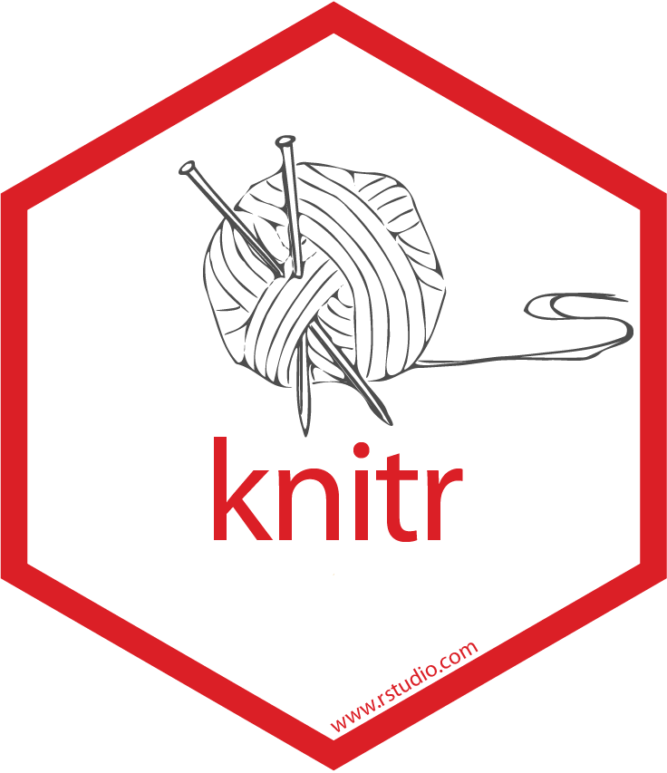
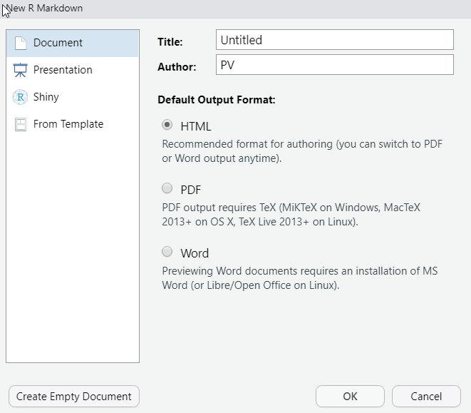
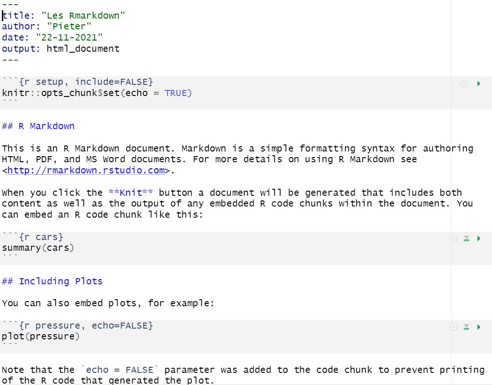
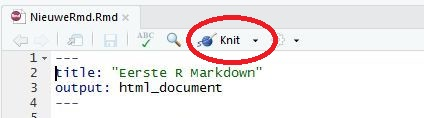
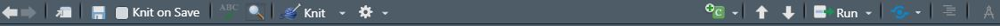

```{r setup, include=FALSE}
options(knitr.duplicate.label = "allow")
knitr::opts_chunk$set(
  out.extra = "",
  inline = TRUE,
  echo = TRUE, 
  warning = FALSE,
  # eval = FALSE,
  # cache = FALSE, 
  dpi = 300, 
  fig.width = 3.6, 
  fig.height = 2.4
  )
fig_width_legend <- 4.8
fig_width_facet <- 5.4
fig_height_facet <- 3.6
```

\hspace{4.5cm} {width=2.3cm} \hspace{2.5cm} {width=2.3cm}\ \hspace{4cm}


# Introductie R markdown

## Inleiding 

### Wat leren we deze les

- Rapporten maken met R code die wordt uitgevoerd


### Voorbereiding

- Installeer het package `rmarkdown`, `knitr` (standaard al geïnstalleerd in Rstudio)

## Wat is R Markdown?

Een framework voor het maken van reproduceerbare en dynamische documenten met R (en data science in het algemeen)

Een R Markdown file is een platte tekstfile met extensie `.Rmd` en bevat 3 belangrijke onderdelen:

1.  Een __YAML header__
1.  __Chunks__ met R code
1.  Markdown tekst

Er is een *render* stap nodig om het finale document te krijgen in je gewenste rapportage formaat zoals pdf, html, docx, ...

- De .Rmd file wordt door [__knitr__](http://yihui.name/knitr/) omgezet naar een markdown (.md) document
    - Alle code chunks worden uitgevoerd
    - Dit bevat alle tekst, code en de output
- Het .md document wordt verwerkt door [__pandoc__](http://pandoc.org/) tot een finaal document
    - Hiervoor zijn veel output formaten mogelijk
    
Wanneer je een document `Knit` (= breien), dan *breit* R Markdown alle onderdelen aan mekaar als volgt


\

## Waarom R Markdown gebruiken?

- Snel en reproduceerbaar een rapport maken van je R analyses
- Code en rapporttekst bewaren binnen eenzelfde document, zonder manuele copy-paste stappen
- Eenvoudig tekst toevoegen en structuur aanbrengen met koppen, lijsten, ...
    - Snel te leren
    - Geen handmatige formattering nodig
    - Nog steeds goed leesbaar als pure tekst
- Verschillende output formaten mogelijk, zoals .html, .pdf, ...
- Bij wijzigingen in je data krijg je een volledig up-to-date document door 1 simpele "klik op de knop"
- Volledig publiceerbare INBO rapporten kunnen hiermee gemaakt worden

## R Markdown basics {#markdownbasics}

Een nieuwe R Markdown file aanmaken via `File` --> `New File` --> `R Markdown`

{width=9cm}\

Hier kan je al kiezen uit allerlei opties:

- `Document` met output formats
    - `HTML`
    - `PDF` (installatie nodig zoals bv. tinytex, miktex)
    - `Word`
- `Presentation` met output formats
    - `HTML (ioslides)`
    - `HTML (Slidy)`
    - `PDF (Beamer)` (installatie nodig zoals bv. tinytex, miktex)
    - `Powerpoint` (MsPowerpoint of OpenOffice)
- `Shiny`
- `From Template`
    - INBO huisstijl 
        - installatie R packages `INBOtheme` en `INBOmd` nodig
        - [Handleiding INBOmd](https://github.com/inbo/INBOmd/blob/main/README.md) 
        - [Voorbeelden](https://github.com/inbo/inbomd_examples/tree/master/source)

Kies `Document`, en geef het een titel. De nieuwe file ziet er dan als volgt uit:

{width=11cm}\

Om een volledig rapport te maken dat alle tekst, code én resultaten bevat

- Klik op de `Knit` knop 
    {width=7cm}\
- Of gebruik de *shortcut* CTRL + SHIFT + K
- Of doe dit in R code (in specifieke gevallen nuttig) met de functies `knit` en `render`


Bovenaan je script venster heb je nog interessante knoppen die je kan gebruiken, om je het leven gemakkelijker te maken.


Enkele interessante functionaliteiten:

- Knit knop om je document te renderen (het dropdown menu ernaast kan je gebruiken om van outputformaat te veranderen)
- Instellingen (tandwieltje)  hoe de Rstudio zich gedraagt als je Rmarkdown documenten maakt
    - Wil je dat de code chunks inline getoond worden
    - Instellingen voor output formaat (wijzigt je YAML header)
- Insert code chunk (eerste icoontje rechts)
- Navigeer van code chunk naar code chunk (pijlen rechts)
- Run: voer de code in de code chunks uit (extra opties het kleine pijltje ernaast)
- Toon de inhoudstafel van je document
- Het laatste icoontje wijzigt de modus van tekstuele editor naar de **visuele markdown editor** en omgekeerd (in de meest recente Rstudio versies) zodat je al een idee hebt hoe het resultaat eruit ziet
    - je kan in de visuele modus werken
    - maar de tekstmodus blijft aangeraden omdat dit nog niet volledig op punt staat

##  Markdown syntax

Een beperkte set van conventies om platte tekst te formatteren, die eenvoudig te leren en te schrijven zijn, en de tekst zelf nog gemakkelijk leesbaar houdt.
Een kort overzicht kan je vinden in de cheat sheet (Help > Cheat Sheets > Rmarkown).

### Tekst formattering 

- *Italic*: 1 sterretje of underscore rond de tekst
    ```
    *italic*  or _italic_
    ```
- **Bold**: 2 sterretjes of underscores rond de tekst
    ```
    **bold**   __bold__
    ```
- _**Bold Italic**_: 3 sterretjes of underscore gevolgd door 2 sterretjes
    ```
    ***bold italic***   _**bold italic**_
    ```
- `Code` (tekst met vaste breedte): 
    - accent grave (staat bij de mu) rond de tekst:  ```` `dit wordt vaste breedte` ````, wordt getoond als: `dit wordt vaste breedte`
    - een lege regel laten, en dan de tekst 4 spaties laten inspringen


- Verbatim output (letterlijke tekst) 
    - tekst zetten tussen 2 regels met ```` ``` ````
    - als je toch een regel met ```` ``` ```` in je tekst wil tonen kan je dit tussen 2 vierdubble ````` ```` ````` zetten (je kan dit ook inline gebruiken)

````
    ```
    Deze tekst moet letterlijk als vaste breedte overgenomen worden.
    Zo is dit niet **vetgedrukt**
    ```    
````
- Superscript^2^: accent circonflex (^) rond de tekst: `superscript^2^`
- Subscript~2~: tilde (~) rond de tekst: `subscript~2~`
    
- Escape karakter: Sommige karakters hebben een speciale betekenis, en als je die in de tekst wil gebruiken, moet je een backslash (\\) ervoor zetten, dit geldt voor bv. \$, \\,  \% en ```` ` ````. Dus om een backslash en dollarteken te schrijven, kan je dit zo coderen: \\\\ en \\\$, of alternatief als ```` `\` ```` en ```` `$` ````

- Wiskundige formules
    - Je kan een LateX gebaseerde formattering voor formules gebruiken
    - Een formuleblok op de volgende regels zet je tussen 2 dubbele `$$`
    - Inline formules komen tussen 2 enkele `$` dus `$E=mc^2$` wordt getoond als $E=mc^2$.

    - [Meer info: rmd4sci.njtierney.com/math.html](https://rmd4sci.njtierney.com/math.html) 

```
$$
A = \pi \times r^{2}
$$

$$
x = \frac{-b \pm \sqrt{b^2 - 4ac}}{2a}
$$
```

$$
A = \pi \times r^{2}
$$
$$
x = \frac{-b \pm \sqrt{b^2 - 4ac}}{2a}
$$

### Koppen

- Kop 1: 1 hashtag
    ```
    # 1st Level Header
    ```
- Kop 2: 2 hashtags
    ```
    ## 2nd Level Header
    ```
- Kop 3: 3 hashtags
    ```
    ### 3rd Level Header
    ```
- ... 
- De al dan niet nummering van de koppen wordt gecontroleerd door de renderingsopties in de YAML header  (zie verder) of door een voorgedefinieerde renderingsstijl (bv. INBOmd).

### Lijsten

- Je kan zelf geneste lijsten of opsommingen definiëren. 
- Er mogen zelfs blanco regels tussen gelaten worden
- **Voor het eerste item van een lijst is een blanco regel nodig**
- Diepere levels worden voorafgegaan door 4 spaties (of 2 tabs, als RStudio zo ingesteld is)
- De gebruikte stijl bepaalt hoe de symbolen en nummering eruit ziet

#### Lijst met opsommingstekens

    ```
    *   Bulleted list item 1
    *   Item 2
        - Item 2a
        - Item 2b
    ```
- Met sterretjes of streepjes
- Gebruik eenzelfde symbool voor de verschillende niveaus voor de duidelijkheid
- In het gerenderde document krijgt elk niveau een ander opsommingsteken

Als output krijg je het volgende (defaultstijl): 

*   Bulleted list item 1
*   Item 2
    - Item 2a
    - Item 2b

#### Genummerde lijst

    ```
    1.  Numbered list item 1
        1. Dit is subitem 1a
        1. Dit is subitem 1b
    1.  Item 2. 
    ```
    
- Een (willekeurig) cijfer of letter gevolgd door een `.`
- In het gerenderde document verhogen de cijfers (letters) automatisch
- Bij diepere niveaus start de nummering opnieuw
    
Als output ziet dit er als volgt uit (defaultstijl):
    
1.  Numbered list item 1
    1. Dit is subitem 1a
    1. Dit is subitem 1b
1.  Item 2. 
    


### HTML Links en niet-R figuren

- Link onder de url <http://www.inbo.be> zelf schrijf je als 
    ```
    <http://www.inbo.be>
    ```
- Link onder [een stuk beschrijvende tekst](http://www.inbo.be) schrijf je als
    ```
    [een stuk beschrijvende tekst](http://www.inbo.be)
    ```
- Figuur wordt met ! aangeduid, de afmetingen kunnen gespecifieerd worden (ZONDER spaties rond `=`)
    ```
    {width=4cm, height=2cm}
    ```
    {width=4cm}\
    
### Manuele tabellen aanmaken

In markdown kan je niet-R tabellen maken door deze quasi letterlijk te tekenen als volgt: 

```
titel1  | titel2  | titel3
------  | ------  | ------
waarde1 | waarde3 | waarde5
waarde2 | waarde4 | waarde6

```
Dit wordt in de defaultstijl getoond als:

titel1  | titel2  | titel3
------  | ------  | ------
waarde1 | waarde3 | waarde5
waarde2 | waarde4 | waarde6

Hoe de tabel eruit ziet wordt door de stijl gedefinieerd, maar deze manier van werken is niet zo gebruiksvriendelijk, daarom is het vaak beter die aan te maken via R code, behalve voor enkele heel kleine tabellen die niet uit je data berekend worden.

## Code chunks

Om de R code in een R Markdown document te laten uitvoeren, moet die in een `chunk` staan. Er zijn 3 manieren om een chunk aan te maken:

1. *Shortcut* CTRL + ALT + I
1. Het knopje bovenaan rechts 
1. Door manueel de chunk delimiters ` ```{r} ` en ` ``` ` in te tikken

Het resultaat is telkens

````
```{r}`r ''`

```
````

Tussen deze chunk delimiters schrijf je dan (kleine) stukken R code, die je nog steeds kan uitvoeren zoals in een gewoon R script. In het `Run` menu bovenaan kan je verschillende mogelijkheden kiezen, of m.b.v. onderstaande shortcuts:

- Regel per regel: CTRL + ENTER 
- De huidige chunk: CTRL + SHIFT + ENTER, of met de groene *Run*-pijl wat je te zien krijgt als je het kleine pijltje rechts van RUN aanklikt  
- Alle voorgaande chunks: CTRL + ALT + P, of met de *pijl tot het groene streepje* 
- De volgende chunk: CTRL + ALT + N
- Alle chunks: CTRL + ALT + R

Binnen de accolades (op de eerste regel van de chunk, na de `r`) kunnen nog een hele reeks opties meegegeven worden.

### Chunk naam

Er kan een **unieke** naam gegeven worden aan elke chunk (**vermijd spaties en punten **). Deze volgt na de `r` en een spatie: ```` ```{r chunknaam} ````. Dit heeft 3 voordelen:

1. Je kan gemakkelijker navigeren tussen de verschillende chunks, door gebruik te maken van de drop-down navigator links onder in de script editor.  
    {width=5cm}\
1. Figuren die in een chunk aangemaakt worden, krijgen een logische naam (gebaseerd op de chunk naam), zodat deze gemakkelijker te hergebruiken zijn.
1. Je kan kruisverwijzingen naar chunks toevoegen

### Chunk opties

In de chunk header kunnen nog een hele reeks extra opties meegegeven worden:

- Na de chunk naam
- Gescheiden door komma's
- Allemaal achter mekaar, geen regeleinde toegelaten
- Kunnen ook gekozen worden via het *Instellingen wieltje* 


#### Getoonde onderdelen

De belangrijkste opties controleren of de code uitgevoerd moet worden en welke resultaten er getoond worden in het finale document.

- `eval = FALSE`: De code wordt getoond maar niet uitgevoerd (en dus ook geen output). Dit is handig om voorbeeldcode te laten zien, of om een groot blok code uit te schakelen zonder de regels uit te commentariëren.
- `include = FALSE`: De code wordt uitgevoerd maar niet getoond. Ook geen output getoond. Gebruik dit voor setup code (laden van packages e.d.) die je niet wil tonen in je rapport.
- `echo = FALSE`: De code wordt niet getoond maar wel uitgevoerd, en de output wordt wel getoond. Zinvol voor rapporten waar de lezer de onderliggende code niet moet zien.
- `results = 'hide'`: Dit verbergt de output.  
`results = 'hold'`: De output wordt pas getoond nadat alle code in die chunk uitgevoerd is.
- `fig.show = 'hide'` Dit verbergt de figuren.
- `message = FALSE`: Er worden geen messages getoond.
- `warning = FALSE`: Er worden geen warnings getoond.
- `error = TRUE`: Het compileren gaat gewoon door, ondanks een fout in de code. De foutmelding wordt getoond in het rapport. Kan handig zijn om te debuggen. De defaultwaarde, `error = FALSE`, laat het knitten mislukken als er een fout in het document zit.
    
Onderstaande tabel laat zien welke onderdelen niet getoond worden door de verschillende opties:

Option             | Run code | Show code | Output | Plots | Messages | Warnings 
-------------------|----------|-----------|--------|-------|----------|---------
`eval = FALSE`     | -        |           | -      | -     | -        | -
`include = FALSE`  |          | -         | -      | -     | -        | -
`echo = FALSE`     |          | -         |        |       |          |
`results = "hide"` |          |           | -      |       |          | 
`fig.show = "hide"`|          |           |        | -     |          |
`message = FALSE`  |          |           |        |       | -        |
`warning = FALSE`  |          |           |        |       |          | -

#### Figuren

Opties hoe figuren die met R gemaakt zijn (bvb ggplot) getoond moeten worden

- `fig.width = 3`: breedte van de figuur in inch
    - Wil je een breedte van 10cm, specifieer dan `fig.width = 10/2.54`, want 1 inch = 2.54 cm
- `fig.height = 2`: hoogte van de figuur in inch
- `fig.align = "left", "right", "center"`: alignering van de figuur
- `fig.cap = ""`: titel van de figuur (character string)

**Tip**: Als je gebruik wil maken van de figure caption, moet je elke figuur in een aparte chunk zetten. Op deze manier kan je dan ook cross-references toevoegen naar de figuur.

### Caching

Normaal begint elke compilatie van een R Markdown document met een schone lei. Wanneer er echter zware berekeningen gedaan worden, kan het interessant zijn deze resultaten te bewaren, zodat deze chunks niet telkens opnieuw uitgevoerd moeten worden. Daarvoor dienen de volgende opties:

- `cache = TRUE`: output van de chunk wordt bewaard onder een speciale naam. In volgende runs zal `knitr` controleren of de **code** veranderd is, en enkel dan de chunk opnieuw uitvoeren, anders de bewaarde resultaten gebruiken.
- `cache.path = ""`: locatie waar de cache-files bewaard moeten worden, indien verschillend van de default.

Er moet wel zorgvuldig omgesprongen worden met het cachen, want er wordt enkel naar de code van de desbetreffende chunk gekeken, niet naar de dependencies (bvb eerdere chunks waar data ingelezen en/of bewerkt worden). Dit kan vermeden worden door deze afhankelijkheden mee te nemen als chunk optie:

- `dependson = ""`: character vector met **alle** chunks waarvan deze chunk afhankelijk is

of de volgende globale optie te specifiëren:

- `autodep = TRUE`: achterhaal de afhankelijkheden tussen chunks automatisch door de globale variabelen in de code te analyseren

Toch is het goed om regelmatig de cache volledig te verwijderen met het commando `knitr::clean_cache()` (in de console).


### Andere code chunk opties

- `purl = TRUE`: Als je de R code uit je  Rmarkdown extraheert met de functie `purl` uit het `knitr` package, wordt de chunk niet meegenomen indien FALSE

- `tidy = FALSE`: zal de code  tidy getoond worden
- `comment = "##"`: Hoe wordt commentaar zoals R output aangeduid in het einddocument


### Globale opties voor het volledige script

Sommige van de eerder gedefinieerde opties wil je graag hanteren voor alle chunks. Dit kan door in het begin van het document een chunk aan te maken met de code `knitr::opts_chunk$set()` en deze opties tussen de haakjes vast te leggen, gescheiden door komma's.

Onderstaande code zet je binnen de eerste chunk.

```{r knitInstellingen, eval = FALSE}
knitr::opts_chunk$set(
  echo = FALSE,
  message = FALSE,
  warning = FALSE,
  cache = TRUE,
  cache.path = "cache/",
  fig.height = 6,
  fig.width = 9
)
```

Nu worden voor het hele document de code, messages en warnings verborgen, de resultaten gecached in de subfolder `cache` (die moet bestaan), en zijn alle figuren 6 inch hoog en 9 inch breed.


### Inline code

De mogelijkheid bestaat om output van R code ook rechtstreeks in de tekst te integreren. Dit kan met de code `` `r ` ``. Dit kan handig zijn als je bepaalde eigenschappen van je gegevens (bvb aantal records, gemiddelde, $p$-waarde, ...) wil vermelden in de tekst.

> De dataset `iris` bevat gegevens over `` `r
> nrow(iris)` `` bloemen. 
> Voor het bloemblad is de gemiddelde lengte `` `r
> mean(iris$Petal.Length)` ``cm en de gemiddelde breedte `` `r
> mean(iris$Petal.Width)` ``cm.

Bij het compileren van het document worden de resultaten van de berekeningen in de tekst geïntegreerd:

> De dataset `iris` bevat gegevens over 150 bloemen. 
> Voor het bloemblad is de gemiddelde lengte 3.758cm en de gemiddelde breedte 1.199cm.

### Handige weetjes

- Markdown
    - Een nieuwe lijn in je Rmd bestand betekent niet een nieuwe lijn in je rapport. Om een nieuwe lijn in het rapport te beginnen laat je een lijn leeg in je markdown document.
    - De hoeveelheid witregels je laat tussen tekst in je Rmd bestand, maakt geen verschil in je rapport
    - De hoeveelheid spaties binnen je Rmd bestand, maakt ook geen verschil in je rapport
    - Je kan tekst in markdown uitcommentariëren, alles wat tussen `<!--` en `-->` staat is commentaar en wordt niet in je rapport opgenomen.
    - Tekst in de YAML header kan je met `#` uitcommentariëren
- R code
    - De werkdirectory die gebruikt wordt om je code uit te voeren is standaard de locatie waar je script staat
    - Je kan binnen een r code chunk de R functie `source("ander-r-script.R")` gebruiken
    - Je kan je Rmarkdown script opsplitsen in subdocumenten, in je hoofddocument moet je een r code chunk maken die verwijst naar de kinderdocumenten
````
```{r, child=c('eerstebestand.Rmd', 'tweedebestand.Rmd', 'derdebestand.Rmd')} `r ''`
```
````
    - Je kan zelfs voorwaardelijk subdocumenten integreren op basis van R variabelen
````
```{r} `r ''`
modelkeuze <- 'lineair'
```
````
````
```{r, child=if (modelkeuze == 'lineair') 'lineairmodel.Rmd'} `r ''`
```
````


## YAML header

Optionele sectie die bovenaan het document komt, omringd door `---`.

### Standaard

```
---
title: "Les 3 - R Markdown"
output: html_document
---
```

### Extra opties

- `subtitle: "Een propere manier om R code en tekst te combineren"`
- `authors: [ivyjansen, pieterverschelde]`
- `date: 2019-03-19`
- `papersize: a4`: default is `letter`
- `urlcolor: blue`: zorgt ervoor dat de links blauw kleuren
- `bibliography: rmarkdown.bib`: bibliography file, BiBTeX, Endnote, medline,...
- `csl: apa.csl`: citation style language

### Specifieke opties voor de output

- `toc: true`: inhoudstafel toevoegen
- `toc_depth: 2`: tem kop 2 in de inhoudstafel
- `number_sections: true`: secties nummeren

Deze opties kunnen gebruikt worden bij alle output formaten. Andere opties zijn specifiek voor de verschillende output formaten, en hiervoor verwijzen we naar [https://bookdown.org/yihui/rmarkdown/documents.html](https://bookdown.org/yihui/rmarkdown/documents.html). Let erop dat het output formaat nu gevolgd wordt door een dubbelpunt, en dat de opties voorafgegaan worden door 2 extra spaties.

```
---
title: "Les 3 - R Markdown"
output: 
  html_document:
    toc: true
    toc_depth: 2
    number_sections: true
---
```
Hierboven vraag je een html bestand te maken, met een toc (table of content) die 2 niveau's diep gaat en met genummerde secties.


Hieronder gebruiken we een css bestand om je html document te styleren en vragen we dat alles in 1 self-contained document komt, dit wil zeggen dat de html file zelf alle figuren bevat, in tegenstelling tot een aparte map,  dus enkel dit bestand doorzenden is genoeg om iemand je rapport te laten lezen.

```
---
title: "Les 3 - R Markdown"
output: 
  html_document:
    css = een_ccs_file_in_je_rmd_script_directory.css
    self_cointained: yes
    toc: true
    toc_depth: 2
    number_sections: true
---
```

## Figuren


````
```{r testfiguur, fig.cap = "Histogram Sepal.Length", fig.width = 2, message=FALSE}`r  ''`
library(ggplot2)
ggplot(iris, aes(x = Sepal.Length)) + geom_histogram()
```
````

Indien je de code laat uitvoeren, krijg je volgende output in je rapport:

```{r irisfiguur, fig.cap = "Histogram Sepal.Length", fig.width = 2, message=FALSE}
library(ggplot2)
ggplot(iris, aes(x = Sepal.Length)) + geom_histogram()

```

De code om de figuur aan te maken wordt getoond omdat in de eerste chunk van dit document het argument `echo = TRUE` in de knitr options gezet is. Je kan dit in iedere chunk overriden door dit mee op te nemen binnen de accolades aan het begin van een code chunk.

Omdat een caption meegegeven is, wordt de figuur automatisch genummerd en komt de caption onder de figuur.


## Tabellen

Standaard print R Markdown een tabel zoals je die in de console ziet (met een dubbele hashtag ervoor of met wat je als `comment` gespecifieerd hebt in je chunk opties).

```{r}
iris[1:10,]
```

Er bestaan een hele reeks packages en functies om dit mooier te tonen. De eenvoudigste manier is met de functie `kable` uit het package `knitr` met extra mogelijkheid tot customisatie met functies uit het pakket `kableExtra`.

We gaan daar in deze beginnerscursus niet dieper op in, maar de opties zijn heel ruim. Opties voor kable zoals (rij- en kolomnamen, titel, alignering, digits, ...) kan je vinden in de help `?kable`.
Een tutorial voor kableExtra vind je in het [vignette van kableExtra](https://cran.r-project.org/web/packages/kableExtra/vignettes/awesome_table_in_html.html)

````
```{r iristabel}`r ''`
library(knitr)
kable(iris[1:10,], caption = "De eerste 10 rijen van de iris dataset")
```
````
De output is als volgt:
```{r iristabel}
library(knitr)
kable(iris[1:10,], caption = "De eerste 10 rijen van de iris dataset")
```

De caption is belangrijk om mee te geven voor in je rapport. Hier geef ik ook een naam mee aan de code chunk, namelijk `iristabel` omdat ik later naar deze tabel wil kunnen verwijzen.

### Interactieve tabellen en figuren

Tegenwoordig, omdat documenten vaker en vaker digitaal worden verspreid, wint het gebruik van licht interactieve html tabellen en figuren meer en meer aan stoom. 

Om interactieve tabellen te genereren (hiermee bedoel ik tabellen die de gebruiker kan filteren, zoeken en sorteren) kan je de functie `datatable` van de library `DT` gebruiken in je code chunk.

Dit is vooral handig als je html bestanden gebruikt, voor pdf bestanden zal de tabel wel verschijnen, maar kan er niet mee geïnterageerd worden en ziet de gebruiker slechts het eerste deel van de tabel.

````
```{r interactievetabel}`r ''`
library(DT) #dit pakket moet mogelijks nog installeren
datatable(iris, caption = "Interactieve iris tabel")
```
````

```{r interactievetabel}
library(DT) #dit pakket moet je mogelijks nog installeren
datatable(iris, caption = "Interactieve iris tabel")
```

Interactieve plots kunnen met `htmlwidgets`, `leaflet` of `plotly` gemaakt worden.
Een voorbeeld met plotly vind je hieronder:

````
```{r  interactievefiguur, fig.cap = "Interactieve figuur voor Sepal", message = FALSE}`r ''`
library(plotly)
p <- ggplot(iris, aes(x = Sepal.Length, y = Sepal.Width, color = Species)) +
  geom_point()
ggplotly(p)
```
````

Via plotly kan je gegevens uit de plot filteren door in de legende te klikken, zie je informatie als je over een punt zweeft met je muis en kan je inzoomen en uitzoomen.

Deze interactieve figuren worden niet getoond als je naar pdf rendert.

## Introductie tot bookdown en INBO rapporten met markdown

### Wat is bookdown

Bookdown is een uitbreiding op markdown en voorziet heel wat extra zaken die nodig zijn om een publicatiewaardig rapport te schrijven. Als je een publiceerbaar INBO rapport wil maken met markdown in plaats van een meer rudimentair analyserapport, zal je bookdown gebruiken in plaats van markdown:

- Stijl kan heel uitgebreid geconfigureerd worden (zie `INBOmd`) 
- Laat kruisverwijzingen toe
- Gemakkelijk een inhoudstabel te maken, lijst van figuren en tabellen
- Citaties in de tekst en een referentielijst zijn eenvoudig
- ...

Er zijn enkele standaard bookdown outputs beschikbaar, die je in je YAML header kan kiezen, bijvoorbeeld html_document2 en pdf_document2

    ---
    title: Cross-referencing figures, tables, and equations
    author: Generated by bookdown
    output:
      bookdown::html_document2: default
      bookdown::pdf_document2: default
    ---

### Verwijzen naar figuren, tabellen en secties

Als je code chunks een naam gegeven hebt en een caption hebt toegevoegd, kan je hiernaar verwijzen in de tekst.

Ook secties kan je een naam geven door na de titel van de header `{#referentienaam}` toe te voegen waarbij je een duidelijk label als referentienaam. Zo heb ik `{#markdownbasics}` toegevoegd aan de kop `## Markdown basics`

Figuur `\@ref(fig:irisfiguur)` toont dat ...

Tabel `\@ref(tab:iristabel)` toont dat ...

In hoofdstuk `\@ref(markdownbasics)` vind je ...

Figuur `\@ref(fig:irisfiguur)` toont dat ...

Tabel \@ref(tab:iristabel) toont dat ...

In hoofdstuk \@ref(markdownbasics) vind je ...

Kruisverwijzingen naar niet R gegenereerde figuren en tabellen kan je op dezelfde manier doen als bij secties, maar je labelt ze met fig: of tab: dus door `{#fig:refnaam}` of `{#tab:refnaam}` op de juiste plaats toe te voegen, kan je dan later hiernaar verwijzen via `\@ref(fig:refnaam)` of `\@ref(tab:refnaam)`

### INBO rapporten

Indien je INBOmd hebt geïnstalleerd (installatie-instructies zie \@ref(markdownbasics) kan je een nieuw markdown document maken "from template" en dan een INBO stijl kiezen voor rapporten, presentaties, posters, ... 
Het skelet van de YAML header wordt dan voor jou gemaakt.

**Let op: de eerste configuratie van INBOmd kan wat lastig zijn, dus als je vastloopt, neem gerust contact met BMK op**.

Indien je met meerdere Rmarkdown documenten wil werken (we raden aan een apart document per hoofdstuk van je rapport) zal er een document moeten zijn met de naam `index.Rmd` die het begin van je rapport zal bevatten.

Dit moet minstens 1 header bevatten alsook best de nodige configuratie-informatie. 

Daarna worden de andere Rmarkdown documenten alfabetisch geïntegreerd in het rapport, dus gebruik best bestandsnamen die beginnen met 01_, 02_, ...

Voor meer uitgebreide informatie verwijs ik naar de voorbeelden uit `INBOmd_examples` (zie \@ref(markdownbasics))


### Citaties

Standaard wordt BibTex gebruikt om referenties bij te houden, al zijn er nu al integraties met verschillende programma's zoals `zotero` mogelijk. De meeste referentiesoftware bevat ook de mogelijkheid om te exporteren naar het bibtex formaat.
Waar je referenties staan kan je meegeven met de YAML header

    ---
    output: html_document
    bibliography: references.bib  
    csl: citatiestijl.csl #is niet nodig als dit al in de rapportstijl staat
    ---

Waarbij references.bib een tekstbestand is die verschillende bibtex entries bevat.
Iedere entry heeft een naam die je dan in je tekst kan gebruiken om te citeren als `[@bib-entry-naam]`

Als je R pakketten gebruikt, kan je gemakkelijk de referentie in bibtex formaat opvragen.


```{r citaties}
citation() #Wijze van citeren en BibTex entry voor R
citation("ggplot2") #Wijze van citeren en BibTex entry voor ggplot
```


## Shortcuts

- Accent grave (` ` `): ALT + 96
- Document knitten: CTRL + SHIFT + K
- Nieuwe chunk: CTRL + ALT + I
- Code regel per regel uitvoeren: CTRL + ENTER 
- Volledige code chunk uitvoeren: CTRL + SHIFT + ENTER
- Alle voorgaande chunks uitvoeren: CTRL + ALT + P
- De volgende chunk uitvoeren: CTRL + ALT + N
- Alle chunks uitvoeren: CTRL + ALT + R


## More to read

- [Introduction to R Markdown](https://rmarkdown.rstudio.com/articles_intro.html)
- R for data science
    - Boek van Hadley Wickham en Garrett Grolemund
    - Hardcopy beschikbaar op INBO
    - [Digitale versie](https://r4ds.had.co.nz/)
- Cheat Sheets
    - In RStudio onder `Help` menu
    - [Online](https://www.rstudio.com/resources/cheatsheets/)
- [Officiële markdown les](https://rmarkdown.rstudio.com/lesson-1.html)
- [Boek van Nicholas Tierney](https://rmd4sci.njtierney.com/)


## References

- [R for data science](https://r4ds.had.co.nz/)
- [Coding Club Edinburgh](https://ourcodingclub.github.io/2016/11/24/rmarkdown-1.html)
