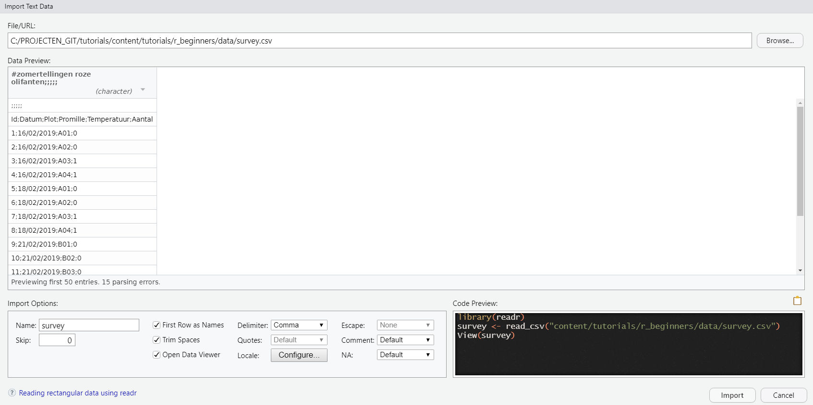
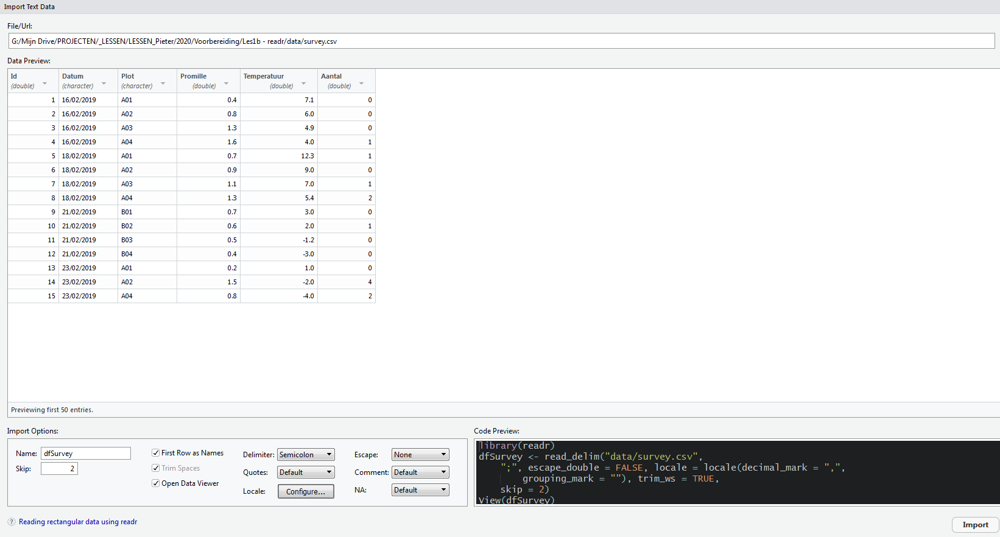
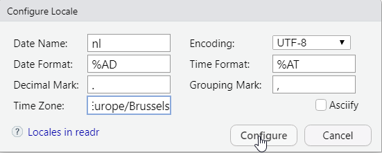

---
title: "Data inlezen"
authors: Pieter en Ivy en Raïsa
output:
  pdf_document: default
  html_document: default
---

# Data inlezen

```{r setoptions, echo = FALSE, purl = FALSE}
knitr::opts_chunk$set(eval = FALSE, echo = TRUE)
```

## Inleiding

- R laat toe een groot gamma aan databestanden in te lezen
- Deze functionaliteit zit voornamelijk in R packages
- In deze sessie kiezen we voor de "tidyverse" omgeving
- **R werkt niet rechtstreeks op de bronbestanden!**
    - Je leest een extern databestand in als een R object
    - op dit R object zal je dan werken
    - Verandert je extern databestand, dan moet je dit opnieuw inlezen
    - Wijzigingen aan de data die je in R hebt gedaan moet je terug exporteren
        - Ook wegschrijven kan in ieder formaat, al zijn tekstbestanden (.txt, .csv) het eenvoudigste
        - Tip: **Overschrijf nooit je origineel bronbestand!**

## Bestandstypes

Vetgedrukt heb je de benodigde R packages. Om deze te gebruiken moeten die geïnstalleerd en geladen zijn


- tekstbestanden: txt, tsv, csv, fwf ---> **readr** of basis R
- excel bestanden (enkel inlezen): xls, xlsx  ---> **readxl**
- access databases: mdb, accdb ---> **RODBC / (odbc + DBI)**
- eenvoudige databestanden: sqlite ---> **odbc**
- databank server connecties: SQL server, MySql, postgres ---> **RODBC / (DBI + odbc)**
- googlesheets ---> **googledrive / googlesheets4**
- R binaire objecten ---> basis R functialiteit


## Hoe wordt de data verwacht

Standaard gaat R uit van het volgende data formaat:

- rechthoekig (alle rijen even lang)
- kolomnamen op de eerste rij
- 1 observatieeenheid per rij
- slechts 1 datatype per kolom
- geen exotische karakters
- kleurcodes van cellen staan in een extra kolom, kleuren zelf zijn niet importeerbaar
- 1 dataset per tabblad
- tabblad of extern bestand met metadata die beschrijft wat de kolommen voorstellen en wat de mogelijke waarden zijn

Dit is niet vaak het geval, dus 

- in R heb je veel functies om hiermee om te gaan
- Als je aanpassingen aanbrengt, doe dit op een kopie van je origineel bestand!
- Vaak efficiënter de bronbestanden zelf eerst zo goed mogelijk te zetten voor je die in R importeert
- Wat je extern of in R doet hangt af van situatie tot situatie maar wees hier logisch in


## Verwijzen naar een bestand

De data wordt ingelezen via relatieve padnamen ten opzichte van je werkdirectory (die kan je terugvinden via het commando _getwd()_). 
Alternatief kan je ook altijd je werkdirectory zien bovenaan het consolevenster (venster links onderaan).

R werkt standaard met forward slash voor directories (/). Wil je een backslash gebruiken moet je die verdubbelen \\\\

```{r relatiefpad, purl=FALSE}

getwd() #via setwd("padnaam") kan je die zetten, 
#alternatief: via het menu bovenaan: Session > Set Working Directory

#onderstaande code werkt pas als het csv bestand bestaat op de juiste locatie

#data die in de werkdirectory staat
data <- read_csv("mijndata.csv")

#data die in een subfolder van je werkdirectory staat
data <- read_csv("subfolder/mijndata.csv")

#data 1 folder hoger
data <- read_csv("../mijndata.csv")

#data 2 folders hoger
data <- read_csv("../../mijndata.csv") 

#data die in een andere folder staat op hetzelfde niveau als je werkfolder
data <- read_csv("../anderefolder/mijndata.csv")

#je kan ook absolute padnamen gebruiken
data <- read_csv("c:/ikke/projecten/data/mijndata.csv")

#in plaats van / kan je ook altijd \\ gebruiken in Windows systemen
#en je kan die zelfs mixen als je verwarrend wil overkomen
data <- read_csv("c:\\ikke/projecten\\data/mijndata.csv")

```


## Inlezen van tekstbestanden

Tekstbestanden zijn alle bestanden die leesbaar zijn in een programma zoals kladblok of notepad++. Dit zijn meestal .txt, .csv en .tsv bestanden. Deze bestanden kunnen op veel verschillende manieren gecodeerd zijn, zo gebruiken ze in de VS vooral "," als scheidingsteken en "." als decimaalteken, terwijl in Europa doorgaans eerder ";" als scheidingsteken gebruikt wordt en "," als decimaalteken.

Teksbestanden kan je inlezen via het menusysteem (File > Import Dataset). Dit genereert ook R code, welke je best overneemt in je script, zodat je die interactie met het menu niet meer nodig hebt.

Tekstbestanden zullen we hier via het **readr** pakket inlezen. De basisfunctie in dit pakket is ***read_delim***, maar die heeft ook nog afgeleide functies met andere defaultwaarden zoals:

- *read_table* en *read_table2* : verwachten een of meerdere spaties als kolomscheidingsteken
- *read_csv* en *read_csv2*: Amerikaanse en Europese csv bestanden
- *read_tsv*: verwacht een tab als scheidingsteken (een tab wordt in R voorgesteld als "\\t")
- *read_fwf*: verwacht dat iedere kolom hetzelfde aantal characters bevat
- *spec_delim*: leest enkel de kolominformatie in

Het is heel belangrijk om goed te checken of je data wel correct ingelezen is, hiervoor zijn de basisfuncties _View_, _summary_, _head_, _str_, _dim_, _table_, ... een goede hulp.

Niet aanwezige waarden worden in R als `NA` gecodeerd. 


### Eenvoudig tekstbestand zonder teveel problemen

```{r EenvoudigTeksbestand}

library(readr) 
bestandSP <- "data/20180222_species.csv"

#het inlezen van de csv inhoud in het R object dfSpecies
dfSpecies <- read_delim("data/20180222_species.csv", delim = ",") 

#idem, maar we steken de filenaam in een R object
dfSpecies <- read_delim(bestandSP, delim = ",") 

#identiek, maar het formaat is al door de functie geregeld
dfSpecies <- read_csv("data/20180222_species.csv")

#voor help
?read_delim

#Altijd alles controleren
#Kan ook door in het environment paneel het object dfSpecies 
#aan te klikken of uit te vouwen
dim(dfSpecies)
head(dfSpecies)
tail(dfSpecies)
summary(dfSpecies)
str(dfSpecies)
View(dfSpecies)

#De file werd niet volledig correct ingelezen
# een NA waarde in eerste kolom die wel degelijk de waarde afkorting NA bedoelt
#Bij de view zie je dat de NA in kolom 1 cursief is in tegenstelling tot de rest 
#in dit geval moet je het na argument meegeven.
#zodat de waarde NA in het bestand niet als een missende waarde aanzien wordt
dfSpecies <- read_csv("data/20180222_species.csv", na = "")

```


## Inlezen van tekstbestanden: via het menusysteem en extra parameters

Om tekstbestanden in te lezen kan je in plaats van rechtstreeks de code te schrijven, de data inlezen via een grafische interface, die dan de R code voor jou zal genereren

**De code die gegenereerd wordt zet je best in je script!**, dan moet je de volgende keer enkel de code in het script runnen in plaats van dit proces opnieuw te moeten doorlopen. Eens je wat aan R gewend bent, zal je het menu nog zelden gebruiken.


File > Import Dataset > From Text ... (readr)



Je ziet dat dit bestand nog niet correct zou worden ingelezen (zie figuur)
 --> via parameters aanpassen





Het Date format en Time Format mag op %AD en %AT gelaten worden, dit betekent dat R dit automatisch zal proberen detecteren. %AD herkend datums in formaten Y-m-d of Y/m/d, %AT herkend tijd in het formaat H:M eventueel aangevuld met :S en am/pm.
Wil je bijvoorbeeld de datums laten herkennen in het formaat 14/07/2021 dan kan je in het veld Date Format `%d/%m/%Y` invullen. 

Als je in je voorbeeldvenster van je data op het datatype klikt onder de kolomnaam, dan krijg je hier ook opties om de datatypes te wijzigen, zoals een suggestie hoe je je datum kan configureren.

Je ziet rechtsonderaan de code die wordt gegenereert. Je kan de file inlezen door op OK te drukken, maar kopieer altijd de code naar je script, zodat je later het menu niet meer nodig hebt als je de data opnieuw wil inlezen.

Welke parameters kunnen we wijzigen om de file correct in te lezen? Je zal zien dat deze overeen komen met  `?read_delim`

- `Name`: Naam van het R object (in de code wat links van <- staat)
- `Skip`: Hoeveel rijen moeten overgeslaan worden (parameter `skip`)
- `First row as names`: Bevat de eerste rij rijnamen of niet (parameter `col_names`)
- `Trim spaces`: Moeten spaties genegeerd worden (parameter `trim_ws`)
- `Open Data Viewer`: zorgt voor de extra regel `View(data)`.
- `Delimiter`: Wat is het scheidingsteken (parameter `delim`)
- `Quotes`: Om aan te geven of er quotes in de data zitten en of dit enkele of dubbele zijn (parameter `quote`)
- `Escape`: Als je data ook de delimiter bevat, kan je hiermee zeggen hoe deze in de file worden gecodeerd (parameter `escape_bakslash` en `escape_double`)
- `Comment`: Lijnen die in de tekst commentaar is en mag overgeslaan worden (parameter `comment.char`)
- `NA`: Hoe worden NA waarden in de tekst weergegeven (parameter `na`)
In de preview bovenaan kan je het type kolom wijzigen (parameter `col_types`)
- `Locale`: Is een iets ingewikkeldere manier om aan te kunnen geven welke  het decimaal teken en andere landsinstellingen zijn. (parameter `locale`). Wij gebruiken meestal volgende instelling: 

```
locale = locale(decimal_mark = ",", grouping_mark = "", date_format = "%d/%m/%Y")`

```

```{r TekstbestandMetOpties}

#Voorbeeld:

#De Europese vorm van .csv gaat uit van een ; als scheiding en , als decimaal
#voor de Europese vorm gebruiken we read_csv2, voor de Amerikaansse is dit read_csv
#De eerste 2 rijen in de csv zijn geen onderdeel van de data, die skippen we

#Dit is wat je krijgt via het menu 
#aantal en volgorde van argumenten kan verschillen
#het pad is mogelijks het absolute pad ipv het relatieve pad zoals hieronder
dfSurvey <- read_delim("data/survey.csv", 
                       delim = ";", skip = 2, 
                       escape_double = FALSE, 
                       col_types = cols(Datum = col_date(format = "%d/%m/%Y")), 
                       locale = locale(decimal_mark = ",", grouping_mark = ""),
                       trim_ws = TRUE, skip = 2)
View(dfSurvey)
summary(dfSurvey)

```

## Wegschrijven csv bestanden

Dataframes kan je gemakkelijk wegschrijven als een tekstbestand. Bij voorkeur is dit een csv bestand. Als het de bedoeling is het weggeschreven csv bestand in excel te openen, dan gebruik je best de functie *write_excel_csv2* voor Nederlandstalige besturingssystemen en spreadsheets en *write_excel_csv* voor Amerikaanse.

**Let op: je krijgt geen waarschuwing als een bestaand bestand zal worden overschreven**

```{r WegschrijvenTekstbestand}

#onderstaande alternatieven doen hetzelfde, maar write_excel_csv2 is de voorkeur
#iris is een meegeleverde dataset in R, via data(iris) zie je die in je environment
data(iris)
write_delim(iris, "data/iris.csv", delim = ";") #decimaalteken is .
write_csv2(iris, "data/iris.csv") #decimaalteken is ,
write_excel_csv2(iris, "data/iris.csv") #decimaalteken is ,

```


## Inlezen Excel Data

Om Excel bestanden in te lezen gebruiken we hier het package **readxl**.

- de functie *read_excel* uit het **readxl** package
- Codering argumenten heel gelijkaardig als  via het **readr** package
- Extra argumenten specifiek voor excel bestanden zoals *sheet* en *range*
- Het uiteindelijke R object is in dezelfde vorm

**Tip: Verzorg je excel bestand en zorg dat elke kolom een consistent datatype is, zeker voor datumtijd, omdat R die dan onmiddellijk juist inleest.**

Data wegschrijven als Excel bestand kan niet met dit pakket, al is hier een csv bestand een goed alternatief, zeker als je `write_excel_csv2` gebruikt. Als je echt een native excel bestand wil wegschrijven, kan je packages gebruiken zoals **xlsx**, **openxlsx**, **writexl**.

Onderstaande code kan ook bekomen worden via het menusysteem: File > Import Dataset > From Excel ...


```{r ExcelInlezen}

library("readxl")
bestandsnaam <- "data/20190124_survey_part1.xlsx"

#als sheet kan je ook de naam gebruiken "Blad1"
dfSurvey1 <- read_excel(bestandsnaam, sheet = 1) 

summary(dfSurvey1) #geen kolomnamen, allemaal characters, zelfs 1 logical
head(dfSurvey1)

#Dit kan gemakkelijk als volgt opgelost worden
dfSurvey2 <- read_excel(bestandsnaam, sheet = "Blad1", skip = 1, n_max = 19 )
summary(dfSurvey2)
str(dfSurvey2)

#Je kan ook een range specifiëren en de na-waarden instellen
dfSurvey3 <- read_excel(bestandsnaam, sheet = "Blad1", skip = 0, 
                        range = "A2:D21", 
                        na = c("", "#NAAM?"))
View(dfSurvey3)

```

- Functie `read_excel` uit het package **readxl**
- Kan ook via het menu en werkt analoog aan via het menu inlezen uit tekstbestanden
    - File > Import Dataset > From Excel 
    - Je krijgt nu bijna hetzelfde venster als bij teksbestanden
    - Via extra parameters kan je je wensen specificiëren
- Belangrijkste argumenten (enkel path is verplicht)
    - path: locatie en bestandsnaam
    - sheet: welk tabblad (via nummer of via `"naamTabblad"`)
    - range: range van waarden bv. `"A1:C20"`
    - col_types: kolomtypes indien ze niet correct herkend worden (normaal gezien als je excel goed is opgebouwd kloppen deze automatisch)
    - na: hoe worden ontbrekende waarden gecodeerd
    - guess_max: hoeveel rijen moet R bekijken om te beslissen welk kolomtype het is
        - belangrijk als een kolom heel veel lege rijen in het begin heeft: R denkt dan soms dat de kolom enkel TRUE / FALSE bevat
        - belangrijk als de eerste tekst maar heel ver voorkomt, dan kan het zijn dat R de kolom numeriek interpreteert, en al je tekst wordt dan missing data

```{r ExcelSheetEnRange}

library(readxl)
#De gegevens staan in het tabblad Plot2 in de range A2:D21
dfSurvey2 <- read_excel(path = "data/survey.xlsx", 
                        sheet = "Plot2",
                        range = "A2:D21" 
                        )
dfSurvey2
summary(dfSurvey2)

table(dfSurvey2$Sex) #controle of de geslachten juist ingevuld zijn

?read_excel #voor meer info over de argumenten

```

## Googlesheets

- Maakt gebruik van het **googlesheets4** package
- Je moet jezelf authoriseren via de functie `gs4_auth()`
- Eenmalig wordt je verwezen naar een login website voor google
    - je geeft toegang aan tidyverse-googlesheets
        - ofwel krijg je dan een code die je in R moet plakken
        - ofwel zal je direct een melding krijgen dat de authorisatie gelukt is
- Periodiek zal R je vragen dit 0auth token te verversen
- Eens dit gebeurd is zal je iedere R sessie gevraagd worden je naam te selecteren
  - je ziet een selectie van namen en je kiest het correcte nummer
  - alternatief kan je direct je e-mail adres meegeven zodat de selectie niet meer nodig is
- Nu kan je de url of key van de sheet gebruiken
    - de url of key nemen de plaats in van `file` bij andere functies zoals `read_csv`
    - **de key is een deel van de url** en werkt doorgaans sneller 
- Eens geregistreerd kan je de data eruit halen via `read_sheet`


```{r GooglesheetInlezen, eval=FALSE}

library(googlesheets4) #laden van het googlesheets package

gs4_auth() #authorisatie (de eerste keer en dan periodiek eens nodig)
#Let op. dit is interactief, dus de volgende code nog niet plakken

#geef je email direct mee, dan moet je je naam niet selecteren
#als je 0auth-token nog geldig is
gs4_auth(email = "xxx@yyy.zzz") #e-mail adres naar je eigen adres wijzigen

#Je kan registreren met de html van de sheet of de sheet key
url <- "https://docs.google.com/spreadsheets/d/1f4vpxZdscu_8854M-z69nKT9MxQlag-4iQ1R3rJKYfY/edit?usp=sharing"
#De key is onderdeel van de url
key <- "1f4vpxZdscu_8854M-z69nKT9MxQlag-4iQ1R3rJKYfY"

dfLab <- read_sheet(url) #zal volledig eerste sheet lezen in de url
dfLab <- read_sheet(key) #identiek maar voor de key

#Optioneel: Indien je de titel en sheetnamen wil kennen
gs4_get(key) #ook hier kan je de url gebruiken

#Je kan het inlezen meer finetunen en een sheet opgeven en optioneel ook een range
dfLab <- read_sheet(ss = key, #pad + file
                    sheet = 1,  #worksheetnummer of "naam"
                    na = "NULL", #hoe wordt NA gecodeerd
                    range = "A1:H44" #de range (optioneel)
                    )
head(dfLab)
View(dfLab)

?read_sheet #help opvragen voor overzicht van alle argumenten

```

Belangrijke argumenten voor `read_sheet`

- ss: url of key van het google sheets bestand
- sheet: het nummer of `"naam"` van het tabblad
- range: het bereik zoals in Excel bv `"A1:C20"`
- col_types, na, skip, ... zoals bij `read_delim` en `read_excel`


## Binaire R objecten inlezen

Vaak heb je 1 grote data cleaning en eens je data op orde staat, is het niet meer nodig dat je telkens diezelfde stappen opnieuw uitvoert. Je kan de gecleande data opslaan als een tekstbestand, maar zeker voor grote data is een binair bestand veel sneller.

```{r BinaireBestanden}

#Bewaar enkele geïmporteerde datasets samen in de file mijngegevens.Rdata
save(dfLab, dfSpecies, file = "mijngegevens.Rdata")

#Verwijder deze datasets, zodat deze niet meer bestaan in de R sessie
#De bestanden waaruit deze data komt verdwijnen natuurlijk niet
#Alternatief kan je R herstarten (via CTRL + SHIFT + F10)
rm(dfLab, dfSpecies)

#Lees deze opnieuw in via het binaire bestand
load(file = "mijngegevens.Rdata")

#dfLab en dfSpecies staan terug

```


## Connectie met Access, Databanken, Databronnen

Dit zit niet meer in de scope van deze cursus. Als je hierover vragen hebt, ben je altijd welkom.
Hieronder staat gewoon kort wat voorbeeldcode hoe dat gebeurt.

In grote lijnen doen ze allemaal iets zeer gelijkaardig:

1. Leg een connectie met de databron (access, sql server, ...)
1. Voer met deze connectie een SQL query uit of lees een tabel in zijn geheel in
1. Sluit de connectie

### Access

Let op, indien je nog niet Office365 hebt, kan het zijn dat je nog niet de 64-bit drivers voor Access hebt. In dit geval werkt het enkel als je in Rstudio de R versie op 32-bit zet. (Menu --> Tools > Global Options > General > R version --> kies 32-bit versie uit de lijst)
 
```{r AccessInlezen}
 
#!!! Werkt enkel bij 32-bit versie van R als je enkel 32-bit Office drivers hebt
#Vanaf office365 is 64-bit geen probleem

bestand <- "data/bosvitaliteit.accdb"

conn <- odbcConnectAccess2007(bestand) #voor .accdb bestanden (voor .mdb: odbcConnectAccess(bestand))
sqlTables(conn) #optioneel toon de aanwezige tabellen

#haal een volledige tabel binnen
dfTest <- sqlFetch(conn, sqtable = "qryMetingen") 

#haal data binnen via een sql query
query <- "select JAAR, PRVNR, BMNR, OMTREK from tblOpnames"
dfTest <- sqlQuery(conn, query)

#sluit de connectie
odbcClose(conn) #is niet per sé nodig, maar is properder

str(dfTest)
head(dfTest)
 
```

### Connectie met INBO databank of datawarehouse

Hiervoor kan je ook RODBC gebruiken en een databron aanmaken in windows.
Je kan die aanmaken via windows start --> zoek naar gegevensbronnen (odbc) en kies een naam voor de databron en vul de connectiegegevens in (dat kan een Access bestand zijn, verwijzing naar SQL server, ...)
**Let op: dit is pc specifiek, dus als je het script doorgeeft moet die ook deze databron gedefinieerd hebben in windows**

``` {r GegevensbronInlezen}

library(RODBC)
conn <- odbcConnect("Naam_Van_Mijn_Gegevensbron")

#hierop kan je dan sqlQuery of sqlFetch gebruiken,  
#zoals getoond bij de connectie naar Access.

```

Alternatief kan je werken via het DBI en odbc package

```{r DatabankInlezen, eval = FALSE}

library(DBI)
library(odbc)

#maak de connectie 
#die zie je in Rstudio in het paneel rechtsboven onder tabblad connections
#zorg dat je op het INBO netwerk zit, of met vpn verbonden bent
#de 2  basis db servers op het INBO in 2021 zijn 
    #inbo-sql08-prd.inbo.be voor data warehouses
    #inbo-sql07-prd.inbo.be voor databanken
con <- DBI::dbConnect(odbc::odbc(),
                      driver = "SQL Server",
                      server = "inbo-sql08-prd.inbo.be",
                      database = "W0003_00_Lims")

#toon de beschikbare tabellen in het dbo schema
#op het INBO is dit schema standaard voor de tabellen
dbListTables(con, table_type = "TABLE", schema_name = "dbo")

#Lees een volledige tabel in 
dfUnits <- dbReadTable(con, "dimUnit")
head(dfUnits)

#Lees gegevens in ahv een query
sql = "select LabSampleID, FieldSampleID, SampleType, Project from dimSample " 
sql = paste(sql, "where Project = 'I-17W001-02'")
dfSamples <-dbGetQuery(con, sql, n = 500)
head(dfSamples)

#Optioneel: Sluit de connectie
dbDisconnect(con)

```

Voor enkele INBO databases is een in-house pakket **inbodb** ontwikkeld om de communicatie met de databases te vereenvoudigen. Voor meer info hieromtrent contacteer het BMK of OSCIBIO team.


