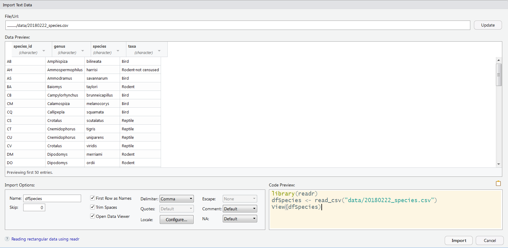

#Data inlezen

```{r setup, echo=FALSE}
knitr::opts_chunk$set(echo = TRUE, message = FALSE, warning = FALSE, eval = FALSE)
```

##Inleiding

- R laat toe een groot gamma aan databestanden in te lezen
- Deze functionaliteit zit voornamelijk in R packages
- In deze sessie kiezen we voor de "tidyverse" omgeving
- **R werkt niet rechtstreeks op de bronbestanden!**
    - Je leest een extern databestand in als een R object
    - Op dit R object zal je dan werken
    - Verandert je extern databestand, dan moet je dit opnieuw inlezen
    - R heeft functionaliteiten om resultaten terug weg te schrijven naar de externe bestanden

##Bestandstypes


- tekstbestanden: txt, tsv, csv, fwf ---> **readr**
- excel bestanden: xls, xlsx  ---> **readxl**
- access databases: mdb, accdb ---> **RODBC** **(odbc)**
- eenvoudige databestanden: sqlite ---> **odbc**
- databank server connecties: SQL server, MySql, postgres ---> **RODBC / DBI / odbc**
- googlesheets ---> **googlesheets**
- R binaire objecten ---> basis R

Vetgedrukt zijn de benodigde R packages. Om deze te gebruiken moeten die geïnstalleerd en geladen zijn


##Data formaat

Standaard gaat R uit van het volgende data formaat:

- rechthoekig (bv. een excel tabblad met rijen van gelijke lengte) 
- kolomnamen op de eerste rij
- 1 observatie-eenheid per rij
- slechts 1 datatype per kolom
- geen exotische karakters
- kleurcodes kan R niet inlezen, daarvoor maak je een aparte kolom in je data
- 1 dataset per tabblad
- tabblad of extern bestand met metadata die beschrijft wat de kolommen voorstellen en wat de mogelijke waarden zijn

Dit is niet vaak het geval, dus:

- ofwel pas je de bronbestanden aan voor je in R importeert
- ofwel gebruik je R functies om dit goed te zetten

##Verwijzen naar een bestand

- R zoekt de data relatief aan de werkdirectory
    - deze staat links bovenaan de console
    - of kan je opvragen via `getwd()`

```{r relatiefpad, eval = FALSE}

getwd()

#data die in de werkdirectory staat
data <- read_csv("mijndata.csv")

#data die in een subfolder van je werkdirectory staat
data <- read_csv("subfolder/mijndata.csv")

#data die 1 folder hoger staat
data <- read_csv("../mijndata.csv")

#data 2 folders hoger
data <- read_csv("../../mijndata.csv") 

#data die in een andere folder staat op hetzelfde niveau als je werkfolder
data <- read_csv("../anderefolder/mijndata.csv")

```

#Inlezen van tekstbestanden

##Formaten

- Tekstbestanden zijn alle bestanden die leesbaar zijn in een programma zoals kladblok
- Dit zijn meestal .txt, .csv en .tsv, .fwf bestanden. 


##Tekstbestanden in R

- Wij gebruiken het pakket **readr**
- R heeft ook basisfuncties hiervoor (`read.csv`, `read.csv2`, `read.table`, ...)
    - wij gaan deze niet gebruiken
    - de ingelezen data is anders van structuur in het readr package
- Basisfunctie **`read_delim`** kan je voor alle formaten gebruiken
- Afgeleide functies met voorgekozen defaultwaarden:

    - `read_table`: spatie als scheidingsteken
    - `read_table2` : 1 of meerdere spaties als scheidingsteken
    - `read_csv`: Amerikaanse CSV (`","` als scheiding en `"."` als decimaal)
    - `read_csv2`: Europese CSV (`";"` als scheiding en `","` als decimaal)
    - `read_tsv`:  tab als scheidingsteken (in R voorgesteld als `"\t"`)
    - `read_fwf`: iedere kolom hetzelfde aantal characters
    - `spec_delim`: leest enkel de kolominformatie in, niet de data zelf
    
- Goed nakijken of je data correct ingelezen is

    - `View`: toont je data in sorteerbaar en filterbaar Excel-achtig formaat
    - `summary`: toont voor iedere kolom de basisinfo
    - `head`: toont de eerste datarijen
    - `str`: toont de datastructuur
    - `dim`: toont de dimensies (aantal rijen en kolommen)
    - `table`: toont voor een kolom het aantal waarden per categorie

Tekstbestanden kan je ook via het menu inlezen



- File > Import Dataset > From Text (readr)
    - R zal zelf al proberen te raden wat de best geschikte `read_` functie is
    - Bovenaan browse je naar je bestand
    - Links onderaan geef je de naam van je R object
- Verder kan je nog heel wat parameters meegeven in het midden onderaan
    - scheidingsteken, skip rows, NA codering, ...
- In het voorbeeldvenster kan je de kolomtypes wijzigen en kijken of alles correct ingesteld is
- De code rechtsonderaan altijd naar je script kopiëren in kader van reproduceerbaarheid!
- Klik op import als je tevreden bent

##Eenvoudig tekstbestand (Amerikaanse CSV)

Onderstaand  voorbeeldbestand is bijna rechtstreeks inleesbaar in R, er zit 1 klein probleem in omtrent hoe ontbrekende waarden gecodeerd worden, wat we via argumenten in R oplossen.


```{r example_speciesERR}

#Benodigde package laden
library(readr)

#de bestandsnaam is 20180222_species.csv
#maar deze staat in de folder data in de werkdirectory

#het inlezen
#alternatief 1
dfSpecies <- read_delim("data/20180222_species.csv", delim = ",") 
#alternatief 2
bestandsnaam <- "data/20180222_species.csv"
dfSpecies <- read_delim(bestandsnaam, delim = ",")
#alternatief 3
dfSpecies <- read_csv(bestandsnaam)

#Toon de eerste/laatste 6 rijen
head(dfSpecies)
tail(dfSpecies)

#Toon de dimensies
dim(dfSpecies)

#Toon een samenvatting van de kolommen
summary(dfSpecies)

#Toon de data in een sorteerbare en filterbare tabel
#Hetzelfde als dubbelklikken op object in "Environment"
View(dfSpecies)

#Toon de inwendige structuur van de data
#Hetzelfde als het object uitvouwen in "Environment"
str(dfSpecies)

#Stukje code dat je gewoon kan repliceren, checkt gewoon het aantal ontbrekende waarden
apply(dfSpecies, 2, function(x) sum(is.na(x)))

# ---> Waar zit de fout?

?read_csv #kijk naar de parameter "na"

#Correct ingelezen:
dfSpecies <- read_csv(bestandsnaam, na = "") #ofwel na = character()

```


Belangrijke argumenten voor de **`read_`** functies 

- file: bestandsnaam (incl. relatief pad) van het in te lezen bestand
- delim: het scheidingsteken `","`  `";"` `" "` `"\t"` 
- guess_max: op basis van hoeveel rijen moet R proberen het juiste kolomtype te raden
- col_types: manueel aangeven welk type elke kolom heeft (meestal niet nodig)
- na: hoe zijn ontbrekende waarden gecodeerd
- skip: hoeveel rijen overslaan vooraleer de data begint


##Europese CSV

Als je naar de data survey.csv kijkt voldoet dit niet volledig aan het verwachte formaat. Namelijk de eerste 2 rijen bevatten geen data. Daarnaast wordt de datum niet correct herkend. Onderstaande code om dit op te lossen kan ook volledig via de menu import bekomen worden.

```{r surveycsv}

library(readr)

dfSurvey <- read_csv2(file = "data/survey.csv", 
                      skip = 2) #skip = 2 slaat de eerste 2 rijen over
dfSurvey
summary(dfSurvey)
View(dfSurvey)

#Spijtig genoeg werden de datums niet herkend
#Dit moet met wat code opgelost worden
#via col_types zeg je dat de datum moet gehaald worden 
#uit de kolom Datum met als formaat dag/maand/jaar.
dfSurvey <- read_csv2(file = "data/survey.csv", 
                      skip = 2, 
                      col_types = cols(Datum = col_date(format = "%d/%m/%Y")))
View(dfSurvey)
summary(dfSurvey)

```

#Inlezen Excel Data

- Functie `read_excel` uit het package **readxl**
- Kan ook via het menu en werkt analoog aan via het menu inlezen uit tekstbestanden
    - File > Import Dataset > From Excel 
    - Je krijgt nu bijna hetzelfde venster als bij teksbestanden
    - Via extra parameters kan je je wensen specificiëren
- Belangrijkste argumenten (enkel path is verplicht)
    - path: locatie en bestandsnaam
    - sheet: welk tabblad (via nummer of via `"naamTabblad"`)
    - range: range van waarden bv. `"A1:C20"`
    - col_types: kolomtypes indien ze niet correct herkend worden (normaal gezien als je excel goed is opgebouwd kloppen deze automatisch)
    - na: hoe worden ontbrekende waarden gecodeerd
    - guess_max: hoeveel rijen moet R bekijken om te beslissen welk kolomtype het is

```{r surveyxls}

library(readxl)

#De gegevens staan in het tabblad Plot2 in de range A2:D21
dfSurvey2 <- read_excel(path = "data/survey.xlsx", 
                        sheet = "Plot2",
                        range = "A2:D21" 
                        )
dfSurvey2
summary(dfSurvey2)

table(dfSurvey2$Sex) #controle of de geslachten juist ingevuld zijn

?read_excel #voor meer info over de argumenten

```

#Googlesheets

- Maakt gebruik van het **googlesheets** package
- Je moet jezelf authoriseren via de functie `gs_auth()`
    - dit moet slechts periodiek
    - je wordt verwezen naar een login website voor google
    - je geeft toegang aan tidyverse-googlesheets
        - ofwel krijg je dan een code die je in R moet plakken
        - ofwel zal je direct een melding krijgen dat de authorisatie gelukt is
- Nu kan je je spreadsheet registreren
    - De registratie maakt soort google-bestandsnaam
    - Deze verkregen bestandsnaam gebruik je dan net zoals bij `read_excel` of `read_csv`
    - Registreren (bestandsnaam ophalen) kan op 3 manieren
        - via de url `gs_url`
        - via de key (snelste) `gs_key`
        - via de titel van de sheet `gs_title`
- Eens geregistreerd kan je de data eruit halen via `gs_read`

```{r google}
library(googlesheets) #laden van het googlesheets package

gs_auth() #authorisatie (niet altijd nodig)

#Mogelijkheid 1: Registreren via de URL
url <- "https://docs.google.com/spreadsheets/d/1f4vpxZdscu_8854M-z69nKT9MxQlag-4iQ1R3rJKYfY/edit?usp=sharing"
my_spreadsheet <- gs_url(url)

#Mogelijkheid 2: Registreren via de KEY (die code zie je ook in de URL staan)
my_spreadsheet <- gs_key("1f4vpxZdscu_8854M-z69nKT9MxQlag-4iQ1R3rJKYfY")

#Mogelijkheid 3: Registreren via de titel
my_spreadsheet <- gs_title("R_Introductie_Les_1_2019")

#Nu is het tijd om de data uit de sheet te halen
#tot nu hebben we immers enkel nog maar de bestandsnaam gekregen
dfLab <- gs_read(ss = my_spreadsheet, #pad + file
                 ws = 1,  #worksheetnummer of "naam"
                 na = "NULL" #hoe wordt NA gecodeerd
                 )
head(dfLab)
View(dfLab)

?gs_read #help op overzicht te vinden van alle argumenten

```

Belangrijke argumenten voor `gs_read`

- ss: het object met de google registratie (de google bestandsnaam)
- ws: het nummer of `"naam"` van het tabblad
- range: het bereik zoals in Excel bv `"A1:C20"`
- col_types, na, skip, ... zoals bij `read_delim` en `read_excel`


#Binaire R objecten inlezen

Vaak heb je 1 grote data cleaning en eens je data op orde staat, is het niet meer nodig dat je telkens diezelfde stappen opnieuw uitvoert. Je kan de gecleande data opslaan als een tekstbestand, maar zeker voor grote data is een binair bestand veel sneller.

```{r binair}
#Bewaar enkele geïmporteerde datasets samen in de file mijngegevens.Rdata
save(dfLab, dfSpecies, file = "mijngegevens.Rdata")

#Verwijder deze datasets, zodat deze niet meer bestaan in de R sessie
#De bestanden waaruit deze data komt verdwijnen natuurlijk niet
#Alternatief kan je R herstarten (via CTRL + SHIFT + F10)
rm(dfLab, dfSpecies)

#Lees deze opnieuw in via het binaire bestand
load(file = "mijngegevens.Rdata")

#dfLab en dfSpecies staan terug

```


#Connectie met andere data formaten

## Inleiding

Dit is eerder als naslagwerk, en zal niet zonder vraag aan bod komen in de cursus.
Het basisprincipe is: 

1. Maak een connectie met de databank (SQL, Access, ...) en bewaar dit connectiebestandje in een object met de naam `conn` of `con` of `channel` of om het even wat
1. Vraag de data op via een leesfunctie
    - het eerste argument is de connectie, dus de objectnaam van hierboven
    - het tweede argument is de tabelnaam of de SQL query


--------------------- EINDE LES --------------------------------------------

##Connectie met Access

- Via de pakketten **DBI** en **odbc** is het elegantste, maar werkt alleen als de access drivers geïnstalleerd zijn, wat op INBO niet altijd het geval is
- Alternatief: **RODBC** 
    - Dit geeft een data.frame in plaats van een tibble als resultaat
    - Je R architectuur moet hetzelfde zijn als je Access versie
        - Op INBO hebben we 32-bit MS Access
        - dus je moet R ook op 32-bit zetten (Tools > Global Options en dan bovenaan de juiste R versie kiezen en Rstudio heropstarten)

### Access inlezen via RODBC

- Laadt RODBC als library
- Maak connectie met de databank (analoog aan hoe je een googlesheet registreert)
    - voor .mdb: `odbcConnectAccess`
    - voor .accdb: `odbcConnectAccess2007`
- Bevraag de data via SQL queries via `sqlQuery`
- Of maak in Access je Queries en lees deze in R in via `sqlFetch`
- Belangrijke argumenten `sqlFetch`
    - channel: connectie met databank
    - sqtable: naam van de tabel tussen quotes bv. "tblOpnames"
- Belangrijkste argumenten `sqlQuery`
    - channel: connectie met databank
    - query: een SQL query tussen quotes bv. "select * from tblOpnames"
- Als alles ingelezen is, sluit je connectie af (is niet verplicht, maar properder)
    
**LET OP! ZET MS ACCESS BESTANDEN NIET OP GOOGLE DRIVE ZONDER BACKUP**

```{r accessrodbc}
library(RODBC)

bestand <- "data/bosvitaliteit.accdb"

conn <- odbcConnectAccess2007(bestand)
conn #als dit -1 is, of een tekst van 2 regels dan is de connectie niet gelukt

#Toon alle aanwezige tabellen
sqlTables(conn)

#Toon enkel tabellen en views
sqlTables(conn, tableType =  c("TABLE", "VIEW")) #toon enkel tabellen en views

#Je kan de queries ook gewoon als een tabel inlezen
dfTest <- sqlFetch(conn, sqtable = "qryMetingen")
summary(dfTest)

#Dit kan ieder mogelijke query zijn die Access aankan
query <- "select JAAR, PRVNR, BMNR, OMTREK from tblOpnames"

#Hier pas haal je je data binnen
dfTest <- sqlQuery(conn, query)
summary(dfTest)

odbcClose(conn) #is altijd  properder je connecties weer af te sluiten

```

###Access inlezen via DBI

- Dit is een veel snellere manier
- De codering is iets minder elegant, al kan dat op termijn verbeteren
- Hoe te werk gaan
    - Maak een connectiestring die 2 argumenten heeft
        - DBQ: bestandsnaam van de databank
        - Driver: de driver die gebruikt moet worden
        - beide argumenten moeten gescheiden zijn door `";"`
    - Connecteer met de databank via `dbConnect` wat een object geeft analoog als bij RODBC
    - Bevraag je data via SQL met de functie `dbGetQuery`
    - Of haal een hele tabel binnen met de functie `dbReadTable`
        

```{r accessdbi}
##Via DBI (werkt niet als je niet alle drivers hebt)

library(DBI)
library(odbc)

db_connect_string <- paste0("DBQ=", 
                        bestand, #je bestandsnaam van eerder
                        ";",
                        "Driver={Microsoft Access Driver (*.mdb, *.accdb)};"
                       )
myconn <-  dbConnect(odbc::odbc(),
                     .connection_string = db_connect_string)
myconn #indien -1 of een warning van 2 regels --> mislukt

#Hele tabel inlezen
dfOpnames2 <- dbReadTable(myconn, "tblOpnames")

#QUery inlezen
sql <- "select * from tblOpnames"
dfOpnames2 <- dbGetQuery(myconn, sql)
 
```


#Connectie met INBO databanken en datawarehouses

##Connectie met databases via **RODBC**

- Hier niet van belang of je 32-bit of 64-bit R gebruikt
- Maak best je gegevensbron op voorhand of vraag dit aan IT
    1. Je gaat naar start en typt gegevensbronnen en selecteert "Gegevensbronnen (ODBC)"
    1. Dan kom je in het venster ODBC-gegevensbronbeheer
    1. Kies toevoegen ...
    1. Kies SQL server (of SQL server Native client 11 als dit niet werkt)
    1. Druk op voltooien
    1. Geef bij naam en beschrijving "W0003_00_Lims" in (je mag dit vrij kiezen, maar dit is de naam die je in R zal gebruiken)
    1. Als server kies je voor inbo-sql08-prd.inbo.be
    1. Ga naar volgende
    1. Laat op Windows Authentificatie staan en ga naar volgende
    1. Vink "change default database" aan en kies "W0003_00_Lims" uit de lijst
    1. Druk op volgende
    1. Druk op voltooien
    1. Test Data Source
- Nu kan je je data bevragen zoals bij Access via  `sqlQuery` of `sqlFetch`

```{r dbconnectRODBC}

library(RODBC)

odbcDataSources() #toont de beschikbare datasources
conn <- odbcConnect("W0003_00_Lims")
conn

#Toon alle aanwezige tabellen met sqlTables, head is om te beperken tot de eerste
head(sqlTables(conn))

#Dit zijn de nuttige in INBO databases
sqlTables(conn, tableType = c("VIEW", "TABLE"), schema = "dbo")

#Hele tabel ophalen
dfDocu <- sqlFetch(conn, "vwDocumentatie", max = 1000)

sql <- "select LabSampleID, FieldSampleID, SampleType, Project "
sql <- paste(sql, "from dimSample where Project = 'I-17W001-02'")
dfSamples <- sqlQuery(conn, query =  sql)

head(dfSamples)

odbcClose(conn)

```

## Connecties met databases via DBI

- Leest veel sneller in dan RODBC
- Alles komt direct in het tibble formaat
- Rechtsbovenaan Rstudio zie je het tabeloverzicht in het blad "Connections"
- Hoe te werk gaan
    - maak opnieuw een connectie zoals bij Access en RODBC, maar nu via `dbConnect`
    - vul de driver, server en database in
    - passwoord en gebruikersnaam zijn bij INBO databanken gekoppeld aan je google account, en moet je in principe niet meegeven, indien die niet gekoppeld zijn, kan je dit via uid en pwd in te vullen
    - gebruik de functie  `dbReadTable` voor een hele tabel in te lezen
    - of `dbGetQuery` om een query mee te geven
    
```{r dbConnectDBI}

library(DBI)
library(odbc)

#Connectie met het LIMS datawarehouse
con <- dbConnect(odbc::odbc(),
                 driver = "SQL Server",
                 server = "inbo-sql08-prd.inbo.be",
                 database = "W0003_00_Lims")
con

dbListTables(con, table_type = "TABLE", schema_name = "dbo")

dfUnits <- dbReadTable(con, "dimUnit")
head(dfUnits)
View(dfUnits)

sql <- "select LabSampleID, FieldSampleID, SampleType, Project"
sql <- paste(sql, "from dimSample where Project = 'I-17W001-02'")
dfSamples <- dbGetQuery(con, sql, n = 500)
head(dfSamples)
View(dfSamples)

dbDisconnect(con) #stop de connectie met de db

```


