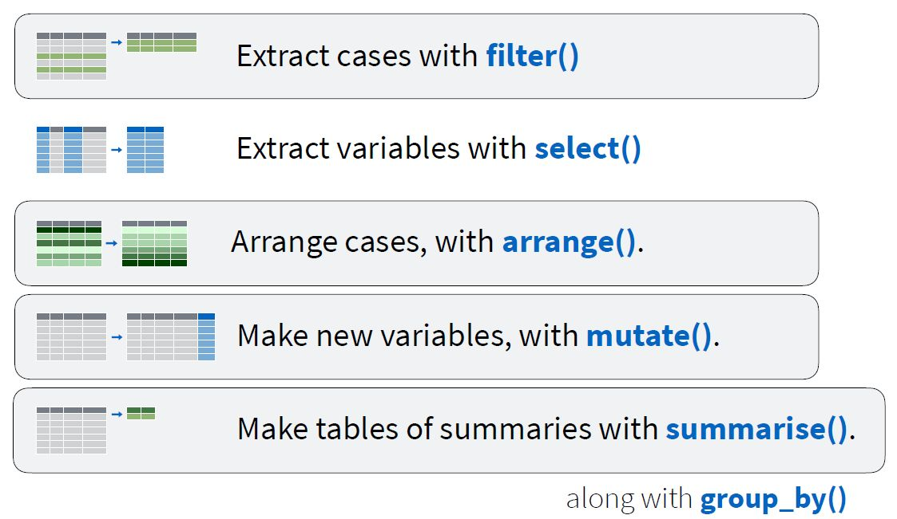
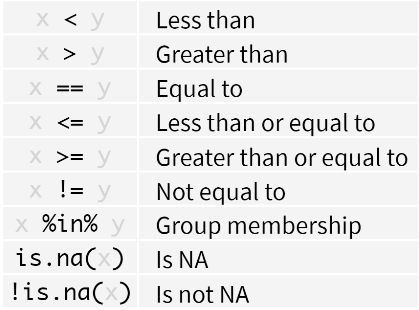

```{r setup, include = FALSE, purl = FALSE}
knitr::opts_chunk$set(
  out.extra = "",
  inline = TRUE,
  echo = TRUE, 
  warning = FALSE,
  # eval = FALSE,
  # cache = FALSE, 
  dpi = 300, 
  fig.width = 3.6, 
  fig.height = 2.4
  )
library(knitr)
set.seed(1234)
```

\hspace{7cm} {width=2.5cm} \hspace{5cm}


# Wat kan je allemaal met dplyr?

\


- `dplyr` is een onderdeel van het `tidyverse` package
- Niet nodig om `dplyr` apart te installeren / laden
    ```{r, message = FALSE}
    library(tidyverse)
    ```


# Pipe `%>%`

{width=3cm}\

Alle functies in het `dplyr` package werken op dezelfde manier. 

- Als eerste argument verwachten ze de data waarop de bewerking uitgevoerd moet worden.
- Alle volgende argumenten zijn details over de uit te voeren bewerking.

Ideaal om gebruik te maken van `pipes`.

- Deze worden aangeduid met `%>%`
- Eerste argument in de functie is overbodig
    - Hetgeen voor de `pipe` staat, wordt als eerste argument (data) gebruikt in de functie na de `pipe`
- Een opeenvolging van bewerkingen mogelijk
    - Resultaat van de vorige bewerking is input voor volgende bewerking
- *Shortcut*: CTRL + SHIFT + M
- *Tip*: Eindig de regel met een `pipe` en zet de volgende bewerking op een nieuwe regel. Dit maakt de code beter leesbaar en vereenvoudigt het debuggen
    ```{r, eval = FALSE, purl = FALSE}
    dataset %>%
      functie1() %>%
      functie2() %>%
      ... %>%
      functieN()
    ```


# `filter()`

- Rijen selecteren op basis van een of meerdere logische voorwaarden
    ```{r, eval = FALSE, purl = FALSE}
    filter(dataset, voorwaarden)
    ```
- Syntax met pipes
    ```{r, eval = FALSE, purl = FALSE}
    dataset %>%
      filter(voorwaarde)
    ```

## Logische voorwaarden

{width=7cm}\


## Voorwaarden combineren

{width=6cm}\

De ampersand `&` mag ook vervangen worden door een komma om voorwaarden te combineren die beiden voldaan moeten zijn.


## Voorbeelden 

### `iris` data

- Selecteer alle records voor de soort `virginica` en bewaar in `iris1`
    ```{r filter}
    iris1 <- filter(iris, Species == "virginica")
    head(iris1)
    ```
- Selecteer alle records van `virginica` waarvoor `Sepal.Length` groter is dan of gelijk aan 7
    ```{r}
    filter(iris1, Sepal.Length >= 7)
    ```
    ```{r, eval = FALSE}
    filter(iris, Species == "virginica" & Sepal.Length >= 7)
    ```
    ```{r, eval = FALSE}
    iris %>% 
      filter(Species == "virginica") %>%
      filter(Sepal.Length >= 7)
    ```

### `pilootstudie.csv` data

```{r, include = FALSE}
piloot <- read_csv2("../data/pilootstudie.csv")
summary(piloot)
```

- Verwijder alle records waarvoor `Omtrek` of `Hoogte` ontbrekend zijn en bewaar het resultaat in `piloot2` (voor later gebruik)
    ```{r}
    piloot2 <- piloot %>%
      filter(!is.na(Omtrek) & !is.na(Hoogte))
    ```
- Selecteer in `piloot2` alle records van de ploegen 1, 5 en 7
    ```{r}
    piloot2 %>%
      filter(Ploeg %in% c(1, 5, 7))
    ```

## Veel voorkomende fouten 

- Gebruik van `=` in plaats van `==`
    ```{r, eval = FALSE, purl = FALSE}
    filter(iris, Species = "virginica")
    filter(iris, Species == "virginica")
    ```
- Vergeten van de aanhalingstekens rond tekst
    ```{r, eval = FALSE, purl = FALSE}
    filter(iris, Species == virginica)
    filter(iris, Species == "virginica")
    ```
- Verschillende testen samengevoegd
    ```{r, eval = FALSE, purl = FALSE}
    filter(iris, 5 < Sepal.Length < 7)
    filter(iris, 5 < Sepal.Length & Sepal.Length < 7)
    ```


# `arrange()`

- Rijen ordenen van klein naar groot volgens een of meerdere kolommen (gescheiden door komma's)
    ```{r, eval = FALSE, purl = FALSE}
    arrange(dataset, variabele1, variabele2, ...)
    dataset %>%
      arrange(variabele1, variabele2, ...)
    ```
- Ordenen van groot naar klein kan met `desc()`
    ```{r, eval = FALSE, purl = FALSE}
    arrange(dataset, desc(variabele))
    ```
- **Opgelet**: Volgorde van variabelen is belangrijk voor het resultaat van de rangschikking

## Voorbeelden

### `piloot2` data

- Vind de dunste bomen. Sorteer daarvoor volgens `Omtrek`
    ```{r arrange}
    arrange(piloot2, Omtrek)
    ```
- Vind de hoogste bomen. Sorteer daarvoor volgens `Hoogte`
    ```{r}
    piloot2 %>%
      arrange(desc(Hoogte))
    ```
- Sorteer de bomen eerst volgens `Omtrek` en daarna volgens `Hoogte`
    ```{r}
    arrange(piloot2, Omtrek, Hoogte)
    ```
- Sorteer de bomen eerst volgens `Hoogte` en daarna volgens `Omtrek` 
    ```{r}
    piloot2 %>%
      arrange(Hoogte, Omtrek)
    ```


# `mutate()`

- Nieuwe variabele(n) aanmaken op basis van bestaande variabele(n) in de dataset
    ```{r, eval = FALSE, purl = FALSE}
    mutate(dataset, NieuweVariabele1, NieuweVariabele2, ...)
    dataset %>% 
      mutate(NieuweVariabele1, NieuweVariabele2, ...)
    ```
- Altijd van de vorm `NieuweVariabele = bewerking op bestaande variabele(n)`
- Mogelijk om meerdere variabelen tegelijk aan te maken
    - Gescheiden door komma's
    - Al mogelijk om nieuwe variabele onmiddellijk te gebruiken
- **Belangrijk**: resultaat moet een even lange vector zijn als de input

## Voorbeelden

### `iris` data

- Oppervlakte van de Sepal blaadjes
    ```{r mutate}
    NieuweIris <- mutate(iris, Sepal.Opp = Sepal.Length * Sepal.Width)
    head(NieuweIris)
    ```
- Verhouding van de oppervlakte van de kelk- en kroonblaadjes
    ```{r}
    iris %>%
      mutate(Sepal.Opp = Sepal.Length * Sepal.Width,
             Petal.Opp = Petal.Length * Petal.Width,
             Verhouding = Sepal.Opp / Petal.Opp) %>%
      head()
    ```


# `select()`

- Een of meerdere kolommen selecteren, namen gescheiden door komma's
    ```{r, eval = FALSE, purl = FALSE}
    select(dataset, kolomnaam1, kolomnaam2, ...)
    dataset %>%
      select(kolomnaam1, kolomnaam2, ...)
    ```
- Alternatief voor vierkante haken `[]` of namen expliciet meegeven
    - Past in de hele piping filosofie
- Interessante functies om gelijkaardige kolommen te selecteren
    - `starts_with("xxx")`: alle kolommen waarvan de naam begint met `xxx`
    - `ends_with("xxx")`: alle kolommen waarvan de naam eindigt met `xxx`
    - `contains("xxx")`: alle kolommen waarvan de naam `xxx` bevat
    ```{r select, eval = FALSE}
    select(iris, starts_with("Petal"))
    select(iris, -ends_with("Width"))
    ```
- Mogelijk om geselecteerde variabelen ineens van naam te veranderen
    - Nadeel dat alle niet-genoemde variabelen niet meegenomen worden
    ```{r, eval = FALSE}
    select(iris, Soort = Species)
    ```
    


# `summarise()`

- Samenvattende waarde(n) berekenen
- Mogelijkheid om meerdere kenmerken (functies) te combineren
- Geeft slechts 1 waarde (per functie) terug
    ```{r, eval = FALSE, purl = FALSE}
    summarise(data, functie(variabele))
    data %>%
      summarise(functie(variabele))
    ```
- Varianten om kenmerken te berekenen voor alle variabelen, of een selectie van variabelen (gebruiken een iets andere syntax, zie `help`)
    - `summarise_all()`
    - `summarise_at()`
    - `summarise_if()`

## Voorbeelden

### `piloot2` data

- Vind de dunste boom
    ```{r summarise}
    summarise(piloot2, Dunste = min(Omtrek))
    ```
- Vind de hoogste boom, het aantal proefvlakken, en de mediaan voor de referentiemetingen
    ```{r}
    piloot2 %>%
      summarise(HoogsteBoom = max(Hoogte),
                AantalProefVlakken = n_distinct(Proefvlak),
                MediaanRef = median(Referentie))
    ```
- Bereken voor alle variabelen het gemiddelde
    ```{r}
    piloot2 %>%
      summarise_all(mean)
    ```

### `iris` data

- Bereken voor alle numerieke variabelen het gemiddelde
    ```{r}
    iris %>%
      summarise_if(is.numeric, mean)
    ```
- Bereken voor alle variabelen (behalve Species) het minimum en het maximum
    ```{r}
    iris %>%
      summarise_at(vars(-Species), 
                   list(minimum = min, 
                        maximum = max))
    ```


# `group_by()`

- Gegevens groeperen volgens een of meerdere variabelen. Dit doet niks, behalve er een gegroepeerde `tibble` van maken.
    ```{r, eval = FALSE, purl = FALSE}
    group_by(data, variabele1, variabele2, ...)
    data %>%
      group_by(variabele1, variabele2, ...)
    ```
- Groepering ongedaan maken met `ungroup()`
    - Meestal niet nodig, maar sommige functies kunnen niet om met gegroepeerde data
- Meestal gebruikt in combinatie met `summarise()` om per groep samenvattende kenmerken te kunnen berekenen
    ```{r, eval = FALSE, purl = FALSE}
    data %>%
      group_by(variabele_i) %>%
      summarise(functie(variabele_j))
    ```

## Voorbeelden

### `iris` data

 - Bereken per soort het aantal waarnemingen en de gemiddelde `Sepal.Width`
    ```{r group_by}
    iris %>%
      group_by(Species) %>%
      summarise(Aantal = n(),
                Gemiddelde = mean(Sepal.Width))
    ```

### `piloot2` data

- Bereken per boom het minimum, gemiddelde en maximum van de omtrek en de hoogte (ook nodig om te groeperen per proefvlak omdat de nummering van de bomen in elk proefvlak opnieuw begint)
    ```{r}
    piloot2 %>%
      group_by(Proefvlak, Boom) %>%
      summarise(MinOmtrek = min(Omtrek),
                GemOmtrek = mean(Omtrek),
                MaxOmtrek = max(Omtrek),
                MinHoogte = min(Hoogte),
                GemHoogte = mean(Hoogte),
                MaxHoogte = max(Hoogte))
    ```
- Bereken per ploeg het aantal metingen per proefvlak
    ```{r}
    piloot2 %>%
      group_by(Proefvlak, Ploeg) %>%
      summarise(Aantal = n())
    ```


# Andere interessante functies

## `distinct()`

- Verwijder dubbele rijen
- Mogelijk om een of meerdere variabelen te specifiëren waarnaar gekeken moet worden

## `top_n(data, n, variabele)`

- Sorteer rijen volgens een variabele en neem de bovenste $n$ rijen

## `slice()`

- Selecteer rijen op basis van de positie

## `transmute()`

- Alternatief voor `mutate()`
- Behoudt enkel de nieuw aangemaakte variabelen

## `rename(data, NieuweNaam = OudeNaam)`

- Variabelen hernoemen
- Alternatief voor hernoemen met `select()`
- Voordeel dat alle variabelen die niet hernoemd worden, identiek in de data blijven

## `count(data, variabelen)`

- Tel het aantal rijen in de groepen gedefinieerd door de variabelen
- Verkorte vorm voor 
    ```{r, eval = FALSE, purl = FALSE}
    data %>%
      group_by(variabelen) %>%
      summarise(n = n())
    ```
- Heeft nog de extra optie om te sorteren: `count(variabele, sort = TRUE)`


## Alle varianten van `join`

Voeg kolommen van de ene tabel toe aan de andere tabel, door de rijen te koppelen volgens corresponderende waarden. Kan ook gebruikt worden om een tabel te filteren op de rijen van een andere tabel. Elke `join` resulteert in een andere combinatie van waarden uit beide tabellen.

- `left_join()`
- `right_join()`
- `inner_join()`
- `full_join()`
- `semi_join()`
- `anti_join()`


# Tidy data

- Tidy data = ordelijke gegevens
- Volgens 4 principes
    - Elke observatie vormt een rij
    - Elke variabele vormt een kolom
    - Elke cel bevat een waarde
    - Elk type van observationele eenheid vormt een tabel

**Untidy**
```{r, echo = FALSE, purl = FALSE}
untidy <- tibble(Locatie = c("Hasselt", "Gent", "Brugge"),
                 `2008` = c(71, 237, 117),
                 `2014` = c(76, 251, 117),
                 Oppervlakte = c(10224, 15617, 13840),
                 Provincie = c("Limburg", "Oost-Vlaanderen", "West-Vlaanderen"))
kable(untidy)
```

**Tidy**
```{r, echo = FALSE, purl = FALSE}
tidy1 <- untidy %>%
  select(-Oppervlakte, -Provincie) %>%
  gather(key = "Jaar", value = "Inwoners", -Locatie) %>%
  mutate(OppWoonfunctie = c(1732, 2991, 2067, 1837, 3132, 2148),
         PrijsBouwgrond = c(134, 181, 205, 190, 276, 223))
kable(tidy1)
tidy2 <- untidy %>%
  select(Locatie, Oppervlakte, Provincie) %>%
  mutate(Longitude = c(5.3325, 3.7174, 3.2247),
         Latitude = c(50.9307, 51.0543, 51.2093))
kable(tidy2)
```

Gebruik functies uit het `tidyr` package (vervat in `tidyverse`) om de gegevens *tidy* te maken.


# Van breed naar lang formaat met `gather()`

- Kolomnamen zijn geen variabelen, maar waarden van een variabele
- Informatie van deze kolommen *verzamelen* in nieuwe variabelen
    ```{r, eval = FALSE, purl = FALSE}
    gather(data, key = key, value = value, ...)
    data %>%
      gather(key = key, value = value, ...)
    ```
- `key`: naam van de nieuwe variabele die de kolomnamen zal bevatten
- `value`: naam van de nieuwe variabele die de waarden zal bevatten
- `...`: kolomnamen die onder mekaar geplaatst moeten worden
    - Op dezelfde manier te selecteren als in de functie `select()`

\


## Voorbeelden 

### `iris` data

We tonen deze resultaten voor een subset van de `iris` data (rijen 1, 51 en 101)
```{r}
iris_mini <- iris %>%
  slice(c(1, 51, 101))
iris_mini
```

- Maak de kolommen `Kenmerk` en `Waarde` aan, die alle info bevatten van de 4 `Sepal` en `Petal` variabelen
    ```{r gather}
    iris_mini %>%
      gather(key = Kenmerk, value = Waarde, 
             Sepal.Length, Sepal.Width, Petal.Length, Petal.Width)
    ```
- Nieuwe kolommen bevatten info van alle kolommen, behalve van `Species` (idem resultaat)
    ```{r, eval = FALSE}
    iris_mini %>%
      gather(key = Kenmerk, value = Waarde, -Species)
    ```

### `pilootstudie.csv` data

We tonen deze resultaten voor een subset van 4 rijen uit de `pilootstudie` data
```{r}
piloot_mini <- piloot %>%
  sample_n(4)
piloot_mini
```

- Maak de kolommen `Kenmerk` en `Waarde` aan, die alle info bevatten van de variabelen `Omtrek` en `Hoogte`
    ```{r}
    piloot_mini %>%
      gather(key = Kenmerk, value = Waarde, 
             Omtrek, Hoogte)
    ```


# Van lang naar breed formaat met `spread()`

- Omgekeerde van `gather()`
- Observaties zijn verspreid over meerdere rijen, en je wil ze *uitspreiden* over de kolommen
    ```{r, eval = FALSE, purl = FALSE}
    spread(data, key = key, value = value)
    data %>%
      spread(key = key, value = value)
    ```
- `key`: de variabele die de nieuwe kolomnamen bevat
- `value`: de variabele die de waarden bevat

\


## Voorbeelden

### `iris` data

In de lange dataset (uit de voorbeelden van `gather()`) splitsen we de variabele `Kenmerk` nog op in `Blad` en `Afmeting` en bewaren het resultaat in `iris_lang`.

```{r spread, echo = FALSE}
iris_lang <- iris %>%
  slice(c(1, 51, 101)) %>%
  gather(key = Kenmerk, value = Waarde, -Species) %>%
  separate(Kenmerk, into = c("Blad", "Afmeting"))
iris_lang
```

- Maak nieuwe kolommen die de lengte en breedte van de blaadjes bevatten
    ```{r}
    iris_lang %>%
      spread(key = Afmeting, value = Waarde)
    ```

### `pilootstudie.csv` data

We behouden telkens de eerste meting en selecteren de variabelen `Proefvlak`, `Boom`, `Ploeg` en `Omtrek`.
```{r, echo = FALSE}
piloot_lang <- piloot %>%
  filter(Meting == 1) %>%
  select(Proefvlak, Boom, Ploeg, Omtrek) %>%
  distinct()     # Nodig omdat er voor Ploeg 4 nog 2 records overblijven (hoogtemeting met 2 toestellen)
piloot_lang
```

- Spreid de metingen van elke ploeg over verschillende kolommen
    ```{r}
    piloot_lang %>%
      spread(key = Ploeg, value = Omtrek)
    ```

\newpage


# More to learn

- R for data science (Hoofdstuk 5 en 12)
    - Boek van Hadley Wickham en Garrett Grolemund
    - Hardcopy beschikbaar op INBO
    - [Digitale versie](https://r4ds.had.co.nz/)
- Datacamp
    - (gedeeltelijk) gratis lessen (video tutorials en oefeningen)
    - Account voor 72h voor volledige toegang, daarna betalende licentie (~ €25/maand)
    - [Introduction to the Tidyverse](https://www.datacamp.com/courses/introduction-to-the-tidyverse)
    - [Data Wrangling](https://campus.datacamp.com/courses/introduction-to-the-tidyverse/data-wrangling-1?ex=1)
- Data Carpentry
    - [Manipulating, analyzing and exporting data with tidyverse](https://datacarpentry.org/R-ecology-lesson/03-dplyr.html)
- Stat 545
    - [Introduction to dplyr](http://stat545.com/block009_dplyr-intro.html)
    - [dplyr functions for a single dataset](http://stat545.com/block010_dplyr-end-single-table.html)
- Coding Club Edinburgh
    - [Easy and efficient data manipulation](https://ourcodingclub.github.io/2017/01/16/piping.html)
- INBO Coding Club
    - [Tidy data](https://docs.google.com/presentation/d/1Fv91mNOk3Qv0WYC07FJPOg_kn3gPCQx8YOItxcU1EX4/edit#slide=id.g4b08f8312d_1_240)
- Cheat Sheets
    - In RStudio onder `Help` menu
    - [Online](https://www.rstudio.com/resources/cheatsheets/)


# Referenties

- [Transform data with dplyr](https://github.com/cwickham/data-science-in-tidyverse/blob/master/slides/02-Transform.pdf)
- [R for data science](https://r4ds.had.co.nz/)
