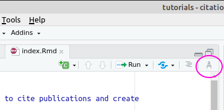
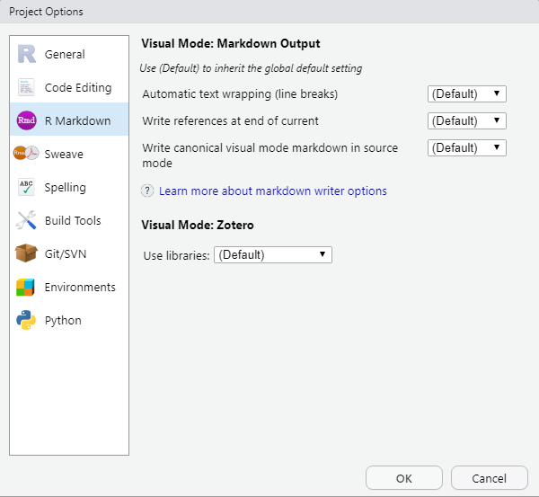
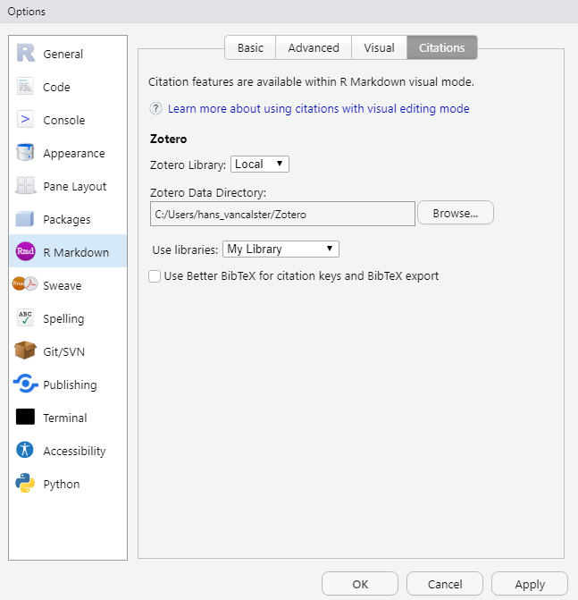
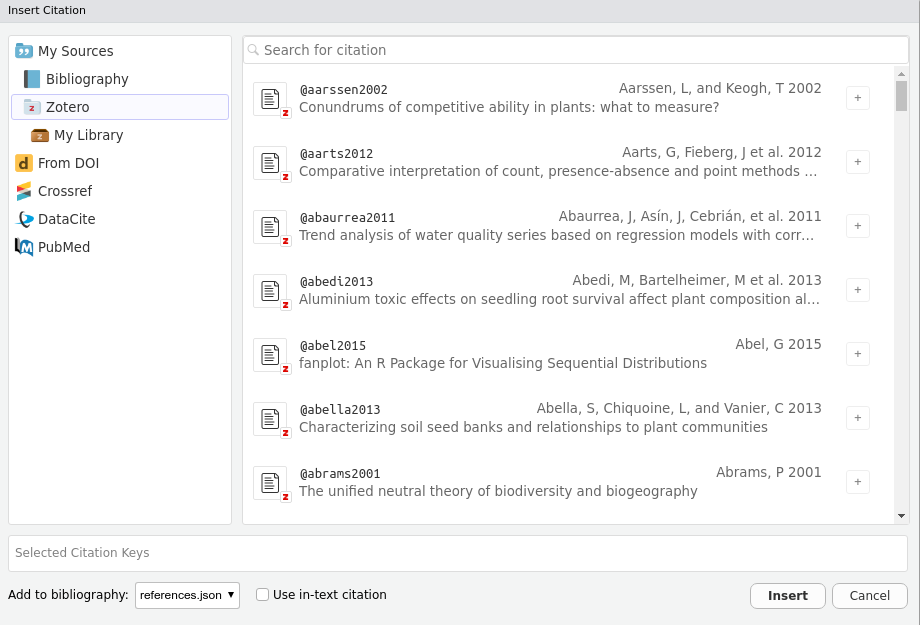

```{r include = FALSE}
library(knitr)
opts_chunk$set(
  echo = FALSE
)
library(ymlthis)
library(magrittr)
```

# Enter VME mode

With the advent of RStudio version 1.4+, working with bibliographies and citing documents in R Markdown has much improved.
In this tutorial we focus on best practices to further ease the citation experience when working with R Markdown documents.
We also give some guidelines specific to the Research Institute for Nature and Forest.

More general tutorials can be found at the following web pages:

-   <https://rmarkdown.rstudio.com/authoring_bibliographies_and_citations.html>
-   <https://rstudio.github.io/visual-markdown-editing/#/citations>

The latter webpage is part of the documentation about the Visual Markdown Editing (**VME**) mode that is available since RStudio 1.4+ as an alternative to writing R Markdown documents in source mode.
VME is a what-you-see-is-what-you-get [^1] interface for interacting with R Markdown.
This interface is similar to writing documents in word processing software (google docs, MS Word, ...).
Moreover, the VME mode has more functionalities for citations than the source mode.
To switch between source mode and VME, press the  button
:

[^1]: Commonly abbreviated as [WYSIWYG](https://en.wikipedia.org/wiki/WYSIWYG), in contrast to [WYSIWYM](https://en.wikipedia.org/wiki/WYSIWYM), of which plain Markdown (in RStudio source mode) is an example.



In this tutorial, we assume you are familiar with the basics of [R Markdown](https://bookdown.org/yihui/rmarkdown/) or [Bookdown](https://bookdown.org/yihui/bookdown/).

# Preparing your R Markdown document to work with citations

There are various places where you can specify things that impact working with citations.
The most important are specifications you can provide in the YAML header of your R Markdown document.
Next to that, the RStudio global and project options provide some additional settings.

## Document level specifications (YAML header specifications)

### Specifying a bibliography

You can specify one or more bibliography files with the `bibliography` argument in a number of formats, including the most commonly used formats at the Research Institute for Nature and Forest: CSL-JSON, CSL-YAML, BibTex and EndNote.

We strongly recommend however to [use CSL-JSON or CSL-YAML](https://rmarkdown.rstudio.com/authoring_bibliographies_and_citations.html), since CSL is the native format for Pandoc [^2].
All other bibliographic formats are internally converted to CSL-JSON, but with the exception of CSL-YAML this can in general not be perfect.
Compared to CSL-JSON, Pandoc's CSL-YAML has identical contents while having the most human-friendly syntax.
[CSL-JSON](https://citeproc-js.readthedocs.io/en/latest/csl-json/markup.html) is the formal standard supported by all CSL processors [^3]
.

[^2]: [Pandoc](https://pandoc.org/) is the workhorse for converting markdown to a desired output (such as html).

[^3]: A CSL processor is a piece of software to parse CSL styles, locale files, item metadata and citing details, and generate citations and bibliographies in the correct format.
    [Multiple](https://citationstyles.org/developers/#/csl-processors) CSL processors are available for use in software.
    The reference implementation is the [citeproc-js](https://citeproc-js.readthedocs.io/en/latest/) processor, which is implemented e.g. in Zotero and Mendeley; the citeproc-js project has also formulated the CSL-JSON standard.
    Pandoc, the document conversion software used by R Markdown, uses its own [citeproc](https://hackage.haskell.org/package/citeproc) CSL processor.

Some example specifications:

    ```{r results="asis"}
    yml() %>% 
      yml_citations(bibliography = "references.yaml")
    ```

Note that it is not even necessary at this stage that the bibliography file exists.
It is possible to just give it a name and [start adding citations in VME mode](#citing-documents).
When the first citation is inserted, for instance from a linked Zotero database, the file will be automatically created and the reference will be added to the file.

For users of Endnote, we recommend to export selected references to BibTeX format (as far as we know, it is not possible to export to CSL-JSON format).
To do this:

-   Edit -\> Output Styles -\> Open style manager and check the BibTex Export entry

-   make sure that BibTex Export is checked in the Edit -\> Output styles menu as well

-   File -\> Export, select Text file from the file type dropdown menu and save the file as `<filename>.bibtex`

We recommend to only include references in the bibliography file that are cited in the document.

    ```{r results="asis"}
    yml() %>% 
      yml_citations(bibliography = c("path/to/my/ref.json",
                                     "other_references_from_endnote.bibtex"))
    ```

### Specifying a citation style

The Research Institute for Nature and Forest has its own citation style.
There is a separate [tutorial](../style_inbo_bibliography/) that shows how to use this style in various reference manager software.

Specifying a citation style is done in the YAML header using the `csl` argument.
The `csl` argument should be a path or URL to a CSL style file.
To specify the style file for the Research Institute for Nature and Forest it is best to use the URL of the most up to date version:

    ```{r results="asis"}
    yml() %>% 
      yml_citations(bibliography = "ref.json",
                    csl = "https://raw.githubusercontent.com/citation-style-language/styles/master/research-institute-for-nature-and-forest.csl")
    ```

### Other YAML citation arguments {#other-yaml-citation-arguments}

The [ymlthis field guide](https://ymlthis.r-lib.org/articles/yaml-fieldguide.html#citations-1), [Pandoc](https://pandoc.org/MANUAL.html#other-relevant-metadata-fields) & associated [citeproc](https://github.com/jgm/citeproc/blob/master/man/citeproc.1.md) documentation and [RStudio VME citations section](https://rstudio.github.io/visual-markdown-editing/#/citations) mention the following useful arguments:

`citation-abbreviations`

:   Path to a CSL abbreviations JSON file, which can be used to translate from full journal titles to abbreviated journal titles.
    Examples of such files can be found [here](https://github.com/citation-style-language/abbreviations).

`link-citations`

:   Logical.
    Add citations hyperlinks to the corresponding bibliography entries?
    Default is `false`.

`nocite`

:   Citation IDs (`@item1`) to include in the bibliography even if they are not cited in the document.
    Including the wildcard pattern `@*` will include all citations in the bibliography regardless of whether they are cited in the document.

`suppress-bibliography`

:   Logical.
    Suppress bibliography?
    Default is `false`.

`lang`

:   Locale to use in formatting citations.
    If this is not set, the locale is taken from the default-locale attribute of the CSL file.
    `en-US` is used if a locale is not specified in either the metadata or the CSL file.

`reference-section-title`

:   If this has a value, a section header with this title will be added before the bibliography.
    If `reference-section-title` is not specified and the document ends with a section header, this final header will be treated as the bibliography header.

`zotero`

:   Specify one or more Zotero libraries.
    Or `false` to turn of Zotero library entirely.

Here is an example of a valid YAML with all citation arguments ("yes" and "no" serve as alternatives to `true` and `false`):

    ```{r results="asis"}
    yml() %>% 
      yml_citations(bibliography = "ref.json", 
                    csl = "https://raw.githubusercontent.com/citation-style-language/styles/master/research-institute-for-nature-and-forest.csl", 
                    citation_abbreviations = "abbreviations.json",
                    suppress_bibliography = FALSE, 
                    link_citations = TRUE,
                    nocite = c("@item1", "@item2")
                    ) %>%
      yml_toplevel(lang = "en-US",
                   zotero = "no")
    ```

## Rstudio project and global options

The project options allow you to select a Zotero reference manager library or libraries for the RStudio project you are working in.
The default will detect your local Zotero library.
It is also possible to point to other libraries, which can include a [group library](https://rstudio.github.io/visual-markdown-editing/#/citations?id=group-libraries) that is shared among co-workers.



The global options are more or less the same as the project options but will apply to all your RStudio projects.
The defaults are OK.



# Citing documents {#citing-documents}

## Syntax

The following Markdown syntax is used to refer to documents.
It is based on citation keys and the basic building block is `@citationkey`.

| syntax                                                               | result (depending on chosen csl style)                             |
|----------------------------------------------------------------------|--------------------------------------------------------------------|
| `@adams1975` concludes that ...                                      | @adams1975 concludes that ...                                      |
| `@adams1975[p.33]` concludes that ...                                | @adams1975 [p.33] concludes that ...                               |
| ... end of sentence `[@adams1975]`.                                  | ... end of sentence [@adams1975].                                  |
| ... end of sentence `[see @adams1975,p.33]`.                         | ... end of sentence [see @adams1975,p.33].                         |
| delineate multiple authors with colon: `[@adams1975; @aberdeen1958]` | delineate multiple authors with colon: [@adams1975; @aberdeen1958] |

## Insert a citation

You can either type the syntax in source mode, or use the insert citation button in VME mode.
Using the VME mode has multiple benefits:

-   autocompletion: typing `@` will automatically show a list of available references

-   searching and inserting references using one of the following methods (from the menu: Insert -\> Citation; or shortcut CTRL+SHIFT+F8)

    -   From the bibliography or bibliographies referred to in the YAML header's `bibliography` field
    -   From a Zotero library
    -   From DOI
    -   Crossref
    -   DataCite
    -   PubMed

This means that the Zotero reference manager is highly recommended when you want to work smoothly with citations in R Markdown.
This reference manager also integrates nicely with other word processing software such as MS Word and Googledocs.



# Bibliography placement

By default, the bibliography will be placed at the end of the document.
So, you will want a final header titled `# References` or `# Bibliography` at the end your document.
See also the `reference-section-title` field that we discussed in [Other YAML citation arguments](#other-yaml-citation-arguments).

If you want to place the bibliography somewhere else, for instance before the appendices, you can insert a `div` html tag in source mode:

    # References

    <div id="refs"></div>

    # Appendix

If you use [the `bookdown::gitbook` output format](https://bookdown.org/yihui/bookdown/html.html#gitbook-style), further tweaks are possible.
This format allows you to write a html report or book that consists of multiple html pages.
You can for instance choose to split each chapter of a report into separate html pages.
In that case, by default, the bibliography is split and all citation items that are cited on a given html page are put at the end of that page, so that readers do not have to navigate to a different bibliography page to see the details of citations.
This feature can be disabled by setting the `split_bib` YAML field to FALSE, in which case all citations cited in the entire report or book are put on a separate bibliography page.
To do this, you can add specific keys in the YAML header:

    ```{r results="asis"}
    yml() %>%
      yml_bookdown_site() %>%
      yml_output(bookdown::gitbook(split_by = "chapter",
                                   split_bib = FALSE))
    ```
