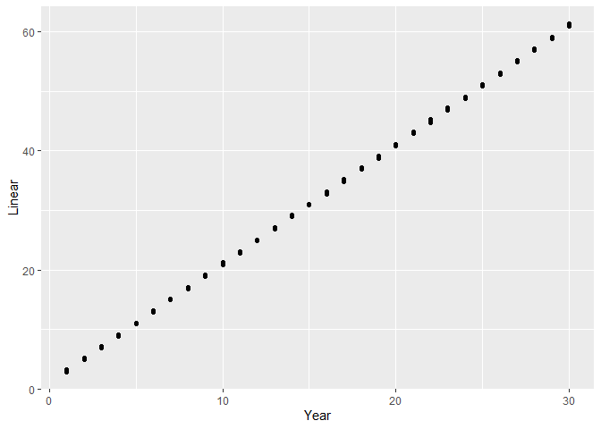
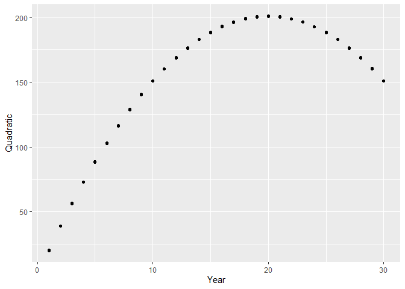
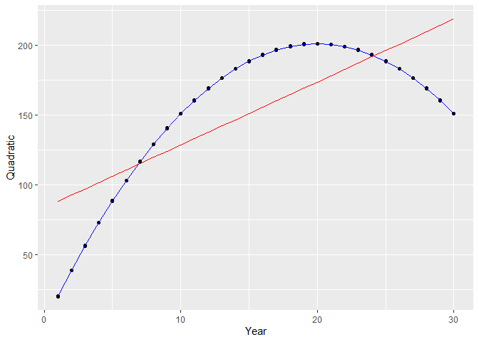
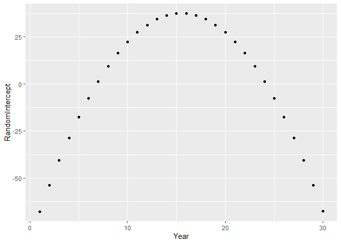

## Used packages

``` r
library(ggplot2)
```

    ## Warning: package 'ggplot2' was built under R version 4.0.2

``` r
library(lme4)
```

    ## Loading required package: Matrix

## Dummy data

For the sake of this demontration we use a very simple dataset with a
very high signal versus noise ratio. Let’s look at a simple timeseries
with multiple observations per timepoint.

``` r
n.year <- 30
n.replicate <- 10
sd.noise <- 0.1
dataset <- expand.grid(
  Replicate =  seq_len(n.replicate),
  Year = seq_len(n.year)
)
dataset$fYear <- factor(dataset$Year)
dataset$Noise <- rnorm(nrow(dataset), mean = 0, sd = sd.noise)
dataset$Linear <- 1 + 2 * dataset$Year + dataset$Noise
dataset$Quadratic <- 1 + 20 * dataset$Year - 0.5 * dataset$Year ^ 2 + 
  dataset$Noise
```

``` r
ggplot(dataset, aes(x = Year, y = Linear)) + geom_point()
```

<!-- -->

``` r
ggplot(dataset, aes(x = Year, y = Quadratic)) + geom_point()
```

<!-- -->

## Quadratic trend but fit as a linear trend

Assume that we assume that the trend is linear but in reality it is
quadratic. In this case the random intercept of year will pickup the
differences with the linear trend.

``` r
model.quadratric <- lmer(Quadratic ~ Year + (1|Year), 
                         data = dataset)
summary(model.quadratric)
```

    ## Linear mixed model fit by REML ['lmerMod']
    ## Formula: Quadratic ~ Year + (1 | Year)
    ##    Data: dataset
    ## 
    ## REML criterion at convergence: -105.5
    ## 
    ## Scaled residuals: 
    ##      Min       1Q   Median       3Q      Max 
    ## -3.12646 -0.60920  0.06426  0.63613  2.98079 
    ## 
    ## Random effects:
    ##  Groups   Name        Variance  Std.Dev.
    ##  Year     (Intercept) 1.198e+03 34.6147 
    ##  Residual             1.052e-02  0.1025 
    ## Number of obs: 300, groups:  Year, 30
    ## 
    ## Fixed effects:
    ##             Estimate Std. Error t value
    ## (Intercept)  83.6655    12.9623   6.455
    ## Year          4.5000     0.7301   6.163
    ## 
    ## Correlation of Fixed Effects:
    ##      (Intr)
    ## Year -0.873

``` r
dataset$QuadraticPredict <- predict(model.quadratric)
dataset$QuadraticFixed <- predict(model.quadratric, re.form = ~0)
```

``` r
ggplot(dataset, aes(x = Year, y = Quadratic)) + 
  geom_point() + 
  geom_line(aes(y = QuadraticFixed), colour = "red") + 
  geom_line(aes(y = QuadraticPredict), colour = "blue")
```

<!-- -->

The random effects will have a strong pattern. Indicating that a second
order polynomial makes more sense than a linear trend.

``` r
rf <- data.frame(
  Year = seq_len(n.year),
  RandomIntercept = ranef(model.quadratric)$Year[, 1]
)
```

``` r
ggplot(rf, aes(x = Year, y = RandomIntercept)) + 
  geom_point()
```

<!-- -->

## What if the trend is perfectly linear?

Both the fixed effect and the random effect can perfectly model the
pattern in the data. So the model seems to be unidentifiable. However
the likelihood of the model contains a penalty term for the random
intercept. The stronger the absolute value of the random effect, the
stronger the penalty. The fixed effects have no penalty term. Hence,
model with strong fixed effect will have a higher likelihood than
exactly the same fit generated by strong random effects.

In this case the linear trend is very strong compared to the noise. So
the linear trend in the fixed effect fits the data very well. Note that
the random effect variance is zero.

``` r
model.linear <- lmer(Linear ~ Year + (1|Year), data = dataset)
```

    ## boundary (singular) fit: see ?isSingular

``` r
summary(model.linear)
```

    ## Linear mixed model fit by REML ['lmerMod']
    ## Formula: Linear ~ Year + (1 | Year)
    ##    Data: dataset
    ## 
    ## REML criterion at convergence: -498.3
    ## 
    ## Scaled residuals: 
    ##     Min      1Q  Median      3Q     Max 
    ## -2.8338 -0.6580  0.1124  0.6691  2.5458 
    ## 
    ## Random effects:
    ##  Groups   Name        Variance Std.Dev.
    ##  Year     (Intercept) 0.00000  0.0000  
    ##  Residual             0.01043  0.1021  
    ## Number of obs: 300, groups:  Year, 30
    ## 
    ## Fixed effects:
    ##              Estimate Std. Error t value
    ## (Intercept) 0.9988195  0.0120954   82.58
    ## Year        1.9999875  0.0006813 2935.46
    ## 
    ## Correlation of Fixed Effects:
    ##      (Intr)
    ## Year -0.873
    ## convergence code: 0
    ## boundary (singular) fit: see ?isSingular

``` r
dataset$LinearPredict <- predict(model.linear)
dataset$LinearFixed <- predict(model.linear, re.form = ~0)
```

``` r
ggplot(dataset, aes(x = Year, y = Linear)) + 
  geom_point() + 
  geom_line(aes(y = LinearFixed), colour = "red") + 
  geom_line(aes(y = LinearPredict), colour = "blue")
```

<!-- -->

## What about fitting year as a factor in the fixed effects

Combining the same variables as a factor in the fixed effects and as a
random intercept doesn’t make sense. They allow exactly the same model
fit and thus the random intercept will always shrink to zero.
