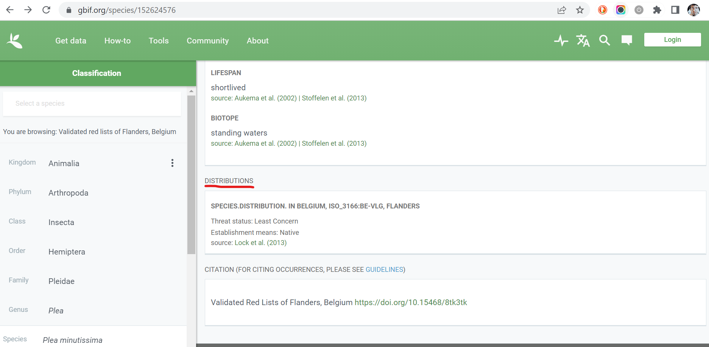

## Introduction

The R package [rgbif](https://docs.ropensci.org/rgbif/) is a R wrapper to the [GBIF API](https://www.gbif.org/developer/summary) which allows you to get data from GBIF directly in your R session. The package is very well documented. Please, look at the articles on how to:

1. [setup your GBIF username and password](https://docs.ropensci.org/rgbif/articles/gbif_credentials.html)
2. [get occurrence data](https://docs.ropensci.org/rgbif/articles/getting_occurrence_data.html)
3. [work with taxonomy related functions](https://docs.ropensci.org/rgbif/articles/taxonomic_names.html)
4. [match and download a long species list](https://docs.ropensci.org/rgbif/articles/downloading_a_long_species_list.html)

So, why to write another tutorial about rgbif? Because I think you can benefit from these short instructions to get a (species) checklist dataset from GBIF without having to read throughout all the documentation, which could be sometimes feeling overwhelming.

```{r load_libraries, message=FALSE, warning=FALSE}
library(tidyverse)    # To do datascience
library(rgbif)        # To lookup names in the GBIF backbone taxonomy
library(knitr)
```

## Retrieve a GBIF checklist dataset in R

You want to load the [Validated red lists of Flanders, Belgium](https://www.gbif.org/dataset/fc18b0b1-8777-4c8a-8cb8-f9f15870d6a9) checklist in your R session.

The URL of this checklist contains an important information, the `datasetKey`, which is the alphanumeric string following the prefix  `https://www.gbif.org/dataset/`. In our case:


```{r define_datasetKey}
datasetKey <- "fc18b0b1-8777-4c8a-8cb8-f9f15870d6a9"
```

You need to run the `name_usage()` rgbif function using the argument ``

```{r name_usage}
red_list <- name_usage(datasetKey = datasetKey)
```
   
You get a list of two:

```{r}
names(red_list)
```

the slot ´meta `contains metadata:

```{r}
red_list$meta
```
which are sometimes very important! In our case, for example, we can see that we didn't download all the data as `endOfRecords` is `FALSE`. The reason is that `name_usage` has an argument called `limit` which is the	
number of records to return. The default value is 100.

To get all the taxa we need to specify a sufficiently high number, e.g. 10000. The hard limit of the API is ten times bigger, 100k, which is an extremely high number for such kind of datasets:

```{r use_limit}
red_list <- name_usage(datasetKey = datasetKey, limit = 10000)
```

Now we should have all taxa:

```{r preview_species_df}
red_list$meta$endOfRecords
```

Let's check the taxa in slot `data`:

```{r}
kable(red_list$data[1:10,])
```

But what do those keys stay for?

- `key`, sometimes called `taxonKey`, is the identifier of the taxon within our checklist
- `nubKey` is the identifier of the taxon within the [GBIF Backbone Taxonomy](https://www.gbif.org/dataset/d7dddbf4-2cf0-4f39-9b2a-bb099caae36c) dataset, or simply _backbone_. The link from the taxon in the red list checklist dataset the taxon in the backbone is done by GBIF automatically behind the scenes while publishing the checklist. You can control the match before publication of course, by using the gbif match utility in rgbif (see the vignette [match and download a long species list](https://docs.ropensci.org/rgbif/articles/downloading_a_long_species_list.html)) or the GBIF [data validator](https://www.gbif.org/tools/data-validator) web tool.
- `kingdomKey`,	`phylumKey`, `classKey`,	`orderKey`, `familyKey`, `genusKey`, `speciesKey`, `parentKey`: keys referring to the taxon classification as proposed in the checklist dataset. Notice that if the taxon is a species, `key` and `speciesKey` are the same. Keep in mind that the classication can be different than the classification in the backbone. Not all checklists are published with such detailed taxonomic classification. For example, the [LIFE RIPARIAS target species list](https://www.gbif.org/dataset/fd004d9a-2ea4-4244-bb60-0df508d20a15) contains only the kingdom the taxa belong to. So, only `kingdomKey` and `speciesKey` are present.

Notice also that all these taxonomic related keys point to specific web pages on the GBIF website. You need only to add the prefix `https://www.gbif.org/species/`. For example, the first taxon has key `152624576` and the corresponding webpage is `https://www.gbif.org/species/152624576`, while its nubkey, `2020551`, points to the webpage of the taxon as mentioned in the backbone: `https://www.gbif.org/species/2020551`.

Now, let's check how many taxa you got:

```{r}
nrow(red_list$data)
```

However, the webpage on GBIF says 3036 records


Who lies?!? Nobody, actually. The reason is the taxonomic classification added to each taxon. How to get the 3036 records of the red list? And which taxa are actually part of the added classification? The column `origin` is what we need!

```{r}
red_list$data %>%
  count(origin)
```

You need then to _filter_ on `origin` with value `"SOURCE"`:

```{r filter on origin}
red_list_taxa <- red_list$data %>% filter(origin == "SOURCE")
nrow(red_list_taxa)
```

## Retrieve non taxonomic information from a GBIF checklist in R

A checklist dataset is not always only a list of taxa: it can be enriched by **extensions** containing information about e.g. the _distribution_, the _species profile_ or other less strict defined information described in the _description_ extension.

How to get this information in R? Unfortunately, this information is linked to the taxon, not to the checklist dataset as a whole. In other words, you get an error if you try this:

```r
distribution <- name_usage(datasetKey = datasetKey, data = "distribution")
Error in exists(z, private$crul_h_pool) : invalid first argument
```

You need a loop over all the taxa (`key`):

```{r get_distribution}
distribution <- 
  red_list_taxa %>% 
  pull(key) %>%
  map_dfr(., function(x) {
    distribution_details <-name_usage(x, data = "distribution")
    return(distribution_details$data)
    }
  )
```

Overview:

```{r}
kable(distribution[1:10,])
```

This step is slower than retrieving the taxonomic information as we need 3036 calls to the API, one per taxon, instead of one.

Again, can you find this information on the GBIF website? Of course! All infos about the extensions is shown on the taxon page. Below a screenshot showing the section related to the distribution extension for [_Plea minutissima_](https://www.gbif.org/species/152624576)(`key`: `152624576`):



## Cite the checklist dataset

If the (checklist) dataset you used is worth to be cited, you can retrieve the citation by running `gbif_citation()` function:

```{r cite}
gbif_citation(x = datasetKey)
```

## INBO datasets on GBIF

INBO is an official GBIF publisher and a host for many other smaller publishers. Do you want to know which datasets have been published so far by INBO? 
You can have a look via this link:

https://www.gbif.org/dataset/search?publishing_org=1cd669d0-80ea-11de-a9d0-f1765f95f18b

you can finetuning the search by selecting the type of the datasets. For example, for checklist datasets:

https://www.gbif.org/dataset/search?type=CHECKLIST&publishing_org=1cd669d0-80ea-11de-a9d0-f1765f95f18b

Can you do this in R? Of course. Use the rgbif function `dataset_search()` specifying the INBO's ID as publishing organization. Again, you get a list with two slots, `meta` and `data`. Guess where the datasets are :-)

```{r get_datasets_INBO}
INBO_datasets <- dataset_search(
  publishingOrg = "1cd669d0-80ea-11de-a9d0-f1765f95f18b"
)
INBO_datasets$data
```

To finetune the search as we did online, use `type` argument:

```{r inbo_checklists}
INBO_checklists <- dataset_search(
  publishingOrg = "1cd669d0-80ea-11de-a9d0-f1765f95f18b",
  type = "checklist"
)
INBO_checklists$data 
```

## INBO as hosting organization

INBO is not only a GBIF publisher. It hosts GBIF data for many other organisations. How to get all hosted datasets? By selecting INBO in the field "Host":

Online: https://www.gbif.org/dataset/search?hosting_org=1cd669d0-80ea-11de-a9d0-f1765f95f18b

In R, by using the argument `hostingOrg` within function `dataset_search()`:

```{r}
datasets_hosted_by_inbo <- dataset_search(
  hostingOrg = "1cd669d0-80ea-11de-a9d0-f1765f95f18b",
  limit = 1000)
datasets_hosted_by_inbo$data
```

Notice again the `limit` argument with a sufficiently high number as value. Exercise: check the `meta` slot to check if we got all records.

Which publishing organizations host GBIF data at INBO?

```{r org_hosting_data}
datasets_hosted_by_inbo$data %>%
  distinct(publishingOrganization)
```

## A nerdy touch: the GBIF API output

We said at the beginning of this tutorial that the information you get via rgbif is harvested by using the GBIF API. So, the question is: can you see the API output on the web as well? Answer is YES! You need some prefixes and again the values in the field `key`. Here below we use the taxon [_Plea minutissima_](https://www.gbif.org/species/152624576)(`key`: `152624576`) as example:
1. taxonomic information: https://api.gbif.org/v1/species/152624576
2. distribution information: https://api.gbif.org/v1/species/152624576/distributions
3. description information: https://api.gbif.org/v1/species/152624576/descriptions

And the checklist dataset? Here you go: https://api.gbif.org/v1/dataset/fc18b0b1-8777-4c8a-8cb8-f9f15870d6a9. Notice the word `dataset` instead of `species` in the prefix.

Notice that all information exposed by the GBIF API is written using the [JSON](https://en.wikipedia.org/wiki/JSON) format. To parse it in a humanly readable way, you can use the Google Chrome extension [JSON Formatter](https://chrome.google.com/webstore/detail/json-formatter/bcjindcccaagfpapjjmafapmmgkkhgoa) or another similar extension.
The difference is impressive, isn't?

Raw:


Parsed:

