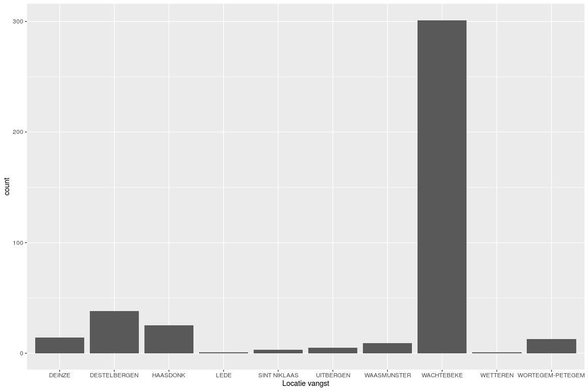

``` r
library(googlesheets)
library(dplyr)
library(ggplot2)
```

Setup
-----

The R package [googlesheets](https://github.com/jennybc/googlesheets/blob/master/README.md) provides the functionality to retrieve data from a google sheet. Once the registration as a user is done and the permissions are granted, it enables to read and write to google sheets. Initiation of the authentification can be done with the `gs_auth` command.

``` r
gs_auth()
```

Google will ask to grant the package the permission to access your drive. This token is saved to in a file `.httr-oauth` in your current working directory. Make sure this is not part of your version control system. However, as we want to be able to make the running independent from the user authentification or without needing an interactive environment. Therefore, we can store the token in a file and get the authentification from there. The code loads the token from the file if the file exists. Otherwise a new token is created and stored in the file.

``` r
if (file_test("-f", "googlesheets_token.rds")) {
  gs_auth(token = "googlesheets_token.rds")
} else {
  # first get the token, but not caching it in a local file
  token <- gs_auth(cache = FALSE)
  # save the token into a file in the current directory
  saveRDS(token, file = "googlesheets_token.rds")
}
```

Make sure the token is savely stored within your project folder without sharing it or putting it into the version control history. If you need more power (e.g. necessity of integration services such as Travis CI), check the encryption options in [this manual](https://rawgit.com/jennybc/googlesheets/master/vignettes/managing-auth-tokens.html).

Once registered, an overview of your available google sheets is provided as follows, with the option to provide a (regular) expression to search for in the names:

``` r
gs_ls("tutorial_example")
```

    ## # A tibble: 2 x 10
    ##   sheet_title author perm  version updated             sheet_key ws_feed
    ##   <chr>       <chr>  <chr> <chr>   <dttm>              <chr>     <chr>  
    ## 1 tutorial_e… stijn… rw    old     2018-12-13 16:37:58 1O9W_c0A… https:…
    ## 2 tutorial_e… stijn… rw    old     2018-12-13 16:36:56 124Od346… https:…
    ## # ... with 3 more variables: alternate <chr>, self <chr>, alt_key <chr>

I just want to load a google spreadsheet
----------------------------------------

Consider you have the authentification. You know the name, URL or key of the spreadheet and want to read this in, well use one of the functions `gs_title()`, `gs_url()` or `gs_key()`.

As an example, I want to work on the sheet called `TraitsRedListSpecies`. Finding the spreadheet is done as follows:

``` r
goose <- gs_title("tutorial_example_spreadsheet_2")
```

    ## Sheet successfully identified: "tutorial_example_spreadsheet_2"

An overview of the different sheets provides sufficient information to retrieve the dataset and work with them:

``` r
gs_ws_ls(goose)
```

    ## [1] "Tbl1 Ringgegevens"     "Tbl2 Koppels"          "Tbl3 Waarnemingen"    
    ## [4] "Tbl4 Nesten"           "Tbl5 Nestcontroles"    "Tbl6 Uitkipsucces"    
    ## [7] "Tbl7 Kuikenoverleving" "Tbl8 Datums"

So, getting the `BreedingBirds` sheet into a native R object can be done by reading the specific worksheet:

``` r
goose_data <- goose %>% 
        gs_read(ws = "Tbl1 Ringgegevens")
```

    ## Accessing worksheet titled 'Tbl1 Ringgegevens'.

    ## Parsed with column specification:
    ## cols(
    ##   Ringnummer = col_character(),
    ##   Kleurring = col_character(),
    ##   Soort = col_character(),
    ##   Leeftijdscategorie = col_character(),
    ##   Geslacht = col_character(),
    ##   `Datum vangst` = col_character(),
    ##   `Locatie vangst` = col_character(),
    ##   Vangtype = col_character(),
    ##   Gestorven = col_character()
    ## )

Inspecting the data of the sheet:

``` r
class(goose_data)
```

    ## [1] "tbl_df"     "tbl"        "data.frame"

``` r
head(goose_data)
```

    ## # A tibble: 6 x 9
    ##   Ringnummer Kleurring Soort Leeftijdscatego… Geslacht `Datum vangst`
    ##   <chr>      <chr>     <chr> <chr>            <chr>    <chr>         
    ## 1 B1634      162       Bran… Adult            Vrouw    7/20/2000     
    ## 2 B3204      181       Bran… Adult            <NA>     8/9/2009      
    ## 3 K23913     636       Bran… Adult            <NA>     8/9/2009      
    ## 4 K46701     <NA>      Bran… Adult            Onbekend 7/2/2012      
    ## 5 <NA>       <NA>      <NA>  <NA>             <NA>     <NA>          
    ## 6 K46702     <NA>      Bran… Adult            Onbekend 7/2/2012      
    ## # ... with 3 more variables: `Locatie vangst` <chr>, Vangtype <chr>,
    ## #   Gestorven <chr>

We can now start working on the data, e.g. make a plot of the number of species in each location:

``` r
ggplot(data = goose_data %>% filter(!is.na(`Locatie vangst`)), 
       aes(x = `Locatie vangst`)) +
    geom_bar()
```


