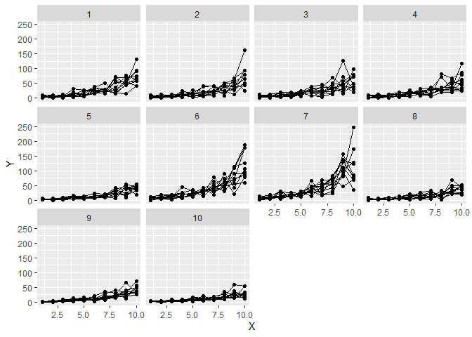

## Definition

An observation level random effect (OLRE) is a random effect with a
different level for each observation. Combined with a Poisson
distribution it can capture moderate overdispersion.

## Example

The model below is a simple mixed model. \(\delta_{ijk}\) is the OLRE.

\[Y_{ijk} \sim Poisson(\mu_{ijk})\]

\[\log(\mu_{ijk}) = \eta_{ijk}\]

\[\eta_{ijk} = \beta_0 + \beta_1 X_i + b_j + \delta_{ijk}\]

\[b_j \sim N(0, \sigma_b)\]

\[\delta_{ijk} \sim N(0, \sigma_{olre})\]

Let’s generate some overdispersed data using a negative binomial
distribution.

``` r
set.seed(324)
n.i <- 10
n.j <- 10
n.k <- 10
beta.0 <- 1
beta.1 <- 0.3
sigma.b <- 0.5
theta <- 5
dataset <- expand.grid(
  X = seq_len(n.i),
  b = seq_len(n.j),
  Replicate = seq_len(n.k)
)
rf.b <- rnorm(n.j, mean = 0, sd = sigma.b)
dataset$eta <- beta.0 + beta.1 * dataset$X + rf.b[dataset$b]
dataset$mu <- exp(dataset$eta)
dataset$Y <- rnbinom(nrow(dataset), mu = dataset$mu, size = theta)
dataset$OLRE <- seq_len(nrow(dataset))
```

``` r
library(ggplot2)
```

    ## Warning: package 'ggplot2' was built under R version 4.0.2

``` r
ggplot(dataset, aes(x = X, y = Y, group = Replicate)) +
  geom_line() +
  geom_point() +
  facet_wrap(~b)
```

<!-- -->

Next we fit the model with an OLRE.

``` r
library(lme4)
```

    ## Loading required package: Matrix

``` r
m1 <- glmer(Y ~ X + (1 | b) + (1 | OLRE),
  data = dataset,
  family = poisson
)
summary(m1)
```

    ## Generalized linear mixed model fit by maximum likelihood (Laplace
    ##   Approximation) [glmerMod]
    ##  Family: poisson  ( log )
    ## Formula: Y ~ X + (1 | b) + (1 | OLRE)
    ##    Data: dataset
    ## 
    ##      AIC      BIC   logLik deviance df.resid 
    ##   6871.8   6891.4  -3431.9   6863.8      996 
    ## 
    ## Scaled residuals: 
    ##      Min       1Q   Median       3Q      Max 
    ## -2.06918 -0.41636 -0.00649  0.27116  1.55094 
    ## 
    ## Random effects:
    ##  Groups Name        Variance Std.Dev.
    ##  OLRE   (Intercept) 0.1732   0.4161  
    ##  b      (Intercept) 0.1475   0.3840  
    ## Number of obs: 1000, groups:  OLRE, 1000; b, 10
    ## 
    ## Fixed effects:
    ##             Estimate Std. Error z value Pr(>|z|)    
    ## (Intercept) 1.002971   0.127698   7.854 4.02e-15 ***
    ## X           0.298558   0.005803  51.447  < 2e-16 ***
    ## ---
    ## Signif. codes:  0 '***' 0.001 '**' 0.01 '*' 0.05 '.' 0.1 ' ' 1
    ## 
    ## Correlation of Fixed Effects:
    ##   (Intr)
    ## X -0.282

The estimates for \(\beta_0\), \(\beta_1\) and \(\sigma_b\) are
reasonably close to the ones used to generate the data.

## Check the sanity of the model

Models with an OLRE should be used carefully. Because OLRE can have a
very strong influence on the model. One should always check the standard
deviation of the ORLE. High standard deviations are a good indication
for problems. Let’s show why.

The main model (without OLRE) is
\(\gamma_{ijk} = \beta_0 + \beta_1 X_i + b_j\). The OLRE correct this
for overdispersion \(\eta_{ijk} = \gamma_{ijk} + \delta_{ijk}\). Since
\(\delta_{ijk} \sim N(0, \sigma_{olre})\), the 2.5% and 97.5% quantiles
of this distribution define a range in which 95% of the plausible OLRE
values are. The 2.5% quantile (\(\delta_{lcl}\)) indicates a strong but
plausible downward correction, the 97.5% quantile (\(\delta_{ucl}\)) an
upward correction. So due to the corrections we have
\(\eta_{ijk} = (\gamma_{ijk} + \delta_{lcl}; \gamma_{ijk} + \delta_{ucl}) = \gamma_{ijk} + (\delta_{lcl};\delta_{ucl})\).
In a Poisson distribution with log-link we have
\(\log(\mu_{ijk}) = \eta_{ijk}\) or
\(\mu_{ijk} = e ^{\eta_{ijk}} = e ^{\gamma_{ijk} + (\delta_{lcl};\delta_{ucl})}\).
The ratio \(r_{ijk}\) between the upper and lower boundary of
\(\mu_{ijk}\) is:

\[r_{ijk} = \frac{e ^{\gamma_{ijk} + \delta_{ucl}}}{e ^{\gamma_{ijk} + \delta_{lcl})}}\]
