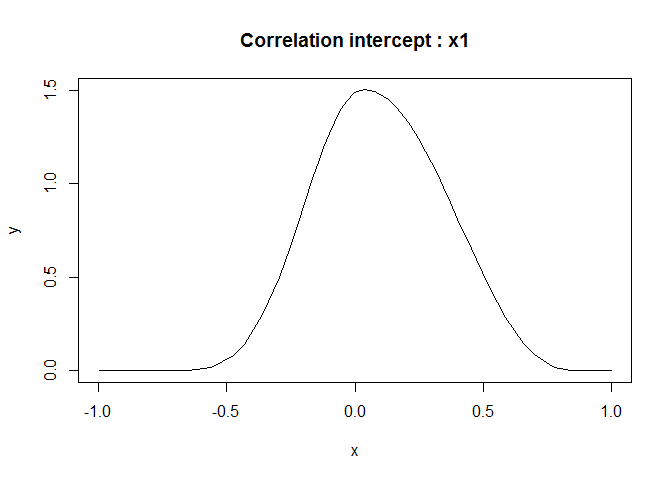
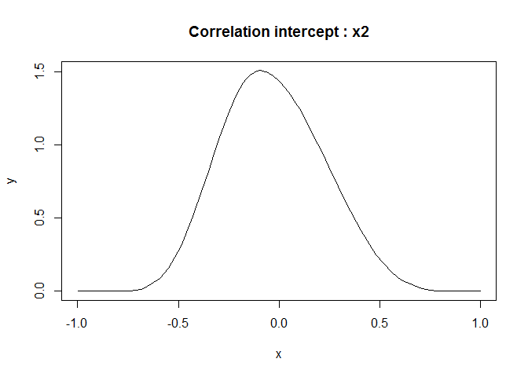
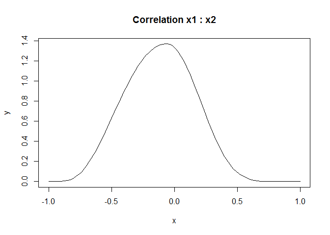

# Read the data

``` r
library(readr)
library(rprojroot)
dataset <- read_csv(find_root_file(
  "content/tutorials/r_perfect_correlation",
  "correlated-random-effects.csv",
  criterion = is_git_root)
  )
```

    ## Parsed with column specification:
    ## cols(
    ##   y = col_double(),
    ##   x1 = col_double(),
    ##   x2 = col_double(),
    ##   country = col_double(),
    ##   wave = col_double(),
    ##   region = col_double()
    ## )

``` r
dataset$region <- factor(dataset$region)
dataset$country <- factor(dataset$country)
```

``` r
head(dataset)
```

    ## # A tibble: 6 x 6
    ##       y    x1    x2 country  wave region
    ##   <dbl> <dbl> <dbl> <fct>   <dbl> <fct> 
    ## 1     0 0.330 0.149 12       1995 5     
    ## 2     0 0.330 0.149 12       1995 5     
    ## 3     0 0.330 0.149 12       1995 5     
    ## 4     1 0.330 0.149 12       1995 5     
    ## 5     1 0.330 0.149 12       1995 5     
    ## 6     0 0.330 0.149 12       1995 5

``` r
summary(dataset)
```

    ##        y                x1                x2              country      
    ##  Min.   :0.0000   Min.   :-1.5102   Min.   :-0.39999   65     :  8923  
    ##  1st Qu.:0.0000   1st Qu.:-0.0717   1st Qu.:-0.21021   74     :  6654  
    ##  Median :0.0000   Median : 0.1140   Median :-0.05628   17     :  6054  
    ##  Mean   :0.3823   Mean   : 0.0450   Mean   : 0.03466   22     :  6051  
    ##  3rd Qu.:1.0000   3rd Qu.: 0.2647   3rd Qu.: 0.26592   33     :  6043  
    ##  Max.   :1.0000   Max.   : 0.5757   Max.   : 0.97725   47     :  5459  
    ##                   NA's   :3009                         (Other):176395  
    ##       wave      region   
    ##  Min.   :1995   1:36645  
    ##  1st Qu.:1995   2:33008  
    ##  Median :2000   3:33999  
    ##  Mean   :2000   4:38303  
    ##  3rd Qu.:2005   5:48399  
    ##  Max.   :2005   6:25225  
    ## 

# Aggregate binary data

This makes the data more compact and easier to analyse.

``` r
library(dplyr)
```

    ## 
    ## Attaching package: 'dplyr'

    ## The following objects are masked from 'package:stats':
    ## 
    ##     filter, lag

    ## The following objects are masked from 'package:base':
    ## 
    ##     intersect, setdiff, setequal, union

``` r
dataset <- dataset %>% 
  group_by(region, country, wave) %>% 
  summarise(
    Present = sum(y == 1), 
    N = n(), 
    x1 = mean(x1, na.rm = TRUE), 
    x2 = mean(x2)
  )
dataset$countrywave <- interaction(dataset$country, dataset$wave)
dataset$regionid <- as.integer(dataset$region)
dataset$regionid1 <- dataset$regionid + max(dataset$regionid)
dataset$regionid2 <- dataset$regionid1 + max(dataset$regionid)
dataset$cwave <- dataset$wave - min(dataset$wave)
n.region <- n_distinct(dataset$region)
```

``` r
dataset
```

    ## # A tibble: 146 x 12
    ## # Groups:   region, country [84]
    ##    region country  wave Present     N      x1     x2 countrywave regionid
    ##    <fct>  <fct>   <dbl>   <int> <int>   <dbl>  <dbl> <fct>          <int>
    ##  1 1      8        1995     195  1525  0.0116  0.217 8.1995             1
    ##  2 1      8        2000     211  1500 -0.0430  0.106 8.2000             1
    ##  3 1      16       1995     623  1500  0.203  -0.175 16.1995            1
    ##  4 1      16       2000     259  1000  0.0412 -0.108 16.2000            1
    ##  5 1      16       2005     777  2015  0.120  -0.129 16.2005            1
    ##  6 1      33       1995    1210  2040  0.196   0.355 33.1995            1
    ##  7 1      33       2000    1096  2002  0.114   0.203 33.2000            1
    ##  8 1      33       2005    1157  2001  0.142   0.254 33.2005            1
    ##  9 1      34       2000     217  1004 -0.0292  0.954 34.2000            1
    ## 10 1      34       2005     527  2015  0.119   0.199 34.2005            1
    ## # ... with 136 more rows, and 3 more variables: regionid1 <int>,
    ## #   regionid2 <int>, cwave <dbl>

``` r
summary(dataset)
```

    ##  region    country         wave         Present             N       
    ##  1:26   4      :  3   Min.   :1995   Min.   :  45.0   Min.   : 417  
    ##  2:24   15     :  3   1st Qu.:1995   1st Qu.: 320.5   1st Qu.:1038  
    ##  3:16   16     :  3   Median :2000   Median : 475.0   Median :1211  
    ##  4:30   33     :  3   Mean   :2000   Mean   : 564.5   Mean   :1477  
    ##  5:36   39     :  3   3rd Qu.:2005   3rd Qu.: 702.2   3rd Qu.:1874  
    ##  6:14   47     :  3   Max.   :2005   Max.   :2369.0   Max.   :3401  
    ##         (Other):128                                                 
    ##        x1                   x2             countrywave     regionid    
    ##  Min.   :-1.5102302   Min.   :-0.399994   1.1995 :  1   Min.   :1.000  
    ##  1st Qu.:-0.1579904   1st Qu.:-0.212392   4.1995 :  1   1st Qu.:2.000  
    ##  Median : 0.0728662   Median :-0.120049   5.1995 :  1   Median :4.000  
    ##  Mean   : 0.0009505   Mean   : 0.002102   6.1995 :  1   Mean   :3.466  
    ##  3rd Qu.: 0.2099507   3rd Qu.: 0.197752   7.1995 :  1   3rd Qu.:5.000  
    ##  Max.   : 0.5757258   Max.   : 0.977251   8.1995 :  1   Max.   :6.000  
    ##  NA's   :3                                (Other):140                  
    ##    regionid1        regionid2         cwave       
    ##  Min.   : 7.000   Min.   :13.00   Min.   : 0.000  
    ##  1st Qu.: 8.000   1st Qu.:14.00   1st Qu.: 0.000  
    ##  Median :10.000   Median :16.00   Median : 5.000  
    ##  Mean   : 9.466   Mean   :15.47   Mean   : 5.068  
    ##  3rd Qu.:11.000   3rd Qu.:17.00   3rd Qu.:10.000  
    ##  Max.   :12.000   Max.   :18.00   Max.   :10.000  
    ## 

# Analyse the model with `lme4`

``` r
library(lme4)
```

    ## Loading required package: Matrix

``` r
system.time(
  model <- glmer(
    cbind(Present, N - Present) ~ 
      x1 + x2 + (1 + x1 + x2 | region) + (1 | country) + (1 | countrywave), 
    data = dataset, 
    family = binomial
  )
)
```

    ## boundary (singular) fit: see ?isSingular

    ##    user  system elapsed 
    ##    1.12    0.03    1.18

``` r
model
```

    ## Generalized linear mixed model fit by maximum likelihood (Laplace
    ##   Approximation) [glmerMod]
    ##  Family: binomial  ( logit )
    ## Formula: cbind(Present, N - Present) ~ x1 + x2 + (1 + x1 + x2 | region) +  
    ##     (1 | country) + (1 | countrywave)
    ##    Data: dataset
    ##       AIC       BIC    logLik  deviance  df.resid 
    ## 1907.0354 1939.6267 -942.5177 1885.0354       132 
    ## Random effects:
    ##  Groups      Name        Std.Dev. Corr       
    ##  countrywave (Intercept) 0.3989              
    ##  country     (Intercept) 0.5740              
    ##  region      (Intercept) 0.1283              
    ##              x1          0.1537    1.00      
    ##              x2          0.3741   -1.00 -1.00
    ## Number of obs: 143, groups:  countrywave, 143; country, 82; region, 6
    ## Fixed Effects:
    ## (Intercept)           x1           x2  
    ##    -0.60707      0.48902      0.04427  
    ## convergence code 0; 0 optimizer warnings; 1 lme4 warnings

This gives perfectly correlated random effects because there is not
enough information in the dataset to estimate random slopes at the
region level.

# Analyse the model with `INLA`

``` r
library(INLA)
```

    ## Loading required package: sp

    ## Loading required package: parallel

    ## Loading required package: foreach

    ## This is INLA_20.03.17 built 2020-05-05 07:15:25 UTC.
    ## See www.r-inla.org/contact-us for how to get help.

``` r
system.time(
  m1 <- inla(
    Present ~ x1 + x2 + 
        # INLA equivalent of (1 + x1 + x2|region)
          f(regionid, model = "iid3d", n = 3 * n.region) + 
          f(regionid1, x1, copy = "regionid") + 
          f(regionid2, x2, copy = "regionid") + 
        # INLA equivalent of (1 + x1 + x2|region)
      f(country, model = "iid") + 
      f(countrywave, model = "iid"),
    Ntrials = N,
    data = dataset,
    family = "binomial",
    control.compute = list(dic = TRUE)
  )
)
```

    ##    user  system elapsed 
    ##    0.86    0.96    4.80

``` r
summary(m1)
```

    ## 
    ## Call:
    ##    c("inla(formula = Present ~ x1 + x2 + f(regionid, model = \"iid3d\", ", 
    ##    " n = 3 * n.region) + f(regionid1, x1, copy = \"regionid\") + ", " 
    ##    f(regionid2, x2, copy = \"regionid\") + f(country, model = \"iid\") + 
    ##    ", " f(countrywave, model = \"iid\"), family = \"binomial\", data = 
    ##    dataset, ", " Ntrials = N, control.compute = list(dic = TRUE))") 
    ## Time used:
    ##     Pre = 1.14, Running = 2.29, Post = 1.16, Total = 4.59 
    ## Fixed effects:
    ##               mean    sd 0.025quant 0.5quant 0.975quant   mode kld
    ## (Intercept) -0.603 0.176     -0.953   -0.602     -0.255 -0.602   0
    ## x1           0.368 0.328     -0.275    0.367      1.019  0.363   0
    ## x2          -0.033 0.273     -0.569   -0.034      0.508 -0.036   0
    ## 
    ## Random effects:
    ##   Name     Model
    ##     regionid IID3D model
    ##    country IID model
    ##    countrywave IID model
    ##    regionid1 Copy
    ##    regionid2 Copy
    ## 
    ## Model hyperparameters:
    ##                                        mean    sd 0.025quant 0.5quant
    ## Precision for regionid (component 1)  9.140 3.930      3.445    8.511
    ## Precision for regionid (component 2)  8.237 4.092      2.793    7.427
    ## Precision for regionid (component 3)  7.968 3.940      2.769    7.171
    ## Rho1:2 for regionid                   0.099 0.247     -0.360    0.091
    ## Rho1:3 for regionid                  -0.029 0.251     -0.487   -0.042
    ## Rho2:3 for regionid                  -0.117 0.267     -0.631   -0.112
    ## Precision for country                 3.192 0.825      1.927    3.070
    ## Precision for countrywave             6.475 1.345      4.155    6.373
    ##                                      0.975quant   mode
    ## Precision for regionid (component 1)     18.573  7.229
    ## Precision for regionid (component 2)     18.473  5.953
    ## Precision for regionid (component 3)     17.861  5.762
    ## Rho1:2 for regionid                       0.585  0.040
    ## Rho1:3 for regionid                       0.482 -0.094
    ## Rho2:3 for regionid                       0.391 -0.070
    ## Precision for country                     5.139  2.835
    ## Precision for countrywave                 9.415  6.188
    ## 
    ## Expected number of effective parameters(stdev): 144.14(0.296)
    ## Number of equivalent replicates : 1.01 
    ## 
    ## Deviance Information Criterion (DIC) ...............: 1382.48
    ## Deviance Information Criterion (DIC, saturated) ....: 290.76
    ## Effective number of parameters .....................: 144.25
    ## 
    ## Marginal log-Likelihood:  -994.06 
    ## Posterior marginals for the linear predictor and
    ##  the fitted values are computed

``` r
plot(
  m1$marginals.hyperpar$`Rho1:2 for regionid`, 
  type = "l", 
  main = "Correlation intercept : x1"
)
```

<!-- -->

``` r
plot(
  m1$marginals.hyperpar$`Rho1:3 for regionid`, 
  type = "l", 
  main = "Correlation intercept : x2"
)
```

<!-- -->

``` r
plot(
  m1$marginals.hyperpar$`Rho2:3 for regionid`, 
  type = "l", 
  main = "Correlation x1 : x2"
)
```

<!-- -->

Note that the correlations are now around zero with rather wide credible
intervals.

`INLA` is a bit slower than `lme4`, but still very fast for a Bayesian
technique.

## Alternative models

``` r
# Remove random effect of region
m2 <- inla(
  Present ~ x1 + x2 + f(country, model = "iid") + f(countrywave, model = "iid"),
  Ntrials = N,
  data = dataset,
  family = "binomial",
  control.compute = list(dic = TRUE)
)
```

``` r
# Use a random walk along wave per country
m3 <- inla(
  Present ~ x1 + x2 + f(country, model = "iid") + f(cwave, replicate = as.integer(country), model = "rw1"),
  Ntrials = N,
  data = dataset,
  family = "binomial",
  control.compute = list(dic = TRUE)
)
```

``` r
# Remove random effect of countr:wave
m4 <- inla(
  Present ~ x1 + x2 + f(country, model = "iid"),
  Ntrials = N,
  data = dataset,
  family = "binomial",
  control.compute = list(dic = TRUE)
)
```

``` r
c(m1$dic$dic, m2$dic$dic, m3$dic$dic, m4$dic$dic)
```

    ## [1] 1382.482 1382.484 1382.879 4444.141

Based on the DIC criterion, there is not that much difference between
the models with and without the region effects. The effect of wave per
country is important.
