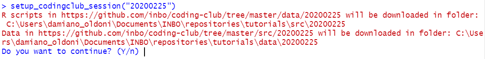

```{r setup, include=FALSE}
knitr::opts_chunk$set(eval = FALSE)
```


Before each coding club you will usually have to download some datasets and some scripts.
This can be done manually from the corresponding GitHub webpages but it is much easier to use the `setup_codingclub_session()` function of the `inborutils` package.

To begin, make sure that you have the latest version of `inborutils` installed by running the following code:

```{r install-inborutils-if-not-present}
if (!"remotes" %in% rownames(installed.packages())) {
  install.packages("remotes")
}
remotes::install_github("inbo/inborutils")
```

Next load the package:

```{r load-package}
library(inborutils)
```

The function takes four arguments with the following default settings:

 - `session_date` which is set to the present day
 - `root_dir` which is set to  the current/project directory `"."`
 - `src_rel_path` which is set to the subdirectory `src`
 - `data_rel_path` which is set to the subdirectory `data`


So when we just run the function like this:

```{r use-default-values}
setup_codingclub_session()
```

We will get the coding club materials for the date of today (if and only if today there is a coding club, otherwise there are no materials and nothing will be downloaded) and these materials will be saved in the `src` and `data` folders of the current working directory or project directory if you work within a RStudio project as recommended in the coding club's [getting started](https://inbo.github.io/coding-club/gettingstarted.html). 
R scripts are downloaded in `src` while datasets are downloaded in `data` using the date of today in the "YYYYMMDD" format as subfolders. Your coding club folder will look like this:

```
├── src
    ├── YYYYMMDD
        └── YYYYMMDD_challenges.r
└── data
    ├── YYYYMMDD
        ├── YYYYYMMDD_filename1.txt
        ├── YYYYYMMDD_filename2.txt   # if more than one dataset is used
        └── ...
```

If you want to get the coding club materials for a past date, use the "YYYYMMDD" format, e.g. for material of August 25, 2020: 

```{r change-date}
setup_codingclub_session("20200225")
```

The subfolders `./src/20200225` and `./data/20200225` are automatically created and files downloaded if not present:

```
├── src
    ├── 20200225
        ├── 20200225_create_messy_project.r
        ├── 20200225_challenges.r
        └── 20200225_challenges_solutions.r
└── data
    ├── 20200225
        └── 20200225_urban_gaia_policy.txt
```

This function is also interactive: before downloading starts a message appears on screen showing the URL of the files to download and the absolute path where R scripts and data will be downloaded, followed by the question: `Do you want to continue? (Y/n)` as shown below:



If everything is ok, enter `Y` (`y` works as well, but it's a kind of a secret...)

If your folders are not named `src` or `data` (although we recommend to name them as such) but for example `scripts` and `data_codingclub` you can specify them as such:

```{r other-subfolders}
setup_codingclub_session("20200225",
                         src_rel_path = "scripts",
                         data_rel_path = "data_codingclub")

```

```
├── scripts
    ├── 20200225
        ├── 20200225_create_messy_project.r
        ├── 20200225_challenges.r
        └── 20200225_challenges_solutions.r
└── data_codingclub
    ├── 20200225
        └── 20200225_urban_gaia_policy.txt
```

To make the function even more flexible, you can modify the root directory although you shouldn't need to while working within an RStudio project.
For example, if you want to move the root to the parent directory:

```{r other-root-dir}
setup_codingclub_session(root_dir = "../")
```

Last but not least, you can always check examples and documentation [online](https://inbo.github.io/inborutils/reference/setup_codingclub_session.html) or via R console:

```{r help}
?setup_codingclub_session
```

Doesn't `setup_codingclub_session` work as expected? 
Do you think there is a bug? 
Or do you have some ideas to improve the function? 
Raise your hand! 
Write an [issue](https://github.com/inbo/inborutils/issues) or contact one of the [INBO coding club organizers](https://inbo.github.io/coding-club/). 
We will be happy to help you.
