This document is a quick and dirty illustration of how spatially
correlated random effect can be fit with INLA. It is based on the
question and the data posted on the R-Sig-mixedmodels mailing list:
<https://stat.ethz.ch/pipermail/r-sig-mixed-models/2016q3/024938.html>.

``` r
library(dplyr)
```

    ## 
    ## Attaching package: 'dplyr'

    ## The following objects are masked from 'package:stats':
    ## 
    ##     filter, lag

    ## The following objects are masked from 'package:base':
    ## 
    ##     intersect, setdiff, setequal, union

``` r
library(tidyr)
library(ggplot2)
```

    ## Warning: package 'ggplot2' was built under R version 4.0.2

``` r
library(scales)
library(INLA)
```

    ## Loading required package: Matrix

    ## 
    ## Attaching package: 'Matrix'

    ## The following objects are masked from 'package:tidyr':
    ## 
    ##     expand, pack, unpack

    ## Loading required package: sp

    ## Loading required package: parallel

    ## Loading required package: foreach

    ## This is INLA_20.03.17 built 2020-05-05 07:15:25 UTC.
    ## See www.r-inla.org/contact-us for how to get help.

``` r
library(rprojroot)
```

# Data import and cleaning

``` r
dataset <- readRDS(find_root_file(
  "content/tutorials/r_spde/",
  "data.Rd", 
  criterion = is_git_root))
summary(dataset)
```

    ##   prec_nov_apr   t_min_nov_apr     srad_nov_apr         age          date    
    ##  Min.   : 47.3   Min.   :0.9167   Min.   : 869.2   Min.   : 1.00   2009:494  
    ##  1st Qu.:118.5   1st Qu.:3.2500   1st Qu.:1232.0   1st Qu.: 9.00   2010:330  
    ##  Median :137.7   Median :3.9917   Median :1386.2   Median :16.00   2011:143  
    ##  Mean   :131.6   Mean   :3.9667   Mean   :1359.5   Mean   :17.73   2012: 97  
    ##  3rd Qu.:146.1   3rd Qu.:4.7833   3rd Qu.:1448.4   3rd Qu.:22.00   NA's:106  
    ##  Max.   :152.2   Max.   :6.9167   Max.   :1769.0   Max.   :48.00             
    ##  evaluation hail         rlat              rlon       
    ##  1:1050     0:929   Min.   :4704304   Min.   :466044  
    ##  2: 120     1:241   1st Qu.:4770128   1st Qu.:507622  
    ##                     Median :4781687   Median :528596  
    ##                     Mean   :4777992   Mean   :532296  
    ##                     3rd Qu.:4789497   3rd Qu.:553595  
    ##                     Max.   :4810808   Max.   :602423

``` r
dataset <- dataset %>%
  filter(!is.na(date)) %>%
  mutate(
    hail = as.integer(hail == "1"),
    rx = rlat * 1e-3,
    ry = rlon * 1e-3,
    srad = srad_nov_apr * 1e-3 - 1,
    prec = prec_nov_apr * 1e-2 - 1,
    temp = t_min_nov_apr - 4
  )
summary(dataset)
```

    ##   prec_nov_apr   t_min_nov_apr     srad_nov_apr         age          date    
    ##  Min.   : 47.3   Min.   :0.9167   Min.   : 869.2   Min.   : 1.00   2009:494  
    ##  1st Qu.:117.2   1st Qu.:3.2333   1st Qu.:1225.2   1st Qu.:10.00   2010:330  
    ##  Median :136.3   Median :3.9833   Median :1388.0   Median :16.00   2011:143  
    ##  Mean   :130.7   Mean   :3.9575   Mean   :1359.4   Mean   :17.68   2012: 97  
    ##  3rd Qu.:145.8   3rd Qu.:4.7833   3rd Qu.:1448.5   3rd Qu.:22.00             
    ##  Max.   :152.2   Max.   :6.9167   Max.   :1769.0   Max.   :48.00             
    ##  evaluation      hail             rlat              rlon              rx      
    ##  1:980      Min.   :0.0000   Min.   :4705059   Min.   :466044   Min.   :4705  
    ##  2: 84      1st Qu.:0.0000   1st Qu.:4769384   1st Qu.:505849   1st Qu.:4769  
    ##             Median :0.0000   Median :4781435   Median :528114   Median :4781  
    ##             Mean   :0.2246   Mean   :4777523   Mean   :531519   Mean   :4778  
    ##             3rd Qu.:0.0000   3rd Qu.:4789367   3rd Qu.:553620   3rd Qu.:4789  
    ##             Max.   :1.0000   Max.   :4810808   Max.   :602403   Max.   :4811  
    ##        ry             srad              prec              temp         
    ##  Min.   :466.0   Min.   :-0.1308   Min.   :-0.5270   Min.   :-3.08333  
    ##  1st Qu.:505.8   1st Qu.: 0.2252   1st Qu.: 0.1725   1st Qu.:-0.76667  
    ##  Median :528.1   Median : 0.3880   Median : 0.3628   Median :-0.01667  
    ##  Mean   :531.5   Mean   : 0.3594   Mean   : 0.3072   Mean   :-0.04245  
    ##  3rd Qu.:553.6   3rd Qu.: 0.4485   3rd Qu.: 0.4583   3rd Qu.: 0.78333  
    ##  Max.   :602.4   Max.   : 0.7690   Max.   : 0.5220   Max.   : 2.91667

# EDA

``` r
ggplot(dataset, aes(x = age)) + geom_histogram(binwidth = 1)
```

<!-- -->

``` r
ggplot(dataset, aes(x = srad)) + geom_density()
```

<!-- -->

``` r
ggplot(dataset, aes(x = temp)) + geom_density()
```

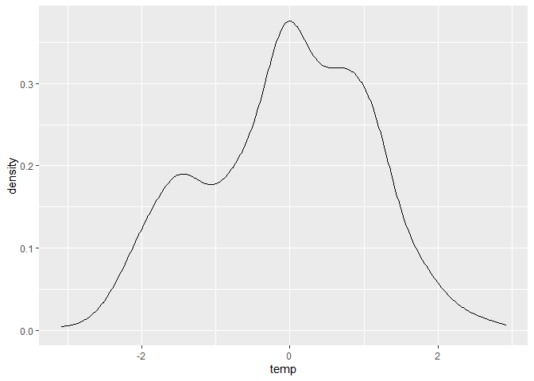<!-- -->

``` r
ggplot(dataset, aes(x = age, y = hail)) +
  geom_point() +
  geom_smooth(
    method = "gam", 
    formula = y ~ s(x, bs = "cs", k = 4),
    method.args = list(family = binomial)
  )
```

<!-- -->

``` r
ggplot(dataset, aes(x = srad, y = hail)) +
  geom_point() +
  geom_smooth(
    method = "gam", 
    formula = y ~ s(x, bs = "cs", k = 4),
    method.args = list(family = binomial)
  )
```

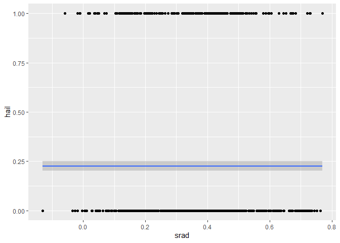<!-- -->

``` r
ggplot(dataset, aes(x = temp, y = hail)) +
  geom_point() +
  geom_smooth(
    method = "gam", 
    formula = y ~ s(x, bs = "cs", k = 4),
    method.args = list(family = binomial)
  )
```

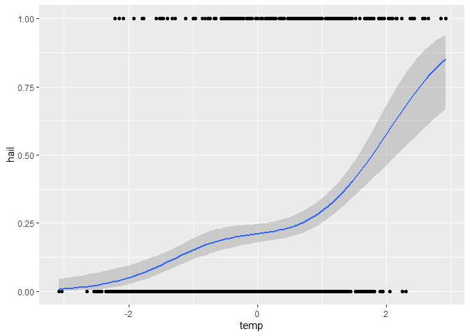<!-- -->

``` r
ggplot(dataset, aes(x = prec, y = hail)) +
  geom_point() +
  geom_smooth(
    method = "gam", 
    formula = y ~ s(x, bs = "cs", k = 4),
    method.args = list(family = binomial)
  )
```

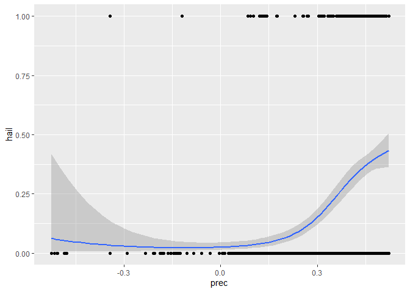<!-- -->

``` r
ggplot(dataset, aes(x = prec, colour = date)) + geom_density()
```

<!-- -->

``` r
ggplot(dataset, aes(x = temp, colour = date)) + geom_density()
```

<!-- -->

``` r
ggplot(dataset, aes(x = rx, y = ry, colour = factor(hail))) +
  geom_point() +
  coord_fixed() +
  facet_wrap(~date)
```

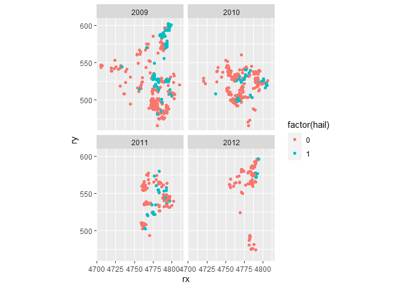<!-- -->

``` r
ggplot(dataset, aes(x = rx, y = ry, colour = temp)) +
  geom_point() +
  coord_fixed() +
  scale_colour_gradientn(colors = rainbow(5)) +
  facet_wrap(~date)
```

<!-- -->

``` r
ggplot(dataset, aes(x = rx, y = ry, colour = prec)) +
  geom_point() +
  coord_fixed() +
  scale_colour_gradientn(colors = rainbow(5)) +
  facet_wrap(~date)
```

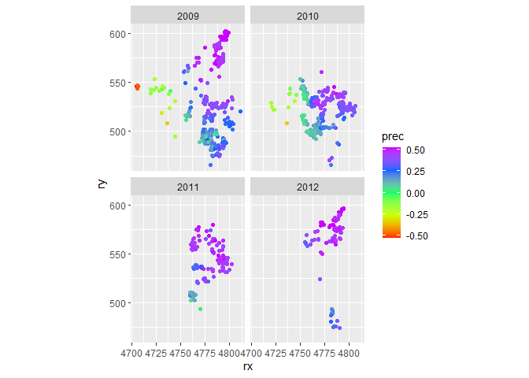<!-- -->

``` r
ggplot(dataset, aes(x = rx, y = ry, colour = srad)) +
  geom_point() +
  coord_fixed() +
  scale_colour_gradientn(colors = rainbow(5)) +
  facet_wrap(~date)
```

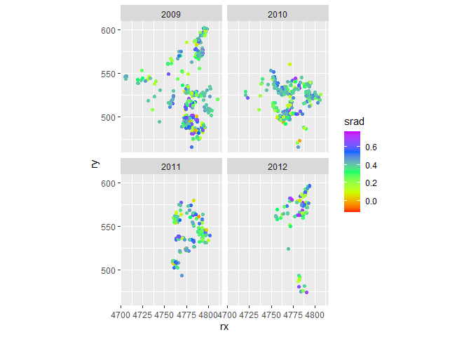<!-- -->

# Model without spatial correlation

``` r
m1 <- inla(
  hail ~ prec + t_min_nov_apr + srad + age + date,
  family = "binomial",
  data = dataset
)
summary(m1)
```

    ## 
    ## Call:
    ##    c("inla(formula = hail ~ prec + t_min_nov_apr + srad + age + date, ", " 
    ##    family = \"binomial\", data = dataset)") 
    ## Time used:
    ##     Pre = 0.959, Running = 0.525, Post = 0.475, Total = 1.96 
    ## Fixed effects:
    ##                 mean    sd 0.025quant 0.5quant 0.975quant   mode kld
    ## (Intercept)   -4.470 0.537     -5.548   -4.461     -3.440 -4.444   0
    ## prec           8.522 0.824      6.951    8.507     10.184  8.476   0
    ## t_min_nov_apr  0.175 0.098     -0.016    0.175      0.369  0.174   0
    ## srad           0.258 0.546     -0.815    0.258      1.330  0.257   0
    ## age            0.000 0.008     -0.016    0.000      0.015  0.000   0
    ## date2010      -1.220 0.228     -1.676   -1.217     -0.780 -1.212   0
    ## date2011      -1.244 0.252     -1.748   -1.241     -0.757 -1.234   0
    ## date2012      -2.975 0.422     -3.863   -2.955     -2.202 -2.914   0
    ## 
    ## Expected number of effective parameters(stdev): 8.00(0.00)
    ## Number of equivalent replicates : 133.01 
    ## 
    ## Marginal log-Likelihood:  -467.48

# Model with spatial random intercept

``` r
coordinates <- dataset %>%
  select(rx, ry) %>%
  as.matrix()

boundary <- inla.nonconvex.hull(coordinates)

mesh <- inla.mesh.2d(
  loc = coordinates, 
  boundary = boundary,
  max.edge = 20,
  cutoff = 5
)
```

``` r
plot(mesh)
points(coordinates, col = "red")
```

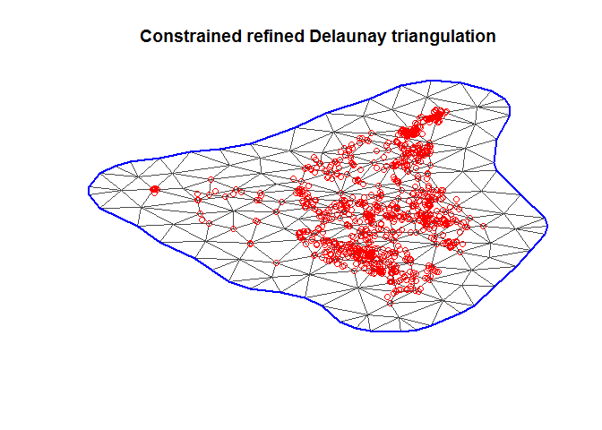<!-- -->

``` r
spde <- inla.spde2.matern(mesh = mesh)
A <- inla.spde.make.A(mesh = mesh, loc = coordinates)
s.index <- inla.spde.make.index(name = "spatial.field", n.spde = spde$n.spde)
stack <- inla.stack(
  data = dataset %>%
    select(hail) %>%
    as.list(),
  A = list(A, 1),
  effects = list(
    c(
      s.index,
      list(intercept = rep(1, spde$n.spde))
    ),
    dataset %>%
      select(temp, prec, srad, age) %>%
      as.list()
  )
)

m2 <- inla(
  hail ~ 0 + intercept + temp + prec + srad + age + 
    f(spatial.field, model = spde),
  data = inla.stack.data(stack),
  family = "binomial",
  control.predictor = list(
    A = inla.stack.A(stack),
    compute = TRUE
  )
)

summary(m2)
```

    ## 
    ## Call:
    ##    c("inla(formula = hail ~ 0 + intercept + temp + prec + srad + age + ", 
    ##    " f(spatial.field, model = spde), family = \"binomial\", data = 
    ##    inla.stack.data(stack), ", " control.predictor = list(A = 
    ##    inla.stack.A(stack), compute = TRUE))" ) 
    ## Time used:
    ##     Pre = 1.55, Running = 28.9, Post = 1.42, Total = 31.9 
    ## Fixed effects:
    ##             mean    sd 0.025quant 0.5quant 0.975quant   mode kld
    ## intercept -2.476 0.847     -4.204   -2.456     -0.862 -2.417   0
    ## temp       1.070 0.238      0.616    1.066      1.551  1.056   0
    ## prec       0.516 1.902     -3.348    0.552      4.166  0.611   0
    ## srad      -1.961 0.836     -3.625   -1.953     -0.340 -1.938   0
    ## age       -0.014 0.011     -0.036   -0.014      0.007 -0.014   0
    ## 
    ## Random effects:
    ##   Name     Model
    ##     spatial.field SPDE2 model
    ## 
    ## Model hyperparameters:
    ##                            mean    sd 0.025quant 0.5quant 0.975quant   mode
    ## Theta1 for spatial.field -2.103 0.559      -3.30   -2.059     -1.119 -1.899
    ## Theta2 for spatial.field -0.745 0.344      -1.36   -0.768     -0.018 -0.853
    ## 
    ## Expected number of effective parameters(stdev): 76.40(3.25)
    ## Number of equivalent replicates : 13.93 
    ## 
    ## Marginal log-Likelihood:  -365.15 
    ## Posterior marginals for the linear predictor and
    ##  the fitted values are computed

## Predict values on a grid

``` r
n.grid <- 50
dx <- diff(pretty(dataset$rx, n.grid)[1:2])
dy <- diff(pretty(dataset$ry, n.grid)[1:2])
delta <- max(dx, dy)
grid <- expand.grid(
  rx = seq(
    floor(min(dataset$rx) / delta) * delta,
    max(dataset$rx) + delta,
    by = delta
  ),
  ry = seq(
    floor(min(dataset$ry) / delta) * delta,
    max(dataset$ry) + delta,
    by = delta
  )
)

A.grid <- inla.spde.make.A(mesh = mesh, loc = as.matrix(grid))
stack.grid <- inla.stack(
  data = list(hail = NA),
  A = list(A.grid),
  effects = list(
    c(
      s.index,
      list(intercept = rep(1, spde$n.spde))
    )
  ),
  tag = "grid"
)

stack.join <- inla.stack(stack, stack.grid)
m3 <- inla(
  hail ~ 0 + intercept + temp + prec + srad + age + f(spatial.field, model = spde),
  data = inla.stack.data(stack.join),
  family = "binomial",
  control.predictor = list(
    A = inla.stack.A(stack.join),
    compute = TRUE
  )
)
summary(m3)
```

    ## 
    ## Call:
    ##    c("inla(formula = hail ~ 0 + intercept + temp + prec + srad + age + ", 
    ##    " f(spatial.field, model = spde), family = \"binomial\", data = 
    ##    inla.stack.data(stack.join), ", " control.predictor = list(A = 
    ##    inla.stack.A(stack.join), compute = TRUE))" ) 
    ## Time used:
    ##     Pre = 1.42, Running = 96.7, Post = 1.5, Total = 99.6 
    ## Fixed effects:
    ##             mean    sd 0.025quant 0.5quant 0.975quant   mode kld
    ## intercept -2.476 0.848     -4.204   -2.456     -0.861 -2.417   0
    ## temp       1.070 0.238      0.616    1.066      1.551  1.056   0
    ## prec       0.516 1.902     -3.349    0.552      4.166  0.611   0
    ## srad      -1.961 0.836     -3.625   -1.953     -0.340 -1.938   0
    ## age       -0.014 0.011     -0.036   -0.014      0.007 -0.014   0
    ## 
    ## Random effects:
    ##   Name     Model
    ##     spatial.field SPDE2 model
    ## 
    ## Model hyperparameters:
    ##                            mean    sd 0.025quant 0.5quant 0.975quant   mode
    ## Theta1 for spatial.field -2.103 0.559      -3.30   -2.059     -1.121 -1.899
    ## Theta2 for spatial.field -0.745 0.344      -1.36   -0.768     -0.018 -0.853
    ## 
    ## Expected number of effective parameters(stdev): 76.40(3.25)
    ## Number of equivalent replicates : 13.93 
    ## 
    ## Marginal log-Likelihood:  -365.15 
    ## Posterior marginals for the linear predictor and
    ##  the fitted values are computed

``` r
grid.index <- inla.stack.index(stack.join, tag = "grid")$data
grid$mean <- m3$summary.fitted.values[grid.index, "mean"]
ggplot(grid, aes(x = rx, y = ry, fill = mean)) + 
  geom_tile() + 
  scale_fill_gradient2() +
  coord_fixed()
```

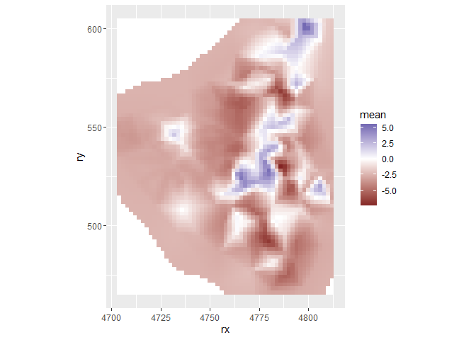<!-- -->

``` r
grid$lcl <- m3$summary.fitted.values[grid.index, "0.025quant"]
ggplot(grid, aes(x = rx, y = ry, fill = lcl)) + 
  geom_tile() + 
  scale_fill_gradient2() +
  coord_fixed()
```

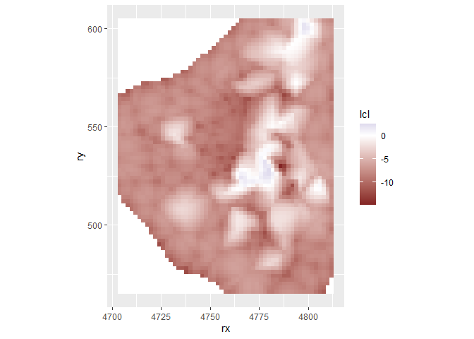<!-- -->

``` r
grid$ucl <- m3$summary.fitted.values[grid.index, "0.975quant"]
ggplot(grid, aes(x = rx, y = ry, fill = ucl)) + 
  geom_tile() + 
  scale_fill_gradient2() +
  coord_fixed()
```

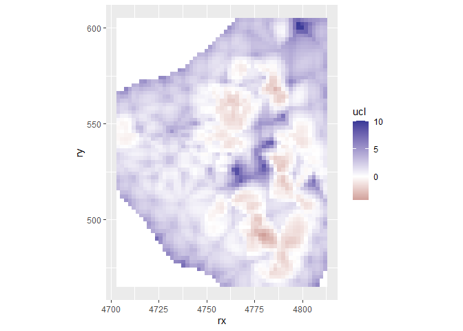<!-- -->

``` r
grid %>%
  gather(key = "type", value = "estimate", mean:ucl) %>%
  mutate(estimate = plogis(estimate)) %>%
  ggplot(aes(x = rx, y = ry, fill = estimate)) +
  geom_tile() +
  scale_fill_gradient2(
    "Probabily of hail\nat reference values", 
    midpoint = 0.5, 
    limits = 0:1, 
    label = percent
  ) +
  coord_fixed() +
  facet_wrap(~type, nrow = 1)
```

<!-- -->
