## Used packages

``` r
library(ggplot2)
```

    ## Warning: package 'ggplot2' was built under R version 4.0.2

``` r
library(scales)
library(pscl)
```

    ## Warning: package 'pscl' was built under R version 4.0.2

    ## Classes and Methods for R developed in the
    ## Political Science Computational Laboratory
    ## Department of Political Science
    ## Stanford University
    ## Simon Jackman
    ## hurdle and zeroinfl functions by Achim Zeileis

``` r
library(MASS)
library(tidyr)
library(dplyr)
```

    ## 
    ## Attaching package: 'dplyr'

    ## The following object is masked from 'package:MASS':
    ## 
    ##     select

    ## The following objects are masked from 'package:stats':
    ## 
    ##     filter, lag

    ## The following objects are masked from 'package:base':
    ## 
    ##     intersect, setdiff, setequal, union

``` r
library(lme4)
```

    ## Loading required package: Matrix

    ## 
    ## Attaching package: 'Matrix'

    ## The following objects are masked from 'package:tidyr':
    ## 
    ##     expand, pack, unpack

# Lots of zero’s doesn’t imply zero-inflation

``` r
set.seed(1234)
n <- 1e4
n.sim <- 1e3
mean.poisson <- 0.05
mean.zeroinfl <- 10000
prop.zeroinfl <- 0.1
```

``` r
dataset <- data.frame(
  Poisson = rpois(n, lambda = mean.poisson)
)
```

``` r
ggplot() +
  geom_linerange(
    data = dataset %>%
      filter(Poisson == 0) %>%
      count(Poisson),
    mapping = aes(
      x = Poisson,
      ymin = 0,
      ymax = n
    )
  ) +
  geom_histogram(
    data = dataset %>%
      filter(Poisson > 0),
    mapping = aes(x = Poisson),
    boundary = 0
  )
```

    ## `stat_bin()` using `bins = 30`. Pick better value with `binwidth`.

<!-- -->

``` r
table(dataset$Poisson)
```

    ## 
    ##    0    1    2 
    ## 9533  462    5

The example above generates values from a Poisson distribution with mean
0.05. Although it has no zero-inflation, 95.3% of the values are zero.

# Zero-inflation can also occur with low number of zero’s

``` r
dataset$ZeroInflatedPoisson <- rbinom(n, size = 1, prob = 1 - prop.zeroinfl) *
  rpois(n, lambda = mean.zeroinfl)
```

``` r
ggplot() +
  geom_linerange(
    data = dataset %>%
      filter(ZeroInflatedPoisson == 0) %>%
      count(ZeroInflatedPoisson),
    mapping = aes(
      x = ZeroInflatedPoisson,
      ymin = 0,
      ymax = n
    )
  ) +
  geom_histogram(
    data = dataset %>%
      filter(ZeroInflatedPoisson > 0),
    mapping = aes(x = ZeroInflatedPoisson),
    boundary = 0
  )
```

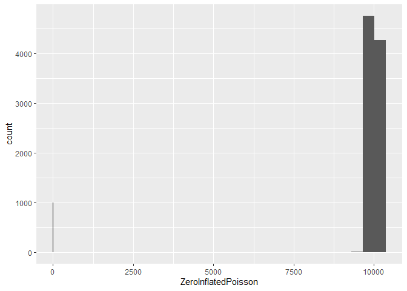<!-- -->

``` r
table(dataset$ZeroInflatedPoisson == 0)
```

    ## 
    ## FALSE  TRUE 
    ##  9007   993

The second example generates a data from a zero-inflated Poisson
distribution with mean 10^{4} and 10, % excess zero’s. The actual
proportion of zero’s is 9.9%.

# How to test for zero-inflation

``` r
dataset <- expand.grid(
  Mean = c(mean.poisson, mean.zeroinfl),
  Rep = seq_len(n)
)
dataset$Poisson <- rpois(nrow(dataset), lambda = dataset$Mean)
dataset$ZeroInflatedPoisson <- rbinom(nrow(dataset), size = 1, prob = 1 - prop.zeroinfl) *
  rpois(nrow(dataset), lambda = dataset$Mean)
```

``` r
ggplot() +
  geom_linerange(
    data = dataset %>%
      filter(Poisson == 0) %>%
      count(Poisson),
    mapping = aes(
      x = Poisson,
      ymin = 0,
      ymax = n
    )
  ) +
  geom_histogram(
    data = dataset %>%
      filter(Poisson > 0),
    mapping = aes(x = Poisson),
    boundary = 0
  )
```

    ## `stat_bin()` using `bins = 30`. Pick better value with `binwidth`.

<!-- -->

``` r
ggplot() +
  geom_linerange(
    data = dataset %>%
      filter(ZeroInflatedPoisson == 0) %>%
      count(ZeroInflatedPoisson),
    mapping = aes(
      x = ZeroInflatedPoisson,
      ymin = 0,
      ymax = n
    )
  ) +
  geom_histogram(
    data = dataset %>%
      filter(ZeroInflatedPoisson > 0),
    mapping = aes(x = ZeroInflatedPoisson),
    boundary = 0
  )
```

    ## `stat_bin()` using `bins = 30`. Pick better value with `binwidth`.

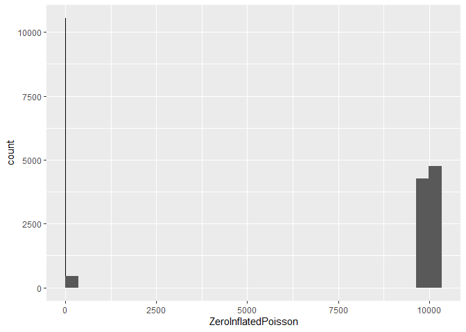<!-- -->

For this example we generate a new dataset with two levels of Mean:
0.05, 10000.00. We generate both a Poisson and a zero-inflated Poisson
variable. The latter has 10, % excess zero’s. The proportion of zero’s
the variables are respectively 47.3% and 52.7%.

Let’s assume that our hypothesis is that all observations share the same
mean. Note that is clearly not the case. If this hypothesis would hold,
then we fit a simple intercept-only model.

``` r
m.pois.simple <- glm(Poisson ~ 1, data = dataset, family = poisson)
m.zero.simple <- glm(ZeroInflatedPoisson ~ 1, data = dataset, family = poisson)
summary(m.pois.simple)
```

    ## 
    ## Call:
    ## glm(formula = Poisson ~ 1, family = poisson, data = dataset)
    ## 
    ## Deviance Residuals: 
    ##     Min       1Q   Median       3Q      Max  
    ## -100.00  -100.00   -20.85    62.15    66.33  
    ## 
    ## Coefficients:
    ##             Estimate Std. Error z value Pr(>|z|)    
    ## (Intercept)   8.5172     0.0001   85172   <2e-16 ***
    ## ---
    ## Signif. codes:  0 '***' 0.001 '**' 0.01 '*' 0.05 '.' 0.1 ' ' 1
    ## 
    ## (Dispersion parameter for poisson family taken to be 1)
    ## 
    ##     Null deviance: 138627905  on 19999  degrees of freedom
    ## Residual deviance: 138627905  on 19999  degrees of freedom
    ## AIC: 138739486
    ## 
    ## Number of Fisher Scoring iterations: 6

``` r
summary(m.zero.simple)
```

    ## 
    ## Call:
    ## glm(formula = ZeroInflatedPoisson ~ 1, family = poisson, data = dataset)
    ## 
    ## Deviance Residuals: 
    ##    Min      1Q  Median      3Q     Max  
    ## -94.96  -94.96  -94.96   70.19   74.27  
    ## 
    ## Coefficients:
    ##              Estimate Std. Error z value Pr(>|z|)    
    ## (Intercept) 8.4137957  0.0001053   79899   <2e-16 ***
    ## ---
    ## Signif. codes:  0 '***' 0.001 '**' 0.01 '*' 0.05 '.' 0.1 ' ' 1
    ## 
    ## (Dispersion parameter for poisson family taken to be 1)
    ## 
    ##     Null deviance: 143653204  on 19999  degrees of freedom
    ## Residual deviance: 143653204  on 19999  degrees of freedom
    ## AIC: 143753725
    ## 
    ## Number of Fisher Scoring iterations: 6

After fitting the model we generate at random a new response variable
based on the models and count the number of zero’s. This is repeated
several times so that we can get a distribion of zero’s based on the
model. Finally we compare the number of zero’s in the original dataset
with this distribution.

``` r
simulated <- data.frame(
  PoissonSimple = apply(
    simulate(m.pois.simple, nsim = n.sim) == 0,
    2,
    mean
  ),
  ZeroInflatedSimple = apply(
    simulate(m.zero.simple, nsim = n.sim) == 0,
    2,
    mean
  )
)
```

``` r
ggplot(simulated, aes(x = PoissonSimple)) +
  geom_histogram(binwidth = 0.01) +
  geom_vline(xintercept = mean(dataset$Poisson == 0), colour = "red") +
  scale_x_continuous(label = percent)
```

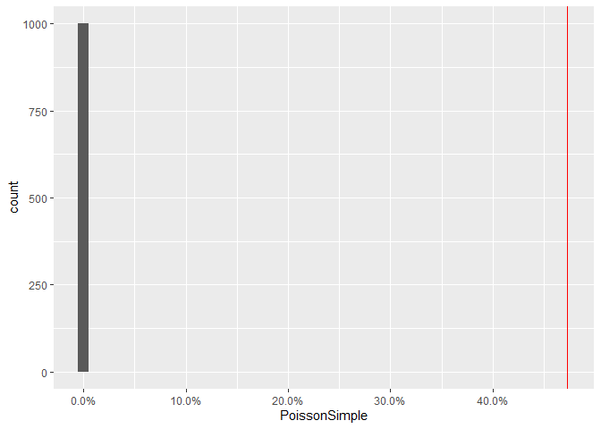<!-- -->

``` r
ggplot(simulated, aes(x = ZeroInflatedSimple)) +
  geom_histogram(binwidth = 0.01) +
  geom_vline(xintercept = mean(dataset$Poisson == 0), colour = "red") +
  scale_x_continuous(label = percent)
```

<!-- -->

In both cases none of the simulated values contains zero’s. The red line
indicates the observed proportion of zero’s with is clearly greater.
This indicates that we have either a poor model fit or zero-inflation.

# Improving the model

In the case of this example we have two groups with very different
means: one group with low mean generating lots of zero’s and one group
with large mean generating no zero’s. Adding this grouping improves the
model.

``` r
m.pois.complex <- glm(Poisson ~ factor(Mean), data = dataset, family = poisson)
m.zero.complex <- glm(ZeroInflatedPoisson ~ factor(Mean), data = dataset, family = poisson)
summary(m.pois.complex)
```

    ## 
    ## Call:
    ## glm(formula = Poisson ~ factor(Mean), family = poisson, data = dataset)
    ## 
    ## Deviance Residuals: 
    ##     Min       1Q   Median       3Q      Max  
    ## -3.6720  -0.3353  -0.3353   0.1405   4.2399  
    ## 
    ## Coefficients:
    ##                   Estimate Std. Error z value Pr(>|z|)    
    ## (Intercept)       -2.87884    0.04218  -68.25   <2e-16 ***
    ## factor(Mean)10000 12.08917    0.04218  286.59   <2e-16 ***
    ## ---
    ## Signif. codes:  0 '***' 0.001 '**' 0.01 '*' 0.05 '.' 0.1 ' ' 1
    ## 
    ## (Dispersion parameter for poisson family taken to be 1)
    ## 
    ##     Null deviance: 138627905  on 19999  degrees of freedom
    ## Residual deviance:     13118  on 19998  degrees of freedom
    ## AIC: 124702
    ## 
    ## Number of Fisher Scoring iterations: 6

``` r
summary(m.zero.complex)
```

    ## 
    ## Call:
    ## glm(formula = ZeroInflatedPoisson ~ factor(Mean), family = poisson, 
    ##     data = dataset)
    ## 
    ## Deviance Residuals: 
    ##      Min        1Q    Median        3Q       Max  
    ## -134.295    -0.301    -0.301    10.023    13.695  
    ## 
    ## Coefficients:
    ##                   Estimate Std. Error z value Pr(>|z|)    
    ## (Intercept)       -3.09224    0.04691  -65.93   <2e-16 ***
    ## factor(Mean)10000 12.19918    0.04691  260.08   <2e-16 ***
    ## ---
    ## Signif. codes:  0 '***' 0.001 '**' 0.01 '*' 0.05 '.' 0.1 ' ' 1
    ## 
    ## (Dispersion parameter for poisson family taken to be 1)
    ## 
    ##     Null deviance: 143653204  on 19999  degrees of freedom
    ## Residual deviance:  18653539  on 19998  degrees of freedom
    ## AIC: 18754062
    ## 
    ## Number of Fisher Scoring iterations: 5

``` r
simulated$PoissonComplex <- apply(
  simulate(m.pois.complex, nsim = n.sim) == 0,
  2,
  mean
)
simulated$ZeroInflatedComplex <- apply(
  simulate(m.zero.complex, nsim = n.sim) == 0,
  2,
  mean
)
```

``` r
ggplot(simulated, aes(x = PoissonComplex)) +
  geom_histogram(binwidth = 0.0005) +
  geom_vline(xintercept = mean(dataset$Poisson == 0), colour = "red") +
  scale_x_continuous(label = percent)
```

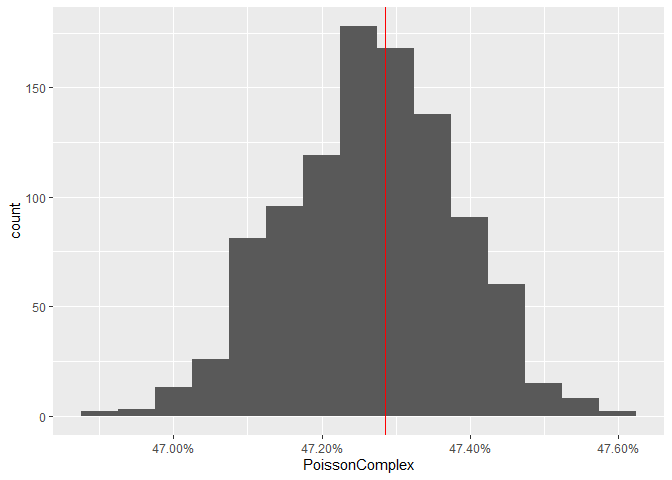<!-- -->

``` r
ggplot(simulated, aes(x = ZeroInflatedComplex)) +
  geom_histogram(binwidth = 0.0005) +
  geom_vline(xintercept = mean(dataset$ZeroInflatedPoisson == 0), colour = "red") +
  scale_x_continuous(label = percent)
```

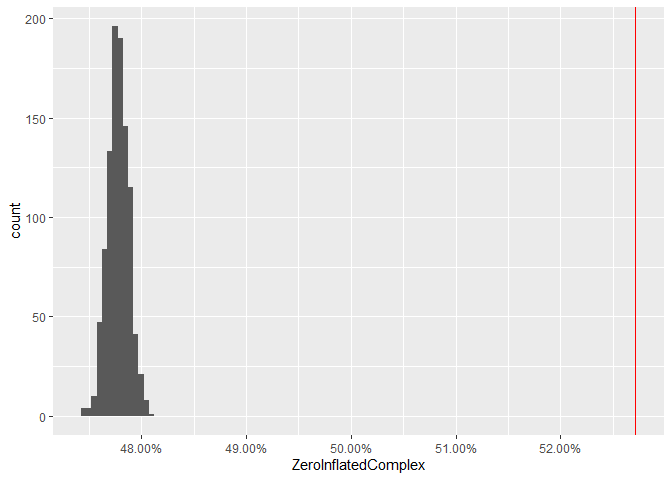<!-- -->

In case of the Poisson variable, 45.1% of the simulated dataset from the
complex model has more zero’s than the observed dataset. So this model
can captures the zero’s and there is not zero-inflation. In case of the
zero-inflated Poisson variable 0.0% of the simulated dataset from the
complex model has more zero’s than the observed dataset. Hence we
conclude that the zero’s are not modelled properly. We can’t improve the
model further with covariates, hence we’ll have to treat is a a
zero-inflated distribution.

``` r
m.zero.zi <- zeroinfl(
  ZeroInflatedPoisson ~ factor(Mean) | 1,
  data = dataset,
  dist = "poisson"
)
summary(m.zero.zi)
```

    ## 
    ## Call:
    ## zeroinfl(formula = ZeroInflatedPoisson ~ factor(Mean) | 1, data = dataset, 
    ##     dist = "poisson")
    ## 
    ## Pearson residuals:
    ##     Min      1Q  Median      3Q     Max 
    ## -3.0282 -0.2126 -0.2126  0.3297  9.1506 
    ## 
    ## Count model coefficients (poisson with log link):
    ##                   Estimate Std. Error z value Pr(>|z|)    
    ## (Intercept)       -2.98879    0.04716  -63.37   <2e-16 ***
    ## factor(Mean)10000 12.19909    0.04716  258.65   <2e-16 ***
    ## 
    ## Zero-inflation model coefficients (binomial with logit link):
    ##             Estimate Std. Error z value Pr(>|z|)    
    ## (Intercept)  -2.2170     0.0336  -65.98   <2e-16 ***
    ## ---
    ## Signif. codes:  0 '***' 0.001 '**' 0.01 '*' 0.05 '.' 0.1 ' ' 1 
    ## 
    ## Number of iterations in BFGS optimization: 13 
    ## Log-likelihood: -5.938e+04 on 3 Df

``` r
sim.zero.zi <- function(model) {
  eta <- predict(model, type = "count")
  prob <- predict(model, type = "zero")
  new.value <-
    rbinom(length(eta), size = 1, prob = 1 - prob) *
      rpois(length(eta), lambda = eta)
  mean(new.value == 0)
}
simulated$ZeroInflatedZI <- replicate(n.sim, sim.zero.zi(m.zero.zi))
ggplot(simulated, aes(x = ZeroInflatedZI)) +
  geom_histogram(binwidth = 0.0005) +
  geom_vline(xintercept = mean(dataset$ZeroInflatedPoisson == 0), colour = "red") +
  scale_x_continuous(label = percent)
```

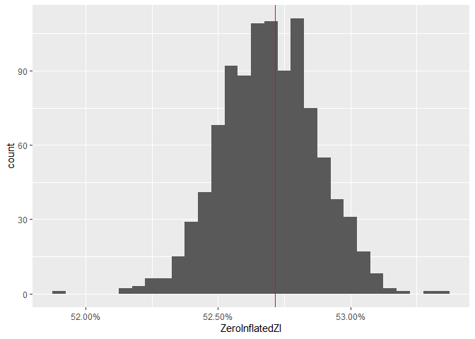<!-- -->

When we fit a proper zero-inflated model to the zero-inflated Poisson
variable, then 45.5% of the simulated datasets have more zero’s than the
observed dataset. So the zero-inflation is properly handled.

# Modelling zero-inflation by overdispersion

``` r
m.zero.nb <- glm.nb(ZeroInflatedPoisson ~ factor(Mean), data = dataset)
summary(m.zero.nb)
```

    ## 
    ## Call:
    ## glm.nb(formula = ZeroInflatedPoisson ~ factor(Mean), data = dataset, 
    ##     init.theta = 0.6535490762, link = log)
    ## 
    ## Deviance Residuals: 
    ##     Min       1Q   Median       3Q      Max  
    ## -3.5298  -0.2963  -0.2963   0.0850   2.8393  
    ## 
    ## Coefficients:
    ##                   Estimate Std. Error z value Pr(>|z|)    
    ## (Intercept)       -3.09224    0.04854  -63.71   <2e-16 ***
    ## factor(Mean)10000 12.19918    0.05009  243.56   <2e-16 ***
    ## ---
    ## Signif. codes:  0 '***' 0.001 '**' 0.01 '*' 0.05 '.' 0.1 ' ' 1
    ## 
    ## (Dispersion parameter for Negative Binomial(0.6535) family taken to be 1)
    ## 
    ##     Null deviance: 130864  on 19999  degrees of freedom
    ## Residual deviance:  14676  on 19998  degrees of freedom
    ## AIC: 204749
    ## 
    ## Number of Fisher Scoring iterations: 1
    ## 
    ## 
    ##               Theta:  0.65355 
    ##           Std. Err.:  0.00868 
    ## 
    ##  2 x log-likelihood:  -204742.76400

``` r
dataset$ID <- seq_along(dataset$Mean)
m.zero.olre <- glmer(
  ZeroInflatedPoisson ~ factor(Mean) + (1 | ID),
  data = dataset,
  family = poisson
)
summary(m.zero.olre)
```

    ## Generalized linear mixed model fit by maximum likelihood (Laplace
    ##   Approximation) [glmerMod]
    ##  Family: poisson  ( log )
    ## Formula: ZeroInflatedPoisson ~ factor(Mean) + (1 | ID)
    ##    Data: dataset
    ## 
    ##       AIC       BIC    logLik  deviance  df.resid 
    ##  218344.4  218368.1 -109169.2  218338.4     19997 
    ## 
    ## Scaled residuals: 
    ##      Min       1Q   Median       3Q      Max 
    ## -0.99401 -0.06651 -0.06651  0.00113  0.81490 
    ## 
    ## Random effects:
    ##  Groups Name        Variance Std.Dev.
    ##  ID     (Intercept) 8.377    2.894   
    ## Number of obs: 20000, groups:  ID, 20000
    ## 
    ## Fixed effects:
    ##                   Estimate Std. Error z value Pr(>|z|)    
    ## (Intercept)       -5.38382    0.06961  -77.34   <2e-16 ***
    ## factor(Mean)10000 13.64883    0.07490  182.23   <2e-16 ***
    ## ---
    ## Signif. codes:  0 '***' 0.001 '**' 0.01 '*' 0.05 '.' 0.1 ' ' 1
    ## 
    ## Correlation of Fixed Effects:
    ##             (Intr)
    ## fct(M)10000 -0.921

``` r
simulated$ZeroInflatedNB <- apply(
  simulate(m.zero.nb, nsim = n.sim) == 0,
  2,
  mean
)
```

``` r
ggplot(simulated, aes(x = ZeroInflatedNB)) +
  geom_histogram(binwidth = 0.0005) +
  geom_vline(xintercept = mean(dataset$ZeroInflatedPoisson == 0), colour = "red") +
  scale_x_continuous(label = percent)
```

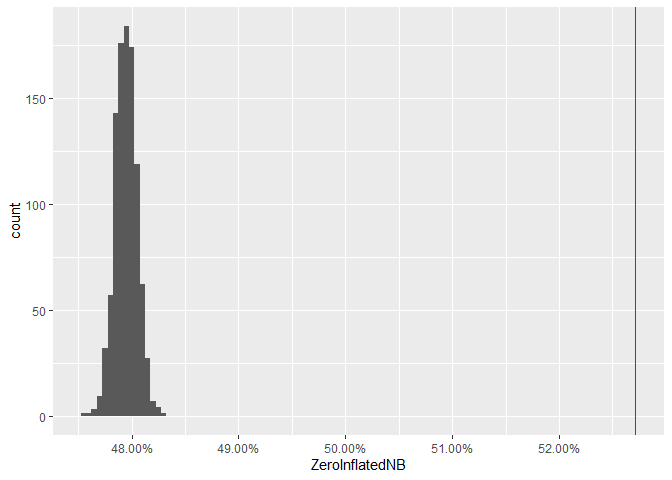<!-- -->

``` r
simulated$ZeroInflatedOLRE <- apply(
  simulate(m.zero.olre, nsim = n.sim) == 0,
  2,
  mean
)
```

``` r
ggplot(simulated, aes(x = ZeroInflatedOLRE)) +
  geom_histogram(binwidth = 0.0005) +
  geom_vline(xintercept = mean(dataset$ZeroInflatedPoisson == 0), colour = "red") +
  scale_x_continuous(label = percent)
```

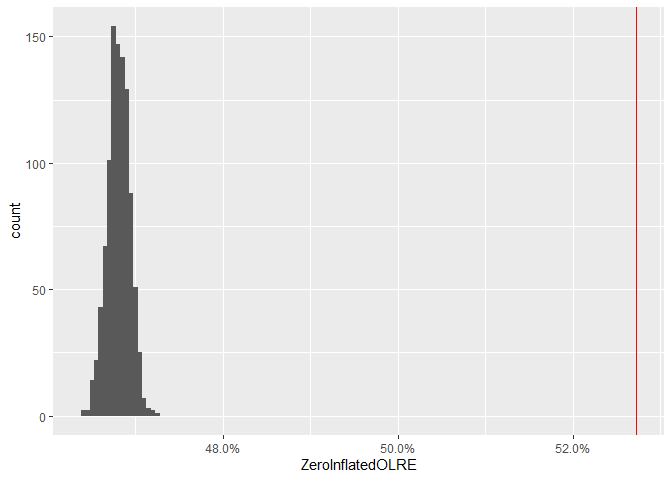<!-- -->

``` r
mean.2 <- 5
dataset2 <- expand.grid(
  Mean = mean.2,
  Rep = seq_len(100)
)
dataset2$ZeroInflatedPoisson <-
  rbinom(nrow(dataset2), size = 1, prob = 1 - prop.zeroinfl) *
    rpois(nrow(dataset2), lambda = dataset2$Mean)
```

``` r
ggplot(dataset2, aes(x = ZeroInflatedPoisson)) +
  geom_histogram(binwidth = 1)
```

<!-- -->

``` r
m.zero2 <- glm(ZeroInflatedPoisson ~ 1, data = dataset2, family = poisson)
summary(m.zero2)
```

    ## 
    ## Call:
    ## glm(formula = ZeroInflatedPoisson ~ 1, family = poisson, data = dataset2)
    ## 
    ## Deviance Residuals: 
    ##     Min       1Q   Median       3Q      Max  
    ## -2.9326  -0.6633  -0.1464   0.7731   2.6952  
    ## 
    ## Coefficients:
    ##             Estimate Std. Error z value Pr(>|z|)    
    ## (Intercept)  1.45862    0.04822   30.25   <2e-16 ***
    ## ---
    ## Signif. codes:  0 '***' 0.001 '**' 0.01 '*' 0.05 '.' 0.1 ' ' 1
    ## 
    ## (Dispersion parameter for poisson family taken to be 1)
    ## 
    ##     Null deviance: 217.63  on 99  degrees of freedom
    ## Residual deviance: 217.63  on 99  degrees of freedom
    ## AIC: 508.69
    ## 
    ## Number of Fisher Scoring iterations: 5

``` r
simulated$ZeroInflated2 <- apply(
  simulate(m.zero2, nsim = n.sim) == 0,
  2,
  mean
)
```

``` r
ggplot(simulated, aes(x = ZeroInflated2)) +
  geom_histogram(binwidth = 0.01) +
  geom_vline(xintercept = mean(dataset2$ZeroInflatedPoisson == 0), colour = "red") +
  scale_x_continuous(label = percent)
```

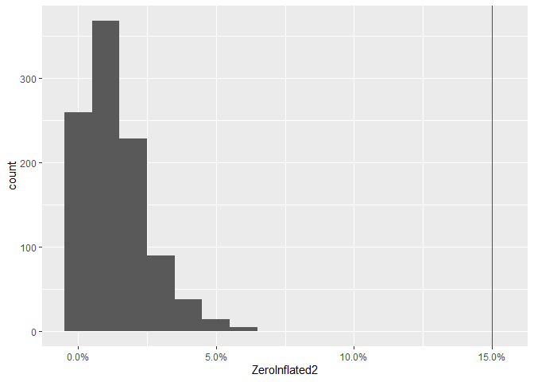<!-- -->

``` r
m.zero.nb2 <- glm.nb(ZeroInflatedPoisson ~ 1, data = dataset2)
summary(m.zero.nb2)
```

    ## 
    ## Call:
    ## glm.nb(formula = ZeroInflatedPoisson ~ 1, data = dataset2, init.theta = 4.249064467, 
    ##     link = log)
    ## 
    ## Deviance Residuals: 
    ##     Min       1Q   Median       3Q      Max  
    ## -2.4375  -0.4811  -0.1038   0.5292   1.7364  
    ## 
    ## Coefficients:
    ##             Estimate Std. Error z value Pr(>|z|)    
    ## (Intercept)   1.4586     0.0684   21.32   <2e-16 ***
    ## ---
    ## Signif. codes:  0 '***' 0.001 '**' 0.01 '*' 0.05 '.' 0.1 ' ' 1
    ## 
    ## (Dispersion parameter for Negative Binomial(4.2491) family taken to be 1)
    ## 
    ##     Null deviance: 130.63  on 99  degrees of freedom
    ## Residual deviance: 130.63  on 99  degrees of freedom
    ## AIC: 489.84
    ## 
    ## Number of Fisher Scoring iterations: 1
    ## 
    ## 
    ##               Theta:  4.25 
    ##           Std. Err.:  1.44 
    ## 
    ##  2 x log-likelihood:  -485.839

``` r
simulated$ZeroInflatedNB2 <- apply(
  simulate(m.zero.nb2, nsim = n.sim) == 0,
  2,
  mean
)
```

``` r
ggplot(simulated, aes(x = ZeroInflatedNB2)) +
  geom_histogram(binwidth = 0.01) +
  geom_vline(xintercept = mean(dataset2$ZeroInflatedPoisson == 0), colour = "red") +
  scale_x_continuous(label = percent)
```

<!-- -->

``` r
dataset2$ID <- seq_along(dataset2$Mean)
m.zero.olre2 <- glmer(
  ZeroInflatedPoisson ~ (1 | ID),
  data = dataset2,
  family = poisson
)
```

``` r
simulated$ZeroInflatedOLRE2 <- apply(
  simulate(m.zero.olre2, nsim = n.sim) == 0,
  2,
  mean
)
```

``` r
ggplot(simulated, aes(x = ZeroInflatedOLRE2)) +
  geom_histogram(binwidth = 0.01) +
  geom_vline(xintercept = mean(dataset2$ZeroInflatedPoisson == 0), colour = "red") +
  scale_x_continuous(label = percent)
```

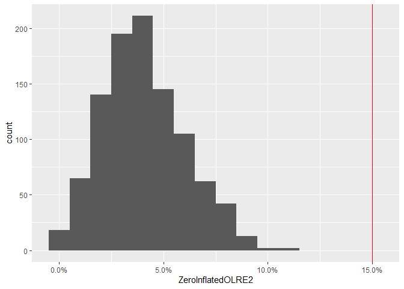<!-- -->

``` r
m.zero.zi2 <- zeroinfl(
  ZeroInflatedPoisson ~ 1,
  data = dataset2,
  dist = "poisson"
)
```

``` r
summary(m.zero.zi2)
```

    ## 
    ## Call:
    ## zeroinfl(formula = ZeroInflatedPoisson ~ 1, data = dataset2, dist = "poisson")
    ## 
    ## Pearson residuals:
    ##     Min      1Q  Median      3Q     Max 
    ## -1.5786 -0.4772 -0.1101  0.6241  2.4596 
    ## 
    ## Count model coefficients (poisson with log link):
    ##             Estimate Std. Error z value Pr(>|z|)    
    ## (Intercept)  1.61454    0.04905   32.92   <2e-16 ***
    ## 
    ## Zero-inflation model coefficients (binomial with logit link):
    ##             Estimate Std. Error z value Pr(>|z|)    
    ## (Intercept)  -1.7794     0.2912  -6.111  9.9e-10 ***
    ## ---
    ## Signif. codes:  0 '***' 0.001 '**' 0.01 '*' 0.05 '.' 0.1 ' ' 1 
    ## 
    ## Number of iterations in BFGS optimization: 5 
    ## Log-likelihood: -225.2 on 2 Df

``` r
simulated$ZeroInflatedZI2 <- replicate(n.sim, sim.zero.zi(m.zero.zi2))
ggplot(simulated, aes(x = ZeroInflatedZI2)) +
  geom_histogram(binwidth = 0.01) +
  geom_vline(xintercept = mean(dataset2$ZeroInflatedPoisson == 0), colour = "red") +
  scale_x_continuous(label = percent)
```

<!-- -->

A negative binomial distribution can capture some of the zero-inflation
by overdispersion. Especially in cases with low mean and few data. When
the mean is low, a reasonable portion of the zero origination comes from
the poisson distribution. However, the shape of the distribution is
different.

``` r
distribution <- data.frame(
  Count = 0:20
)
distribution$Truth <- dpois(
  distribution$Count,
  lambda = mean.2
) + ifelse(
  distribution$Count == 0,
  prop.zeroinfl,
  0
)
distribution$Poisson <- dpois(
  distribution$Count,
  lambda = exp(coef(m.zero2))
)
distribution$ZIPoisson <- dpois(
  distribution$Count,
  lambda = exp(coef(m.zero.zi2)[1])
) + ifelse(
  distribution$Count == 0,
  plogis(coef(m.zero.zi2)[2]),
  0
)

se <- sqrt(VarCorr(m.zero.olre2)$ID)
z <- seq(qnorm(.001, sd = se), qnorm(.999, sd = se), length = 101)
dz <- dnorm(z, sd = se)
dz <- dz / sum(dz)
delta <- outer(
  distribution$Count,
  exp(z + fixef(m.zero.olre2)),
  FUN = dpois
)
distribution$OLRE <- delta %*% dz

distribution$NegBin <- dnbinom(
  distribution$Count,
  size = m.zero.nb2$theta,
  mu = exp(coef(m.zero.nb2))
)
long <- gather(distribution, key = "Model", value = "Density", -Count)
```

    ## Warning: attributes are not identical across measure variables;
    ## they will be dropped

``` r
long$Truth <- long$Model == "Truth"
```

``` r
ggplot(long, aes(x = Count, y = Density, colour = Model, linetype = Truth)) +
  geom_line()
```

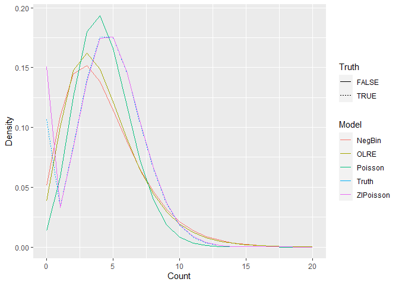<!-- -->
