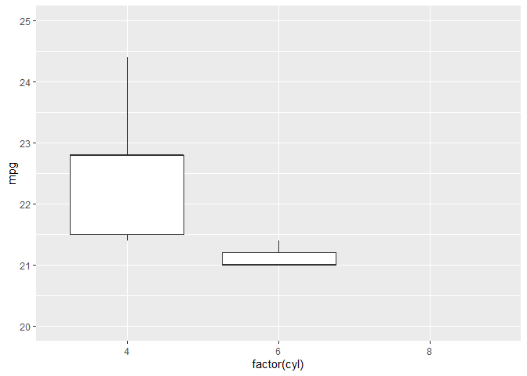
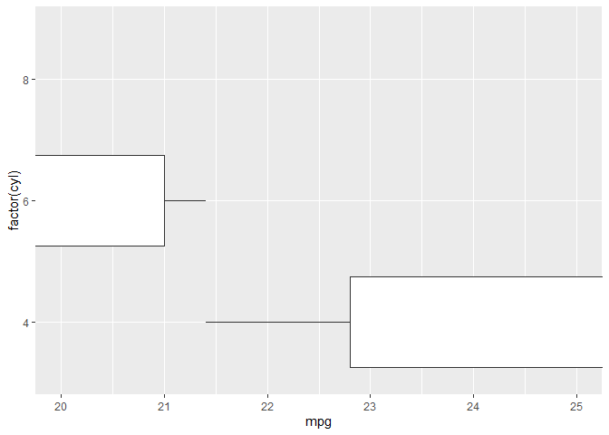

# Original figure

``` r
library(ggplot2)
```

    ## Warning: package 'ggplot2' was built under R version 4.0.2

``` r
ggplot(mtcars, aes(x = factor(cyl), y = mpg)) + 
  geom_boxplot()
```

<!-- -->

# “Zoom in” with scales

Data points outside the limits are considered to be `NA`. Note that this
will alter all calculated geoms.

``` r
ggplot(mtcars, aes(x = factor(cyl), y = mpg)) + 
  geom_boxplot() + 
  scale_y_continuous(limits = c(20, 25))
```

    ## Warning: Removed 24 rows containing non-finite values (stat_boxplot).

<!-- -->

# “Zoom in” with coord

This doesn’t affect the values:

``` r
ggplot(mtcars, aes(x = factor(cyl), y = mpg)) + 
  geom_boxplot() + 
  coord_cartesian(ylim = c(20, 25))
```

<!-- -->

Note that you can use only one `coord`. Only the last one will have an
effect on the plot.

``` r
ggplot(mtcars, aes(x = factor(cyl), y = mpg)) + 
  geom_boxplot() + 
  coord_cartesian(ylim = c(20, 25)) + 
  coord_flip()
```

    ## Coordinate system already present. Adding new coordinate system, which will replace the existing one.

<!-- -->

``` r
ggplot(mtcars, aes(x = factor(cyl), y = mpg)) + 
  geom_boxplot() + 
  coord_flip() + 
  coord_cartesian(ylim = c(20, 25))
```

    ## Coordinate system already present. Adding new coordinate system, which will replace the existing one.

<!-- -->

Set the limits in `coord_flip` to get the effects of both.

``` r
ggplot(mtcars, aes(x = factor(cyl), y = mpg)) + 
  geom_boxplot() + 
  coord_flip(ylim = c(20, 25))
```

<!-- -->
