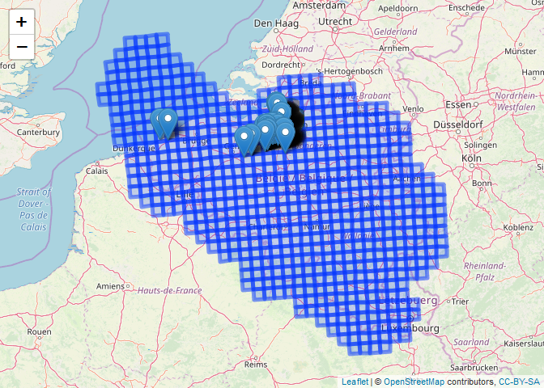

``` r
library(R.utils)
```

    ## Loading required package: R.oo

    ## Loading required package: R.methodsS3

    ## R.methodsS3 v1.7.1 (2016-02-15) successfully loaded. See ?R.methodsS3 for help.

    ## R.oo v1.22.0 (2018-04-21) successfully loaded. See ?R.oo for help.

    ## 
    ## Attaching package: 'R.oo'

    ## The following objects are masked from 'package:methods':
    ## 
    ##     getClasses, getMethods

    ## The following objects are masked from 'package:base':
    ## 
    ##     attach, detach, gc, load, save

    ## R.utils v2.8.0 successfully loaded. See ?R.utils for help.

    ## 
    ## Attaching package: 'R.utils'

    ## The following object is masked from 'package:utils':
    ## 
    ##     timestamp

    ## The following objects are masked from 'package:base':
    ## 
    ##     cat, commandArgs, getOption, inherits, isOpen, parse, warnings

``` r
library(rgdal)
```

    ## Loading required package: sp

    ## rgdal: version: 1.3-6, (SVN revision 773)
    ##  Geospatial Data Abstraction Library extensions to R successfully loaded
    ##  Loaded GDAL runtime: GDAL 2.2.3, released 2017/11/20
    ##  Path to GDAL shared files: C:/R/Library/rgdal/gdal
    ##  GDAL binary built with GEOS: TRUE 
    ##  Loaded PROJ.4 runtime: Rel. 4.9.3, 15 August 2016, [PJ_VERSION: 493]
    ##  Path to PROJ.4 shared files: C:/R/Library/rgdal/proj
    ##  Linking to sp version: 1.3-1

    ## 
    ## Attaching package: 'rgdal'

    ## The following object is masked from 'package:R.oo':
    ## 
    ##     getDescription

``` r
library(tidyverse)
```

    ## Warning: package 'tidyverse' was built under R version 3.5.3

    ## -- Attaching packages ---------------------------------------------------------------------------------- tidyverse 1.2.1 --

    ## v ggplot2 3.1.1     v purrr   0.3.2
    ## v tibble  2.1.1     v dplyr   0.8.1
    ## v tidyr   0.8.2     v stringr 1.4.0
    ## v readr   1.3.1     v forcats 0.4.0

    ## Warning: package 'ggplot2' was built under R version 3.5.3

    ## Warning: package 'tibble' was built under R version 3.5.3

    ## Warning: package 'purrr' was built under R version 3.5.3

    ## Warning: package 'dplyr' was built under R version 3.5.3

    ## -- Conflicts ------------------------------------------------------------------------------------- tidyverse_conflicts() --
    ## x tidyr::extract() masks R.utils::extract()
    ## x dplyr::filter()  masks stats::filter()
    ## x dplyr::lag()     masks stats::lag()

``` r
library(leaflet)
library(sp)
library(sf)
```

    ## Linking to GEOS 3.6.1, GDAL 2.2.3, PROJ 4.9.3

``` r
library(rgbif)
library(DBI)
```

What we want to do
------------------

In this short tutorial, we explore various options to deal with the situation where we have (1) a spatially referenced GIS file with polygons and (2) a spatially referenced set of points that overlaps with the GIS polygons.

Typically, both data sources contain information (apart from the spatial locations) that needs to be related to each other in some way. In this case study, we want to know for each point in which polygon it is located.

Get some data to work with
--------------------------

For the point data, we will work with data on the invasive species - Chinese mitten crab (**Eriocheir sinensis**) in Flanders, Belgium, from the year 2008 (GBIF.org (20th June 2019) GBIF Occurrence Download <https://doi.org/10.15468/dl.decefb>).

We will use to convenience functions from the `rgbif` package to download the data as a zip file and to import the data as a `tibble` in the R environment.

``` r
invasive_species <- occ_download_get("0032582-190415153152247",
                                     path = tempdir(),
                                     overwrite = TRUE) %>% 
  occ_download_import() %>%
  filter(!is.na(decimalLongitude), !is.na(decimalLatitude))
```

    ## Download file size: 0.01 MB

    ## On disk at C:\Users\HANS_V~1\AppData\Local\Temp\RtmpWSn2QS\0032582-190415153152247.zip

We will use the European reference grid system from the European Environmental Agency as an example of a GIS vector layer (each grid cell is a polygon). The Belgium part of the grid system can be downloaded as a sqlite/spatialite database from the EEA website using the following code:

``` r
# explicitly set mode = "wb", otherwise zip file will be corrupt
download.file("https://www.eea.europa.eu/data-and-maps/data/eea-reference-grids-2/gis-files/belgium-spatialite/at_download/file", destfile = paste0(tempdir(), "\\Belgium_spatialite.zip"), mode = "wb")

# this will extract a file Belgium.sqlite to the temporary folder
unzip(zipfile = paste0(tempdir(), "\\Belgium_spatialite.zip"), exdir = tempdir())  
```

Next, we use `rgdal::readOGR` to connect with the sqlite/spatialite database and extract the Belgium 10 km x 10 km grid as a SpatialPolygonsDataFrame. Apart from the 10 km x 10 km grid, the database also contains 1 km x 1 km and 100 km x 100 km grids as raster or vector files.

``` r
be10grid <- readOGR(dsn = paste0(tempdir(), "\\Belgium.sqlite"), 
                  layer = "be_10km")
```

    ## OGR data source with driver: SQLite 
    ## Source: "C:\Users\hans_vancalster\AppData\Local\Temp\RtmpWSn2QS\Belgium.sqlite", layer: "be_10km"
    ## with 580 features
    ## It has 3 fields

Point in polygon with the `sp` package
--------------------------------------

First, we need to convert the data.frame with point locations to a spatial data.frame. We also need to ensure that the coordinate reference system (CRS) for both the point locations and the grid is the same. The data from GBIF are in WGS84 format.

``` r
crs_wgs84 <- CRS("+init=epsg:4326")
coord <- invasive_species %>%
    select(decimalLongitude, decimalLatitude)
invasive_spatial <- SpatialPointsDataFrame(coord,
                                           data = invasive_species,
                                           proj4string = crs_wgs84)
```

We transform the 10 km x 10 km grid to the same CRS system:

``` r
be10grid <- spTransform(be10grid, crs_wgs84)
```

Now we are ready to spatially join (overlay) the SpatialPointsDataFrame wth the 10 km x 10 km grid. This can be done using `sp::over`. The first two arguments of the function give, respectively, the geometry (locations) of the queries, and the layer from which the geometries or attributes are queried. See `?sp::over`. In this case, when x = "SpatialPoints" and y = "SpatialPolygonsDataFrame", it returns a data.frame of the second argument with row entries corresponding to the first argument.

``` r
invasive_be10grid <- over(x = invasive_spatial, y = be10grid)
invasive_species_be10grid <- bind_cols(invasive_species,
                                       invasive_be10grid)
```

To see what the result looks like, we can select the most relevant variables and print it (first ten rows).

``` r
invasive_species_be10grid %>%
  select(species, starts_with("decimal"),
         eventDate, cellcode) %>%
  head(10)
```

    ## # A tibble: 10 x 5
    ##    species       decimalLatitude decimalLongitude eventDate      cellcode  
    ##    <chr>                   <dbl>            <dbl> <chr>          <fct>     
    ##  1 Eriocheir si~            51.1             4.28 2008-09-17T00~ 10kmE392N~
    ##  2 Eriocheir si~            51.1             4.28 2008-06-03T00~ 10kmE392N~
    ##  3 Eriocheir si~            51.0             3.87 2008-03-20T00~ 10kmE389N~
    ##  4 Eriocheir si~            51.0             4.42 2008-07-03T00~ 10kmE393N~
    ##  5 Eriocheir si~            51.1             4.28 2008-09-17T00~ 10kmE392N~
    ##  6 Eriocheir si~            51.1             4.33 2008-04-10T00~ 10kmE392N~
    ##  7 Eriocheir si~            51.2             2.73 2008-03-13T00~ 10kmE381N~
    ##  8 Eriocheir si~            51.1             4.17 2008-03-19T00~ 10kmE391N~
    ##  9 Eriocheir si~            51.1             4.17 2008-03-19T00~ 10kmE391N~
    ## 10 Eriocheir si~            51.0             3.96 2008-10-28T00~ 10kmE389N~

Point in polygon with the `sf` package
--------------------------------------

The same spatial query can be done with the aid of the `sf` package. The package has built-in functions to read spatial data (which also uses GDAL as backbone).

We will project the data to Lambert72, because the join assumes planar coordinates.

``` r
be10grid <- read_sf(paste0(tempdir(), "\\Belgium.sqlite"), 
                    layer = "be_10km")  %>%
  # convert to Lambert72
  st_transform(crs = 31370)
```

Instead of a SpatialPolygonsDataframe, we now get a "sf" object which is also a data.frame and a tbl:

``` r
class(be10grid)
```

    ## [1] "sf"         "tbl_df"     "tbl"        "data.frame"

The spatial information now resides in a GEOMETRY variable:

``` r
be10grid$GEOMETRY
```

    ## Geometry set for 580 features 
    ## geometry type:  POLYGON
    ## dimension:      XY
    ## bbox:           xmin: -22402.56 ymin: -1449.985 xmax: 311353.3 ymax: 305932.2
    ## epsg (SRID):    31370
    ## proj4string:    +proj=lcc +lat_1=51.16666723333333 +lat_2=49.8333339 +lat_0=90 +lon_0=4.367486666666666 +x_0=150000.013 +y_0=5400088.438 +ellps=intl +towgs84=-106.8686,52.2978,-103.7239,0.3366,-0.457,1.8422,-1.2747 +units=m +no_defs
    ## First 5 geometries:

    ## POLYGON ((-20851.02 240718.4, -21626.25 250679....

    ## POLYGON ((-21626.25 250679.5, -22402.56 260640....

    ## POLYGON ((-7781.475 201650, -8552.253 211611, 1...

    ## POLYGON ((-8552.253 211611, -9324.075 221572.1,...

    ## POLYGON ((-9324.075 221572.1, -10096.95 231533....

Similarly, the package has built-in functions to convert a data.frame containing coordinates to a spatial data.frame:

``` r
invasive_spatial <- st_as_sf(invasive_species,
                             coords = c("decimalLongitude",
                                        "decimalLatitude"),
                             crs = 4326) %>%
  # convert to Lambert72
  st_transform(crs = 31370)
```

Now we are ready to make the spatial overlay. This is done with the aid of `sf::st_join`. We set the join type to `st_within` and join the information from the grid to the points through a left join. See [the DE-9IM topological model](https://en.wikipedia.org/wiki/DE-9IM) for explanations about all possible spatial joins.

``` r
invasive_be10grid <- invasive_spatial %>%
  st_join(be10grid,
          join = st_within, 
          left = TRUE) %>%
  select(-eoforigin, -noforigin)  # exclude the EofOrigin NofOrigin columns
```

What have we done?
------------------

To rap this up, we make a map that shows what we have done. We will use the results obtained with the `sf` package.

First, we need to transform back to WGS84 (the background maps in leaflet are in WGS84).

``` r
invasive_be10grid <- invasive_be10grid %>%
  st_transform(crs = 4326)
be10grid <- be10grid %>%
  st_transform(crs = 4326)
```

Zooming in on the point markers and hovering over a marker will show the reference grid identifier for the grid cell as it is joined to spatial points object `invasive_be10grid`. Clicking in a grid cell will bring up a popup showing the reference grid identifier for the grid cell as it is named in `be10grid`.

``` r
leaflet(be10grid) %>%
  addTiles() %>%
  addPolygons(popup = ~cellcode) %>%
  addMarkers(data = invasive_be10grid,
             label = ~cellcode)
```


