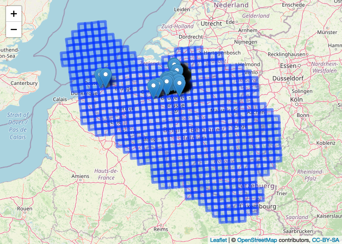

``` r
library(R.utils)
library(rgdal)
library(tidyverse)
library(leaflet)
library(sp)
library(sf)
library(rgbif)
library(DBI)
```

## What we want to do

In this short tutorial, we explore various options to deal with the
situation where we have (1) a spatially referenced GIS file with
polygons and (2) a spatially referenced set of points that overlaps with
the GIS polygons.

Typically, both data sources contain information (apart from the spatial
locations) that needs to be related to each other in some way. In this
case study, we want to know for each point in which polygon it is
located.

## Get some data to work with

For the point data, we will work with data on the invasive species -
Chinese mitten crab (**Eriocheir sinensis**) in Flanders, Belgium, from
the year 2008 (GBIF.org (20th June 2019) GBIF Occurrence Download
<https://doi.org/10.15468/dl.decefb>).

We will use convenience functions from the `rgbif` package to download
the data as a zip file and to import the data as a `tibble` in the R
environment.

``` r
invasive_species <- occ_download_get("0032582-190415153152247",
                                     path = tempdir(),
                                     overwrite = TRUE) %>% 
  occ_download_import() %>%
  filter(!is.na(decimalLongitude), !is.na(decimalLatitude))
```

    ## Download file size: 0.01 MB

    ## On disk at /var/folders/c2/7_7qg3r93993m4kk3kjqgj2n76h_tn/T//RtmpYC9cBo/0032582-190415153152247.zip

We will use the European reference grid system from the European
Environmental Agency as an example of a GIS vector layer (each grid cell
is a polygon). The Belgian part of the grid system can be downloaded as
a sqlite/spatialite database from the EEA website using the following
code:

``` r
# explicitly set mode = "wb", otherwise zip file will be corrupt
download.file("https://www.eea.europa.eu/data-and-maps/data/eea-reference-grids-2/gis-files/belgium-spatialite/at_download/file", destfile = file.path(tempdir(), "Belgium_spatialite.zip"), mode = "wb")

# this will extract a file Belgium.sqlite to the temporary folder
unzip(zipfile = file.path(tempdir(), "Belgium_spatialite.zip"), exdir = tempdir())  
```

## Point in polygon with the `sf` package

The spatial query can be done with the aid of the [`sf`
package](https://r-spatial.github.io/sf/). The package has built-in
functions to read spatial data (which uses GDAL as backbone).

We will project the data to Belgian Lambert 72
(<https://epsg.io/31370>), because the join assumes planar coordinates.

``` r
be10grid <- read_sf(file.path(tempdir(), "Belgium.sqlite"), 
                    layer = "be_10km")  %>%
  # convert to Belgian Lambert 72
  st_transform(crs = 31370)
```

We now get a `sf` object which is also a `data.frame` and a `tbl`:

``` r
class(be10grid)
```

    ## [1] "sf"         "tbl_df"     "tbl"        "data.frame"

Let’s have a look at this object:

``` r
be10grid
```

    ## Simple feature collection with 580 features and 3 fields
    ## Geometry type: POLYGON
    ## Dimension:     XY
    ## Bounding box:  xmin: -22402.56 ymin: -1449.985 xmax: 311353.3 ymax: 305932.2
    ## Projected CRS: Belge 1972 / Belgian Lambert 72
    ## # A tibble: 580 × 4
    ##    cellcode     eoforigin noforigin                                     GEOMETRY
    ##  * <chr>            <dbl>     <dbl>                                <POLYGON [m]>
    ##  1 10kmE376N318   3760000   3180000 ((-20851.02 240718.4, -21626.25 250679.5, -…
    ##  2 10kmE376N319   3760000   3190000 ((-21626.25 250679.5, -22402.56 260640.9, -…
    ##  3 10kmE377N314   3770000   3140000 ((-7781.475 201650, -8552.253 211611, 1426.…
    ##  4 10kmE377N315   3770000   3150000 ((-8552.253 211611, -9324.075 221572.1, 655…
    ##  5 10kmE377N316   3770000   3160000 ((-9324.075 221572.1, -10096.95 231533.3, -…
    ##  6 10kmE377N317   3770000   3170000 ((-10096.95 231533.3, -10870.87 241494.6, -…
    ##  7 10kmE377N318   3770000   3180000 ((-10870.87 241494.6, -11645.85 251456.1, -…
    ##  8 10kmE377N319   3770000   3190000 ((-11645.85 251456.1, -12421.9 261417.9, -2…
    ##  9 10kmE377N320   3770000   3200000 ((-12421.9 261417.9, -13199.02 271379.8, -3…
    ## 10 10kmE377N321   3770000   3210000 ((-13199.02 271379.8, -13977.21 281342.1, -…
    ## # … with 570 more rows

We can see that the spatial information resides in a `GEOMETRY` list
column.

Similarly, the package has built-in functions to convert a `data.frame`
containing coordinates to a spatial `sf` object:

``` r
invasive_spatial <- st_as_sf(invasive_species,
                             coords = c("decimalLongitude",
                                        "decimalLatitude"),
                             crs = 4326) %>%
  # convert to Lambert72
  st_transform(crs = 31370)
```

Resulting in:

``` r
invasive_spatial
```

    ## Simple feature collection with 513 features and 43 fields
    ## Geometry type: POINT
    ## Dimension:     XY
    ## Bounding box:  xmin: 35125.7 ymin: 188235.3 xmax: 153743.2 ymax: 220135
    ## Projected CRS: Belge 1972 / Belgian Lambert 72
    ## # A tibble: 513 × 44
    ##        gbifID datasetKey   occurrenceID  kingdom phylum class order family genus
    ##  *      <int> <chr>        <chr>         <chr>   <chr>  <chr> <chr> <chr>  <chr>
    ##  1 1146738051 258c9ce5-1b… INBO:VIS:007… Animal… Arthr… Mala… Deca… Pseud… Erio…
    ##  2 1146738044 258c9ce5-1b… INBO:VIS:007… Animal… Arthr… Mala… Deca… Pseud… Erio…
    ##  3 1146738029 258c9ce5-1b… INBO:VIS:007… Animal… Arthr… Mala… Deca… Pseud… Erio…
    ##  4 1146738026 258c9ce5-1b… INBO:VIS:007… Animal… Arthr… Mala… Deca… Pseud… Erio…
    ##  5 1146737979 258c9ce5-1b… INBO:VIS:007… Animal… Arthr… Mala… Deca… Pseud… Erio…
    ##  6 1146737949 258c9ce5-1b… INBO:VIS:007… Animal… Arthr… Mala… Deca… Pseud… Erio…
    ##  7 1146737902 258c9ce5-1b… INBO:VIS:007… Animal… Arthr… Mala… Deca… Pseud… Erio…
    ##  8 1146737751 258c9ce5-1b… INBO:VIS:007… Animal… Arthr… Mala… Deca… Pseud… Erio…
    ##  9 1146737736 258c9ce5-1b… INBO:VIS:007… Animal… Arthr… Mala… Deca… Pseud… Erio…
    ## 10 1146737717 258c9ce5-1b… INBO:VIS:007… Animal… Arthr… Mala… Deca… Pseud… Erio…
    ## # … with 503 more rows, and 35 more variables: species <chr>,
    ## #   infraspecificEpithet <lgl>, taxonRank <chr>, scientificName <chr>,
    ## #   countryCode <chr>, locality <lgl>, publishingOrgKey <chr>,
    ## #   coordinateUncertaintyInMeters <dbl>, coordinatePrecision <lgl>,
    ## #   elevation <lgl>, elevationAccuracy <lgl>, depth <lgl>, depthAccuracy <lgl>,
    ## #   eventDate <dttm>, day <int>, month <int>, year <int>, taxonKey <int>,
    ## #   speciesKey <int>, basisOfRecord <chr>, institutionCode <chr>, …

Now we are ready to make the spatial overlay. This is done with the aid
of `sf::st_join`. The default join type is `st_intersects`. This will
result in the same spatial overlay as `sp::over` (see next section). We
join the information from the grid to the points through a left join.
See [the DE-9IM topological model](https://en.wikipedia.org/wiki/DE-9IM)
for explanations about all possible spatial joins.

Note that with `st_intersects` points on a polygon boundary and points
corresponding to a polygon vertex are considered to be inside the
polygon. In the case where points are joined with polygons,
`st_intersects` and `st_covered_by` will give the same result. The join
type `st_within` can be used if we want to join only when points are
completely within (excluding polygon boundary).

``` r
invasive_be10grid_sf <- invasive_spatial %>%
  st_join(be10grid,
          join = st_intersects, 
          left = TRUE) %>%
  select(-eoforigin, -noforigin)  # exclude the EofOrigin NofOrigin columns
```

Looking at selected columns of the resulting object:

``` r
invasive_be10grid_sf %>%
  select(species, eventDate, cellcode, geometry)
```

    ## Simple feature collection with 513 features and 3 fields
    ## Geometry type: POINT
    ## Dimension:     XY
    ## Bounding box:  xmin: 35125.7 ymin: 188235.3 xmax: 153743.2 ymax: 220135
    ## Projected CRS: Belge 1972 / Belgian Lambert 72
    ## # A tibble: 513 × 4
    ##    species            eventDate           cellcode                geometry
    ##    <chr>              <dttm>              <chr>                <POINT [m]>
    ##  1 Eriocheir sinensis 2008-09-17 00:00:00 10kmE392N312 (143788.9 201487.1)
    ##  2 Eriocheir sinensis 2008-06-03 00:00:00 10kmE392N312 (143788.9 201487.1)
    ##  3 Eriocheir sinensis 2008-03-20 00:00:00 10kmE389N311 (114822.9 188235.3)
    ##  4 Eriocheir sinensis 2008-07-03 00:00:00 10kmE393N311 (153743.2 191634.8)
    ##  5 Eriocheir sinensis 2008-09-17 00:00:00 10kmE392N312 (143788.9 201487.1)
    ##  6 Eriocheir sinensis 2008-04-10 00:00:00 10kmE392N312 (147138.3 199035.5)
    ##  7 Eriocheir sinensis 2008-03-13 00:00:00 10kmE381N314  (35125.7 205808.5)
    ##  8 Eriocheir sinensis 2008-03-19 00:00:00 10kmE391N312 (136197.7 197300.8)
    ##  9 Eriocheir sinensis 2008-03-19 00:00:00 10kmE391N312 (136197.7 197300.8)
    ## 10 Eriocheir sinensis 2008-10-28 00:00:00 10kmE389N311 (121593.8 190203.2)
    ## # … with 503 more rows

## Point in polygon with the `sp` package

*General note: migration to the more actively developed `sf` package is
currently advised by the `sp` maintainer.* *The `sp` package is still
maintained in order to support the newest versions of the GDAL and PROJ
backends.*

Instead of `sf` objects (= `data.frames` or `tibbles` with a geometry
list-column), the `sp` package works with `Spatial` spatial data classes
(which has many derived spatial data classes for points, polygons, …).

First, we need to convert the `data.frame` with point locations to a
`SpatialPointsDataFrame`. We also need to ensure that the coordinate
reference system (CRS) for both the point locations and the grid is the
same. The data from GBIF are in WGS84 format.

``` r
crs_wgs84 <- CRS(SRS_string = "EPSG:4326")
coord <- invasive_species %>%
    select(decimalLongitude, decimalLatitude)
invasive_spatial <- SpatialPointsDataFrame(coord,
                                           data = invasive_species,
                                           proj4string = crs_wgs84)
```

The `sp` package has no native methods to read the Belgium 10 km x 10 km
grid, but we can use `rgdal::readOGR` to connect with the
sqlite/spatialite database and extract the Belgium 10 km x 10 km grid as
a `SpatialPolygonsDataFrame`. Apart from the 10 km x 10 km grid, the
database also contains 1 km x 1 km and 100 km x 100 km grids as raster
or vector files.

``` r
be10grid <- readOGR(dsn = file.path(tempdir(), "Belgium.sqlite"), 
                  layer = "be_10km")
```

    ## Warning in OGRSpatialRef(dsn, layer, morphFromESRI = morphFromESRI, dumpSRS
    ## = dumpSRS, : Discarded datum European_Terrestrial_Reference_System_1989 in
    ## Proj4 definition: +proj=laea +lat_0=52 +lon_0=10 +x_0=4321000 +y_0=3210000
    ## +ellps=GRS80 +units=m +no_defs

    ## OGR data source with driver: SQLite 
    ## Source: "/private/var/folders/c2/7_7qg3r93993m4kk3kjqgj2n76h_tn/T/RtmpYC9cBo/Belgium.sqlite", layer: "be_10km"
    ## with 580 features
    ## It has 3 fields

Note the warning: it is because some PROJ.4 information, i.e. the string
to represent the coordinate reference system, is not supported anymore
in the current geospatial GDAL and PROJ libraries (the background
workhorses for spatial R packages). The spatialite database from the EEA
website (with the 10 km x 10 km grid) still uses the older PROJ.4 string
. Because the `rgdal` package is still backwards compatible, we should
not (yet) worry about this: `rgdal` does the translation for the newer
GDAL 3 and PROJ &gt;= 6. Do know that, instead of *PROJ.4* strings, the
*WKT2* string is now used in R to better represent coordinate reference
systems (so it would best be incorporated in the EEA data source). Just
compare these:

``` r
# PROJ.4 string = old; used by PROJ 4
proj4string(be10grid)  # or: be10grid@proj4string
```

    ## Warning in proj4string(be10grid): CRS object has comment, which is lost in
    ## output

    ## [1] "+proj=laea +lat_0=52 +lon_0=10 +x_0=4321000 +y_0=3210000 +ellps=GRS80 +units=m +no_defs"

``` r
# WKT2 string = new and much better; used by PROJ >= 6
wkt(be10grid) %>% cat  # or: be10grid@proj4string %>% comment %>% cat
```

    ## PROJCRS["ETRS89-extended / LAEA Europe",
    ##     BASEGEOGCRS["ETRS89",
    ##         DATUM["European Terrestrial Reference System 1989",
    ##             ELLIPSOID["GRS 1980",6378137,298.257222101,
    ##                 LENGTHUNIT["metre",1]]],
    ##         PRIMEM["Greenwich",0,
    ##             ANGLEUNIT["degree",0.0174532925199433]],
    ##         ID["EPSG",4258]],
    ##     CONVERSION["Europe Equal Area 2001",
    ##         METHOD["Lambert Azimuthal Equal Area",
    ##             ID["EPSG",9820]],
    ##         PARAMETER["Latitude of natural origin",52,
    ##             ANGLEUNIT["degree",0.0174532925199433],
    ##             ID["EPSG",8801]],
    ##         PARAMETER["Longitude of natural origin",10,
    ##             ANGLEUNIT["degree",0.0174532925199433],
    ##             ID["EPSG",8802]],
    ##         PARAMETER["False easting",4321000,
    ##             LENGTHUNIT["metre",1],
    ##             ID["EPSG",8806]],
    ##         PARAMETER["False northing",3210000,
    ##             LENGTHUNIT["metre",1],
    ##             ID["EPSG",8807]]],
    ##     CS[Cartesian,2],
    ##         AXIS["northing (Y)",north,
    ##             ORDER[1],
    ##             LENGTHUNIT["metre",1]],
    ##         AXIS["easting (X)",east,
    ##             ORDER[2],
    ##             LENGTHUNIT["metre",1]],
    ##     USAGE[
    ##         SCOPE["Statistical analysis."],
    ##         AREA["Europe - European Union (EU) countries and candidates. Europe - onshore and offshore: Albania; Andorra; Austria; Belgium; Bosnia and Herzegovina; Bulgaria; Croatia; Cyprus; Czechia; Denmark; Estonia; Faroe Islands; Finland; France; Germany; Gibraltar; Greece; Hungary; Iceland; Ireland; Italy; Kosovo; Latvia; Liechtenstein; Lithuania; Luxembourg; Malta; Monaco; Montenegro; Netherlands; North Macedonia; Norway including Svalbard and Jan Mayen; Poland; Portugal including Madeira and Azores; Romania; San Marino; Serbia; Slovakia; Slovenia; Spain including Canary Islands; Sweden; Switzerland; Turkey; United Kingdom (UK) including Channel Islands and Isle of Man; Vatican City State."],
    ##         BBOX[24.6,-35.58,84.17,44.83]],
    ##     ID["EPSG",3035]]

We transform the 10 km x 10 km grid to the same CRS system:

``` r
be10grid <- spTransform(be10grid, crs_wgs84)
```

Now we are ready to spatially join (overlay) the
`SpatialPointsDataFrame` wth the 10 km x 10 km grid. This can be done
using `sp::over`. The first two arguments of the function give,
respectively, the geometry (locations) of the queries, and the layer
from which the geometries or attributes are queried. See `?sp::over`. In
this case, when x = “SpatialPoints” and y = “SpatialPolygonsDataFrame”,
it returns a `data.frame` of the second argument with row entries
corresponding to the first argument.

``` r
invasive_be10grid <- over(x = invasive_spatial, y = be10grid)
invasive_species_be10grid <- bind_cols(invasive_species,
                                       invasive_be10grid)
```

To see what the result looks like, we can select the most relevant
variables and print it (first ten rows).

``` r
invasive_species_be10grid %>%
  select(species, starts_with("decimal"),
         eventDate, cellcode) %>%
  head(10)
```

    ## # A tibble: 10 × 5
    ##    species       decimalLatitude decimalLongitude eventDate           cellcode  
    ##    <chr>                   <dbl>            <dbl> <dttm>              <chr>     
    ##  1 Eriocheir si…            51.1             4.28 2008-09-17 00:00:00 10kmE392N…
    ##  2 Eriocheir si…            51.1             4.28 2008-06-03 00:00:00 10kmE392N…
    ##  3 Eriocheir si…            51.0             3.87 2008-03-20 00:00:00 10kmE389N…
    ##  4 Eriocheir si…            51.0             4.42 2008-07-03 00:00:00 10kmE393N…
    ##  5 Eriocheir si…            51.1             4.28 2008-09-17 00:00:00 10kmE392N…
    ##  6 Eriocheir si…            51.1             4.33 2008-04-10 00:00:00 10kmE392N…
    ##  7 Eriocheir si…            51.2             2.73 2008-03-13 00:00:00 10kmE381N…
    ##  8 Eriocheir si…            51.1             4.17 2008-03-19 00:00:00 10kmE391N…
    ##  9 Eriocheir si…            51.1             4.17 2008-03-19 00:00:00 10kmE391N…
    ## 10 Eriocheir si…            51.0             3.96 2008-10-28 00:00:00 10kmE389N…

## What have we done?

To wrap this up, we make a map that shows what we have done. We will use
the results obtained with the `sf` package.

First, we need to transform `invasive_be10grid_sf` back to WGS84 (the
background maps in leaflet are in WGS84) (`be10grid` is already in WGS84
format).

``` r
invasive_be10grid_sf <- invasive_be10grid_sf %>%
  st_transform(crs = 4326)
```

Zooming in on the point markers and hovering over a marker will show the
reference grid identifier for the grid cell as it is joined to spatial
points object `invasive_be10grid`. Clicking in a grid cell will bring up
a popup showing the reference grid identifier for the grid cell as it is
named in `be10grid`.

``` r
leaflet(be10grid) %>%
  addTiles() %>%
  addPolygons(popup = ~cellcode) %>%
  addMarkers(data = invasive_be10grid_sf,
             label = ~cellcode)
```

<!-- -->

*Note: run the code to see the interactive map.*
