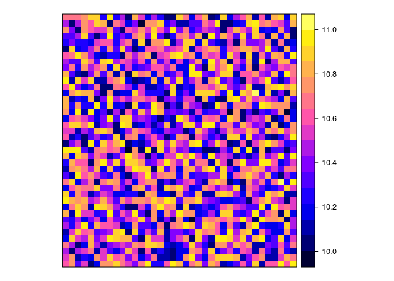
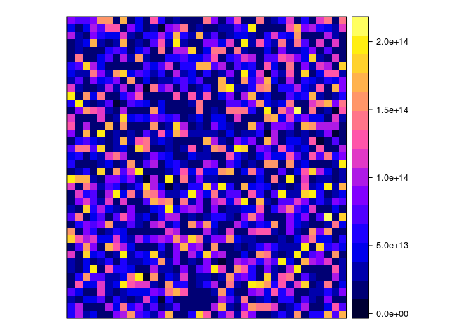

This tutorial uses a few basic functions from the
[dplyr](https://dplyr.tidyverse.org) and
[raster](https://rspatial.org/raster/pkg) packages. While only a few
functions are used, you can use the previous hyperlinks to access the
tutorials (vignettes) of these packages for more functions and
information.

``` r
options(stringsAsFactors = FALSE)
library(raster)
library(tidyverse)
library(inborutils)
```

You find bit more background about ‘why and what’, regarding the open
GeoTIFF standard, in [a separate
post](../../articles/geospatial_standards/) on this website.

In short, the GeoTIFF format is ideal for exchange, publication,
interoperability & durability and to open science in general.

## How to make and use GeoTIFF files (`*.tif`)

### Making a mono-layered GeoTIFF file from a `RasterLayer` R object

Let’s create a small dummy `RasterLayer` object from scratch, for some
area in Belgium (using the CRS \[1\] Belgian Lambert 72, i.e.
[EPSG-code 31370](https://epsg.io/31370)):

``` r
artwork <- 
  raster(extent(188500, 190350, 227550, 229550), # xmin, xmax, ymin, ymax
         res = 50, # resolution of 50 meters
         crs = CRS("+init=epsg:31370")) %>% 
  setValues(runif(ncell(.)))  # fill with random values
```

What does this look like?

``` r
artwork
```

    ## class      : RasterLayer 
    ## dimensions : 40, 37, 1480  (nrow, ncol, ncell)
    ## resolution : 50, 50  (x, y)
    ## extent     : 188500, 190350, 227550, 229550  (xmin, xmax, ymin, ymax)
    ## crs        : +init=epsg:31370 +proj=lcc +lat_1=51.16666723333333 +lat_2=49.8333339 +lat_0=90 +lon_0=4.367486666666666 +x_0=150000.013 +y_0=5400088.438 +ellps=intl +towgs84=-106.8686,52.2978,-103.7239,0.3366,-0.457,1.8422,-1.2747 +units=m +no_defs 
    ## source     : memory
    ## names      : layer 
    ## values     : 0.0001557397, 0.9997439  (min, max)

A simple trick to plot this raster:

``` r
spplot(artwork)
```

<!-- -->

To write this `RasterLayer` object as a GeoTIFF, you can use the
`raster::writeRaster()` function. In the background, it uses the GeoTIFF
driver of the powerful [GDAL](https://gdal.org) library.

``` r
artwork %>% 
  writeRaster("artwork.tif")
```

And now?  
***Say HURRAY\!\!***

### Making a multi-layered GeoTIFF file from a `RasterBrick` R object

Let’s create a `RasterBrick` object of three
layers:

``` r
arts <- brick(artwork) # RasterBrick with one layer (the RasterLayer from above)
arts[[2]] <- artwork + 10 # Add second layer, e.g. based on first one
arts[[3]] <- calc(arts[[2]], function(x) 20 ^ x) # Making third layer from second
names(arts) <- paste0("layer", 1:3)
```

*Note: in real-life cases, you will see that the `calc()` function is
more efficient than simple algebraic expressions such as for layer2.*

How does the result look like?

``` r
arts
```

    ## class      : RasterBrick 
    ## dimensions : 40, 37, 1480, 3  (nrow, ncol, ncell, nlayers)
    ## resolution : 50, 50  (x, y)
    ## extent     : 188500, 190350, 227550, 229550  (xmin, xmax, ymin, ymax)
    ## crs        : +init=epsg:31370 +proj=lcc +lat_1=51.16666723333333 +lat_2=49.8333339 +lat_0=90 +lon_0=4.367486666666666 +x_0=150000.013 +y_0=5400088.438 +ellps=intl +towgs84=-106.8686,52.2978,-103.7239,0.3366,-0.457,1.8422,-1.2747 +units=m +no_defs 
    ## source     : memory
    ## names      :       layer1,       layer2,       layer3 
    ## min values : 1.557397e-04, 1.000016e+01, 1.024478e+13 
    ## max values : 9.997439e-01, 1.099974e+01, 2.046429e+14

``` r
arts %>% 
  as.list %>% 
  lapply(spplot)
```

    ## [[1]]

<!-- -->

    ## 
    ## [[2]]

<!-- -->

    ## 
    ## [[3]]

<!-- -->

So now what?  
***Let’s write it\!***

``` r
arts %>% 
  writeRaster("arts.tif")
```

But, I want to add 20 extra layers\!  
***(…)***

``` r
arts2 <- 
  calc(artwork, 
       function(x) {-1:-20 * x}, # first layer = -1 * artwork
                                 # second layer = -2 * artwork
                                 # ....
       forceapply = TRUE)
names(arts2) <- paste0("neg_layer", 1:20)
# adding it to arts:
arts <- brick(list(arts, arts2))
# saving layer names for later use:
mynames <- names(arts)
```

``` r
nlayers(arts)
```

    ## [1] 23

``` r
names(arts)
```

    ##  [1] "layer1"      "layer2"     
    ##  [3] "layer3"      "neg_layer1" 
    ##  [5] "neg_layer2"  "neg_layer3" 
    ##  [7] "neg_layer4"  "neg_layer5" 
    ##  [9] "neg_layer6"  "neg_layer7" 
    ## [11] "neg_layer8"  "neg_layer9" 
    ## [13] "neg_layer10" "neg_layer11"
    ## [15] "neg_layer12" "neg_layer13"
    ## [17] "neg_layer14" "neg_layer15"
    ## [19] "neg_layer16" "neg_layer17"
    ## [21] "neg_layer18" "neg_layer19"
    ## [23] "neg_layer20"

**Overwrite** the earlier written file:

``` r
arts %>% 
  writeRaster("arts.tif",
              overwrite = TRUE)
```

That’s about it\!

### Reading a GeoTIFF file

Nothing can be more simple…

Reading a mono-layered GeoTIFF file with `raster()` gives back the
`RasterLayer`:

``` r
artwork_test <- raster("artwork.tif")
```

``` r
artwork_test
```

    ## class      : RasterLayer 
    ## dimensions : 40, 37, 1480  (nrow, ncol, ncell)
    ## resolution : 50, 50  (x, y)
    ## extent     : 188500, 190350, 227550, 229550  (xmin, xmax, ymin, ymax)
    ## crs        : +proj=lcc +lat_1=51.16666723333333 +lat_2=49.8333339 +lat_0=90 +lon_0=4.367486666666666 +x_0=150000.013 +y_0=5400088.438 +ellps=intl +towgs84=-106.8686,52.2978,-103.7239,0.3366,-0.457,1.8422,-1.2747 +units=m +no_defs 
    ## source     : /media/floris/DATA/git_repositories/tutorials/content/tutorials/spatial_standards_raster/artwork.tif 
    ## names      : artwork 
    ## values     : 0.0001557397, 0.9997439  (min, max)

Reading a multi-layered GeoTIFF file with `brick()` returns the
`RasterBrick`:

``` r
arts_test <- brick("arts.tif")
```

However:

``` r
names(arts_test)
```

    ##  [1] "arts.1"  "arts.2"  "arts.3"  "arts.4" 
    ##  [5] "arts.5"  "arts.6"  "arts.7"  "arts.8" 
    ##  [9] "arts.9"  "arts.10" "arts.11" "arts.12"
    ## [13] "arts.13" "arts.14" "arts.15" "arts.16"
    ## [17] "arts.17" "arts.18" "arts.19" "arts.20"
    ## [21] "arts.21" "arts.22" "arts.23"

As you see, layer names are not saved in the GeoTIFF. You define them in
R:

``` r
names(arts_test) <- mynames
arts_test
```

    ## class      : RasterBrick 
    ## dimensions : 40, 37, 1480, 23  (nrow, ncol, ncell, nlayers)
    ## resolution : 50, 50  (x, y)
    ## extent     : 188500, 190350, 227550, 229550  (xmin, xmax, ymin, ymax)
    ## crs        : +proj=lcc +lat_1=51.16666723333333 +lat_2=49.8333339 +lat_0=90 +lon_0=4.367486666666666 +x_0=150000.013 +y_0=5400088.438 +ellps=intl +towgs84=-106.8686,52.2978,-103.7239,0.3366,-0.457,1.8422,-1.2747 +units=m +no_defs 
    ## source     : /media/floris/DATA/git_repositories/tutorials/content/tutorials/spatial_standards_raster/arts.tif 
    ## names      :        layer1,        layer2,        layer3,    neg_layer1,    neg_layer2,    neg_layer3,    neg_layer4,    neg_layer5,    neg_layer6,    neg_layer7,    neg_layer8,    neg_layer9,   neg_layer10,   neg_layer11,   neg_layer12, ... 
    ## min values :  1.557397e-04,  1.000016e+01,  1.024478e+13, -9.997439e-01, -1.999488e+00, -2.999232e+00, -3.998976e+00, -4.998719e+00, -5.998463e+00, -6.998207e+00, -7.997951e+00, -8.997695e+00, -9.997439e+00, -1.099718e+01, -1.199693e+01, ... 
    ## max values :  9.997439e-01,  1.099974e+01,  2.046429e+14, -1.557397e-04, -3.114794e-04, -4.672192e-04, -6.229589e-04, -7.786986e-04, -9.344383e-04, -1.090178e-03, -1.245918e-03, -1.401657e-03, -1.557397e-03, -1.713137e-03, -1.868877e-03, ...

That’s what we wanted\!

The actual data are not loaded into memory, but read in chunks when
performing operations. This makes it convenient when using larger
rasters:

``` r
inMemory(arts_test)
```

    ## [1] FALSE

Selecting a specific layer by its name:

``` r
arts_test$neg_layer20
```

    ## class      : RasterLayer 
    ## band       : 23  (of  23  bands)
    ## dimensions : 40, 37, 1480  (nrow, ncol, ncell)
    ## resolution : 50, 50  (x, y)
    ## extent     : 188500, 190350, 227550, 229550  (xmin, xmax, ymin, ymax)
    ## crs        : +proj=lcc +lat_1=51.16666723333333 +lat_2=49.8333339 +lat_0=90 +lon_0=4.367486666666666 +x_0=150000.013 +y_0=5400088.438 +ellps=intl +towgs84=-106.8686,52.2978,-103.7239,0.3366,-0.457,1.8422,-1.2747 +units=m +no_defs 
    ## source     : /media/floris/DATA/git_repositories/tutorials/content/tutorials/spatial_standards_raster/arts.tif 
    ## names      : neg_layer20 
    ## values     : -19.99488, -0.003114794  (min, max)

### Homework: explore the amazing `stars` package

Enter deep hyperspace and meet the `stars` package, which stores
multidimensional hypercubes… Really, visit its
[website](https://r-spatial.github.io/stars/) and never look (or turn?)
back\!

``` r
library(stars)
```

For now, my time’s up and I’ll just demonstrate how easy it is to
transform a `Raster*` object into a `stars` object:

``` r
interstellar <- 
  arts[[1:5]] %>% 
  st_as_stars()
interstellar
```

    ## stars object with 3 dimensions and 1 attribute
    ## attribute(s):
    ##     layer1           
    ##  Min.   :-2.000e+00  
    ##  1st Qu.:-1.000e+00  
    ##  Median : 1.000e+00  
    ##  Mean   : 1.306e+13  
    ##  3rd Qu.: 1.100e+01  
    ##  Max.   : 2.046e+14  
    ## dimension(s):
    ##      from to offset delta
    ## x       1 37 188500    50
    ## y       1 40 229550   -50
    ## band    1  5     NA    NA
    ##                            refsys point
    ## x    +init=epsg:31370 +proj=lc...    NA
    ## y    +init=epsg:31370 +proj=lc...    NA
    ## band                           NA    NA
    ##                     values    
    ## x                     NULL [x]
    ## y                     NULL [y]
    ## band layer1,...,neg_layer2

It does make sense, right?

What about:

``` r
interstellar %>% split("band")
```

    ## stars object with 2 dimensions and 5 attributes
    ## attribute(s):
    ##     layer1              layer2      
    ##  Min.   :0.0001557   Min.   :10.00  
    ##  1st Qu.:0.2475555   1st Qu.:10.25  
    ##  Median :0.5052805   Median :10.51  
    ##  Mean   :0.5022832   Mean   :10.50  
    ##  3rd Qu.:0.7533531   3rd Qu.:10.75  
    ##  Max.   :0.9997439   Max.   :11.00  
    ##     layer3            neg_layer1         
    ##  Min.   :1.024e+13   Min.   :-0.9997439  
    ##  1st Qu.:2.150e+13   1st Qu.:-0.7533531  
    ##  Median :4.652e+13   Median :-0.5052805  
    ##  Mean   :6.529e+13   Mean   :-0.5022832  
    ##  3rd Qu.:9.782e+13   3rd Qu.:-0.2475555  
    ##  Max.   :2.046e+14   Max.   :-0.0001557  
    ##   neg_layer2         
    ##  Min.   :-1.9994878  
    ##  1st Qu.:-1.5067062  
    ##  Median :-1.0105610  
    ##  Mean   :-1.0045664  
    ##  3rd Qu.:-0.4951110  
    ##  Max.   :-0.0003115  
    ## dimension(s):
    ##   from to offset delta
    ## x    1 37 188500    50
    ## y    1 40 229550   -50
    ##                         refsys point values
    ## x +init=epsg:31370 +proj=lc...    NA   NULL
    ## y +init=epsg:31370 +proj=lc...    NA   NULL
    ##      
    ## x [x]
    ## y [y]

The `stars` package has a number of efficient geospatial algorithms that
make it worth using, even for simple raster layers\!

1.  CRS = coordinate reference system
