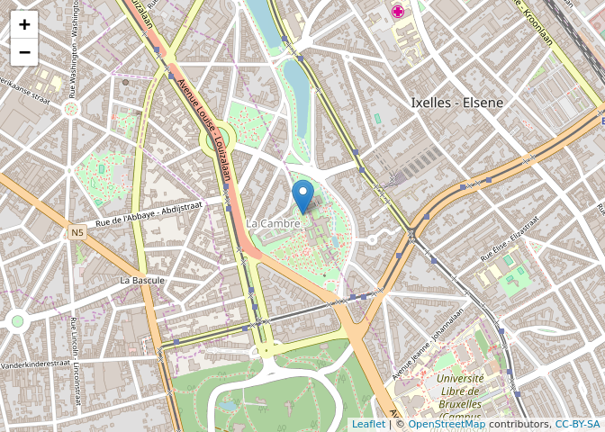

Sometimes we have a layer in one coordinate reference system (CRS) and need to transform it into another coordinate reference system. The first thing we need to do is identifying both coordinate reference systems. Let's create an example and identify the coordinate reference system with `proj4string()`. We used the coordinates posted on the contact page of [NGI](http://www.ngi.be/NL/NL5.shtm).

``` r
library(sp)
library(leaflet)
library(widgetframe)
```

    ## Loading required package: htmlwidgets

``` r
ngi <- data.frame(x = 650381.78, y = 667603.12)
coordinates(ngi) <- ~x + y
proj4string(ngi)
```

    ## [1] NA

`NA` indicates that the coordinate reference system isn't set. So we need to set it manually. In this case we know it is "Lambert 2008". We need to know the related projection string. The projection string is often a rather long string of parameters. However, most coordinate reference systems have an [EPSG](https://en.wikipedia.org/wiki/International_Association_of_Oil_%26_Gas_Producers#European_Petroleum_Survey_Group) number which you can find at <http://epsg.io/>. The EPSG number for "Lambert 2008" is 3812. Let's set this coordinate reference system to our dataset. `CRS()` defines the coordinate reference system based on a text string.

``` r
proj4string(ngi) <- CRS("+init=epsg:3812")
proj4string(ngi)
```

    ## [1] "+init=epsg:3812 +proj=lcc +lat_1=49.83333333333334 +lat_2=51.16666666666666 +lat_0=50.797815 +lon_0=4.359215833333333 +x_0=649328 +y_0=665262 +ellps=GRS80 +towgs84=0,0,0,0,0,0,0 +units=m +no_defs"

We could verify the correctness of this position by plotting in on a map. Here we use the `leaflet` package which requires the data to be in the "WGS84" coordinate reference system. Therefore we use `spTransform` to do this transformation. "WGS84" has EPSG number 4326. But here the coordinate reference system string itself is easier to memorise: "+proj=longlat".

``` r
ngi_ll <- spTransform(ngi, CRS("+proj=longlat"))
proj4string(ngi_ll)
```

    ## [1] "+proj=longlat +ellps=WGS84"

``` r
leaflet(ngi_ll) %>%
  addTiles() %>%
  addMarkers() # %>%
```



``` r
  #frameWidget()
```

| CRS                             |   EPSG| shortened\_PROJ.4\_string |
|:--------------------------------|------:|:--------------------------|
| WGS 84                          |   4326| +init=epsg:4326           |
| Belge 1972 / Belgian Lambert 72 |  31370| +init=epsg:31370          |
| ETRS89 / Belgian Lambert 2008   |   3812| +init=epsg:3812           |
| WGS 84 / Pseudo-Mercator        |   3857| +init=epsg:3857           |
