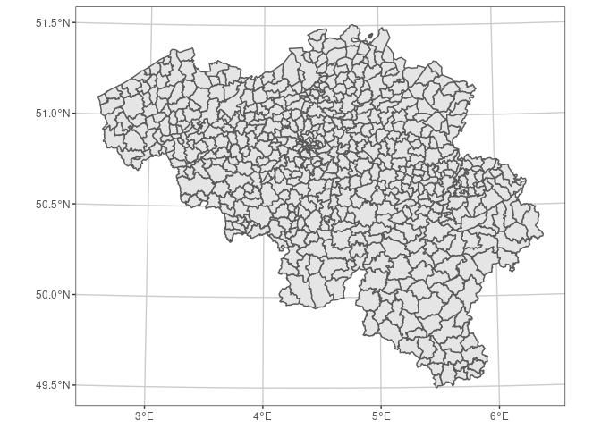
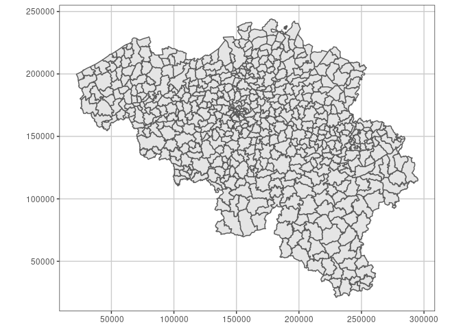
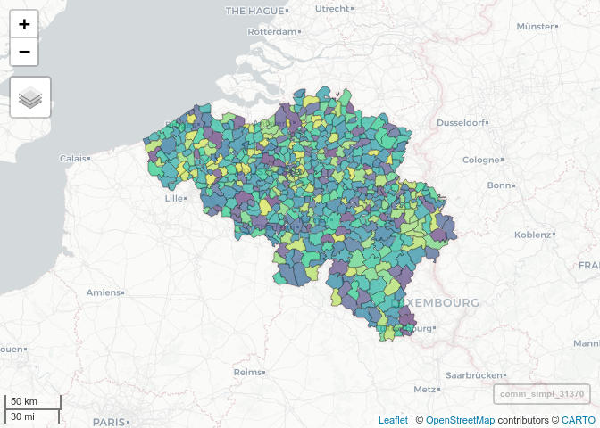
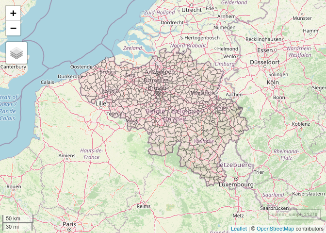
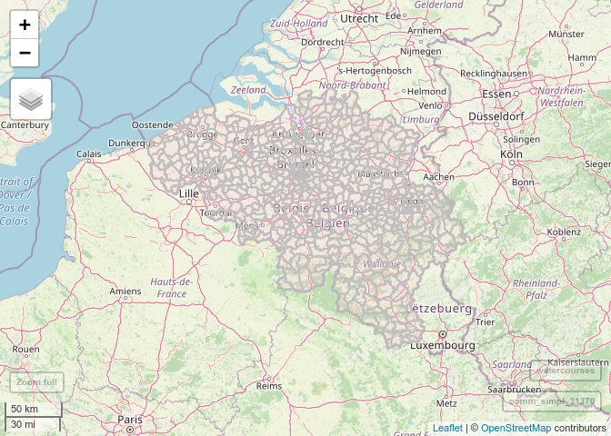
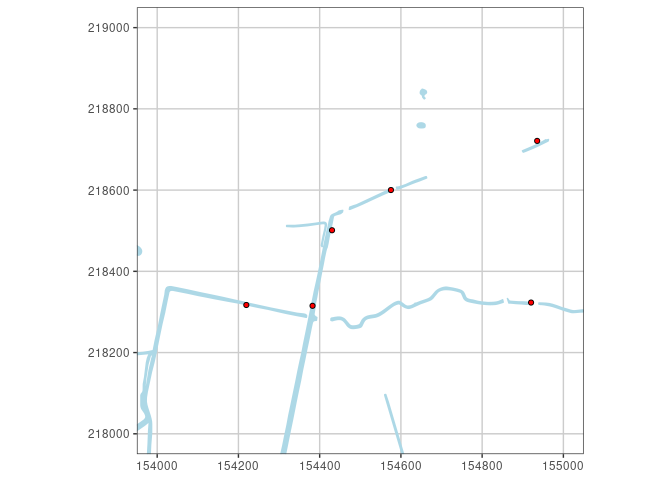
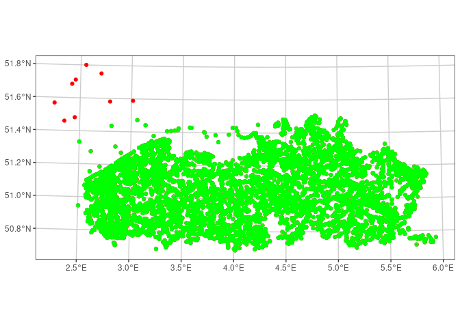
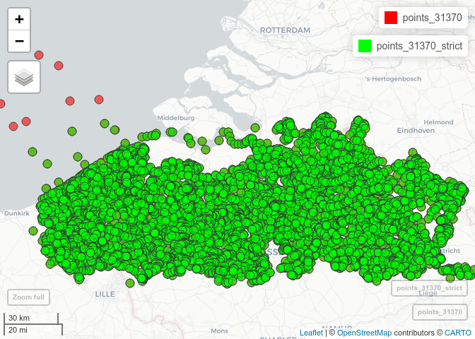

## Introduction and setup

This tutorial originated while preparing an R-demonstration during a GIS
club at INBO on 16 September 2021. (Further material of the GIS club is
available
[here](https://drive.google.com/drive/folders/1s5HZ5VjnkTbCQSE1vfFyMJz6PVIl4mHW).)

A straightforward approach for transforming spatial data is available in
another [tutorial](../spatial_transform_crs/). The current tutorial
tackles a few extra aspects.

The tutorial assumes you have some pre-existing knowledge:

-   Basic knowledge about coordinate reference systems (CRSs) and
    geodetic datums; see [another tutorial](../spatial_crs_coding/) and
    the references and links therein.
-   Knowing how to read geospatial files with
    [`sf`](https://r-spatial.github.io/sf). There is another
    [tutorial](../spatial_standards_vector/) demonstrating some aspects.

In this tutorial we will apply conversions (without datum shift) and
transformations (with datum shift) to `sf` and `sfc` objects. In the
background, these operations use the [PROJ](https://proj.org) library.

Let’s load the needed R packages and prepare a more appropriate theme
for mapping with [`ggplot2`](https://ggplot2.tidyverse.org/):

``` r
library(dplyr)
library(sf)
library(ggplot2)
theme_set(theme_bw())
theme_update(panel.grid = element_line(colour = "grey80"))
library(mapview)
```

Set up input data if needed:

``` r
if (!file.exists(file.path(gisclubdata_path, "gemeenten_belgie.shp"))) {
  googledrive::drive_download(googledrive::as_id("1-epL-fyKB8eS-WwuZhjsl8uyZYplAqFA"), 
                              file.path(tempdir(), "data_gisclub.zip"))
  unzip(file.path(tempdir(), "data_gisclub.zip"),
        exdir = tempdir())
  list.files(file.path(tempdir(), "data_gisclub"), full.names = TRUE) %>% 
    file.copy(gisclubdata_path, recursive = TRUE)
}
```

The code assumes that you have a `gisclubdata_path` object defined
(directory path as a string).

## Joining and mapping polygon layers

For a given `municipalities` and `watercourses` dataset, we would like
to append the municipality name to the watercourses by making a spatial
join.

### Reading data and trying to join

Let’s read the data file of Belgian municipalities:

``` r
path_municipalities <- file.path(gisclubdata_path, "gemeenten_belgie.shp")
municipalities <- read_sf(path_municipalities)
```

It looks like this:

``` r
municipalities
```

    Simple feature collection with 581 features and 3 fields
    Geometry type: MULTIPOLYGON
    Dimension:     XYZ
    Bounding box:  xmin: 2.541331 ymin: 49.49695 xmax: 6.408098 ymax: 51.50511
    z_range:       zmin: 0 zmax: 0
    Geodetic CRS:  WGS 84
    # A tibble: 581 × 4
       T_MUN_NL        Shape_Leng Shape_Area                                geometry
       <chr>                <dbl>      <dbl>                      <MULTIPOLYGON [°]>
     1 ’s Gravenbrakel      0.759    0.0108  Z (((4.095037 50.66599 0, 4.095101 50.…
     2 Aalst                0.676    0.0101  Z (((4.054666 50.99444 0, 4.054666 50.…
     3 Aalter               0.735    0.0154  Z (((3.41099 51.15987 0, 3.41275 51.15…
     4 Aarlen               0.951    0.0148  Z (((5.860749 49.72667 0, 5.860889 49.…
     5 Aarschot             0.640    0.00807 Z (((4.927684 51.03717 0, 4.92797 51.0…
     6 Aartselaar           0.265    0.00141 Z (((4.401293 51.14814 0, 4.400461 51.…
     7 Aat                  0.977    0.0163  Z (((3.756864 50.69743 0, 3.757621 50.…
     8 Affligem             0.261    0.00229 Z (((4.114181 50.92559 0, 4.115272 50.…
     9 Aiseau-Presles       0.393    0.00284 Z (((4.584122 50.43827 0, 4.584458 50.…
    10 Alken                0.336    0.00361 Z (((5.275147 50.9102 0, 5.275645 50.9…
    # … with 571 more rows

It appears that the points have three coordinate dimensions (`XYZ`).
However the features have only two useful dimensions:

``` r
st_dimension(municipalities)
```

      [1] 2 2 2 2 2 2 2 2 2 2 2 2 2 2 2 2 2 2 2 2 2 2 2 2 2 2 2 2 2 2 2 2 2 2 2 2 2
     [38] 2 2 2 2 2 2 2 2 2 2 2 2 2 2 2 2 2 2 2 2 2 2 2 2 2 2 2 2 2 2 2 2 2 2 2 2 2
     [75] 2 2 2 2 2 2 2 2 2 2 2 2 2 2 2 2 2 2 2 2 2 2 2 2 2 2 2 2 2 2 2 2 2 2 2 2 2
    [112] 2 2 2 2 2 2 2 2 2 2 2 2 2 2 2 2 2 2 2 2 2 2 2 2 2 2 2 2 2 2 2 2 2 2 2 2 2
    [149] 2 2 2 2 2 2 2 2 2 2 2 2 2 2 2 2 2 2 2 2 2 2 2 2 2 2 2 2 2 2 2 2 2 2 2 2 2
    [186] 2 2 2 2 2 2 2 2 2 2 2 2 2 2 2 2 2 2 2 2 2 2 2 2 2 2 2 2 2 2 2 2 2 2 2 2 2
    [223] 2 2 2 2 2 2 2 2 2 2 2 2 2 2 2 2 2 2 2 2 2 2 2 2 2 2 2 2 2 2 2 2 2 2 2 2 2
    [260] 2 2 2 2 2 2 2 2 2 2 2 2 2 2 2 2 2 2 2 2 2 2 2 2 2 2 2 2 2 2 2 2 2 2 2 2 2
    [297] 2 2 2 2 2 2 2 2 2 2 2 2 2 2 2 2 2 2 2 2 2 2 2 2 2 2 2 2 2 2 2 2 2 2 2 2 2
    [334] 2 2 2 2 2 2 2 2 2 2 2 2 2 2 2 2 2 2 2 2 2 2 2 2 2 2 2 2 2 2 2 2 2 2 2 2 2
    [371] 2 2 2 2 2 2 2 2 2 2 2 2 2 2 2 2 2 2 2 2 2 2 2 2 2 2 2 2 2 2 2 2 2 2 2 2 2
    [408] 2 2 2 2 2 2 2 2 2 2 2 2 2 2 2 2 2 2 2 2 2 2 2 2 2 2 2 2 2 2 2 2 2 2 2 2 2
    [445] 2 2 2 2 2 2 2 2 2 2 2 2 2 2 2 2 2 2 2 2 2 2 2 2 2 2 2 2 2 2 2 2 2 2 2 2 2
    [482] 2 2 2 2 2 2 2 2 2 2 2 2 2 2 2 2 2 2 2 2 2 2 2 2 2 2 2 2 2 2 2 2 2 2 2 2 2
    [519] 2 2 2 2 2 2 2 2 2 2 2 2 2 2 2 2 2 2 2 2 2 2 2 2 2 2 2 2 2 2 2 2 2 2 2 2 2
    [556] 2 2 2 2 2 2 2 2 2 2 2 2 2 2 2 2 2 2 2 2 2 2 2 2 2 2

Some tools – e.g. spherical geoprocessing – expect XY data. So we will
drop the Z dimension with `st_zm()`. Meanwhile we select the only
necessary attribute and rename it, using `select()`.

``` r
municipalities <- 
  municipalities %>% 
  select(municipality = T_MUN_NL) %>% 
  st_zm()
```

We perform similar operations on the `watercourses` dataset. Here, data
are already defined as two dimensions.

``` r
path_watercourses <- file.path(gisclubdata_path, "watergangen_antw.shp")
watercourses <- read_sf(path_watercourses)
```

``` r
watercourses
```

    Simple feature collection with 7258 features and 14 fields
    Geometry type: POLYGON
    Dimension:     XY
    Bounding box:  xmin: 138050.5 ymin: 201644.5 xmax: 162761.3 ymax: 230509
    CRS:           NA
    # A tibble: 7,258 × 15
         OIDN   UIDN VERSIE BEGINDATUM VERSDATUM   VHAG NAAM       OPNDATUM   BGNINV
        <dbl>  <dbl>  <int> <date>     <date>     <dbl> <chr>      <date>      <int>
     1 205462 492073      3 2017-07-05 2021-05-06  3320 nvt        2017-06-20     13
     2 179828 488809      2 2015-01-20 2021-05-06    -9 nvt        2014-12-02      4
     3 223031 499842      2 2018-03-28 2021-05-06 54710 Kallebeek… 2018-02-27      4
     4 267383 462960      2 2020-02-22 2021-05-06    -9 nvt        2020-01-08      4
     5  72361 481073      3 2010-11-08 2021-05-06 65101 nvt        2020-06-22      6
     6 223073 499879      3 2018-03-28 2021-05-06    -9 nvt        2018-02-27     13
     7  72079 480970      3 2010-11-08 2021-05-06 53460 nvt        2016-06-20      3
     8 145811 567202      3 2012-11-20 2021-07-07    -8 ng         2012-10-19     11
     9 205453 492064      3 2017-07-05 2021-05-06    -9 nvt        2017-06-20     10
    10 269842 463401      2 2020-04-22 2021-05-06    -9 nvt        2020-04-03      4
    # … with 7,248 more rows, and 6 more variables: LBLBGNINV <chr>, LENGTE <dbl>,
    #   OPPERVL <dbl>, Shape_Leng <dbl>, Shape_Area <dbl>, geometry <POLYGON>

Note that not all columns are printed. Let’s preview all columns with
`glimpse()`:

``` r
glimpse(watercourses)
```

    Rows: 7,258
    Columns: 15
    $ OIDN       <dbl> 205462, 179828, 223031, 267383, 72361, 223073, 72079, 14581…
    $ UIDN       <dbl> 492073, 488809, 499842, 462960, 481073, 499879, 480970, 567…
    $ VERSIE     <int> 3, 2, 2, 2, 3, 3, 3, 3, 3, 2, 1, 2, 2, 1, 2, 1, 2, 3, 2, 3,…
    $ BEGINDATUM <date> 2017-07-05, 2015-01-20, 2018-03-28, 2020-02-22, 2010-11-08…
    $ VERSDATUM  <date> 2021-05-06, 2021-05-06, 2021-05-06, 2021-05-06, 2021-05-06…
    $ VHAG       <dbl> 3320, -9, 54710, -9, 65101, -9, 53460, -8, -9, -9, -9, -9, …
    $ NAAM       <chr> "nvt", "nvt", "Kallebeekgeul", "nvt", "nvt", "nvt", "nvt", …
    $ OPNDATUM   <date> 2017-06-20, 2014-12-02, 2018-02-27, 2020-01-08, 2020-06-22…
    $ BGNINV     <int> 13, 4, 4, 4, 6, 13, 3, 11, 10, 4, 1, 4, 4, 1, 4, 4, 1, 13, …
    $ LBLBGNINV  <chr> "aanmaak uniek percelenplan\r\n", "bijhouding binnengebiede…
    $ LENGTE     <dbl> 570.19, 185.33, 1491.01, 307.60, 286.06, 270.32, 48.11, 17.…
    $ OPPERVL    <dbl> 2492.23, 494.77, 9350.36, 978.46, 432.97, 405.56, 118.29, 1…
    $ Shape_Leng <dbl> 570.18844, 185.32549, 1491.01243, 307.59691, 286.06075, 270…
    $ Shape_Area <dbl> 2492.22527, 494.77446, 9350.36080, 978.46010, 432.97004, 40…
    $ geometry   <POLYGON> POLYGON ((141976.5 222453.1..., POLYGON ((142200.6 2050…

We only select some:

``` r
watercourses <- 
  watercourses %>% 
  select(polygon_id = OIDN,
         vhag_code = VHAG,
         watercourse = NAAM)
```

``` r
watercourses
```

    Simple feature collection with 7258 features and 3 fields
    Geometry type: POLYGON
    Dimension:     XY
    Bounding box:  xmin: 138050.5 ymin: 201644.5 xmax: 162761.3 ymax: 230509
    CRS:           NA
    # A tibble: 7,258 × 4
       polygon_id vhag_code watercourse                                     geometry
            <dbl>     <dbl> <chr>                                          <POLYGON>
     1     205462      3320 nvt           ((141976.5 222453.1, 141973.1 222449.6, 1…
     2     179828        -9 nvt           ((142200.6 205085.9, 142197.3 205085, 142…
     3     223031     54710 Kallebeekgeul ((146874.6 203777.1, 146879.3 203775.9, 1…
     4     267383        -9 nvt           ((148997 209136.1, 148996.7 209136.1, 148…
     5      72361     65101 nvt           ((141780.9 213697.8, 141780.7 213695.3, 1…
     6     223073        -9 nvt           ((144377.8 205161.2, 144408.7 205152.8, 1…
     7      72079     53460 nvt           ((140094.1 210962.7, 140093.8 210962.5, 1…
     8     145811        -8 ng            ((149004.6 209659.9, 149002.5 209666.4, 1…
     9     205453        -9 nvt           ((139682 225241.4, 139697.5 225222, 13971…
    10     269842        -9 nvt           ((155762.1 207273.7, 155766.5 207273, 155…
    # … with 7,248 more rows

In the above prints of the `municipalities` and `watercourses` objects,
you could already see their coordinate reference system (CRS). With
`st_crs()` you can extract the `crs` object; it is printed as:

``` r
st_crs(municipalities)
```

    Coordinate Reference System:
      User input: WGS 84 
      wkt:
    GEOGCRS["WGS 84",
        DATUM["World Geodetic System 1984",
            ELLIPSOID["WGS 84",6378137,298.257223563,
                LENGTHUNIT["metre",1]]],
        PRIMEM["Greenwich",0,
            ANGLEUNIT["degree",0.0174532925199433]],
        CS[ellipsoidal,2],
            AXIS["latitude",north,
                ORDER[1],
                ANGLEUNIT["degree",0.0174532925199433]],
            AXIS["longitude",east,
                ORDER[2],
                ANGLEUNIT["degree",0.0174532925199433]],
        ID["EPSG",4326]]

The CRS name ‘WGS 84’ can also be returned by
`st_crs(municipalities)$Name`. As seen from the WKT string, this is a
geographical CRS.

However for `watercourses` the CRS is missing:

``` r
st_crs(watercourses)
```

    Coordinate Reference System: NA

Can we make the spatial join already?

``` r
st_join(watercourses, municipalities) %>% try
```

    Error in st_geos_binop("intersects", x, y, sparse = sparse, prepared = prepared,  : 
      st_crs(x) == st_crs(y) is not TRUE

Fortunately, this doesn’t work: `st_join()` requires its inputs to
belong to the same CRS.

Well, we know that `watercourses` is in the projected CRS `EPSG:31370`
(Belge 1972 / Belgian Lambert 72), so we can just update it:

``` r
st_crs(watercourses) <- "EPSG:31370"
```

Since the CRSs are still different, this should *not* be sufficient for
the join.

``` r
st_join(watercourses, municipalities) %>% try
```

    Error in st_geos_binop("intersects", x, y, sparse = sparse, prepared = prepared,  : 
      st_crs(x) == st_crs(y) is not TRUE

Indeed!

Let’s transform `municipalities` to `EPSG:31370`:

``` r
municipalities_31370 <- st_transform(municipalities, "EPSG:31370")
```

And now…

``` r
(watercourses_comm <- st_join(watercourses, municipalities_31370))
```

    Simple feature collection with 7502 features and 4 fields
    Geometry type: POLYGON
    Dimension:     XY
    Bounding box:  xmin: 138050.5 ymin: 201644.5 xmax: 162761.3 ymax: 230509
    Projected CRS: Belge 1972 / Belgian Lambert 72
    # A tibble: 7,502 × 5
       polygon_id vhag_code watercourse                        geometry municipality
     *      <dbl>     <dbl> <chr>                         <POLYGON [m]> <chr>       
     1     205462      3320 nvt           ((141976.5 222453.1, 141973.… Beveren     
     2     179828        -9 nvt           ((142200.6 205085.9, 142197.… Kruibeke    
     3     223031     54710 Kallebeekgeul ((146874.6 203777.1, 146879.… Kruibeke    
     4     267383        -9 nvt           ((148997 209136.1, 148996.7 … Antwerpen   
     5      72361     65101 nvt           ((141780.9 213697.8, 141780.… Beveren     
     6     223073        -9 nvt           ((144377.8 205161.2, 144408.… Kruibeke    
     7      72079     53460 nvt           ((140094.1 210962.7, 140093.… Beveren     
     8     145811        -8 ng            ((149004.6 209659.9, 149002.… Antwerpen   
     9     205453        -9 nvt           ((139682 225241.4, 139697.5 … Beveren     
    10     269842        -9 nvt           ((155762.1 207273.7, 155766.… Mortsel     
    # … with 7,492 more rows

Succeeded!

Two things to note here:

-   `st_join()` has an argument ‘`join`’ that defines the type of
    topological relationship that is used to either join or *not* join a
    geometry from the first layer with a geometry from the second.
    Various so-called ‘binary predicates’ can be used to define this
    relationship (see `?st_join`), but the default one is
    `st_intersects()`, i.e. an *intersection* as defined by the
    ‘[DE-9IM](https://en.wikipedia.org/wiki/DE-9IM)’ model of binary
    geometry relations.
-   Since several watercourses intersect more than one municipality,
    several of them are repeated in `watercourses_comm`, each with
    another values for `municipality`.

We chose to make the spatial join in the `EPSG:31370` CRS. However, we
can equally do it on a spherical model of the Earth, when using the
geographical coordinates. We expect the resulting joined attributes to
be equivalent. Let’s check:

``` r
st_join(st_transform(watercourses, "EPSG:4326"), municipalities) %>% 
  st_drop_geometry %>% 
  all.equal(watercourses_comm %>% st_drop_geometry)
```

    [1] TRUE

### Mapping

While it has only one attribute and 581 rows, the object size of
`municipalities_31370` is relatively large because its polygons have
numerous vertices:

``` r
object.size(municipalities_31370) %>% format(units = "MB")
```

    [1] "22.1 Mb"

This makes a simple map take long to render in R (not shown here; just
try yourself):

``` r
ggplot(data = municipalities_31370) + geom_sf()
```

For the sake of this exercise, we make a simplified derived object
`comm_simpl_31370` with fewer vertices:

``` r
comm_simpl_31370 <- st_simplify(municipalities_31370, dTolerance = 10)
```

Its size is much smaller:

``` r
object.size(comm_simpl_31370) %>% format(units = "MB")
```

    [1] "3 Mb"

So it renders faster.

``` r
ggplot(data = comm_simpl_31370) + geom_sf()
```

<!-- -->

However, mind that the simplification may be OK for mapping at an
appropriate scale, but beware that information has been lost, so shapes
have changed and gaps + overlaps will appear between polygons. Hence
don’t use this simplified version if you process it further, or for
detailed mapping.

Note the latitude-longitude graticule: the map follows the CRS of the
plotted object, but the graticule is latitude-longitude by default.

We can plot the graticule of another CRS with `coord_sf()`:

``` r
ggplot(data = comm_simpl_31370) + geom_sf() + coord_sf(datum = "EPSG:31370")
```

<!-- -->

The above is the most obvious choice here, since it’s the CRS of the
object, but we could as well plot the graticule of e.g. `EPSG:3035`
(ETRS89-extended / LAEA Europe):

``` r
ggplot(data = comm_simpl_31370) + geom_sf() + coord_sf(datum = "EPSG:3035")
```

<!-- -->

Next to the [`ggplot2`](https://ggplot2.tidyverse.org/) package, which
we used above, interactive maps can be made with the
[`mapview`](https://r-spatial.github.io/mapview/) package.

Here too, time to render differs between:

``` r
mapview(municipalities_31370, legend = FALSE)
```

and:

``` r
mapview(comm_simpl_31370, legend = FALSE)
```

<!-- -->

*Note: run the code to see this and the following interactive maps.*

In this case, `mapview` is using the `leaflet` package with some nice
defaults, but in the above examples it makes a color map by default
because there’s only one attribute. We don’t want this and we make some
further adjustments:

``` r
mapview(comm_simpl_31370, 
        col.regions = "pink", 
        alpha.regions = 0.3, 
        legend = FALSE,
        map.types = "OpenStreetMap")
```

<!-- -->

Note that a separate tutorial about `leaflet` is
[available](../spatial_create_leaflet_map/) on this website!

Beware that `mapview` and `leaflet` produce maps in the ‘WGS 84 /
Pseudo-Mercator’ CRS (`EPSG:3857`). For that to happen, `mapview`
transforms spatial objects on-the-fly. [Pseudo Mercator or Web
Mercator](https://proj.org/operations/projections/webmerc.html) is a
much used projection in web mapping because the coordinate projection is
computed much faster. However it should not be used in official mapping
or as a projected CRS for geoprocessing, since it has more distortions
(including shape) than e.g. the (truly) conformal Mercator projection
(e.g. in CRS `EPSG:3395` – WGS 84 / World Mercator – which is best used
in the equatorial region).

Let’s show two layers with `mapview`:

``` r
mapview(list(comm_simpl_31370, watercourses), 
        col.regions = c("pink", "blue"), 
        alpha.regions = c(0.2, 0.5),
        color = c("grey", NA), 
        legend = FALSE,
        map.types = "OpenStreetMap")
```

<!-- -->

## Different transformation pipelines

We consider a layer of points that correspond to locations where
characteristics were determined of Flemish surfacewater bodies:

``` r
path_points <- file.path(gisclubdata_path, "meetplaatsen_oppwater.shp")
points <- read_sf(path_points)
```

Check the CRS:

``` r
st_crs(points)
```

    Coordinate Reference System:
      User input: Amersfoort / RD New 
      wkt:
    PROJCRS["Amersfoort / RD New",
        BASEGEOGCRS["Amersfoort",
            DATUM["Amersfoort",
                ELLIPSOID["Bessel 1841",6377397.155,299.1528128,
                    LENGTHUNIT["metre",1]]],
            PRIMEM["Greenwich",0,
                ANGLEUNIT["degree",0.0174532925199433]],
            ID["EPSG",4289]],
        CONVERSION["RD New",
            METHOD["Oblique Stereographic",
                ID["EPSG",9809]],
            PARAMETER["Latitude of natural origin",52.1561605555556,
                ANGLEUNIT["degree",0.0174532925199433],
                ID["EPSG",8801]],
            PARAMETER["Longitude of natural origin",5.38763888888889,
                ANGLEUNIT["degree",0.0174532925199433],
                ID["EPSG",8802]],
            PARAMETER["Scale factor at natural origin",0.9999079,
                SCALEUNIT["unity",1],
                ID["EPSG",8805]],
            PARAMETER["False easting",155000,
                LENGTHUNIT["metre",1],
                ID["EPSG",8806]],
            PARAMETER["False northing",463000,
                LENGTHUNIT["metre",1],
                ID["EPSG",8807]]],
        CS[Cartesian,2],
            AXIS["easting (X)",east,
                ORDER[1],
                LENGTHUNIT["metre",1]],
            AXIS["northing (Y)",north,
                ORDER[2],
                LENGTHUNIT["metre",1]],
        USAGE[
            SCOPE["Engineering survey, topographic mapping."],
            AREA["Netherlands - onshore, including Waddenzee, Dutch Wadden Islands and 12-mile offshore coastal zone."],
            BBOX[50.75,3.2,53.7,7.22]],
        ID["EPSG",28992]]

The `points` object has the projected ‘Amersfoort / RD New’ CRS
(`EPSG:28992`), which was created for The Netherlands – onshore. See
e.g.
[Wikipedia](https://nl.wikipedia.org/wiki/Rijksdriehoeksco%C3%B6rdinaten)
for more background about this CRS.

Essentially we are dealing with a different projected CRS than
`EPSG:31370`. `EPSG:28992` uses the ‘Amersfoort’ geodetic datum, defined
using the ‘Bessel 1841’ ellipsoid, while `EPSG:31370` has the ‘Reseau
National Belge 1972’ datum, defined using the ‘International 1924’
ellipsoid.[1]

We will transform `points` (back) to `EPSG:31370` since the data are
outside the intended area of usage. Note that this dataset has been made
for mere demonstrative purposes: since at least a part of the points
fall outside the area of usage (geographic bounding box) of the
‘Amersfoort / RD New’ CRS, the dataset is not appropriate to start from.
But let’s suppose it is all one had available to work with!

### Standard approach

By default, the appropriate transformation pipeline (concatenated
coordinate operations) can differ between different areas that are
represented in a spatial dataset. This is taken care of automatically,
based on the bounding boxes of each CRS, but it will also depend on the
availability of specific transformation grids.

``` r
points_31370 <- st_transform(points, "EPSG:31370")
```

Notice the completely different coordinate ranges between both CRSs:

``` r
st_geometry(points)
#> Geometry set for 7320 features 
#> Geometry type: POINT
#> Dimension:     XY
#> Bounding box:  xmin: -62470.03 ymin: 300542 xmax: 193543.8 ymax: 427302.7
#> Projected CRS: Amersfoort / RD New
#> First 5 geometries:
#> POINT (-30849.68 354341.7)
#> POINT (-31237.91 354683.3)
#> POINT (-28757.74 356391.3)
#> POINT (709.4341 373861.2)
#> POINT (116680.8 340639.1)
```

``` r
st_geometry(points_31370)
#> Geometry set for 7320 features 
#> Geometry type: POINT
#> Dimension:     XY
#> Bounding box:  xmin: 3174.827 ymin: 152992.4 xmax: 260391 ymax: 278347.1
#> Projected CRS: Belge 1972 / Belgian Lambert 72
#> First 5 geometries:
#> POINT (35483.62 205530.5)
#> POINT (35090.55 205866.5)
#> POINT (37545.94 207609.8)
#> POINT (66666.83 225461.1)
#> POINT (183089.2 193870.8)
```

A specific area shown with `ggplot2` in `EPSG:31370`:

``` r
ggplot() + 
  geom_sf(data = watercourses, fill = "lightblue", colour = "lightblue") +
  geom_sf(data = points_31370, fill = "red", shape = 21) +
  lims(x = c(154e3, 155e3), y = c(218e3, 219e3)) +
  coord_sf(datum = "EPSG:31370")
```

<!-- -->

### Enforcing a specific pipeline

We can request available transformation pipelines with
`sf_proj_pipelines()`:

``` r
pipelines <- sf_proj_pipelines("EPSG:28992", "EPSG:31370")
```

One can further limit this by specifying the area of interest (`aoi`
argument), which we didn’t do here.

It is a dataframe with following structure:

``` r
glimpse(pipelines)
```

    Rows: 13
    Columns: 9
    $ id           <chr> "pipeline", "pipeline", "pipeline", "pipeline", "pipeline…
    $ description  <chr> "Inverse of RD New + Amersfoort to ETRS89 (9) + Inverse o…
    $ definition   <chr> "+proj=pipeline +step +inv +proj=sterea +lat_0=52.1561605…
    $ has_inverse  <lgl> TRUE, TRUE, TRUE, TRUE, TRUE, TRUE, TRUE, TRUE, TRUE, TRU…
    $ accuracy     <dbl> 0.011, 0.201, 0.260, 0.450, 1.001, 1.250, 2.000, 2.000, 2…
    $ axis_order   <lgl> FALSE, FALSE, FALSE, FALSE, FALSE, FALSE, FALSE, FALSE, F…
    $ grid_count   <int> 2, 1, 1, 0, 1, 0, 0, 0, 0, 0, 0, 0, 0
    $ instantiable <lgl> TRUE, TRUE, TRUE, TRUE, TRUE, TRUE, TRUE, TRUE, TRUE, TRU…
    $ containment  <lgl> FALSE, FALSE, FALSE, FALSE, FALSE, FALSE, FALSE, FALSE, F…

Some metadata about the pipelines:

``` r
pipelines %>% 
  as_tibble %>% 
  select(definition, description, grid_count, accuracy, instantiable)
```

    # A tibble: 13 × 5
       definition             description           grid_count accuracy instantiable
       <chr>                  <chr>                      <int>    <dbl> <lgl>       
     1 +proj=pipeline +step … Inverse of RD New + …          2    0.011 TRUE        
     2 +proj=pipeline +step … Inverse of RD New + …          1    0.201 TRUE        
     3 +proj=pipeline +step … Inverse of RD New + …          1    0.26  TRUE        
     4 +proj=pipeline +step … Inverse of RD New + …          0    0.45  TRUE        
     5 +proj=pipeline +step … Inverse of RD New + …          1    1.00  TRUE        
     6 +proj=pipeline +step … Inverse of RD New + …          0    1.25  TRUE        
     7 +proj=pipeline +step … Inverse of RD New + …          0    2     TRUE        
     8 +proj=pipeline +step … Inverse of RD New + …          0    2     TRUE        
     9 +proj=pipeline +step … Inverse of RD New + …          0    2     TRUE        
    10 +proj=pipeline +step … Inverse of RD New + …          0    2     TRUE        
    11 +proj=pipeline +step … Inverse of RD New + …          0    6     TRUE        
    12 +proj=pipeline +step … Inverse of RD New + …          0    6     TRUE        
    13 +proj=pipeline +step … Inverse of RD New + …          0   NA     TRUE        

We can see that the first one has best accuracy. Several pipelines are
based on one or two grids for a better accuracy.

When printing the `pipelines` object, its first row is printed in a more
readable manner:

``` r
pipelines
```

    Candidate coordinate operations found:  13 
    Strict containment:     FALSE 
    Axis order auth compl:  FALSE 
    Source:  EPSG:28992 
    Target:  EPSG:31370 
    Best instantiable operation has accuracy: 0.011 m
    Description: Inverse of RD New + Amersfoort to ETRS89 (9) + Inverse of BD72
                 to ETRS89 (3) + Belgian Lambert 72
    Definition:  +proj=pipeline +step +inv +proj=sterea +lat_0=52.1561605555556
                 +lon_0=5.38763888888889 +k=0.9999079 +x_0=155000
                 +y_0=463000 +ellps=bessel +step +proj=hgridshift
                 +grids=nl_nsgi_rdtrans2018.tif +step +inv
                 +proj=hgridshift
                 +grids=be_ign_bd72lb72_etrs89lb08.tif +step
                 +proj=lcc +lat_0=90 +lon_0=4.36748666666667
                 +lat_1=51.1666672333333 +lat_2=49.8333339
                 +x_0=150000.013 +y_0=5400088.438 +ellps=intl

Since the rows of pipelines are sorted by `instantiable` and `accuracy`,
it makes sense to designate the printed pipeline as *Best instantiable
operation*.

It follows that the same information appears when manually selecting and
then printing, except for the number of ‘candidate operations found’:

``` r
pipelines[1,]
```

    Candidate coordinate operations found:  1 
    Strict containment:     FALSE 
    Axis order auth compl:  FALSE 
    Source:  EPSG:28992 
    Target:  EPSG:31370 
    Best instantiable operation has accuracy: 0.011 m
    Description: Inverse of RD New + Amersfoort to ETRS89 (9) + Inverse of BD72
                 to ETRS89 (3) + Belgian Lambert 72
    Definition:  +proj=pipeline +step +inv +proj=sterea +lat_0=52.1561605555556
                 +lon_0=5.38763888888889 +k=0.9999079 +x_0=155000
                 +y_0=463000 +ellps=bessel +step +proj=hgridshift
                 +grids=nl_nsgi_rdtrans2018.tif +step +inv
                 +proj=hgridshift
                 +grids=be_ign_bd72lb72_etrs89lb08.tif +step
                 +proj=lcc +lat_0=90 +lon_0=4.36748666666667
                 +lat_1=51.1666672333333 +lat_2=49.8333339
                 +x_0=150000.013 +y_0=5400088.438 +ellps=intl

If you’d like to get even more metadata on the available pipelines,
including the WKT definitions, you can also run PROJ’s
[`projinfo`](https://proj.org/apps/projinfo.html) command line program
from within R if it’s available in your system `PATH`.

``` r
system("projinfo -s EPSG:28992 -t EPSG:31370 --spatial-test intersects -o WKT2:2019")
```

The *default* operation returned by PROJ’s `projinfo`, based on the
union of the source and target CRS’s bounding box, appears to be just
one pipeline with so-called [ballpark
accuracy](https://proj.org/glossary.html#term-Ballpark-transformation).
It’s obtained by dropping the `--spatial-test intersects` option (or
replacing `intersects` by `contains`, which is default)[2], and so it
matches the pipeline where `accuracy` equals `NA` in our `pipelines`
dataframe:

``` r
pipelines[13,]
```

    Candidate coordinate operations found:  1 
    Strict containment:     FALSE 
    Axis order auth compl:  FALSE 
    Source:  EPSG:28992 
    Target:  EPSG:31370 
    Best instantiable operation has only ballpark accuracy 
    Description: Inverse of RD New + Ballpark geographic offset from Amersfoort
                 to Belge 1972 + Belgian Lambert 72
    Definition:  +proj=pipeline +step +inv +proj=sterea +lat_0=52.1561605555556
                 +lon_0=5.38763888888889 +k=0.9999079 +x_0=155000
                 +y_0=463000 +ellps=bessel +step +proj=lcc
                 +lat_0=90 +lon_0=4.36748666666667
                 +lat_1=51.1666672333333 +lat_2=49.8333339
                 +x_0=150000.013 +y_0=5400088.438 +ellps=intl

The low accuracy of a ballpark transformation is because datum
differences between source and target CRSs are neglected:

> It does not attempt any datum shift, hence the “ballpark” qualifier in
> its name. Its accuracy is unknown, and could lead in some cases to
> errors of a few hundreds of metres.

*(Source:
<https://proj.org/glossary.html#term-Ballpark-transformation>)*

With `st_transform()` we can enforce a specific pipeline. Note that it
is only available for `sfc` objects, not `sf` objects.

Let’s apply the most accurate pipeline to *all* points:

``` r
# We select the pipeline with lowest accuracy (< 0.02), by filtering on accuracy.
# If the grids are installed, this should match the first line of the pipelines object.
chosen_pipeline_definition <- pipelines %>% filter(accuracy < 0.02) %>% pull(definition)
points_31370_strict <- 
  st_transform(st_geometry(points), "EPSG:31370",
               pipeline = chosen_pipeline_definition) %>% 
  st_sf(st_drop_geometry(points), geometry = .) %>% 
  as_tibble %>% 
  st_as_sf
```

And compare:

``` r
st_geometry(points_31370)
#> Geometry set for 7320 features 
#> Geometry type: POINT
#> Dimension:     XY
#> Bounding box:  xmin: 3174.827 ymin: 152992.4 xmax: 260391 ymax: 278347.1
#> Projected CRS: Belge 1972 / Belgian Lambert 72
#> First 5 geometries:
#> POINT (35483.62 205530.5)
#> POINT (35090.55 205866.5)
#> POINT (37545.94 207609.8)
#> POINT (66666.83 225461.1)
#> POINT (183089.2 193870.8)
```

``` r
st_geometry(points_31370_strict)
#> Geometry set for 7320 features  (with 9 geometries empty)
#> Geometry type: POINT
#> Dimension:     XY
#> Bounding box:  xmin: 18976.03 ymin: 152963.3 xmax: 260391 ymax: 244024
#> Projected CRS: Belge 1972 / Belgian Lambert 72
#> First 5 geometries:
#> POINT (35393.39 205495.3)
#> POINT (35000.39 205831.3)
#> POINT (37455.41 207574.3)
#> POINT (66666.83 225461.1)
#> POINT (183089.2 193870.8)
```

Notice the **9 empty geometries** in case of `points_31370_strict`!

What is happening?

``` r
p <- 
  ggplot() + 
  geom_sf(data = points_31370, colour = "red") +
  geom_sf(data = points_31370_strict, colour = "green") 
p
```

<!-- -->

It appears that points too far at sea are considered invalid when
applying this pipeline, and their geometry was cleared (although the
corresponding row was not dropped).

If we make a zoomable plot, there’s more to discover.

``` r
plotly::ggplotly(p)
```

<!-- -->

Most points on the map are on the exact same location between both
approaches. We can see that points west and south of the *geographic
bounding box* for usage of the Dutch CRS have a different position
depending on the applied approach.

It can be further investigated with `mapview` (note that this does a
further reprojection to `EPSG:3857`):

``` r
mapview(list(points_31370, points_31370_strict),
        col.regions = c("red", "green"))
```

<!-- -->

Here it appears that the western and southern points of `points_31370`
were transformed with the ballpark-accuracy pipeline: they are way off
the surfacewater bodies!

In this case, one might prefer enforcing the specific pipeline outside
the geographic bounding box of `EPSG:28992`, as we did for
`points_31370_strict`. However best explore the other pipelines as well,
e.g. the most accurate one that doesn’t depend on a grid, and consider
using that outside the geographic bounding box.

Bottomline is that you should be suspicious about coordinates outside
the CRS’s geographic bounding box! So keep an eye on them when applying
a default transformation procedure.

## Further reading and more packages

Much more information can be found in the online books by [Pebesma &
Bivand](#ref-pebesma_spatial_2021) ([2021](#ref-pebesma_spatial_2021))
and [Lovelace *et al.*](#ref-lovelace_geocomputation_2019)
([2019](#ref-lovelace_geocomputation_2019)). The `sf` package has a nice
website at <https://r-spatial.github.io/sf>; version 0.6-1 was
introduced in [Pebesma](#ref-pebesma_simple_2018)
([2018](#ref-pebesma_simple_2018)).

There are several more R packages to make beautiful maps. We
specifically mention [`tmap`](https://r-tmap.github.io/tmap/)
([Tennekes, 2018](#ref-tennekes_tmap_2018)) and
[`mapsf`](https://riatelab.github.io/mapsf/) for making production-ready
thematic maps. `tmap` is used a lot in [Lovelace *et
al.*](#ref-lovelace_geocomputation_2019)
([2019](#ref-lovelace_geocomputation_2019)).

Further, there is the
[`plotKML`](https://plotkml.r-forge.r-project.org/) package, which
renders spatial objects in Google Earth ([Hengl *et al.*,
2015](#ref-hengl_plotkml:_2015))!

## Bibliography

<div id="refs" class="references csl-bib-body hanging-indent">

<div id="ref-hengl_plotkml:_2015" class="csl-entry">

Hengl T., Roudier P., Beaudette D. & Pebesma E. (2015). plotKML:
Scientific Visualization of Spatio-Temporal Data. Journal of Statistical
Software 63. <http://www.geostat-course.org/system/files/jss1079.pdf>.

</div>

<div id="ref-lovelace_geocomputation_2019" class="csl-entry">

Lovelace R., Nowosad J. & Muenchow J. (2019). Geocomputation with R.
<https://geocompr.robinlovelace.net/>.

</div>

<div id="ref-pebesma_simple_2018" class="csl-entry">

Pebesma E. (2018). Simple Features for R: Standardized Support for
Spatial Vector Data. The R Journal 10 (1): 439–446.
<https://journal.r-project.org/archive/2018/RJ-2018-009/index.html>.

</div>

<div id="ref-pebesma_spatial_2021" class="csl-entry">

Pebesma E. & Bivand R. (2021). Spatial Data Science.
<https://r-spatial.org/book>.

</div>

<div id="ref-tennekes_tmap_2018" class="csl-entry">

Tennekes M. (2018). tmap: Thematic Maps in R. Journal of Statistical
Software 84 (1): 1–39. <https://doi.org/10.18637/jss.v084.i06>.

</div>

</div>

[1] Note that several European countries, including Belgium, now provide
national projected CRSs that use the common ETRS89 datum (European
Terrestrial Reference System 1989). An example is the Belgian CRS
`EPSG:3812` (ETRS89 / Belgian Lambert 2008).

[2] In the documentation of `projinfo`, we can read about the
`--spatial-test` option: ‘*Specify how the area of use of coordinate
operations found in the database are compared to the area of use
specified explicitly with `--area` or `--bbox`, or derived implicitly
from the area of use of the source and target CRS. By default, projinfo
will only keep coordinate operations whose are of use is strictly within
the area of interest (**contains** strategy). If using the
**intersects** strategy, the spatial test is relaxed, and any coordinate
operation whose area of use at least partly intersects the area of
interest is listed.*’
