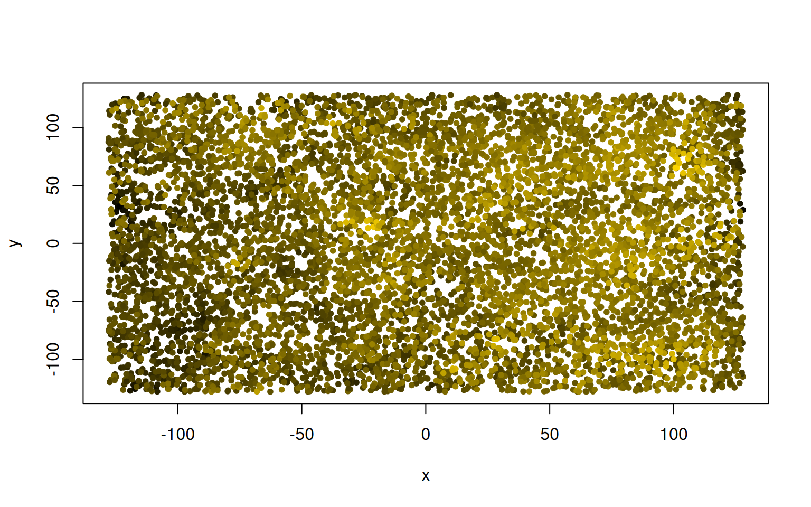
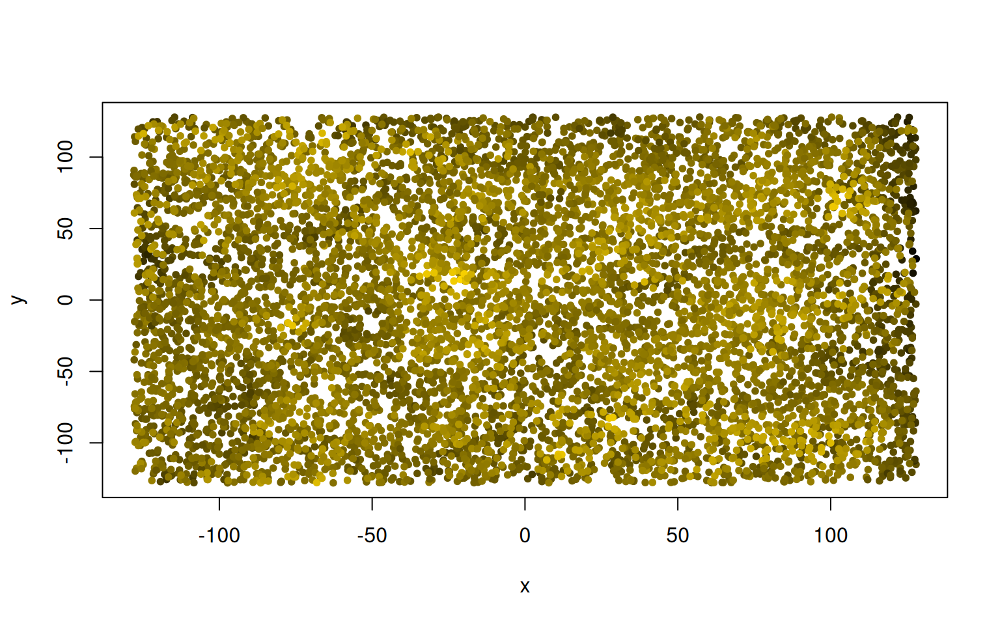
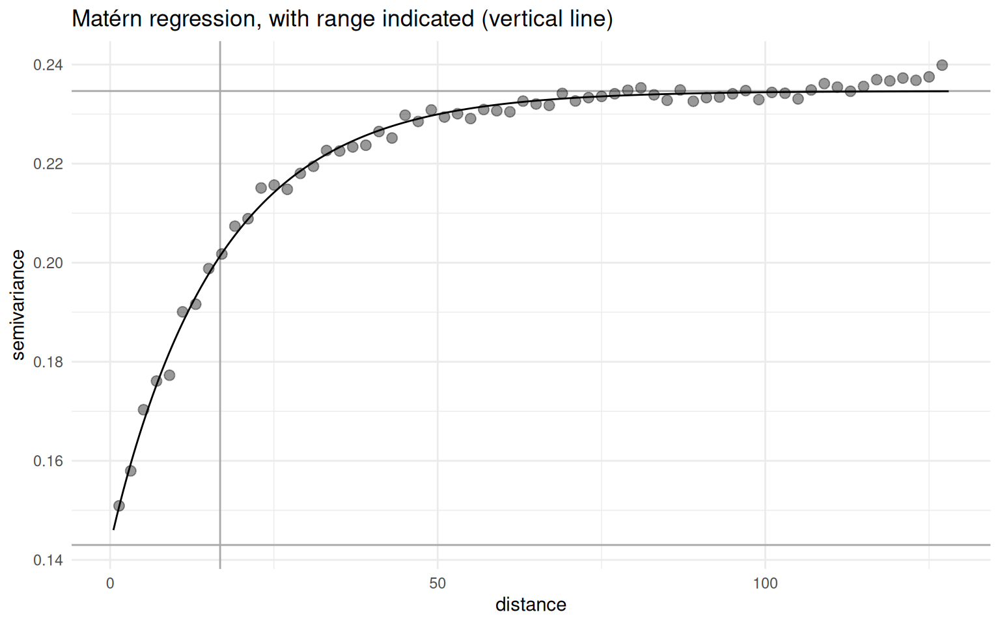
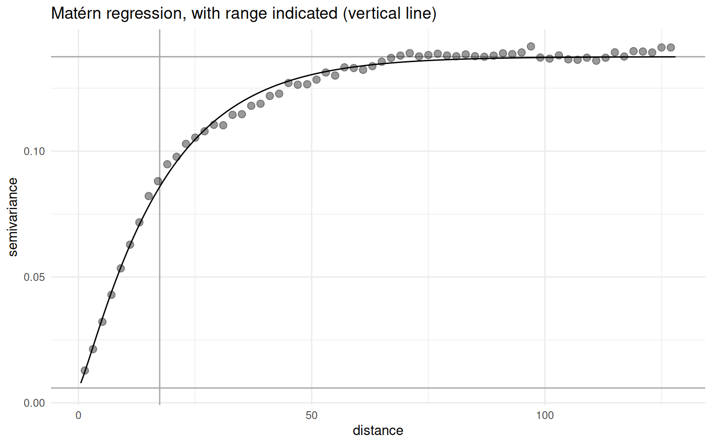
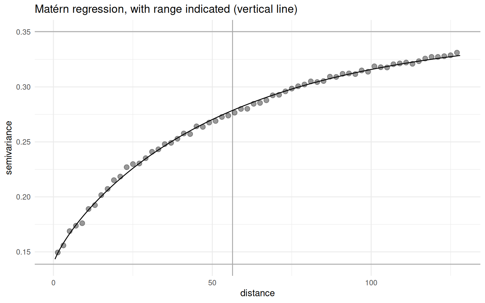

# Introduction

> Everything is related to everything else, but near things are more related than distant things.

[*(First Law according to Waldo Tobler)*](https://en.wikipedia.org/wiki/Tobler%27s_first_law_of_geography)

This remarkably unquantitative statement, or "law", is described [on wikipedia](https://en.wikipedia.org/wiki/Tobler%27s_first_law_of_geography#Background) as "a direct product of the quantitative revolution" in Geography.
Contrast it with the [wikipedia article on variograms](https://en.wikipedia.org/wiki/Variogram), which is full of jargon and seemingly complicated equations.

With this tutorial, I would like to document the condensed essence of my own trials and misunderstandings with practical variogram-based analysis.
We will see below that variograms are not that complicated after all.

The latter wikipedia article is a reminder that wikipedia generally is a non-academic, low quality resource.
For example:

-   They [initially](https://en.wikipedia.org/wiki/Variogram#) describe a (semi-)variogram as **"a \[mathematical\] function"**.
-   That "function" describes the "degree of dependence" of a spatial random field (pro tip: if it is dependent, it is not random, such as the distribution of gold ore used as an introductory example is not random).
-   As becomes unclear [afterwards](https://en.wikipedia.org/wiki/Variogram#Definition), that function is not "variance" (`var()`), but something else. Although the whole thing is called *variogram*, variance is in fact the "degree of dependence".
-   Then, they distinguish an **empirical variogram** ([here](https://en.wikipedia.org/wiki/Variogram#Empirical_variogram)). I would <a href="https://de.wikipedia.org/wiki/Praxis_(Philosophie)">refer to</a> the popular philosopher Vladimir Ilyich Ulyanov on this: "Praxis is the criterion of truth"[^1], i.e. there exists no useful *non-empirical variogram*.
-   Finally, ["variogram models"](https://en.wikipedia.org/wiki/Variogram#Variogram_models) are mentioned, which are actually *the function* we began with. They are not just one function: there are many options, with the unmentioned Matérn being the generalization for a Gaussian- to Exponential class of functions.

My personal definition of the term **variogram** would rather describe it as a moderately flexible algorithm (see box below).
This notion is based on the actual implementation and application of the technique in various computer software libraries (R: `gstat::variogram`, `geoR::variog`, `fields::vgram`; Python: `skgstat.Variogram`), as well as primary references given below.

{}
The common steps of performing variogram-based data analysis are:

1.  **de-trending** (optional), i.e. working on the residuals after spatial linear regression
2.  **cross-calculate** distance and difference of measurement locations
3.  **binning** by distance (and optionally direction), thereby calculating **semivariance** per bin
4.  **modeling**, i.e. performing a Matérn regression on the semivariance-distance data
5.  **kriging** (optional) is the application of the model for spatial interpolation (not shown)
{}

I will implement these steps below, and interested readers are invited to confirm for themselves that the outcome matches the abundant variogram implementations in the mentioned libraries.
The focus of this notebook is *the code*, interspersed with rather brief hints and explanations.
The reason I present this is, first of all, *educational*.
Beyond that, I experienced some frustration with reproducibility of some of the variograms common libraries would give me: they simply do not *document all the steps involved*.
Most of the intermediate steps are trivial by themselves, and giving the proceture the fancy name "variogram" seems like "hiding traces" to me.
As a bonus, and to my surprise, the **cross-calculation of distance and difference** seems to be *computationally more efficient* if implemented as below (<a href="#sec-crossdifference" class="quarto-xref">Section 2.4</a>), which **enables the calculation of variograms for far bigger data sets**.
But your mileage may vary, so feel invited to try it yourself.

Enjoy!

``` r
.libPaths("/data/R/library")
void <- suppressPackageStartupMessages
# library("sp") |> void()

# our beloved tidyverse components:
library("dplyr") |> void() 
library("ggplot2") |> void()  
```

# Data

We will work on a simulated data set of more or less random values, in which we know *a priori* what is going on.

## Simulation Settings

Some general settings that define our synthetic data set:

``` r
n_observations <- 2^13
extent <- 128
smooth_sigma <- 16
zrange <- 2*pi

# covariate effect magnitudes
a_slope <- pi/3
b_slope <- pi/4
```

## Raw Random

Generating a data set of random points for playing around.

``` r
gimme_points <- function(N = 100, scale = 1.0) (runif(N)*2.0-1.0) * scale
data <- data.frame(
  x = gimme_points(n_observations, extent),
  y = gimme_points(n_observations, extent),
  z_ = gimme_points(n_observations, zrange)
)
knitr::kable(head(data, 5))
```

|          x |         y |        z\_ |
|-----------:|----------:|-----------:|
|  97.207245 | -19.09752 |  0.2775672 |
| -89.766349 | 102.78127 |  4.7786851 |
|   2.024068 |  69.30068 |  6.1044616 |
| -66.311655 | 109.59379 |  5.8144798 |
| -49.674869 | 108.20334 | -1.8773028 |

*Mental note: points towards the rim will tend to have fewer neighbors.*

## Common Covariate Classes

I also want to throw in two covariates, say... `a` and `b`.
Those stand in for real covariates.
One will systematically vary continuously with the location.
The other is completely random, and categorical.

``` r
data$a <- 0.7 * data$x / extent + 0.3 * data$y / extent
```

As you see, `a` is continuous, but correlated to `x` and `y`.

In contrast, `b` is a categorical and randomly distributed:

``` r
data$b <- as.integer(rbinom(n = n_observations, size = 1, prob = 0.4))

data$z <- data$z_ + a_slope * data$a + b_slope * data$b

knitr::kable(head(data, 3))
```

|          x |         y |       z\_ |          a |   b |        z |
|-----------:|----------:|----------:|-----------:|----:|---------:|
|  97.207245 | -19.09752 | 0.2775672 |  0.4868423 |   1 | 1.572785 |
| -89.766349 | 102.78127 | 4.7786851 | -0.2500161 |   1 | 5.302267 |
|   2.024068 |  69.30068 | 6.1044616 |  0.1734926 |   1 | 7.071541 |

There no noise applied to those covariates, moderate noise on the raw data, so they should be recover-able.

Visualizing, with color:

``` r
# https://stackoverflow.com/a/9946970
rbpal <- colorRampPalette(c('black','gold'))
color <- rbpal(n_observations)[as.numeric(cut(data$z, breaks = n_observations))]

plot(data$x, data$y, col = color, pch = as.integer(18 + 2*data$b),
  xlab = "x", ylab = "y")
```


<figcaption> Figure 1: The raw data, unsmoothed.</figcaption><br>

If you look closely, the upper right is more golden than the lower-left.
This is the effect of covariate `a`.
Symbols indicate the categorical covariate `b`.

All rather random.

## <a href="sec-crossdifference"></a> Cross-Difference

The following one-line functions are a major game-changer for large data sets, in particular the `self_difference()`.
All it does is compute the difference of all elements of one vector to each other, in matrix form.
The `outer` vector product is well-implemented in R, most efficient, which allows this to be applied to long vectors.
There are many applications beyond the one shown here.

With `self_difference`, we can define a simple function to calculate the Euclidean cross-distance of points within a data set.
We can even make the distance wrap at the edges, simply using the modulo in `wrap_difference`.
The modified `Euclid_wrap` effectively gives us an infinite playing field.

Those functions return matrices, with all the vector indices in rows and columns.
Usually, we only require unique cross-combinations of elements in arbitrary order, which can be achieved by `lower_triangl`ing the matrix (grabbing the lower triangle of a matrix with `lower.tri`).

``` r
# compute the difference of all elements of one vector to each other
self_difference <- function (vec) outer(X = vec, Y = vec, FUN = function(X, Y)  Y-X)
wrap_difference <- function (vec) outer(X = vec, Y = vec, FUN = function(X, Y) (Y-X) %% (2*extent))

# Calculate the Euclidean distance of the x and y columns in a data frame.
Euclid <- function (data) sqrt(self_difference(data$x)^2 + self_difference(data$y)^2 )
Euclid_wrap <- function (data) sqrt(wrap_difference(data$x)^2 + wrap_difference(data$y)^2 )

# return the lower triangle of a matrix, unpacking it into a vector of unique values
lower_triangle <- function (mat) mat[lower.tri(mat)]
```

## <a href="sec-smoothing"></a> Simple Smoothing

Just so that we can optionally incorporate **some Tobler spirit**: a smoother.
2D smoothing, or "convolution with a 2D Gaussian", as the pro's call it, is what creates relation among adjacent points.

``` r
# smoothing 2D data
smooth <- function (data, sigma = NULL) {
  
  if (sigma <= 0 || is.null(sigma) || is.na(sigma)) {
    return(data$z)
  }

  dist <- Euclid_wrap(data)
  # sigma <- extent / 3
  weight <- dnorm(dist, 0, sigma) 
  weight <- weight / colSums(weight)
  # do.call("cbind", rep(list(data$z), length(data$z)))
  
  zmoothed <- weight %*% data$z
  return (zmoothed[,1])
}
```

Smoothing just smoothes all the points, irrespective of groups in the categorical `b`.
To get something out of the parameter we implemented, better smooth group-wise.

``` r
groupwise_smoothing <- function (grp) {
  sub_data <- data %>%
    filter(b == grp)
  sub_data$s <- smooth(sub_data, smooth_sigma)
  return(sub_data)
}

# "split-apply-combine" strategy
data <- bind_rows(lapply(sort(unique(data$b)),
  FUN = groupwise_smoothing
  ))
color <- rbpal(n_observations)[as.numeric(cut(data$s, breaks = n_observations))]
plot(data$x, data$y, col = color, pch = 20,
  xlab = "x", ylab = "y")
```


<figcaption>Figure 2: The data, smoothed with a 2D Gaussian kernel. The edges are darker due to edge wrapping.</figcaption><br>

Nice and smooth.
Feel free to draw a sunset by adjusting `a` and removing the groups.

{}
I chose `s` here as avariable name for the smoothed `z`, which should not be confused with the \\(s\\) often used elsewhere to descripe the position vector of locations.
{}

{}
We chose Gaussian smoothing here.
Hold that thought.
As will become clear in the end, the **assumption of Gaussian spatial interdependence** is what will allow the Matérn regression to work (<a href="#sec-matern" class="quarto-xref">Section 5.2</a>).
{}

# Variograms

## Debatable "De-Trending"

For good reasons, which I hope to make clear below, variogram functions such as `gstat::variogram()` bluntly and silently apply de-trending to all data.

In my opinion, "de-trending" is not a meaningful statistical term.
What is a trend, where does it start, where does it end?

What they really mean is that the analysis is continued on the residual of a linear regression on all spatial co-ordinates.
In R, we can simply use `lm()`.
The regression formula conatains the outcome variable on the left handside, and all spatial variables (`x`, `y`, sometimes `z`) on the right.

``` r
data$d <- lm(s ~ x + y, data)$residual

# another sunrise...
color <- rbpal(n_observations)[as.numeric(cut(data$d, breaks = n_observations))]
plot(data$x, data$y, col = color, pch = 20,
  xlab = "x", ylab = "y") 
```


<figcaption>Figure 3: The smoothed data, again, after de-trending.</figcaption><br>

{}
Whether or not to de-trend prior to variogram calculation is a crucial design decision.
De-trending often improves variogram model regression (<a href="#sec-nodetrend" class="quarto-xref">Section 6.1</a>), but it also removes/diminishes the effects of spatially correlated co-variates.

Make sure that you know whether your variogram function applies de-trending, or not.
At any rate, I would recommend to **store the detrended linear effects for later** by applying your own `lm()`, prior to variogramming.
{}

## Distance-Difference Diagrams

It is good to keep track of the difference-distance plot.

Conventionally, variance is the average difference of observations (or a subset of observatrions, e.g. in a group or bin) from the average.
In *variograms*, the mean is replaced by a given point on the landscape (we want to look at differences from that focus point), and then we iterate over adjacent points.
This will lead to a structurally similar formula as the classical variance, and in fact the concepts are related (Cressie 1993, 75).
We define the **semivariance** \\(\gamma\\) (Matheron 1962):

\\[\gamma = \frac{1}{2N} \sum\limits_{N} \left(z_j - z_i\right)^2\\]

Herein, \\(N\\) is the number of observation pairs \\(\{i, j\}\\); those are usually grouped (binned) so to quantify variances at different distances \\(\gamma\left(h\right)\\) (with \\(h\\) the "lag vector magnitude", i.e. distance group).

The functions `self_difference` and `Euclid_wrap` are defined above (<a href="#sec-crossdifference" class="quarto-xref">Section 2.4</a>).

``` r
# compute raw distance and difference
dist_diff <- data.frame(
  distance = lower_triangle(Euclid_wrap(data)),
  difference_raw = lower_triangle(self_difference(data$z)),
  difference_smooth = lower_triangle(self_difference(data$s)),
  difference = lower_triangle(self_difference(data$d))
)

# limit range, which is a major performance saver.
dist_diff <- dist_diff %>% 
  filter(distance > 0, distance < extent)


# binning, using `cut`
dist_diff$bin <- as.factor(cut(dist_diff$distance, breaks = as.integer(extent/2)))
dist_diff_binned <- dist_diff %>% 
  group_by(bin) %>%
  summarize_all(
    c("mean" = mean,
      "var" = var,
      "count" = function (vec) length(vec)
    )
  )

# semivariance is simply half the variance
dist_diff_binned$semivariance <- 0.5 * dist_diff_binned$difference_var
# head(dist_diff_binned)
```

I would recommend to always look at a raw plot of the difference against distance.

``` r
dist_diff %>% 
  ggplot(aes(x = bin, y = abs(difference))) +
  geom_boxplot(
    outlier.shape = 19, outlier.alpha = 0.01,
    notch = TRUE, notchwidth = 0.8, fill = "lightgrey"
  ) +
  theme_bw()
  #geom_jitter(width = 0.2, alpha = 0.01) +
```


<figcaption>Figure 4: The difference-distance plot, visualized here as box-and-whiskers. Sorry for the ugly x-axis tick labels.</figcaption><br>

## Eminent Empirics

One more step:

``` r
par(mfrow = c(1,2))
plot(dist_diff_binned$distance_mean, dist_diff_binned$distance_count,
   type = "o", col = "darkblue",
   xlab = "distance bin number",
   ylab = "number of pairs"
   )
plot(dist_diff_binned$distance_mean, dist_diff_binned$semivariance,
   type = "o", col = "darkgreen",
   xlab = "bin average distance",
   ylab = "semivariance"
   )

par(mfrow = c(1,1))
```


<figcaption>Figure 5: The left panel shows the averaged difference-distance plot, whereas the right panel is the semivariance, plotted against the distance.</figcaption><br>

You might call the right one (<a href="#fig-empirical-variogram" class="quarto-xref">Figure 5</a>, right) the "empirical variogram", if you like.
It is effectively a variogram.
Vari-o-gram.
A plot of the bin-wise semivariance against distance.

Good to have.

# Model Regression

## Fitting Functions

*Cognitive Dissonance Warning:*
because we binned the data above, we now need to fit a function through the bins to interpolate the space in between.
Even more of a paradox is that we will not use that model here to predict any values; it just models semivariance, anyways.

There are some general convenience wrappers for classical regression.
However, [base-r `optim` does all we need](https://www.rdocumentation.org/packages/stats/versions/3.6.2/topics/optim) (*sometimes*).
There are [other libraries](https://cran.r-project.org/web/views/Optimization.html).

We choose between well-known "Nelder-Mead" optimization algorithm (Nelder and Mead 1965), or the more versatile ["L-BFGS-B"](https://docs.scipy.org/doc/scipy/reference/generated/scipy.optimize.minimize.html) (Zhu et al. 1997; Byrd et al. 1995).
They are interchangeable to some degree, yet the latter allows to define logical parameter boundaries to facilitate optimization convergence.

``` r
# wrap a regression function to generate residuals
# the result is the parameter to be minimized.
wrap_target_function <- function(x, y, regressor, parameters) {
  predictions <- regressor(x, parameters)
  differences <- y - predictions
  return(sum(sqrt(differences^2)))
}

# yet another trick: we can improve model fit on the closer points,
#   by giving them more weight
wrap_target_function_distanceweighted <- function(x, y, regressor, parameters) {
  predictions <- regressor(x, parameters)
  differences <- y - predictions

  # gently improving performance on proximal points:
  differences <- differences * 1/sqrt(x)

  mse <- sqrt(sum(differences^2))
  return(mse)
}


# this can turn regression output into a usable function.
# εὕρηκα, functional programming!
create_prediction_function <- function(regressor, results) {
  fcn <- function (x) {
    regressor(x, results$par)
  }

  return(fcn)
}

# a uniform way to print results
print_regression_results <- function(orsl, label = "") {
  par <- paste(round(orsl$par, 4), collapse = ", ")
  conv <- orsl$convergence
  eps <- orsl$value
  print(sprintf("%s regression: convergence %i at (%s), mse %.1f", label, conv, par, eps))
}

# note: the `epsilon` can be calculated manually with the formula:
#   sum((predictor_function(x) - y)^2)


# Finally, a quick histogram plot of residuals.
plot_residuals_histogram <- function (x, y, predictor_function, ...) {
  residuals <- predictor_function(x) - y
  ggplot(NULL, aes(x = residuals)) +
    geom_histogram(...) +
    theme_bw()
}
```

To test this, behold the non-sensical linear regression!

``` r
x <- dist_diff_binned$distance_mean
y <- dist_diff_binned$semivariance

linear_function <- function(x, parameters) {
  return(parameters[1] + parameters[2]*x)
}

optimizer_results <- optim(
  par = c(0, 0.05),
  fn = function(parameters) {
    wrap_target_function(x, y, linear_function, parameters)
  }, method = "Nelder-Mead"
)

print_regression_results(optimizer_results, label = "linear")
```

    [1] "linear regression: convergence 0 at (0.4526, 2e-04), mse 1.4"

``` r
predictor_function <- create_prediction_function(linear_function, optimizer_results)

ggplot(NULL, aes(x = x, y = y)) +
  geom_point(size = 2.5, colour = "black", fill = "white", alpha = 0.4) +
  geom_line(aes(x = x, y = predictor_function(x))) +
  theme_minimal()
```


<figcaption>Figure 6: In principle, you can fit anything you like to the semivariance.</figcaption><br>

Observations:

-   The regression fits the data more or less well, quantified by the mean square error (`mse`).
-   Optimizer did converge (`convergence 0`, [see "convergence" here](https://stat.ethz.ch/R-manual/R-devel/library/stats/html/optim.html)), which should not be overrated (the regression might still be irrelevant).
-   Parameters can be measured, in this case intercept (\\(0.45\\)) and slope (\\(0\\)).

We can do better, of course.

## Beloved Bellcurve

Quite a popular choice is the **Gaussian**.
There is a suitable "parametric extension" [on wikipedia](https://en.wikipedia.org/wiki/Gaussian_function).
It can be slightly simplified, and the terminology adjusted to Variogram slang.

``` r
gauss_function <- function(x, parameters) {
  sill <- parameters[1] # height
  mu <- 0 # mean, always zero here
  sigma <- parameters[2] # standard deviation
  nugget <- parameters[3] # total height

  # the raw, unscaled gaussian kernel
  gauss <- exp(-((x-mu)^2)/(2*sigma^2))

  # the bell should point downwards:
  result <- sill - (sill - nugget) * gauss

  return(result)
}

try_x <- seq(-pi, pi, length.out = 100)
try_y <- gauss_function(try_x, parameters = c(2., 1., 0.5))

plot(try_x, try_y, type = "l", xlab = "x", ylab = "y", ylim = c(0, 2.))
abline(v = 0)
```


<figcaption>Figure 7: Although it is inverted, scaled, y-shifted, and centered on zero, you will certainly recognize our beloved bell-curve: the Gaussian. Note that we will only use the right half to proceed.</figcaption><br>

## Virtuous Variograms

This can be put to action as follows.

``` r
x <- dist_diff_binned$distance_mean
y <- dist_diff_binned$semivariance # multiplied to support optimizer

start_values <- c(zrange, smooth_sigma, 0.) 
optimizer_results <- optim(
  par = start_values,
  lower = c(0.0, 0.0, 0.0), # all positive parameters
  fn = function(parameters) {
    wrap_target_function_distanceweighted(x, y, gauss_function, parameters)
  }, 
  control = list("fnscale" = 1e-8),
  method = "L-BFGS-B" 
)

predictor_function <- create_prediction_function(
  gauss_function,
  optimizer_results
)

print_regression_results(optimizer_results, label = "Gauss")
```

    [1] "Gauss regression: convergence 0 at (0.4733, 9.5701, 0.2731), mse 0.0"

The lower bounds are enabled by our parametrization; the control parameter `fnscale` seems to improve regression accuracy on low-magnitude `y`-values; start values are using our prior knowledge (this is a tutorial, after all, so the regression better work).

Inspecting the residual pattern:

``` r
plot_residuals_histogram(x, y, predictor_function,
  bins = 32, fill = "lightgray", color = "black")
```


<figcaption>Figure 8: Residual distribution of the Matérn model for semivariance.</figcaption><br>

The regression results are 0.47, 9.57, 0.27.

Conversion to slightly more meaningful parameters:

``` r
sill <- optimizer_results$par[1]
range <- 2*optimizer_results$par[2]
nugget <- optimizer_results$par[3]
```

{}
The parameter `sigma` here is related to the sigma we used for smoothing above; I chose to define the range as two sigma (which is not conventional).
{}

Finally, visualization.
**Behold: a variogram.**

``` r
predx <- seq(0, extent, length.out = 2*extent + 1)

ggplot(NULL, aes(x = x, y = y)) +
  geom_vline(xintercept = range, color = "darkgrey") +
  geom_hline(yintercept = nugget, color = "darkgrey") +
  geom_hline(yintercept = sill, color = "darkgrey") +
  geom_point(size = 2.5, colour = "black", fill = "white", alpha = 0.4) +
  geom_line(aes(x = predx, y = predictor_function(predx))) +
  theme_minimal()
```


<figcaption>Figure 9: Variogram of the simulated data, using a Gauss model.</figcaption><br>

Whenever it works (which should not be taken for granted), the fit is quite good.
Not perfect here, we can still do better.

There are certainly much better regression tools, including probabilistic ones which estimate parameter credible intervals.
Please do not hold back to explore these.

# Playground: Taking It Further

## Gentle Generalization

Can we collect all the steps above in a handy function?
Sure!

``` r
fit_variogram <- function(x, y, value, fcn, skip_detrend = FALSE, ...) {
  # the ellipsis ( , ...) will pass through optimizer parameters

  # convenience structure to match the above
  df <- data.frame(x = x, y = y, z = value)

  # de-trending, optionally disabled
  if (skip_detrend) {
    df$d <- df$z
  } else {
    df$d <- lm(z ~ x + y, df)$residual
  }

  # distance-difference
  dd <- data.frame(
      dist = lower_triangle(Euclid_wrap(df)),
      diff = lower_triangle(self_difference(df$d))
    ) %>%
    filter(dist > 0, dist < extent)

  # binning
  dd$bin <- as.factor(cut(dd$dist, breaks = as.integer(extent/2)))
  dd_binned <- dd %>% 
    group_by(bin) %>%
    summarize_all(
      c("mean" = mean,
        "var" = var
      )
    )

  # regression
  regx <- dd_binned$dist_mean
  regy <- 0.5 * dd_binned$diff_var


  optimizer_results <- optim(
    fn = function(parameters) {
      wrap_target_function_distanceweighted(regx, regy, fcn, parameters)
    },
    ...
  )

  print_regression_results(optimizer_results, label = "")

  # store everything in one list;
  # do I sense a smidgen of OOP here? No, not really.
  optimizer_results$fcn <- fcn
  optimizer_results$regx <- regx
  optimizer_results$regy <- regy

  return(optimizer_results)
}
```

## <a href="sec-matern"></a> Matérn Machinery

There is one step further from Gauss.
Let's mimic what the pro's do!

What follows is an exact quote [(source)](https://pbs-assess.github.io/sdmTMB/articles/model-description.html#gaussian-random-fields).
Note that the \\(s\\) here stants for a position vector, and *not* the smoothed `z`.

`<quote>`

The Matérn defines the covariance \\(\Phi\left( s_j, s_k\right)\\) between spatial locations \\(s_j\\) and \\(s_k\\) as

\\[\Phi\left( s_j, s_k\right) = \tau^2 / \Gamma\left(\nu\right) 2^{\nu -1} \left(\kappa d_{jk}\right)^\nu K_\nu\left(\kappa d_{jk}\right)\\]
<!-- Φ(sj,sk)=τ2/Γ(ν)2ν−1(κdjk)νKν(κdjk),-->

where \\(\tau^2\\) controls the spatial variance,
\\(\nu\\) controls the smoothness,
\\(\Gamma\\) represents the Gamma function,
\\(d_{jk}\\) represents the distance between locations \\(s_j\\) and \\(s_k\\),
\\(K_\nu\\) represents the modified Bessel function of the second kind,
and \\(\kappa\\) represents the decorrelation rate.
The parameter \\(\nu\\) is set to \\(1\\) to take advantage of the Stochastic Partial Differential Equation (SPDE) approximation to the GRF
to greatly increase computational efficiency (Lindgren, Rue, and Lindström 2011).
Internally, the parameters \\(\kappa\\) and \\(\tau\\) are converted to range and marginal standard deviation \\(\sigma\\) as
\\[range=\frac{8}{\kappa}\\]
and
\\[\sigma=\left(4\pi e^{2log(\tau )+2log(\kappa)}\right)^{-\frac{1}{2}}\\]

`</quote>`

This is just to confuse you.
I found the \\(\tau\\)/\\(\kappa\\)/\\(\sigma\\)-parametrization to be less intuitive and not fitting our geoscience jargon, but the Bessel and Gamma were appropriate; so here a slightly modified parametrization.

``` r
matern_function <- function(d, parameters) {
  sill <- parameters[1] # related to semivariance
  sigma <- parameters[2] # related to actual range; turning point
  nugget <- parameters[3]
  nu <- parameters[4]

  z <- sqrt(2 * nu) * d / sigma
  K <- suppressWarnings(besselK(z, nu))
  matern <- (z)^nu * K / (2^(nu - 1) * gamma(nu))
  result <- sill - (sill - nugget) * matern
  
  result[is.na(result)] <- 0
  return(result)
}
```

I initially had trouble fitting this function, because I simplified (leaving out `nugget` and `nu`); the complex version is quite flexible to fit our variogram.
Note that the function is not defined at zero, which is why I filter `NA`.
Our Matérn implementation does not allow decreasing or oscillating semivariance (sometimes seen in real data), but on the other hand decreasing semivariance would griefly violate Tobler's observation.

A regression function demands a specific plot function:

``` r
plot_matern <- function(optimizer_results) {

  # retrieve everything 
  fcn <- optimizer_results$fcn
  regx <- optimizer_results$regx
  regy <- optimizer_results$regy

  # wrap the function with the optimized parameters
  predictor_function <- create_prediction_function(
    fcn,
    optimizer_results
  )

  # extract parameters
  sill <- optimizer_results$par[1]
  sigma <- optimizer_results$par[2]
  range <- 2*optimizer_results$par[2]
  nugget <- optimizer_results$par[3]


  # plotting
  plotx <- seq(0, extent, length.out = 2*extent + 1)
  plotx <- plotx[plotx>0]
  
  g <- ggplot(NULL, aes(x = regx, y = regy)) +
    geom_vline(xintercept = range, color = "darkgrey") +
    geom_hline(yintercept = nugget, color = "darkgrey") +
    geom_hline(yintercept = sill, color = "darkgrey") +
    geom_point(size = 2.5, colour = "black", fill = "white", alpha = 0.4) +
    geom_line(aes(x = plotx, y = predictor_function(plotx))) +
    labs(title = "Matérn regression, with range indicated (vertical line)") +
    theme_minimal()

  return(g)
}
```

In application:

``` r
vg_all <- fit_variogram(
    x = data$x,
    y = data$y,
    value = data$s,
    fcn = matern_function,
    par = c(zrange, smooth_sigma, 0., 1.),
    lower = c(0.0, 0.0, 0., 0.001),
    upper = c(10, 100, 100, 100),
    control = list("fnscale" = 1e-8),
    method = "L-BFGS-B" 
  )
```

    [1] " regression: convergence 0 at (0.4807, 12.2103, 0.2574, 0.811), mse 0.0"

``` r
plot_matern(vg_all)
```


<figcaption>Figure 10: Variogram of all the data, with a Matérn fit.</figcaption><br>

Note the sensible choice of starting values and boundaries.
Again, I indicated the \\(2\sigma\\) range.

## Prior Parametrization

To take this further, we can filter the dataset to retrieve one of the two `b` categories.
The `nu` parameter takes more extreme values here.

``` r
semi_data <- data %>%
  filter(b == 0)

vg_b0 <- fit_variogram(
    x = semi_data$x,
    y = semi_data$y,
    value = semi_data$s,
    fcn = matern_function,
    par = c(zrange, smooth_sigma, 0., 1.),
    lower = c(0.0, 0.0, 0., 0.001),
    upper = c(10, 100, 100, 100),
    control = list("fnscale" = 1e-8),
    method = "L-BFGS-B" 
  )
```

    [1] " regression: convergence 0 at (0.3282, 15.0796, 0.0221, 1.0853), mse 0.0"

``` r
plot_matern(vg_b0)
```


<figcaption>Figure 11: Variogram of the sub-data in the b == 0 category.</figcaption><br>

``` r
semi_data <- data %>%
  filter(b == 1)
vg_b1 <- fit_variogram(
    x = semi_data$x,
    y = semi_data$y,
    value = semi_data$s,
    fcn = matern_function,
    par = c(zrange, smooth_sigma, 0., 1.),
    lower = c(0.0, 0.0, 0., 0.001),
    upper = c(10, 100, 100, 100),
    control = list("fnscale" = 1e-8),
    method = "L-BFGS-B" 
  )
```

    [1] " regression: convergence 0 at (0.4613, 11.1125, 0.0315, 1.0955), mse 0.0"

``` r
plot_matern(vg_b1)
```


<figcaption>Figure 12: Variogram of the sub-data in the `b == 1` category.</figcaption><br>

The \\(2\sigma\\)-range of the full data set with two different categories mixed is \\(24.4\\).
If we only include one of the categories, making the data points more similar, ranges are \\(30.2\\) and \\(22.2\\).
Longer range would mean that distant points are more similar.

The variance itself is also determined by the magnitude of values:
on the `b==1` subset, we added to the measured parameter.
Consequently, we see the `sill-nugget` increase from \\(0.31\\) to \\(0.43\\).

# Recap: De-Trending and Smoothing

*(How does semivariance change without de-trending and un-smoothed, and why?)*

## <a href="sec-nodetrend"></a> Disabled De-trending

``` r
vg_nodetrend <- fit_variogram(
    x = data$x,
    y = data$y,
    value = data$s,
    fcn = matern_function,
    skip_detrend = TRUE,
    par = c(zrange, smooth_sigma, 0., 1.),
    lower = c(0.0, 0.0, 0., 0.001),
    upper = c(10, 100, 100, 100),
    control = list("fnscale" = 1e-8),
    method = "L-BFGS-B" 
  )
```

    [1] " regression: convergence 0 at (0.662, 47.4395, 0.2397, 0.3876), mse 0.0"

``` r
plot_matern(vg_nodetrend)
```


<figcaption>Figure 13: Variogram of the data with de-trending disabled.</figcaption><br>

Due to the systematic effect in the data, the semivariance keeps rising with increasing distance,
which does not match the Matérn model.
Think about it as standing on a slope: if you look uphill, points tend to be higher, downhill, lower, otherwise points level.
The variance of all points in a fixed circle around you would be much higher, compared to a level field.

Even the inverse seems to be a general pattern:

{}
If your semivariance keeps linearly increasing, try de-trending your data.
{}

## Skip Smoothing

How about the raw-raw data?

``` r
vg_nosmoothing <- fit_variogram(
    x = data$x,
    y = data$y,
    value = data$z,
    fcn = matern_function,
    skip_detrend = TRUE,
    par = c(zrange, smooth_sigma, 0., 1.),
    lower = c(0.0, 0.0, 0., 0.99),
    upper = c(100, 100, 0.01, 1.01),
    control = list("fnscale" = 1e-8),
    method = "L-BFGS-B" 
  )
```

    [1] " regression: convergence 0 at (13.2646, 0.4148, 0, 1.01), mse 0.1"

``` r
plot_matern(vg_nosmoothing)
```


<figcaption>Figure 14: Variogram of the Non-Tobleronian raw data, i.e. random data without spatial relation.</figcaption><br>

As expected, with purely random data, Tobler's law does not apply.
(The jitter on close points is due to lower sample size.)
As with [Non-Newtonian fluids](https://en.wikipedia.org/wiki/Non-Newtonian_fluid), these could be called "Non-Tobleronian data".
I had to fix the `nu` and `nugget` because the whole concept does not make sense for a constant.

{}
If your semivariance returns a constant, your data was not spatially related.
{}

# Prospect: Kriging

You might wonder what [kriging](https://en.wikipedia.org/wiki/Kriging) ("BLUP" = Best Linear Unbiased Prediction) has to do with all this?

Kriging is a spatial interpolation method, i.e. it can predict values at points in between measured points.
To do so, it requires *prior information* about how data at points co-varies.
Look and behold: our variogram procedure above yields exactly that prior.

Why is that the BLUP?
Well, "Gaussian" is often what we strive for in our error distributions; it is the definition of "unbiased".
Some other techniques quantify how Gaussian things are to get [independent components](https://en.wikipedia.org/wiki/Independent_component_analysis).
I would argue that there is a bias in science to prefer Gaussian distributions.
You might as well interpolate with the more general [RBF](https://en.wikipedia.org/wiki/Radial_basis_function) (e.g. [using `scipy.interpolate.RBFInterpolator`](https://docs.scipy.org/doc/scipy/reference/generated/scipy.interpolate.RBFInterpolator.html)).

In other fields, kriging might be called "convolution with a Gaussian kernel" (e.g. [image processing](https://docs.scipy.org/doc/scipy/reference/generated/scipy.ndimage.gaussian_filter.html)).
But in that case, the points are in a regular raster.
It can be easily implemented, you can get an idea in the section on "smoothing" (<a href="#sec-smoothing" class="quarto-xref">Section 2.5</a>) above.

You might feel the annoying impudence in my latent mocking of Tobler and Krige and all the great pioneers of the spatial geographical sciences.
Yet I do this on purpose, to motivate you to understand the amazing procedures they established.
I would like you look beyond authority to see the pattern: there is no magic in maths (only beauty, if you appreciate it).

A mathematical procedure seems new and fascinating and maybe intimidating.
Until you master it by understanding its less intimidating components.
Computer code can help with that.
No fear of equations!

# Summary

This tutorial provides all the tools you need for your very own variogram analysis.
As demonstrated, the term *variogram* conceals several simple steps, which, when applied by themselves, offer some flexibility for adjustment to specific experimental situations.

I hope you found the tipps useful, and appreciate feedback, comments, PRs and additions.
Thank you for reading!

# References

Byrd, Richard H., Peihuang Lu, Jorge Nocedal, and Ciyou Zhu. 1995. "A Limited Memory Algorithm for Bound Constrained Optimization." *SIAM Journal on Scientific Computing* 16 (5): 1190--1208. <https://doi.org/10.1137/0916069>.

Cressie, Noel. 1993. *Statistics for Spatial Data*. John Wiley & Sons.

Lindgren, Finn, Håvard Rue, and Johan Lindström. 2011. "An Explicit Link Between Gaussian Fields and Gaussian Markov Random Fields: The Stochastic Partial Differential Equation Approach." *Journal of the Royal Statistical Society: Series B (Statistical Methodology)* 73 (4): 423--98. <https://doi.org/10.1111/j.1467-9868.2011.00777.x>.

Matheron, Georges. 1962. *Traité de Géostatistique Appliquée*. Memoires du Bureau de Recherches Geologiques et Minieres, Editions Technip, Paris.

Nelder, J. A., and R. Mead. 1965. "A Simplex Method for Function Minimization." *The Computer Journal* 7 (4): 308--13. <https://doi.org/10.1093/comjnl/7.4.308>.

Zhu, Ciyou, Richard H. Byrd, Peihuang Lu, and Jorge Nocedal. 1997. "Algorithm 778: L-BFGS-B: Fortran Subroutines for Large-Scale Bound-Constrained Optimization." *ACM Transactions on Mathematical Software* 23 (4): 550--60. <https://doi.org/10.1145/279232.279236>.

Useful links:

-   https://scikit-gstat.readthedocs.io/en/latest/auto_examples/index.html
-   https://www.paulamoraga.com/book-spatial/geostatistical-data-1.html

[^1]: As a fun fact, reference to Lenin is prominently present in the German wikipedia, but not in the English one.
