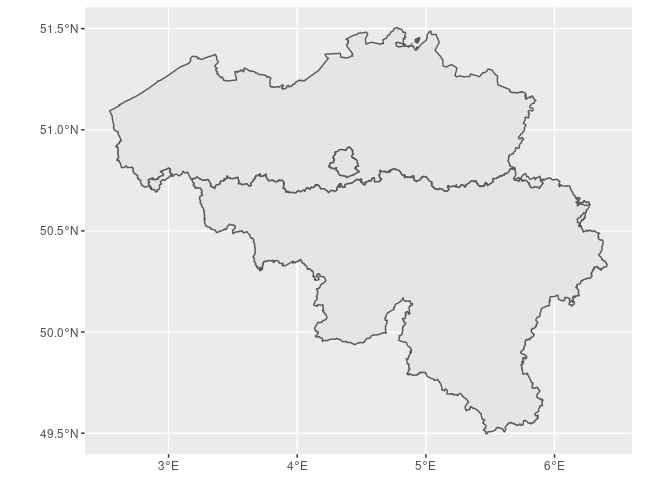
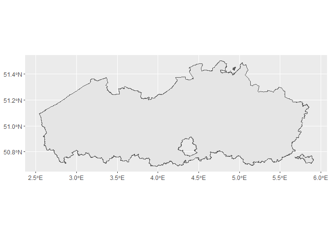
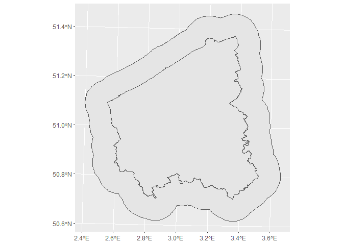

# What is WFS?

In computing, the [Open Geospatial Consortium (OGC) **Web Feature
Service (WFS)**](http://www.opengeospatial.org/standards/wfs) Interface
Standard provides an interface allowing requests for geographical
features across the web using platform-independent calls. One can think
of geographical features as the “source code” behind a map, whereas the
Web Mapping Service (WMS) interface or online tiled mapping portals like
Google Maps return only an image, which end-users cannot edit or
spatially analyze.

The standard output format for reading or downloading data from a WFS is
the XML-based Geography Markup Language (GML), but other formats like
shapefiles or geojson are also available. In early 2006 the OGC members
approved the OpenGIS GML Simple Features Profile. This profile is
designed both to increase interoperability between WFS servers and to
improve the ease of implementation of the WFS standard. (Source:
[Wikipedia](https://en.wikipedia.org/wiki/Web_Feature_Service))

Before we embark on using a WFS service in R, we would like to draw your
attention to the following issue when using a WFS service in a workflow
that needs to be reproducible in the longer term. A distributed, stable
storage of the GIS data used in a workflow is necessary to make that
workflow reproducible on a longer term. When using dynamic databases and
web services, where the data they present are expected to evolve
(e.g. by always pointing at the latest release in these WFS-cases),
this is not guaranteed if you just use the WFS service to directly read
GIS data from it. Instead of directly reading the GIS data, it is also
possible to download the data from the WFS service to disk (and possibly
archive on, e.g., Zenodo) in order to obtain a stable version that can
be re-used later by reading it from disk. Also, in case it takes a long
time to get the GIS data from the WFS service, downloading instead of
directly reading is often a better choice. On the other hand, some types
of workflows might instead require the most up to date GIS data that are
available to be retrieved while no workflow reproducibility is needed.
Do note that publishing the workflow is always recommended for published
work. It serves the scientific community and it is also a way of proving
scientific quality - hence reproducibility is often the best choice for
published work.

Some of the material presented in this tutorial benefitted from a
tutorial presented at the Use of R in Official Statistics conference in
The Hague, September 2018 [Spatial Analysis in R with Open
Geodata](https://github.com/TWIAV/Spatial_Analysis_in_R_with_Open_Geodata/)
and from Lovelace, Nowosad, and Muenchow (2020).

# Useful overviews of web feature services

WFS services for Belgium and regions in Belgium:

  - [overview of WFS services for Flanders
    region](https://overheid.vlaanderen.be/Webdiensten-Overdrachtdiensten)
  - [overview compiled by Michel Stuyts](https://wfs.michelstuyts.be/),
    which is [also available on
    gitlab](https://gitlab.com/GIS-projects/Belgium-WFS/)
  - [overview maintained by DOV
    Vlaanderen](https://dov.vlaanderen.be/page/interessante-webservices)

European portals:

  - [inspire geoportal](https://inspire-geoportal.ec.europa.eu/):
    European portal for spatial data - some of which have a WFS service
  - [environmental data for
    Europe](https://discomap.eea.europa.eu/Index/): many of the products
    listed have either a WMS or a WFS service

Worldwide coverage:

  - [spatineo directory](https://directory.spatineo.com/)

# Used packages

``` r
library(sf) # simple features packages for handling vector GIS data
```

    ## Linking to GEOS 3.8.0, GDAL 3.0.4, PROJ 6.3.1

``` r
library(httr) # generic webservice package
library(tidyverse) # a suite of packages for data wrangling, transformation, plotting, ...
```

    ## -- Attaching packages ---------------------------------------------------------- tidyverse 1.3.0 --

    ## v ggplot2 3.3.0     v purrr   0.3.4
    ## v tibble  3.0.1     v dplyr   0.8.5
    ## v tidyr   1.0.2     v stringr 1.4.0
    ## v readr   1.3.1     v forcats 0.5.0

    ## -- Conflicts ------------------------------------------------------------- tidyverse_conflicts() --
    ## x dplyr::filter() masks stats::filter()
    ## x dplyr::lag()    masks stats::lag()

``` r
library(ows4R) # interface for OGC webservices
```

    ## Loading required package: geometa

    ## Loading ISO 19139 XML schemas...

    ## Loading ISO 19115 codelists...

# Get to know what the service can do with `GetCapabilities`

First of all we need the URL of the service.

``` r
wfs_bwk <- "https://geoservices.informatievlaanderen.be/overdrachtdiensten/BWK/wfs"
```

Next, we append information to the URL address with the aid of
`httr::parse_url` and `httr::build_url`. The former function parses an
URL into a list for easier programmatic addition of information to the
URL. The latter function does the reverse and builds the URL from the
list object.

The `url$query` slot is where you instruct the WFS what information it
should return. It is constructed as a list with name-value pairs. For
now, we only need to specify the `GetCapabilities` request. Other
information such as passing `version = 2.0.0` can be added, but is not
required (by default, the latest version of the WFS service will be
chosen).

``` r
url <- parse_url(wfs_bwk)
url$query <- list(service = "wfs",
                  #version = "2.0.0", # facultative
                  request = "GetCapabilities"
                  )
request <- build_url(url)
request
```

    ## [1] "https://geoservices.informatievlaanderen.be/overdrachtdiensten/BWK/wfs?service=wfs&request=GetCapabilities"

With `GetCapabilities`, we obtain a complete overview of all metadata
for the web service.

To see all capabilities, you can visit [the request in the
webbrowser](https://geoservices.informatievlaanderen.be/overdrachtdiensten/BWK/wfs?service=wfs&request=GetCapabilities).
For instance opening the page in the webbrowser and searching for
“Filter\_Capabilities” allows you to see all possible ways to filter
the data from a WFS layer (e.g. restrict the downloaded data to a
specified bounding box with `SpatialOperator name="BBOX"`).

Instead of searching the page on the web, there are several ways to
access specific pieces of information programmatically. We will show
here how to do this using functions in the `ows4R` package. The first
thing we need to do is generate a connection to the WFS with the aid of
`WFSClient$new()`.

``` r
bwk_client <- WFSClient$new(wfs_bwk, 
                            serviceVersion = "2.0.0") #serviceVersion must be provided here
```

The resulting object `bwk_client` is an R6 object. If you are not
familiar with R6 object, you might want to read [the R6 chapter in
Advanced R](https://adv-r.hadley.nz/r6.html).

Printing \``bwk_client` looks like this:

``` r
bwk_client
```

    ## <WFSClient>
    ##   Inherits from: <OWSClient>
    ##   Public:
    ##     attrs: list
    ##     capabilities: WFSCapabilities, OWSCapabilities, OGCAbstractObject, R6
    ##     clone: function (deep = FALSE) 
    ##     defaults: list
    ##     describeFeatureType: function (typeName) 
    ##     encode: function (addNS = TRUE, geometa_validate = TRUE, geometa_inspire = FALSE) 
    ##     ERROR: function (text) 
    ##     getCapabilities: function () 
    ##     getClass: function () 
    ##     getClassName: function () 
    ##     getFeatures: function (typeName, ...) 
    ##     getFeatureTypes: function (pretty = FALSE) 
    ##     getPwd: function () 
    ##     getToken: function () 
    ##     getUrl: function () 
    ##     getUser: function () 
    ##     getVersion: function () 
    ##     INFO: function (text) 
    ##     initialize: function (url, serviceVersion = NULL, user = NULL, pwd = NULL, 
    ##     logger: function (type, text) 
    ##     loggerType: NULL
    ##     reloadCapabilities: function () 
    ##     url: https://geoservices.informatievlaanderen.be/overdrachtdi ...
    ##     verbose.debug: FALSE
    ##     verbose.info: FALSE
    ##     version: 2.0.0
    ##     WARN: function (text) 
    ##     wrap: FALSE
    ##   Private:
    ##     pwd: NULL
    ##     serviceName: WFS
    ##     system_fields: verbose.info verbose.debug loggerType wrap attrs defaults
    ##     token: NULL
    ##     user: NULL
    ##     xmlElement: NULL
    ##     xmlNamespace: NULL
    ##     xmlNodeToCharacter: function (x, ..., indent = "", tagSeparator = "\n")

The features listed can be accessed using `$`. We can see that some of
them are again functions. As a first example, the following code will
list all available layers for that WFS.

``` r
bwk_client$getFeatureTypes(pretty = TRUE)
```

    ##           name                                    title
    ## 1   BWK:Bwkhab  BWK 2 - BWK-zone en Natura 2000 Habitat
    ## 2 BWK:Bwkfauna BWK 2 - Faunistisch belangrijke gebieden
    ## 3  BWK:Hab3260                 BWK 2 - Habitattype 3260

Another way of accessing this information is:

``` r
bwk_client$getFeatureTypes() %>%
  map_chr(function(x){x$getName()})
```

    ## [1] "BWK:Bwkhab"   "BWK:Bwkfauna" "BWK:Hab3260"

``` r
bwk_client$getFeatureTypes() %>%
  map_chr(function(x){x$getTitle()})
```

    ## [1] "BWK 2 - BWK-zone en Natura 2000 Habitat" 
    ## [2] "BWK 2 - Faunistisch belangrijke gebieden"
    ## [3] "BWK 2 - Habitattype 3260"

We are using `purrr::map()` functionalities here, because the output of
`bwk_client$getFeatureTypes()` is a list and each element of the list
contains information about a layer.

Let’s turn back our attention to `getCapabilities()` and see what
information we can extract from it.

``` r
bwk_client$getCapabilities()
```

    ## <WFSCapabilities>
    ##   Inherits from: <OWSCapabilities>
    ##   Public:
    ##     attrs: list
    ##     clone: function (deep = FALSE) 
    ##     defaults: list
    ##     encode: function (addNS = TRUE, geometa_validate = TRUE, geometa_inspire = FALSE) 
    ##     ERROR: function (text) 
    ##     findFeatureTypeByName: function (expr, exact = TRUE) 
    ##     getClass: function () 
    ##     getClassName: function () 
    ##     getFeatureTypes: function (pretty = FALSE) 
    ##     getOperationsMetadata: function () 
    ##     getOWSVersion: function () 
    ##     getRequest: function () 
    ##     getService: function () 
    ##     getServiceIdentification: function () 
    ##     getServiceProvider: function () 
    ##     getServiceVersion: function () 
    ##     getUrl: function () 
    ##     INFO: function (text) 
    ##     initialize: function (url, version, logger = NULL) 
    ##     logger: function (type, text) 
    ##     loggerType: NULL
    ##     verbose.debug: FALSE
    ##     verbose.info: FALSE
    ##     WARN: function (text) 
    ##     wrap: FALSE
    ##   Private:
    ##     featureTypes: list
    ##     fetchFeatureTypes: function (xmlObj, version) 
    ##     operationsMetadata: OWSOperationsMetadata, R6
    ##     owsVersion: 1.1
    ##     request: OWSGetCapabilities, OWSRequest, OGCAbstractObject, R6
    ##     service: WFS
    ##     serviceIdentification: OWSServiceIdentification, R6
    ##     serviceProvider: OWSServiceProvider, R6
    ##     serviceVersion: 2.0.0
    ##     system_fields: verbose.info verbose.debug loggerType wrap attrs defaults
    ##     url: https://geoservices.informatievlaanderen.be/overdrachtdi ...
    ##     xmlElement: NULL
    ##     xmlNamespace: NULL
    ##     xmlNodeToCharacter: function (x, ..., indent = "", tagSeparator = "\n")

This is again an R6 class object and the `$` can be used to chain
together several functions, much in the same way as the pipe operator
`%>%`. The following chunk illustrates its use. Try executing this
incrementally (select and execute code up to first `$`, second `$`, …)
to see what happens.

``` r
bwk_client$
  getCapabilities()$
  findFeatureTypeByName("BWK:Bwkhab")$
  getDescription() %>%
  map_chr(function(x){x$getName()})
```

    ##  [1] "UIDN"       "OIDN"       "TAG"        "EVAL"       "EENH1"     
    ##  [6] "EENH2"      "EENH3"      "EENH4"      "EENH5"      "EENH6"     
    ## [11] "EENH7"      "EENH8"      "V1"         "V2"         "V3"        
    ## [16] "HERK"       "INFO"       "BWKLABEL"   "HAB1"       "PHAB1"     
    ## [21] "HAB2"       "PHAB2"      "HAB3"       "PHAB3"      "HAB4"      
    ## [26] "PHAB4"      "HAB5"       "PHAB5"      "HERKHAB"    "HERKPHAB"  
    ## [31] "HABLEGENDE" "SHAPE"

This lists all available fields for the layer “BWK:Bwkhab”.

Here is how to get a character vector naming all available operations of
the WFS:

``` r
bwk_client$
  getCapabilities()$
  getOperationsMetadata()$
  getOperations() %>%
  map_chr(function(x){x$getName()})
```

    ## [1] "GetCapabilities"       "DescribeFeatureType"   "GetFeature"           
    ## [4] "GetPropertyValue"      "ListStoredQueries"     "DescribeStoredQueries"
    ## [7] "CreateStoredQuery"     "DropStoredQuery"

The next chunk shows how we can extract the available output formats. We
will see later that `GetFeature` is the operation needed to read or
download data from the WFS. The metadata for this operation has what we
want and we can extract it with a combination of `purrr::map()` and
\``purrr::pluck()`.

``` r
bwk_client$
  getCapabilities()$
  getOperationsMetadata()$
  getOperations() %>%
  map(function(x){x$getParameters()}) %>%
  pluck(3, "outputFormat")
```

    ##  [1] "text/xml; subtype=gml/3.2"           
    ##  [2] "gml32"                               
    ##  [3] "application/gml+xml; version=3.2"    
    ##  [4] "GML2"                                
    ##  [5] "KML"                                 
    ##  [6] "SHAPE-ZIP"                           
    ##  [7] "application/json"                    
    ##  [8] "application/vnd.google-earth.kml xml"
    ##  [9] "application/vnd.google-earth.kml+xml"
    ## [10] "csv"                                 
    ## [11] "gml3"                                
    ## [12] "json"                                
    ## [13] "text/xml; subtype=gml/2.1.2"         
    ## [14] "text/xml; subtype=gml/3.1.1"

<!--
Another interesting piece of metadata we might be interested in is which spatial operations the WFS service is able to do. 
-->

Some more examples follow. Let’s extract the bounding boxes for all
layers.

``` r
bwk_client$
  getCapabilities()$ 
  getFeatureTypes() %>%  
  map(function(x){x$getBoundingBox()})
```

    ## [[1]]
    ##         min       max
    ## x  2.525262  5.936009
    ## y 50.673762 51.505480
    ## 
    ## [[2]]
    ##         min       max
    ## x  2.525262  5.936009
    ## y 50.673762 51.505480
    ## 
    ## [[3]]
    ##         min       max
    ## x  2.525262  5.936009
    ## y 50.673762 51.505480

As expected for this WFS, the bounding boxes are the same for all
layers.

The final example shows how to get the abstract so we can read about the
contents of the layers.

``` r
bwk_client$
  getCapabilities()$ 
  getFeatureTypes() %>%  
  map_chr(function(x){x$getAbstract()})
```

    ## [1] "Zone waaraan een biologische waarde gegeven wordt, alsook een aanduiding van het Natura 2000-habitattype, de vegetatiekundige eenheden of ecotopen, bodembedekking en gegevens over eventueel aanwezige kleine landschapselementen (BWK-karteringseenheden)."                                                                                                                                                             
    ## [2] "Op de Biologische Waarderingskaart krijgen een aantal gebieden een specifieke arcering omwille van de aanwezigheid van bepaalde fauna-elementen. De afbakening is gebaseerd op soorten die tot de Rode lijst-categorieën 'Met uitsterven bedreigd', 'Bedreigd' en 'Kwetsbaar' behoren. Een ruimere omschrijving wordt verstrekt in het afzonderlijk document per kaartblad \"toelichtingXX\", met XX het kaartbladnummer."
    ## [3] "Voorkomen van het Natura 2000 habitattype 3260, de submontane- en laaglandrivieren met waterranonkel- en fonteinkruidvegetaties."

# Read or download vector data from WFS: `GetFeature`

## Example 1: an entire layer

The map of regions of Belgium.

``` r
wfs_regions <- "https://eservices.minfin.fgov.be/arcgis/services/R2C/Regions/MapServer/WFSServer"
regions_client <- WFSClient$new(wfs_regions, 
                            serviceVersion = "2.0.0")
```

    ## Warning in CPL_crs_from_input(x): GDAL Message 1: +init=epsg:XXXX syntax is
    ## deprecated. It might return a CRS with a non-EPSG compliant axis order.

``` r
regions_client$getFeatureTypes(pretty = TRUE)
```

    ##                  name   title
    ## 1 R2C_Regions:Regions Regions

``` r
url <- parse_url(wfs_regions)
url$query <- list(service = "wfs",
                  #version = "2.0.0", # optional
                  request = "GetFeature",
                  typename = "regions",
                  srsName = "EPSG:4326",
                  outputFormat = "GEOJSON")
request <- build_url(url)

bel_regions <- read_sf(request) #Lambert2008
```

``` r
ggplot(bel_regions) +
  geom_sf()
```

<!-- -->

## Example 2: filter by attributes

In this example, we only want to extract specific regions. This can be
done using either [standard OGC filter
specification](https://www.ogc.org/standards/filter) or using a
[Contextual Query Language (CQL)
filter](https://www.loc.gov/standards/sru/cql/index.html), for which a
didactical explanation can be found
[here](https://gcs-docs.s3.amazonaws.com/EVWHS/Miscellaneous/DevGuides/WFS/WFS_Query.htm).\[1\]
The latter, however, only works for WFS services that are hosted on a
GeoServer\!

In this example we also show how the previously used R code can be
stitched together using the pipe (`%>%`) operator.

**Standard OGC filter**

Unfortunately, the standard OGC filter format is very verbose…

``` r
wfs_regions %>%
  parse_url() %>%
  list_merge(query = list(service = "wfs",
                          #version = "2.0.0", # optional
                          request = "GetFeature",
                          typename = "regions",
                          srsName = "EPSG:4326",
                          outputFormat = "GEOJSON",
                          filter = "<Filter><PropertyIsEqualTo><PropertyName>regions:NameDUT</PropertyName><Literal>'Vlaams Gewest'</Literal></PropertyIsEqualTo></Filter>")) %>%
  build_url() %>%
  read_sf() %>%
  ggplot() +
  geom_sf()
```

<!-- -->

**CQL filter**

We use a different WFS service for which CQL works. First we need to
know the names of the fields by which we can filter.

``` r
wfs_vrbg <- "https://geoservices.informatievlaanderen.be/overdrachtdiensten/VRBG/wfs"

vrbg_client <- WFSClient$new(wfs_vrbg, 
                            serviceVersion = "1.1.0")

vrbg_client$
  getCapabilities()$
  findFeatureTypeByName("VRBG:Refprv")$
  getDescription() %>%
  map_chr(function(x){x$getName()})
```

    ## [1] "UIDN"    "OIDN"    "TERRID"  "NAAM"    "NISCODE" "NUTS2"   "SHAPE"

``` r
# another way of doing this:
wfs_vrbg %>%
  parse_url() %>%
  list_merge(query = list(service = "wfs",
                          #version = "1.1.0", # optional
                          request = "DescribeFeatureType",
                          typeName = "VRBG:Refprv")) %>%
  build_url() %>%
  GET()
```

    ## Response [https://geoservices.informatievlaanderen.be/overdrachtdiensten/VRBG/wfs?service=wfs&request=DescribeFeatureType&typeName=VRBG%3ARefprv]
    ##   Date: 2021-01-14 09:50
    ##   Status: 200
    ##   Content-Type: text/xml; subtype=gml/3.2
    ##   Size: 1.55 kB
    ## <?xml version="1.0" encoding="UTF-8"?><xsd:schema xmlns:xsd="http://www.w3.or...
    ##   <xsd:import namespace="http://www.opengis.net/gml/3.2" schemaLocation="http...
    ##   <xsd:complexType name="RefprvType">
    ##     <xsd:complexContent>
    ##       <xsd:extension base="gml:AbstractFeatureType">
    ##         <xsd:sequence>
    ##           <xsd:element maxOccurs="1" minOccurs="1" name="UIDN" nillable="fals...
    ##           <xsd:element maxOccurs="1" minOccurs="1" name="OIDN" nillable="fals...
    ##           <xsd:element maxOccurs="1" minOccurs="0" name="TERRID" nillable="tr...
    ##           <xsd:element maxOccurs="1" minOccurs="0" name="NAAM" nillable="true...
    ## ...

The CQL filter format is much more human readable and easier to code:

``` r
sf_prov <- wfs_vrbg %>% 
  parse_url() %>% 
  list_merge(query = list(service = "wfs",
                          #version = "1.1.0", # optional
                          request = "GetFeature",
                          typeName = "VRBG:Refprv",
                          srsName = "EPSG:31370",
                          cql_filter="NAAM='West-Vlaanderen'",
                          outputFormat = "text/xml; subtype=gml/3.1.1")) %>% 
  build_url() %>% 
  read_sf(crs = 31370)

sf_prov
```

    ## Simple feature collection with 1 feature and 7 fields
    ## geometry type:  MULTISURFACE
    ## dimension:      XY
    ## bbox:           xmin: 21991.38 ymin: 155928.6 xmax: 90416.92 ymax: 229719.6
    ## projected CRS:  Belge 1972 / Belgian Lambert 72
    ## # A tibble: 1 x 8
    ##   gml_id   UIDN  OIDN TERRID NAAM   NISCODE NUTS2                          SHAPE
    ## * <chr>   <dbl> <dbl>  <dbl> <chr>  <chr>   <chr>             <MULTISURFACE [m]>
    ## 1 Refprv~    14     3    351 West-~ 30000   BE25  (POLYGON ((80190.82 229279.7,~

Note, the rather exotic geometry type that is returned (MULTISURFACE).
Some `sf` functions, such as `st_buffer()`, will not work out of the box
for this type. In this specific case, we need an intermediate step
`st_cast()` to make it work.

``` r
sf_prov %>% 
  st_buffer(dist = 100) # errors
```

    ## Error in CPL_geos_op("buffer", x, dist, nQ, numeric(0), logical(0)): Evaluation error: ParseException: Unknown WKB type 12.

``` r
sf_prov_buffer <- sf_prov %>% 
  st_cast(to = "GEOMETRYCOLLECTION") %>% 
  st_buffer(dist = 10000) # works

sf_prov %>% 
  ggplot() + 
  geom_sf(data = sf_prov_buffer) +
  geom_sf()
```

<!-- -->

Also check-out [example 4](example4) for a more advanced use of the CQL
filter.

## Example 3: restrict to a bounding box

This examples illustrates how you can read or download information from
a WFS for further use in R.

Let’s start by reading in the “BWK:Bwkhab” layer for the Hallerbos area.

The main part is defining the input and output. We store the data in
[GeoJSON](https://en.wikipedia.org/wiki/GeoJSON) format which is an open
standard format designed for representing simple geographical features,
along with their non-spatial attributes. It is based on JSON, the
JavaScript Object Notation.

We also add the bounding box from which we want to retrieve the data.
This is very important to add. If you omit a bounding box, the service
will return the entire map which can be very large.

``` r
url <- parse_url(wfs_bwk)
url$query <- list(service = "WFS",
                  #version = "2.0.0", # optional
                  request = "GetFeature",
                  typename = "BWK:Bwkhab",
                  bbox = "142600,153800,146000,156900",
                  outputFormat = "application/json")
request <- build_url(url)
```

Let’s check what we are about to read with `sf::st_layers()`. This time,
the function does return useful information, but the layer name
BWK:Bwkhab seems to be overwritten.

``` r
st_layers(request)
```

    ## Driver: GeoJSON 
    ## Available layers:
    ##   layer_name geometry_type features fields
    ## 1 OGRGeoJSON       Polygon      670     32

``` r
bwk_hallerbos <- read_sf(request)
```

Note that the `layer = ...` argument of `sf:read_sf()` cannot be used to
specify the layer when you pass a WFS GetFeature request to the
function.

Let’s make a simple plot of the object. Note that the object contains
features outside of the bounding box. Those are features which have only
some part within the bounding box.

``` r
ggplot(bwk_hallerbos) + 
  geom_sf()
```

<!-- -->

You can use `sf::st_write()` to save this layer in any format that is
listed by `sf::st_drivers()`.

Continuing from the same request we got earlier, we can download the
data with `httr::GET` and `httr::write_disk()`.

``` r
file <- tempfile(fileext = ".geojson")
GET(url = request, 
    write_disk(file))
```

    ## Response [https://geoservices.informatievlaanderen.be/overdrachtdiensten/BWK/wfs?service=WFS&request=GetFeature&typename=BWK%3ABwkhab&bbox=142600%2C153800%2C146000%2C156900&outputFormat=application%2Fjson]
    ##   Date: 2021-01-14 10:15
    ##   Status: 200
    ##   Content-Type: application/json;charset=UTF-8
    ##   Size: 821 kB
    ## <ON DISK>  C:\Users\HANS_V~1\AppData\Local\Temp\RtmpWMPFqw\file205016f66019.geojson

At this point, all features are downloaded and can be used in R as we
would we any other local file. So we need to load the file with
`read_sf()` from `sf`.

``` r
bwk_hallerbos2 <- read_sf(file)
```

## Example 4: extract feature data at particular points <a name="example4"></a>

In some situations, we do not need the spatial features (polygons,
lines, points), but are interested in the data at a particular point
(i.e. attribute table data) of the spatial feature. When working in a
local GIS environment, one would use a spatial operator to extract the
data (e.g. `within`, `intersects`, `contains`,…). As we discussed
earlier, WFS supports certain spatial operators as part of the service
to directly query this data and overcomes the need to download the
spatial feature data first.

Consider the following use case: You want to extract the attribute data
from a [soil
map](http://www.geopunt.be/catalogus/datasetfolder/5c129f2d-4498-4bc3-8860-01cb2d513f8f)
for a number of sampling points (point coordinates). This use case can
be tackled by relying on the WFS service and the affiliated spatial
operators.

Our example data point (in Lambert 72):

``` r
x_lam <- 173995.67
y_lam <- 212093.44
```

From this point we know the data, so we can verify the result (in
Dutch):

  - Bodemtype: s-Pgp3(v)
  - Bodemserie: Pgp
  - Textuurklasse: licht zandleem
  - Drainageklasse: uiterst nat, gereduceerd

Hence, we now want to extract these soil properties from the WFS, for
the coordinates defined above.

``` r
properties_of_interest <- c("Drainageklasse",
                            "Textuurklasse",
                            "Bodemserie",
                            "Bodemtype")
```

The URL of the wfs service of the soil map of the Flemish region:

``` r
wfs_bodemtypes <- "https://www.dov.vlaanderen.be/geoserver/bodemkaart/bodemtypes/wfs"
```

The essential part is to set up the proper query\! The required data for
the service is defined in the
[metadata](https://www.dov.vlaanderen.be/geoserver/bodemkaart/bodemtypes/wfs?version=1.1.0&request=GetCapabilities&service=wfs)
description. This can look a bit overwhelming at the start, but is a
matter of looking for some specific elements of the (XML) document:

  - `service` (WFS), `request` (GetFeature) and `version` (1.1.0) are
    mandatory fields (see below)
  - `typeName`: Look at the different `<FeatureType...` enlisted and
    pick the `<Name>` of the one you’re interested in. In this
    particular case `bodemkaart:bodemtypes` is the only one available.
  - `outputFormat`: The supported output formats are enlisted in
    `<ows:Parameter name="outputFormat">`. As the service provides CSV
    as output, this is a straightforward option. `json` is another
    popular one.
  - `propertyname`: A list of the attribute table fields (cfr. supra). A
    full list of the Flanders soil map is provided
    [here](https://www.dov.vlaanderen.be/geoserver/bodemkaart/bodemtypes/wfs?request=DescribeFeatureType).
  - We also define the `CRS`, using the [EPSG
    code](http://spatialreference.org/).
  - `CQL_FILTER`: Define the spatial operator, in this case `INTERSECTS`
    of the WFS `geom` and our `POINT` coordinate. The operators are
    enlisted in the `<ogc:SpatialOperators>` field.

Formatting all this information in a query and executing the request
(`GET`) towards the service:

``` r
query <- list(service = "WFS",
             request = "GetFeature",
             #version = "1.1.0", # optional
             typeName = "bodemkaart:bodemtypes",
             outputFormat = "csv",
             propertyname = as.character(paste(properties_of_interest,
                                               collapse = ",")),
             CRS = "EPSG:31370",
             CQL_FILTER = sprintf("INTERSECTS(geom,POINT(%s %s))",
                                  x_lam, y_lam)) 
result <- GET(wfs_bodemtypes, query = query)
result
```

    ## Response [https://www.dov.vlaanderen.be/geoserver/bodemkaart/bodemtypes/wfs?service=WFS&request=GetFeature&typeName=bodemkaart%3Abodemtypes&outputFormat=csv&propertyname=Drainageklasse%2CTextuurklasse%2CBodemserie%2CBodemtype&CRS=EPSG%3A31370&CQL_FILTER=INTERSECTS%28geom%2CPOINT%28173995.67%20212093.44%29%29]
    ##   Date: 2021-01-14 10:33
    ##   Status: 200
    ##   Content-Type: text/csv;charset=UTF-8
    ##   Size: 129 B
    ## FID,Bodemtype,Bodemserie,Textuurklasse,Drainageklasse
    ## bodemtypes.72727,s-Pgp3(v),Pgp,licht zandleem,"uiterst nat, gereduceerd"

The result is not yet formatted to be used as a dataframe. We need to
use a small *trick* using the `textConnection` function to get from the
result (bits) towards a readable output in a dataframe:

``` r
df <- read.csv(textConnection(content(result, 'text')))
knitr::kable(df)
```

| FID              | Bodemtype | Bodemserie | Textuurklasse  | Drainageklasse           |
| :--------------- | :-------- | :--------- | :------------- | :----------------------- |
| bodemtypes.72727 | s-Pgp3(v) | Pgp        | licht zandleem | uiterst nat, gereduceerd |

Which indeed corresponds to the data of the coordinate.

This procedure can also be turned into a function with lat, long and
properties of interest as parameters.

# References

<div id="refs" class="references hanging-indent">

<div id="ref-lovelace_geocomputation_2020">

Lovelace, Robin, Jakub Nowosad, and Jannes Muenchow. 2020.
*Geocomputation with R*. <https://geocompr.robinlovelace.net>.

</div>

</div>

1.  Note that CQL was formerly called Common Query Language.
