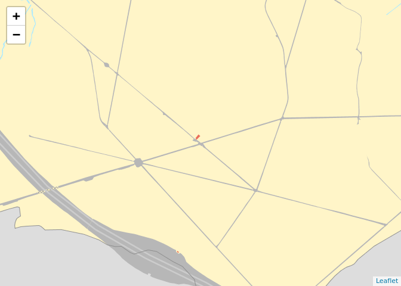
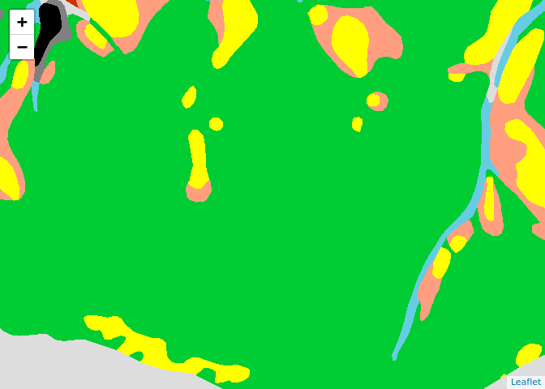
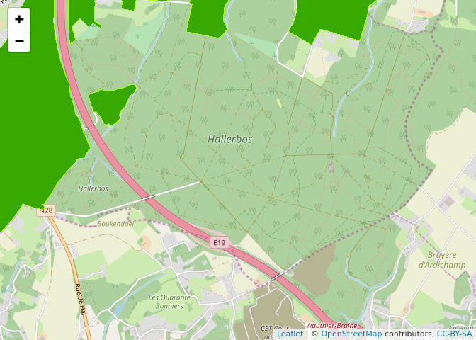
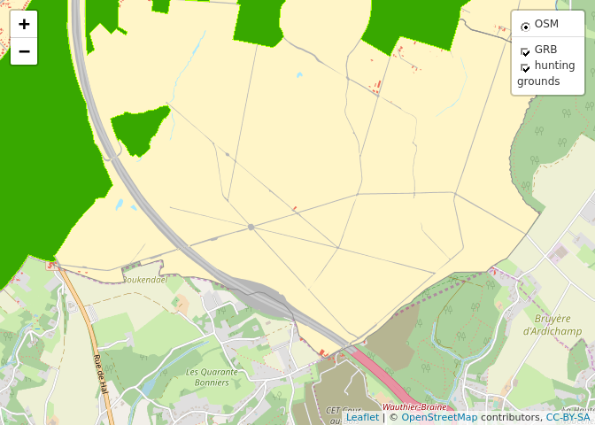

WMS stands for [Web Map Service](https://en.wikipedia.org/wiki/Web_Map_Service). The service provides prerendered tiles at different scales. This makes it useful to include them as background images in maps.

`wms_grb` links to the WMS of the [GRB-basiskaart](http://www.geopunt.be/catalogus/webservicefolder/aa04ae22-2297-98c3-1ffd-3440-5aff-bd2c-8a0cc151), the Flemish cadastral map. It depicts land parcels, buildings, watercourses, roads and railroads.

`wms_ortho` contains a mosaic of recent [orthophotos](http://www.geopunt.be/catalogus/webservicefolder/418e8e4a-12c1-80a8-8306-fcf4-799c-581d-c4e38594) made during the winter. The layer `Ortho` contains the images, the layer `Vliegdagcontour` detail on the time when the pictures were taken.

`wms_inbo` is a WMS providing [several layers]()

`wms_hunting` displays [hunting grounds](http://www.geopunt.be/catalogus/webservicefolder/525f1e17-c7d8-3bf3-550c-82c4-7fb3-e97c-a9bc3a6b) in Flanders

``` r
wms_grb <- "https://geoservices.informatievlaanderen.be/raadpleegdiensten/GRB-basiskaart/wms"
wms_ortho <- "https://geoservices.informatievlaanderen.be/raadpleegdiensten/OMWRGBMRVL/wms"
wms_inbo <- "https://geoservices.informatievlaanderen.be/raadpleegdiensten/INBO/wms"
wms_hunting <- "https://geoservices.informatievlaanderen.be/raadpleegdiensten/Jacht/wms"
```

As background of interactive maps
=================================

WMS layers can be added to a `leaflet` map using the `addWMSTiles()` function.

``` r
library(leaflet)
leaflet() %>% 
  setView(lng = 4.287638, lat = 50.703039, zoom = 15) %>% 
  addWMSTiles(
    wms_grb,
    layers = "GRB_BSK",
    options = WMSTileOptions(format = "image/png", transparent = TRUE)
  )
```



``` r
leaflet() %>% 
  setView(lng = 4.287638, lat = 50.703039, zoom = 15) %>% 
  addWMSTiles(
    wms_ortho,
    layers = "Ortho",
    options = WMSTileOptions(format = "image/png", transparent = TRUE)
  )
```


``` r
leaflet() %>% 
  setView(lng = 4.287638, lat = 50.703039, zoom = 15) %>% 
  addWMSTiles(
    wms_inbo,
    layers = "PNVeg",
    options = WMSTileOptions(format = "image/png", transparent = TRUE)
  )
```



``` r
leaflet() %>% 
  setView(lng = 4.287638, lat = 50.703039, zoom = 14) %>% 
  addTiles(group = "OSM") %>%
  addWMSTiles(
    wms_hunting,
    layers = "Jachtterr",
    options = WMSTileOptions(format = "image/png", transparent = TRUE)
  )
```



``` r
leaflet() %>% 
  setView(lng = 4.287638, lat = 50.703039, zoom = 14) %>% 
  addTiles(group = "OSM") %>%
  addWMSTiles(
    wms_grb,
    layers = "GRB_BSK",
    options = WMSTileOptions(format = "image/png", transparent = TRUE),
    group = "GRB"
  ) %>%
  addWMSTiles(
    wms_hunting,
    layers = "Jachtterr",
    options = WMSTileOptions(format = "image/png", transparent = TRUE),
    group = "hunting<br>grounds"
  ) %>%
  addLayersControl(
    baseGroups = "OSM",
    overlayGroups = c("GRB", "hunting<br>grounds"),
    options = layersControlOptions(collapsed = FALSE)
  )
```


