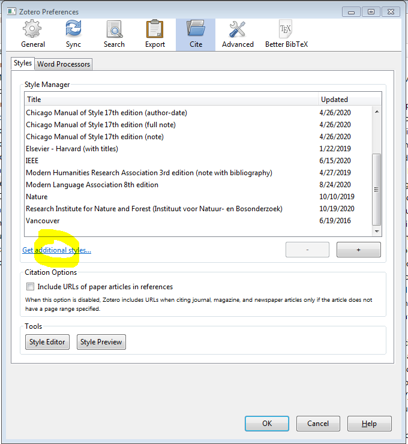
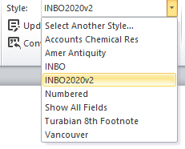

# The INBO citation style

Most journals, publishers and companies use a specified format for
citations and bibliographies. The Research Institute for Nature and
Forest (INBO) is no exception.

All bibliography managers provide ways to automate the formatting of
citations and bibliographies which greatly facilitates scientific
publishing. Depending on the bibliographic manager software, the style
formatting rules are stored in specific files. In this tutorial you will
learn how to use the INBO citation style in EndNote, Mendeley and Zotero
bibliography managers.

EndNote uses a `*.ens` file to store the style formatting rules, whereas
Mendeley and Zotero use the open source `*.csl` file (Citation Style
Language)\[<https://citationstyles.org/>\].

The latest official CSL file of the INBO citation style is available at
the CSL style repository (also transferred automatically to the Zotero
style repository). See
(finding-and-installing-styles)\[<https://citationstyles.org/authors/#/finding-and-installing-styles>\]
for more information.

Here are direct links to the CSL file:

  - (file in the CSL style
    repository)\[<https://github.com/citation-style-language/styles/blob/master/research-institute-for-nature-and-forest.csl>\]
  - (file in the Zotero style
    repository)\[<https://www.zotero.org/styles/research-institute-for-nature-and-forest>\]

The link to the Zotero style repository lets you directly download the
style file.

In case older versions are needed, they can be obtained from
successively numbered releases from our (forked styles
repo)\[<https://github.com/inbo/styles/releases>\].

The EndNote `*.ens` file can be downloaded
(here)\[<https://sites.google.com/a/inbo.be/intranet/ondersteuning/bibliotheek/endnote-informatie/endnotehuisstijl>\]
(only accessible for INBO employees).

Curious what the formatted INBO citation style and bibliography looks
like for various document types? Take a look at these links:

<!-- - Pdf op basis van [bst bestand](citation_style/citation_style_bst.pdf) -->

  - [PDF based on CSL
    file](https://github.com/inbo/inbomd_examples/tree/master/source/citation_style/en/citation_style_csl.pdf)
  - [HTML based on CSL
    file](https://github.com/inbo/inbomd_examples/tree/master/source/citation_style/en/index.html)

# Use in bibliography managers

## Zotero

1.  Open Zotero

2.  Go to `Edit > Preferences > Cite` and click on “Get additional
    styles…”
    
    

3.  In the search field in the popup window that opens type “Research
    Institute for Nature and Forest” and click on the corresponding link

There are good online tutorials that explain how to use Zotero in
combination with [google
docs](https://www.zotero.org/support/google_docs) and [MS
Word](https://www.zotero.org/support/word_processor_plugin_usage).

## Mendeley

1.  Open Mendeley

2.  Go to `View > Citation styles > More styles > Get more styles`

3.  In the search field type “Research Institute for Nature and Forest”
    and click “use this style”
    
    

Guidelines on how to use Mendeley in combination with MS Word or
LibreOffice can be found
[here](https://www.mendeley.com/guides/using-citation-editor).

## EndNote

1.  (Download the INBO style
    file)\[<https://sites.google.com/a/inbo.be/intranet/ondersteuning/bibliotheek/endnote-informatie/endnotehuisstijl>\]

2.  If you do not already have a folder where style files are stored,
    create one (make sure you have read and write rights and choose a
    good location that will not be accidentally deleted (not on your
    desktop)

3.  In EndNote go to `Edit > Preferences > Folder Locations > Style
    Folder` and choose the folder containing the style file(s)

4.  Go to `Edit > Output Styles > Open Style Manager` and activate the
    INBO style and other styles you want to use (check the box)
    
    

5.  The styles carry a name and version number, so they can be used at
    will.

6.  The INBO style can now be used in Windows Word through the EndNote
    add-on.
    
    

The University of Melbourne provides good
[guidelines](https://unimelb.libguides.com/c.php?g=403235&p=2744645) on
how to use EndNote in combination with MS Word.
