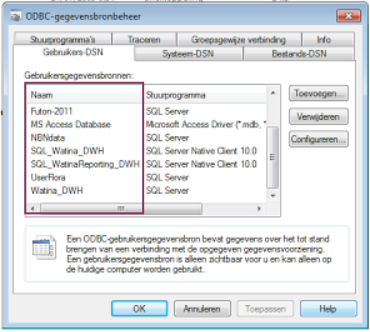

```{r setup, include=FALSE}
knitr::opts_chunk$set(echo = TRUE)
```

To query data from a SQL database that is already accessible using MSAccess, such a database is also accessible from R using the package [RODBC](https://cran.r-project.org/web/packages/RODBC/index.html). This package enables the link in between R and the (remote) database. After installation of the package (`install.packages('RODBC')`), the package can be loaded:

```{r, loadpackage, warning = FALSE, message = FALSE}
library(RODBC)
```

For Windows users, the most important element is to know the so-called `DSN` (i.e. a registered Data Source Name). Actually, it is just the name of the database as it is known by your computer (and MS Access). The easiest way to check the `DSN` is to check the [*registered ODBC connections*](http://www.stata.com/support/faqs/data-management/configuring-odbc-win/) in the administrator tools menu. 

For Dutch-speaking Windows 7 users: 

    > Kies in het Configuratiescherm van Windows de optie Systeembeheer > Gegevensbronnen (ODBC). De optie Systeembeheer verschijnt in de categorie Systeem en onderhoud.

You should see a list similar to the list underneath, with the names of the available DSN names enlisted:


An alternative way to check the DSN name of a database already working on with Access, is to check the DSN inside MS Access (in dutch, check menu item *Koppelingsbeheer*): 


For example, the DSN name `UserFlora` or `Cydonia-prd` can be used to query these databases and extract data from it with similar queries to the one used in MSAccess. First of all, the connection with the database need to be established, by using the `odbcConnect` function, providing the DSN name as argument (Notice, you have to change the comments when running the tutorial in windows):

```{r sqlconnection}
# WINDOWS USERS (uncomment when working in Windows)
#my_connection <- odbcConnect("UserFlora") # uncomment for windows users

# LINUX/MAC USERS (comment out when working in Windows)
my_connection <- odbcDriverConnect("Driver={ODBC Driver 13 for SQL Server};Server=inbosql04.inbo.be;Database=UserFlora;Trusted_Connection=yes;")
```

Once this connection is sucessfully established, the database can be queried. 

**Remark for linux users:** When working in Linux, this setup requires an active *kerberos* session. More information about the setup and functionality will be provided in an upcoming tutorial.

## Get a complete table from the databse

The function `sqlFetch` can be used to load an entire table from a database. For example, to extract the `tblTaxon` table from the flora database:

```{r querytable}
rel_taxa <- sqlFetch(my_connection, "dbo.relTaxonTaxonGroep")
head(rel_taxa)
```

with the connection `my_connection` made earlier is used as the first argument, the table name is the second argument.

**Remark:** If you have no idea about the size of the table you're trying to load from the database, this could be rather tricky and cumbersome. Hence, it is probably better to only extract a portion of the table using a query.

## Execute a query to the database

The function `sqlQuery` provides more flexibilty as it can be used to try any SQL-query on the database. A complete introduction to the SQL language is out of scope here. We will focus on the application and the reusage of a query.

```{r queryrun}
meting <- sqlQuery(my_connection, paste("SELECT TOP 10 * FROM dbo.tblMeting", 
                                        "WHERE Cor_X IS NOT NULL"))
head(meting)
```

## Create and use query templates

When you regularly use similar queries, with some minimal alterations, you do not want to copy/paste each time the entire query. It is prone to errors and you're script will become verbose. It is advisable to create query *templates*, that can be used within the `sqlQuery` function. 

Consider the execution of the following query. We are interested in those records with valid X and Y coordinates for the measurement, based on a given dutch name:

```{r queryexample}
subset_meting <- sqlQuery(my_connection, 
"SELECT meet.Cor_X
	 , meet.Cor_Y
	 , meet.MetingStatusCode
	 , tax.NaamNederlands
	 , tax.NaamWetenschappelijk
	 , waar.IFBLHokID
FROM  [dbo].[tblMeting] AS meet
	LEFT JOIN [dbo].tblTaxon AS tax ON tax.ID = meet.TaxonID
	LEFT JOIN [dbo].tblWaarneming AS waar ON waar.ID = meet.WaarnemingID
WHERE meet.Cor_X IS NOT NULL
	AND meet.Cor_X != 0
	AND tax.NaamNederlands LIKE 'Wilde hyacint'")
head(subset_meting)
```

If we need this query regularly, but each time using a different `tax.NaamNederlands` (only the name changes), it is worthwhile to invest some time in the creation of a small custom function that uses this query as a template. Let's create a function `flora_records_on_dutch_name` that takes a valid database connection and a given dutch name and returns the relevant subset of the data for this query:

```{r querytemplate}

flora_records_on_dutch_name <- function(dbase_connection, dutch_name) {
     sqlQuery(dbase_connection, sprintf(
            "SELECT meet.Cor_X
            	 , meet.COr_Y
            	 , meet.MetingStatusCode
            	 , tax.NaamNederlands
            	 , tax.NaamWetenschappelijk
            	 , waar.IFBLHokID
            FROM  [dbo].[tblMeting] meet
            	LEFT JOIN [dbo].tblTaxon tax ON tax.ID = meet.TaxonID
            	LEFT JOIN [dbo].tblWaarneming waar ON waar.ID = meet.WaarnemingID
            WHERE meet.Cor_X IS NOT NULL
            	AND meet.Cor_X != 0
            	AND tax.NaamNederlands LIKE '%s'", dutch_name))
}

```

Hence, instead of copy-pasting the whole query each time (which could be error-prone), we can reuse the function for different names:

```{r}
hyacint <- flora_records_on_dutch_name(my_connection, "Wilde hyacint")
head(hyacint)
```

```{r}
bosanemoon <- flora_records_on_dutch_name(my_connection, "Bosanemoon")
head(bosanemoon)
```

**Remark:** Do not forget to close your connection when done finished. 

```{r closeit}
close(my_connection)
```

## The `sprintf` function {#sprintf}

In order to accomplish the re-usage of a query for different input names (`dutch_name`), the `sprintf` function is used. The `sprintf` function provides the ability to combine text and variable values in a single charactor string (i.e. the query to execute). For each variable name required in the query (any part of your query you want to have interchangeable), a representation in the query is given by a `%` in combination with the data type you want to represent. The latter is an agreed format conversion, for example `%s` is a character string (e.g. the example of `dutch_name`) and `%i` is an integer value (e.g. `2`). More information about the different symbols is given in the documentation of `sprintf` (type `?sprintf` in the console). 

```{r sprintfex1}
a_name <- 'Jan'
an_integer <- 3
a_float <- 2.8
sprintf('This prints a combination of a name: %s, an integer: %i and a float value: %f', a_name, an_integer, a_float)
```

For float values, you can further define the fixed number of decimals (`%f`) or a fixed number of significant digits with `%g`

```{r sprintfex2}
a_float <- 0.0008262372
sprintf('This prints the same value with five: %.5f or two: %.2f decimal numbers, or a define a number of significant digits: %.5g or %.2g which is sometimes more useful.', a_float, a_float, a_float, a_float)
```

Similarly, this approach can be used to programmatically create template queries with adaptable input values. 


