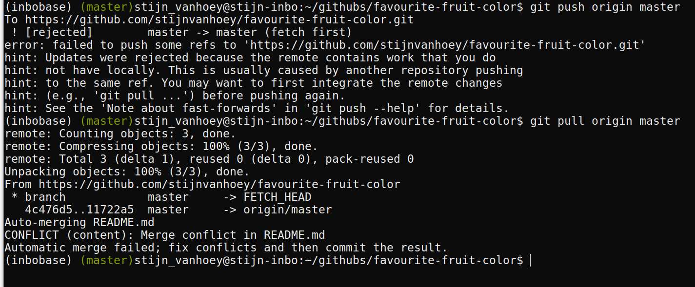
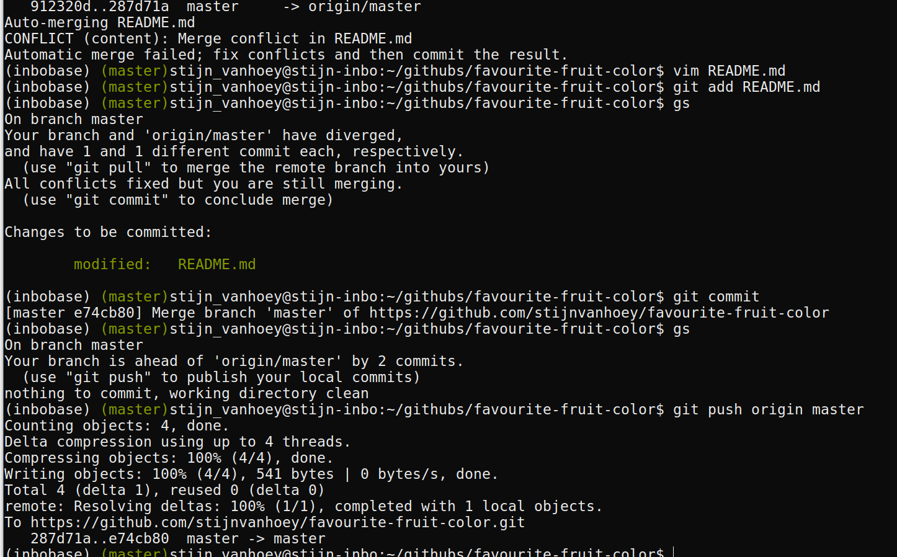

<style type="text/css">
    .reveal section img { 
        border:none; 
        box-shadow:none; 
        }
    .reveal code {
    	font-family: monospace;
    	color: #c04384;
        }
    .reveal pre code {
    	font-family: monospace;
    	color: #1a1a1a;
    	background: ##ececec;
        }
</style>


## Working on your own {data-background=#c2c444}

---

### Create a repo

1. Go to [GitHub](https://github.com) and login
2. Follow [this tutorial](https://help.github.com/articles/create-a-repo/) to create a repo

---


    

---


---

### Clone a repo to work locally

1. Install [git](https://git-scm.com/book/en/v2/Getting-Started-Installing-Git)
2. [Configure git](https://help.github.com/articles/set-up-git/)
3. Follow [this tutorial](https://help.github.com/articles/cloning-a-repository/) to clone your repo

__Tip__: [adapt git configuration](https://git-scm.com/docs/git-config.html#git-config-coreeditor) to use your favourite editor

```
git config --global core.editor gedit
```

---

### Make a commit

1. Open your favourite text editor
2. Update the `README.md`
3. Commit your changes

---

### Make a commit

1. Check the differences: `git status` and `git diff`
2. Commit your changes with `git commit`: 
    * Write commit message in editor: 
    ```
    git commit README.md
    ```
    * Write commit message inline: 
    ```
    git commit -m 'Proper commit message README.md'
    ```

---

### Push your changes to backup your work

* Command `git push`: 
```
git push origin master
```

---

### Go to your repo on GitHub to verify


---

### Create logical commits

1. Make 2 unrelated changes to your `README.md` locally
2. Create one commit for each change.
3. Do not push (yet)

---

### Create logical commits

```
git add -p README.md
```


---

### Create a conflict

Update your `README.md` on GitHub,<br/>
on a line you also edited locally


---

### Conflict!

```
git pull origin master
```



---

### Keep calm and resolve conflict

1. Open `README.md` in text editor:

        <<<<<<< HEAD
        A simple analysis to visualize my favourite fruit colour.
        =======
        A simple analysis to discover my favourite fruit color.
        >>>>>>> origin/master

2. Choose what you want to keep:

        A simple analysis to discover my favourite fruit colour.

3. Commit and push

        git add <fixed files>
        git commit
        git push origin master

---

### Resolve conflict



---

### Add a file

1. Add a `fruits.csv` file in a `/data` directory
2. Link to this file in the `README.md`

---

### Add a file

`git commit -am "My message"` <br/>
takes all changes in a single commit

```
git add data/fruits.csv
git commit -am "Add data file"
git push origin master
```

---

### Undo or adapt last commit: command line

```
git revert HEAD
```

<br/><br/>
<small>
**Tip**: `git revert` can be applied for more functionality. <br/> See [this tutorial](https://inbo.github.io/tutorials/manual-git-undo-commits.html) for more in depth information on undoing commits. 

**Tip**: `git checkout -- <file-name>` will undo changes <br/>to file since last commit (!no log of your changes)

**Tip**: `git reset HEAD~` will unstage changes <br/>(similar to Github Desktop)
</small>

---

### View history

1. `git log`
2. Copy a HASH
3. `git checkout HASH`
4. Check the local directory and files on your computer
5. `git checkout master`

---

### Create a branch to experiment

1. Create a branch
2. Add an analysis file in a `/src` directory
3. Commit
4. Switch between branches

---

### Create a branch to experiment: command line

1. Create a branch by a checkout to new branch, `git checkout -b`: 
    ```
    git checkout -b analysis-script
    ```
2. Get an overview of your branches: `git branch`
3. `git add` a file to the repository
4. Go back to the status of the master: 
    ```
    git checkout master
    ```
5. Verify your local directory structure: where are your files?
6. Go back to the status of the new branch: 
    ```
    git checkout analysis-script
    ```

---

### Create a pull request to include your work

```
git push origin analysis-script
```


---

### Review your pull request


---

### Review your pull request

1. Review
2. If OK, merge pull request
3. Delete branch

---

### Update local master after remote merge

```
git fetch origin
git checkout master
git merge --ff-only origin/master
git branch -d analysis-script
```

**Cfr. local merge**: `git checkout master` and `git merge analysis-script`

---

### Exclude files

* in any programming language, some files are _derivatives_
* sensitive information (passwords,...)
* a folder with large data files that should not be in the history (and backuped elsewhere!)
* a _temp/_ folder for just garbage you create/...

`.gitignore` to the rescue!

---

### Exclude files: command line

1. Go to master branch `git checkout master`
2. Create a new file `password.txt` with the words `SECRET`
3. `git status` and `git diff`
4. Create a file `.gitignore` to exclude the `password.txt` file
5. `git status` and `git diff`
6. `git commit` your adaptation to the `.gitignore` file
7. `git push` your changes to GitHub
8. Verify the `.gitignore` file on GitHub

---

## Working together {data-background=#c2c444}

---

### Teaming up

* Team up with two or three persons
* Let one person invite the others, provide them with read/write access as explained in [this tutorial](https://help.github.com/articles/inviting-collaborators-to-a-personal-repository/)

---

### Invite collaborators


---

### Invite collaborators


---

### Collaboration: issues

* Raise an **issue** online
* Provide issues with an appropriate label
* Assign your colleague to the issue

---

### Collaboration: online adaptations

* Make an adaptation to an online file
* Propose a **pull request** and assign your collaborator
* Merge the adaptation to the `master` branch

---

### Collaboration: local adaptations

**Working local - merging online**

* As collaborator, `clone` the other repository to your local computer
* Create a new `branch` with a different name
* Adapt the content of a file
* `commit` your adaptation
* `push` your `branch` to the remote repository
* Go to GitHub and make a `pull request`
* Revise the work and `merge` online when appropriate
* Update your local work
* Check if all adaptations are represented in your local files

**Tip**: All functionalities are available in the previous sections

---

### Release

Once you are satisfied with the status of your analysis, it makes sense to create a release:

* For publications (DOI)
* For code/software development versions
* For course notes

Follow [this tutorial](https://help.github.com/articles/creating-releases/) to create a release.

---

### Alias usage for command line

As an **example**, give it your flavour:

```
alias gcl='git clone'

alias gs='git status'
alias gd='git diff --word-diff'

alias ga='git add'
alias gap='git add -p'
alias gcm='git commit -v -m'
alias gcam='git commit -am'

alias gch='git checkout'
alias gchb='git checkout -b'

alias gfo='git fetch origin'

alias gm='git merge'
alias gpl='git pull'
alias gps='git push'
alias gplom='git pull origin master'
alias gpsom='git push origin master'
alias gplfm='git fetch origin; git checkout master; git merge --ff-only origin/master'

alias glog="git log --graph --pretty=format:'%C(bold)%h%Creset%C(magenta)%d%Creset %s %C(yellow)<%an> %C(cyan)(%cr)%Creset' --abbrev-commit --date=relative"
```
---

### Some more advice:

* Commit often, make small commits
* Don’t mix changes in 1 commit
* Think about your commit messages
* Keep your code clean, avoid huge one-liners
* Use branches (!)
* Don’t keep long-lived branches (form of technical debt)

---

**There’s no such thing, as a free lunch...**

---

Information combined at [INBO Tutorials website](https://inbo.github.io/tutorials/). <br/>You're welcome to provide issues, pull requests,...


