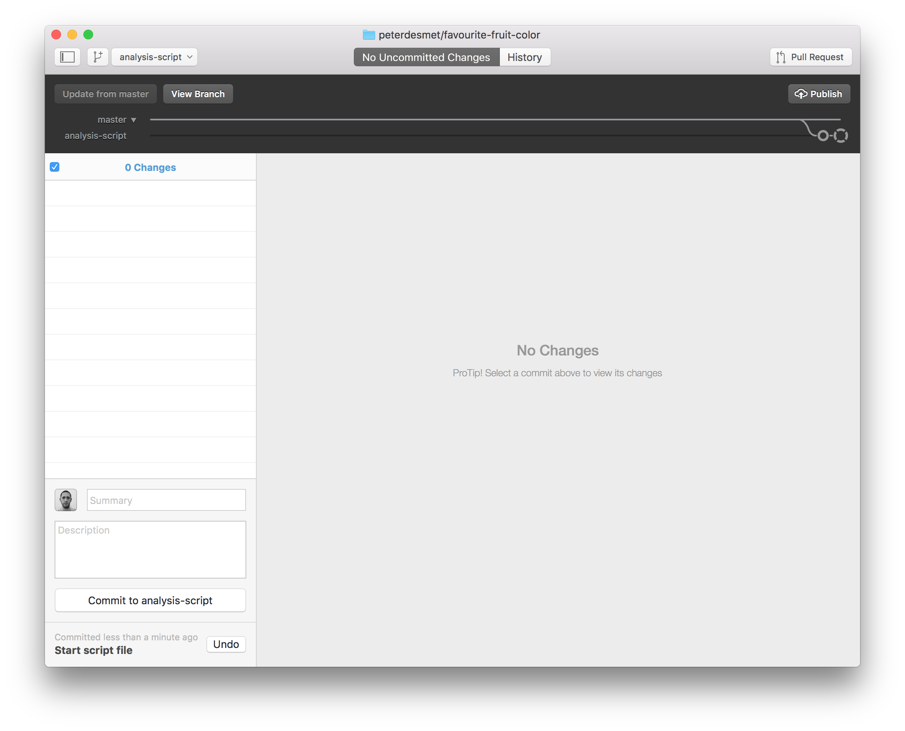

## Working on your own {data-background=#c2c444}

---

### Create a repo

1. Go to [GitHub](https://github.com) and login
2. Follow [this tutorial](https://help.github.com/articles/create-a-repo/) to create a repo

---

    

---

---

### Clone a repo to work locally

1. Install [GitHub Desktop](https://desktop.github.com/)
2. [Configure git](https://help.github.com/desktop/guides/getting-started/configuring-git-for-github-desktop/)
3. Follow [this tutorial](https://help.github.com/desktop/guides/contributing/cloning-a-repository-from-github-to-github-desktop/) to clone your repo

---

### Make a commit

1. Open your favourite text editor
2. Update the `README.md`
3. Commit your changes

---

### Make a commit

---

### Push your changes to backup your work

click `Sync`

---

### Go to your repo on GitHub to verify

---

### Create logical commits

1. Make 2 unrelated changes to your `README.md` locally
2. Create one commit for each change.
3. Do not push (yet)

---

### Create logical commits

---

### Create logical commits

---

### Create a conflict

Update your `README.md` on GitHub, 
on a line you also edited locally

---

### Conflict!

Try to push your local changes

---

### Keep calm and resolve conflict

1. Open `README.md` in text editor:

        <<<<<<< HEAD
        A simple analysis to visualize my favourite fruit colour.
        =======
        A simple analysis to discover my favourite fruit color.
        >>>>>>> origin/master

2. Choose what you want to keep:

        A simple analysis to discover my favourite fruit colour.

3. Commit and sync

---

### Add a file

1. Add a `fruits.csv` file in a `/data` directory
2. Link to this file in the `README.md`

---

### Add a file

---

### Undo or adapt last commit

---

### View history

---

### Create a branch to experiment

1. Create a branch
2. Add an analysis file in a `/src` directory
3. Commit
4. Switch between branches

---

### Create a branch to experiment

---

### Create a branch to experiment

---

### Create a pull request to include your work 

TODO: adapt, as we do this ONLINE instead

---

### Review your pull request

---

### Review your pull request

1. Review
2. If OK, merge pull request
3. Delete branch

---

### Exclude files

* in any programming language, some files are _derivatives_
* sensitive information (passwords,...)
* a folder with large data files that should not be in the history (and backuped elsewhere!)
* a _temp/_ folder for just garbage you create/...

`.gitignore` to the rescue!

---

### Exclude files

---

### Exclude files

---

## Working together {data-background=#c2c444}

---

### Teaming up

* Team up with two or three persons
* Let one person invite the others, provide them with read/write access as explained in [this tutorial](https://help.github.com/articles/inviting-collaborators-to-a-personal-repository/)

---

### Invite collaborators

---

### Invite collaborators

---

### Collaboration: issues

* Raise an **issue** online
* Provide issues with an appropriate label
* Assign your colleague to the issue

---

### Collaboration: online adaptations

* Make an adaptation to an online file
* Propose a **pull request** and assign your collaborator
* Merge the adaptation to the `master` branch

---

### Collaboration: local adaptations

**Working local - merging online**

* As collaborator, `clone` the other repository to your local computer
* Create a new `branch` with a different name
* Adapt the content of a file
* `commit` your adaptation
* `push` your `branch` to the remote repository
* Go to GitHub and make a `pull request`
* Revise the work and `merge` online when appropriate
* Update your local work
* Check if all adaptations are represented in your local files

**Tip**: All functionalities are available in the previous sections

---

### Release

Once you are satisfied with the status of your analysis, it makes sense to create a release:

* For publications (DOI)
* For code/software development versions
* For course notes

Follow [this tutorial](https://help.github.com/articles/creating-releases/) to create a release.

---

### Some more advice:

* Commit often, make small commits
* Don’t mix changes in 1 commit
* Think about your commit messages
* Keep your code clean, avoid huge one-liners
* Use branches (!)
* Don’t keep long-lived branches (form of technical debt)

---

**There’s no such thing, as a free lunch...**

---

Information combined at [INBO Tutorials website](https://inbo.github.io/tutorials/).  You're welcome to provide issues, pull requests,...

