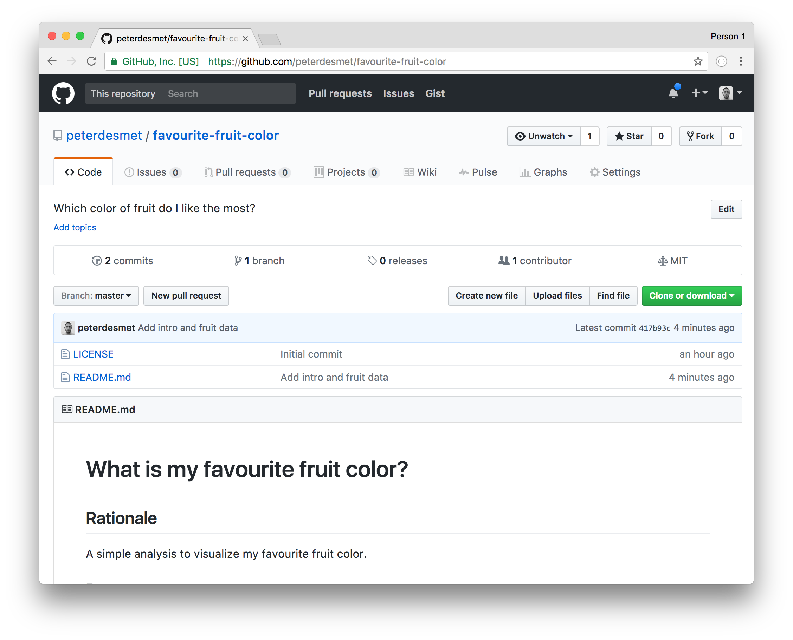
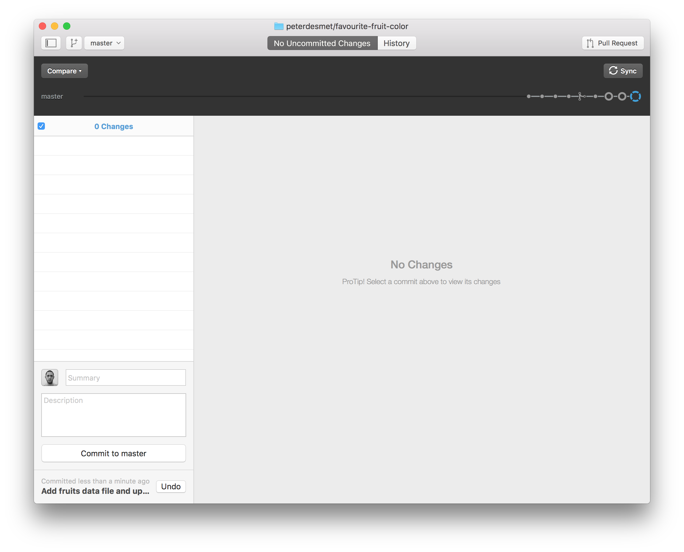
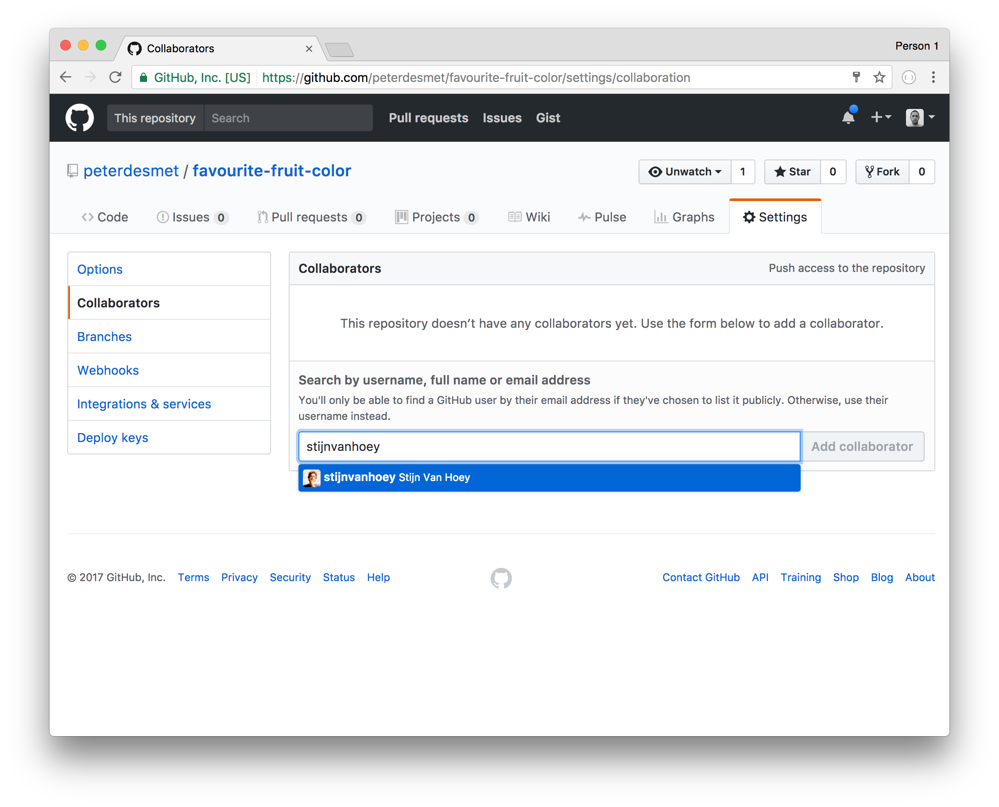

<style type="text/css">
    .reveal section img { 
        border:none; 
        box-shadow:none; 
        }
    .reveal code {
    	font-family: monospace;
    	color: #c04384;
        }
    .reveal pre code {
    	font-family: monospace;
    	color: #1a1a1a;
    	background: ##ececec;
        }
</style>


## Working on your own {data-background=#c2c444}

---

### Create a repo

1. Go to [GitHub](https://github.com) and login
2. Follow [this tutorial](https://help.github.com/articles/create-a-repo/) to create a repo

---


    

---


---

### Git for RStudio setup

1. [Download](https://git-scm.com/downloads) and install Git
1. Install [RStudio](https://inbo.github.io/tutorials/installation-RStudio-admin.html)
1. Open [RStudio](https://inbo.github.io/tutorials/installation-RStudio-user.html)

---

### Git for RStudio setup

Tell RStudio where to find the Git installation. 

1. Go to `Tools > Global Options`
1. Click on `Git/SVN`. 

{width=50%}

---

### Git for RStudio setup

Check Enable version control interface for RStudio projects. Set the path to the Git executable that you just installed. Open a shell, if you don't know where Git is installed. Type `where git` and hit enter (Windows users). 

The path should be something like: `C:/Program Files (x86)/Git/bin/git.exe`

---

### Git for RStudio setup: git configuration

1. Go to `Tools > Shell` to open the Git Shell
1. Tell Git your username and GitHub email (!)


---

### Clone a repo to work locally

1. Copy the repository HTTPS url


2. `File > New Project...`, select `Version Control`, choose `Git`
3. Provide the repository HTTPS link, select the R workspace folder

TODO-Thierry: screenshot (gif?)

---

### Make a commit

1. Update the `README.md`
1. Commit your changes
                            
---

### Make a commit

TODO-Thierry: update fig to rstudio


---

### First time to push your changes

TODO-Thierry: check if this is correct

1. Go to `Tools > Shell` to open the Git Shell
2. Type `git push -u origin`

After this first time, you can just click `push`

TODO-Thierry: screenshot

---

### Go to your repo on GitHub to verify



---

### Create logical commits

1. Make 2 unrelated changes to your `README.md` locally
2. Create one commit for each change.
3. Do not push (yet)

---

### Create logical commits

TODO-Thierry: update fig to rstudio


---

### Create logical commits

TODO-Thierry: update fig to rstudio


---

### Create a conflict

Update your `README.md` on GitHub,<br/>
on a line you also edited locally


---

### Conflict!

Try to push (click `push`) your local changes

TODO-Thierry: update fig to rstudio


---

### Keep calm and resolve conflict

TODO-Thierry: check if correct

1. Open `README.md` in RStudio:

        <<<<<<< HEAD
        A simple analysis to visualize my favourite fruit colour.
        =======
        A simple analysis to discover my favourite fruit color.
        >>>>>>> origin/master

2. Choose what you want to keep:

        A simple analysis to discover my favourite fruit colour.

3. Commit and click `push`

---

### Add a file

1. Add a `fruits.csv` file in a `/data` directory
2. Link to this file in the `README.md`

---

### Add a file

TODO-Thierry: update fig to rstudio


---

### Undo or adapt last commit

TODO-Thierry: update fig to rstudio (or cmd-version?)


---

### View history

TODO-Thierry: update fig to rstudio


---

### Create a branch to experiment

1. Create a NEW branch
2. Add an analysis file in a `/src` directory
3. Commit
4. Switch between branches

---

### Create a branch to experiment (command line)

1. Create a branch by a checkout to new branch, `git checkout -b`: 
    ```
    git checkout -b analysis-script
    ```
2. Get an overview of your branches: `git branch`

TODO-Thierry: add screenshot of shell-version

---

### Effect of changing switching branches

Add a file to the repository in a `src`-directory (see earlier)

1. Go back to the status of the `master` branch: 
TODO-thierry: add screenshot
2. Verify your local directory structure: where are your files?
3. Go back to the status of the new branch (e.g. `analysis-script`): 
TODO-thierry: add screenshot

---

### Create a pull request to include your work 

1. Click `push` 
2. At [Github](https://github.com/), browse to you repo...
3. Create a `pull request`

---

### Create a pull request to include your work 


---

### Create a pull request to include your work 


---

### Review your pull request


---

### Review your pull request

1. Review
2. If OK, merge pull request
3. Delete branch

---

### Include your accepted work to local master

1. Switch to `master` branch
2. Click `pull`.

TODO-Thierry: add screenshot

---

### Exclude files

* in any programming language, some files are _derivatives_
* sensitive information (passwords,...)
* a folder with large data files that should not be in the history (and backuped elsewhere!)
* a _temp/_ folder for just garbage you create/...

`.gitignore` to the rescue!

---

### Exclude files

TODO-Thierry: update fig to rstudio


---

### Exclude files

TODO-Thierry: update fig to rstudio


---

## Working together {data-background=#c2c444}

---

### Teaming up

* Team up with two or three persons
* Let one person invite the others, provide them with read/write access as explained in [this tutorial](https://help.github.com/articles/inviting-collaborators-to-a-personal-repository/)

---

### Invite collaborators



---

### Invite collaborators


---

### Collaboration: issues

* Raise an **issue** online
* Provide issues with an appropriate label
* Assign your colleague to the issue

---

### Collaboration: online adaptations

* Make an adaptation to an online file
* Propose a **pull request** and assign your collaborator
* Merge the adaptation to the `master` branch

---

### Collaboration: local adaptations

**Working local - merging online**

* As collaborator, `clone` the other repository to your local computer
* Create a new `branch` with a different name
* Adapt the content of a file
* `commit` your adaptation
* `push` your `branch` to the remote repository
* Go to GitHub and make a `pull request`
* Revise the work and `merge` online when appropriate
* Update your local work
* Check if all adaptations are represented in your local files

**Tip**: All functionalities are available in the previous sections

---

### Release

Once you are satisfied with the status of your analysis, it makes sense to create a release:

* For publications (DOI)
* For code/software development versions
* For course notes

Follow [this tutorial](https://help.github.com/articles/creating-releases/) to create a release.

---

### Some more advice:

* Commit often, make small commits
* Don’t mix changes in 1 commit
* Think about your commit messages
* Keep your code clean, avoid huge one-liners
* Use branches (!)
* Don’t keep long-lived branches (form of technical debt)

---

**There’s no such thing, as a free lunch...**

---

Information combined at [INBO Tutorials website](https://inbo.github.io/tutorials/). <br/>You're welcome to provide issues, pull requests,...


