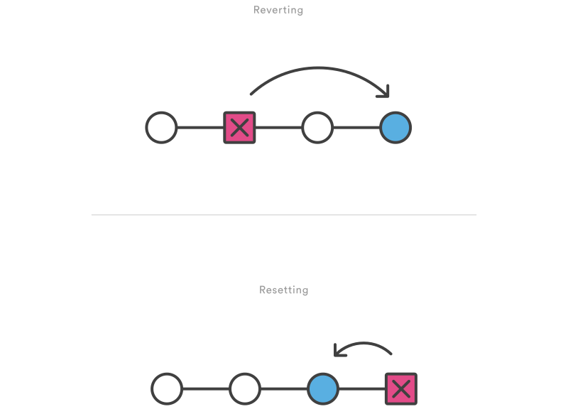

## Introduction

You notice you have done something wrong on your branch. No worries, erroneous commits can be undone or reverted.

First, check your history of commits to see which commits are the faulty ones.

```
git log --oneline
```

*Example output*

```
b7119f2 Continue doing crazy things
872fa7e Try something crazy
a1e8fb5 Make some important changes to hello.py
435b61d Create hello.py
9773e52 Initial import
```

## Git checkout

The git checkout command serves three distinct functions: checking out files, checking out commits, and checking out branches. In this part, only the first two configurations are addressed. Checking out a commit makes the entire working directory match that commit. This can be used to view an old state of your project without altering your current state in any way. Checking out a file lets you see an old version of that particular file, **leaving the rest of your working directory untouched**. (This will put you in a detached HEAD state.)


You can use git checkout to view the “Make some import changes to hello.py” commit as follows:

```
git checkout a1e8fb5
```

This makes your working directory match the exact state of the a1e8fb5 commit. You can look at files, and even edit files without worrying about losing the current state of the project. Nothing you do in here will be saved in your repository. Checking out an old commit is a read-only operation. It’s impossible to harm your repository while viewing an old revision. To continue developing, you need to get back to the “current” state of your project (assuming your master branch is the head of the project):

```
git checkout master
```

If you’re only interested in a single file, you can also use git checkout to fetch an old version of it. For example, if you only wanted to see the `hello.py` file from the old commit, you could use the following command:

```
git checkout a1e8fb5 hello.py
```

Remember, unlike checking out a commit, this **does affect the current state of your project**. The old file revision will show up as a “Change to be committed,” giving you the opportunity to revert back to the previous version of the file. If you decide you don’t want to keep the old version, you can check out the most recent version with the following:

```
git checkout HEAD hello.py
```

This concludes the part on checking your previous commits. In the following part, some methods of rollback to a previous state will be elucidated.


## git revert

The git revert command undoes a committed snapshot. But, instead of removing the commit from the project history, it figures out how to undo the changes introduced by the commit and appends a new commit with the resulting content. This prevents Git from losing history, which is important for the integrity of your revision history and for reliable collaboration.


Usage:

```
git revert <commit>
```

Generate a new commit that undoes all of the changes introduced in <commit>, then apply it to the current branch.

Reverting should be used when you want to remove an entire commit from your project history. This can be useful, for example, if you’re tracking down a bug and find that it was introduced by a single commit. Instead of manually going in, fixing it, and committing a new snapshot, you can use git revert to automatically do all of this for you.

It's important to understand that git revert undoes a single commit—it does not “revert” back to the previous state of a project by removing all subsequent commits. In Git, this is actually called a reset, not a revert.



Reverting has two important advantages over resetting. First, it doesn’t change the project history, which makes it a “safe” operation for commits that have already been published to a shared repository. For details about why altering shared history is dangerous, please see the git reset page.

Second, git revert is able to target an individual commit at an arbitrary point in the history, whereas git reset can only work backwards from the current commit. For example, if you wanted to undo an old commit with git reset, you would have to remove all of the commits that occurred after the target commit, remove it, then re-commit all of the subsequent commits. Needless to say, this is not an elegant undo solution.


Example

The following example is a simple demonstration of git revert. It commits a snapshot, then immediately undoes it with a revert.

```
// edit some tracked files

// commit a snapshot
git commit -m 'make some changes that will be undone'

// revert the commit we have just created
git revert HEAD
```

This can be visualized as the following:


Note that the 4th commit is still in the project history after the revert. Instead of deleting it, git revert added a new commit to undo its changes. As a result, the 3rd and 5th commits represent the exact same code base, and the 4th commit is still in our history just in case we want to go back to it down the road.


## git reset

If git revert is a “safe” way to undo changes, you can think of git reset as the dangerous method. When you undo with git reset(and the commits are no longer referenced by any ref or the reflog), there is no way to retrieve the original copy—it is a permanent undo. Care must be taken when using this tool, as it’s one of the only Git commands that has the potential to lose your work.

Like git checkout, git reset is a versatile command with many configurations. It can be used to remove committed snapshots, although it’s more often used to undo changes in the staging area and the working directory. In either case, it should only be used to undo local changes—you should never reset snapshots that have been shared with other developers.

Usage:

```
git reset <file>
```

Remove the specified file from the staging area, but leave the working directory unchanged. This unstages a file without overwriting any changes.

```
git reset
```

Reset the staging area to match the most recent commit, but leave the working directory unchanged. This unstages all files without overwriting any changes, giving you the opportunity to re-build the staged snapshot from scratch.

```
git reset --hard
``` 

Reset the staging area and the working directory to match the most recent commit. In addition to unstaging changes, the --hard flag tells Git to overwrite all changes in the working directory, too. Put another way: this obliterates all uncommitted changes, so make sure you really want to throw away your local developments before using it.

```
git reset <commit>
```

Move the current branch tip backward to <commit>, reset the staging area to match, but leave the working directory alone. All changes made since <commit> will reside in the working directory, which lets you re-commit the project history using cleaner, more atomic snapshots.

```
git reset --hard <commit>
```

Move the current branch tip backward to <commit> and reset both the staging area and the working directory to match. This obliterates not only the uncommitted changes, but all commits after <commit>, as well.

Discussion

All of the above invocations are used to remove changes from a repository. Without the --hard flag, git reset is a way to clean up a repository by unstaging changes or uncommitting a series of snapshots and re-building them from scratch. The --hard flag comes in handy when an experiment has gone horribly wrong and you need a clean slate to work with.

Whereas reverting is designed to safely undo a public commit, git reset is designed to undo local changes. Because of their distinct goals, the two commands are implemented differently: resetting completely removes a changeset, whereas reverting maintains the original changeset and uses a new commit to apply the undo.


Don’t Reset Public History

You should never use git reset <commit> when any snapshots after <commit> have been pushed to a public repository. After publishing a commit, you have to assume that other developers are reliant upon it.

Removing a commit that other team members have continued developing poses serious problems for collaboration. When they try to sync up with your repository, it will look like a chunk of the project history abruptly disappeared. The sequence below demonstrates what happens when you try to reset a public commit. The origin/master branch is the central repository’s version of your local master branch.


As soon as you add new commits after the reset, Git will think that your local history has diverged from origin/master, and the merge commit required to synchronize your repositories is likely to confuse and frustrate your team.

The point is, make sure that you’re using git reset <commit> on a local experiment that went wrong—not on published changes. If you need to fix a public commit, the git revert command was designed specifically for this purpose.

## Examples:

### *unstaging a file*

The git reset command is frequently encountered while preparing the staged snapshot. The next example assumes you have two files called `hello.py` and `main.py` that you’ve already added to the repository.

```
# Edit both hello.py and main.py

# Stage everything in the current directory
git add .

# Realize that the changes in hello.py and main.py
# should be committed in different snapshots

# Unstage main.py
git reset main.py

# Commit only hello.py
git commit -m "Make some changes to hello.py"

# Commit main.py in a separate snapshot
git add main.py
git commit -m "Edit main.py"
```

As you can see, git reset helps you keep your commits highly-focused by letting you unstage changes that aren’t related to the next commit.

### *removing local commits*

The next example shows a more advanced use case. It demonstrates what happens when you’ve been working on a new experiment for a while, but decide to completely throw it away after committing a few snapshots.

```
# Create a new file called `foo.py` and add some code to it

# Commit it to the project history
git add foo.py
git commit -m "Start developing a crazy feature"

# Edit `foo.py` again and change some other tracked files, too

# Commit another snapshot
git commit -a -m "Continue my crazy feature"

# Decide to scrap the feature and remove the associated commits
git reset --hard HEAD~2
```

The `git reset HEAD~2` command moves the current branch backward by two commits, effectively removing the two snapshots we just created from the project history. Remember that this kind of reset should only be used on unpublished commits. Never perform the above operation if you’ve already pushed your commits to a shared repository.

## Usage statement

The content of this Rmarkdown tutorial is a transformation from [this source](https://www.atlassian.com/git/tutorials/undoing-changes) and is licensed under a Creative Commons Attribution 2.5 Australia License.

